# 第 6 章 Web 应用漏洞评估

在本章中，我们将介绍以下配方：

*   在 Docker 中运行易受攻击的 web 应用程序
*   使用 w3af 进行脆弱性评估
*   使用 Nikto 进行 web 服务器评估
*   使用 Skipfish 进行脆弱性评估
*   使用 Burp 代理拦截 HTTP 流量
*   使用 Burp 入侵者实现定制的攻击自动化
*   使用 Burp Sequencer 检查会话随机性

# 导言

漏洞评估阶段是在目标机器上查找漏洞的过程。

在 web 应用程序和网络上同时执行漏洞评估可能更有用，因为您可以关联从网络基础架构和其他协议（如 SSH、telnet、数据库、SNMP、SMB 和 FTP）收集的不同漏洞和信息。这将使您更好地了解特定 web 应用程序的用途及其在组织中的使用。

然而，为了让观众更容易理解，我们将专门介绍在 web 应用程序上执行漏洞评估的工具和技术。本章中的方法使您能够在一个地方找到扫描和定位 web 应用程序中漏洞所需的所有工具和技术。

脆弱性评估阶段就像一个准备阶段，我们将在其中发现脆弱性。为了确保我们发现应用程序中存在的所有可能的漏洞，必须执行全面的测试。然而，有时使用自动扫描工具会产生误报。对于成功的 pentest，最重要的是我们使用手动漏洞评估方法消除所有误报。

### 注

不要针对非您自己的且不在您自己服务器上的公共网站运行本章中演示的工具。在本例中，为了演示本章中的工具/技术，我们在云上设置了三个易受攻击的 web 应用程序。*小心！*

这些 web 应用程序是 OWASP 砖块、该死的易受攻击的 web 应用程序（DVWA）和 WordPress 2.2 版（易受攻击！）。

这些应用程序在设计上容易受到攻击，因此我们不建议您直接在服务器上，甚至在本地台式机/笔记本电脑上安装这些 web 应用程序。为了演示，我们将这三个易受攻击的 web 应用程序安装在一个 Docker 容器中，并将其托管在 Docker hub 上，供您拉取和使用。看看下一个食谱。

# 在 Docker 中运行易受攻击的 web 应用程序

在前面的配方中，我们下载了 Docker 并运行了 hello world 示例容器。在这个配方中，我们将下载一个 Docker 容器，我们已经准备好供您下载和使用。它是一个已配置且随时可用的容器，具有三个易受攻击的 web 应用程序：

*   OWASP 砖
*   该死的易受攻击的 web 应用程序
*   WordPress 2.2（易受攻击！）

## 准备好了吗

要逐步完成这一步骤，您需要在 Oracle Virtualbox 或 VMware 上运行 Kali Linux，并建立 Internet 连接。该配方与之前的配方紧密相关；强烈建议您遵循之前的配方，然后再继续使用此配方。如果你已经在你的卡利上安装了 Docker，你可以直接从这个配方开始。

## 怎么做。。。

对于此配方，您需要执行以下步骤：

1.  打开终端，拉动 Docker 容器图像，如以下命令所示：

    ```
    $ docker pull intrusionexploitation/dvwa-wordpress2.2-bricks

    ```

2.  You will see the different layers being downloaded, as shown in the following screenshot:

    

3.  After the container image has been downloaded successfully, you will see a screen similar to what is shown in the following screenshot:

    

4.  现在，使用以下命令运行下载的 Docker 容器映像：

    ```
    docker run --name intrusionexploitation       intrusionexploitation/dvwa-wordpress2.2-bricks

    ```

5.  On running the preceding command, you will see the following output:

    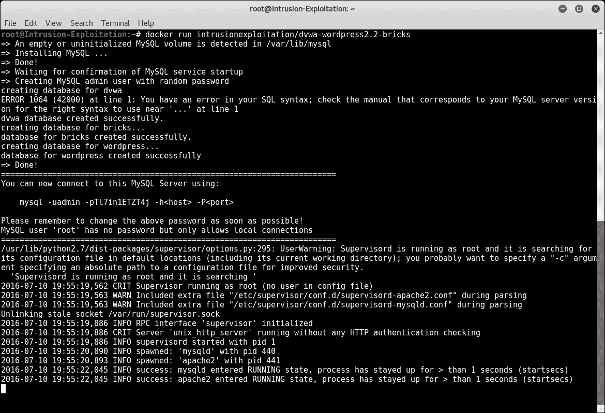

6.  如果看到相同的输出，则表示 Docker 容器已启动并正在运行。保持本终端运行，不要关闭，不要按*Ctrl*+*C*。按*Ctrl*+*C*将停止运行的容器；现在，让它继续运行并最小化终端，这样你就不会意外地关闭它。
7.  要查看此容器上安装的易受攻击的 web 应用程序，首先需要找出正在运行的容器的当前 IP 地址。
8.  To find out the current IP address of the running container, you will first need to list the running container in a new terminal window using the following command:

    ```
    docker ps -a

    ```

    此命令的输出将如以下屏幕截图所示：

    

9.  然后，复制容器 ID 并使用输出中显示的容器 ID 键入以下命令（请记住，您的容器 ID 将与此输出中显示的不同）：

    ```
    docker inspect 01bf653a92f4

    ```

10.  The output will be as shown in the following screenshot:

    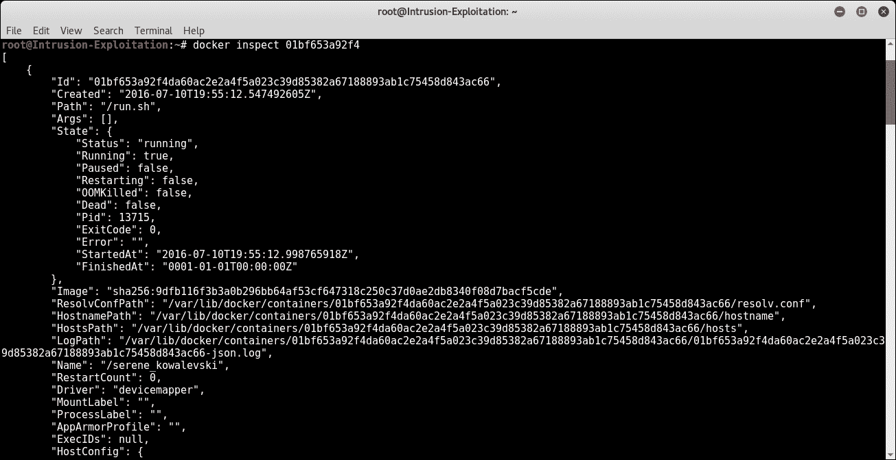

11.  这将是一个非常长的输出；为了快速查找 IP 地址，还可以使用以下命令：

    ```
    docker inspect 01bf653a92f4 | grep IPAddress

    ```

12.  The output is as shown in the following screenshot:

    

13.  As shown, `172.17.0.2` (please note that your IP address could be different from the one shown here.) is the IP address the container is running with; to see the vulnerable web applications installed on this container, copy this IP address and open this on your browser, as shown in the following screenshot:

    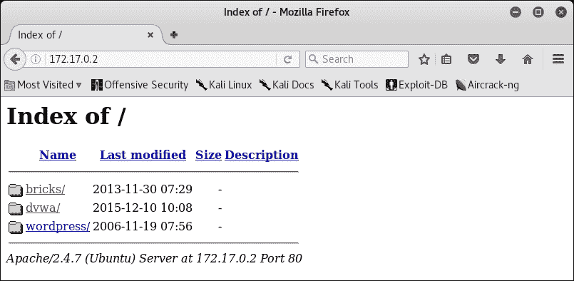

14.  如前面的屏幕截图所示，您将看到 Apache 服务器已启动并正在运行，您可以看到每个不同的 web 应用程序有三个不同的文件夹。
15.  从下一步开始，我们将使用这些应用程序进行 web 应用程序漏洞评估。

## 它是如何工作的。。。

在此配方中，我们从 Docker hub 中提取预配置的 Docker 映像，然后运行下载的映像，列出正在运行的容器，并尝试使用容器 ID 查找正在运行的容器的 IP 地址，以便在浏览器上查看已安装的易受攻击的 web 应用程序。

# 使用 W3af 进行脆弱性评估

在本教程中，我们将学习如何使用 W3af 查找目标 web 应用程序中的漏洞。W3af 是一个 web 应用程序攻击和审计框架。该项目的目标是创建一个框架，通过查找和利用所有 web 应用程序漏洞来帮助您保护 web 应用程序。

## 准备好了吗

要完成这一步骤，您需要在 Oracle Virtualbox 上运行 Kali Linux 并连接互联网。不需要其他先决条件。

## 怎么做。。。

对于此配方，您需要执行以下步骤：

1.  Open the terminal and type `w3af_gui`; the w3af window will be as shown in the following screenshot:

    

2.  Select the **OWASP_TOP10** option from the profile selector in the left-hand side panel. Enter the target URL, as shown in the following screenshot:

    

3.  Expand the **auth** menu, click on the **detailed** plugin, and enter the username and password (only for HTTP form credentials) and all other required parameters and then click on **Save**, as shown in the following screenshot:

    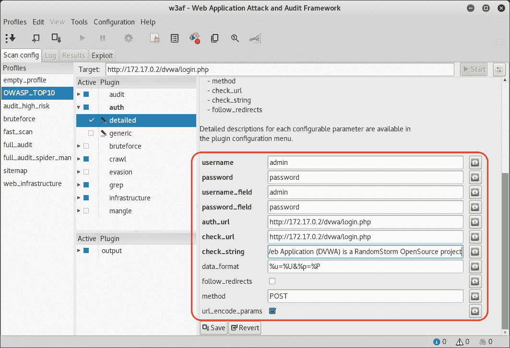

4.  Select **output** and expand it and select all output formats; in our case, we will check all for demonstration purposes, as shown in the following screenshot:

    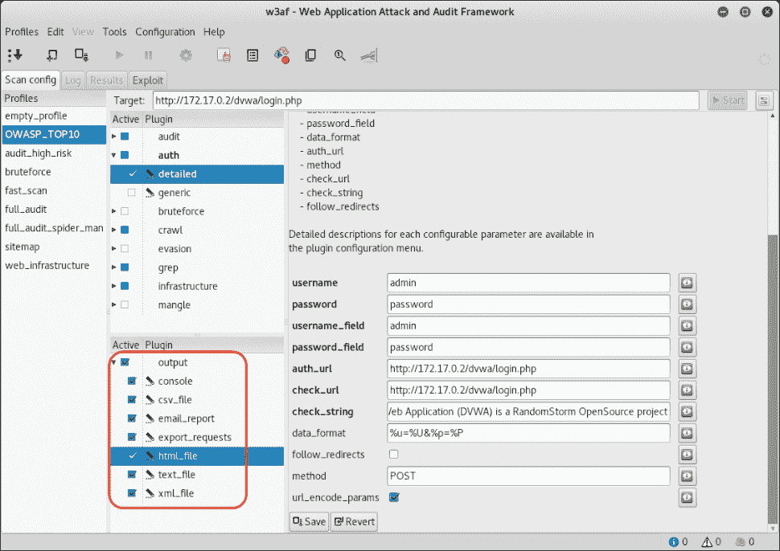

5.  After that, click on the button next to the start button; on clicking it, the following window will open, and it will ask whether you know **target_os** and **target_framework** and save the details, as shown in the following screenshot:

    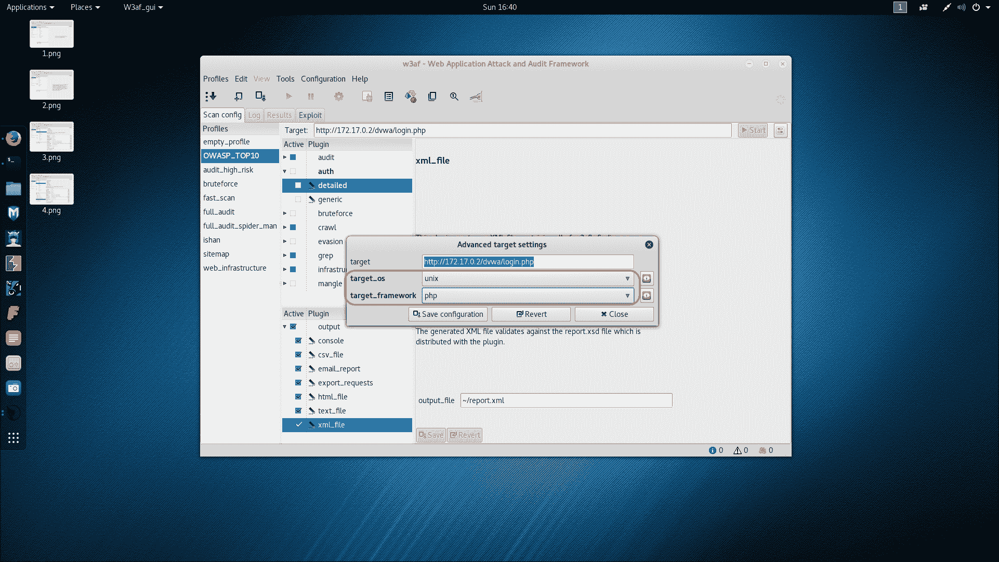

6.  Once all these steps are done, simply click on the **Start** button and the scan will begin, as shown in the following screenshot:

    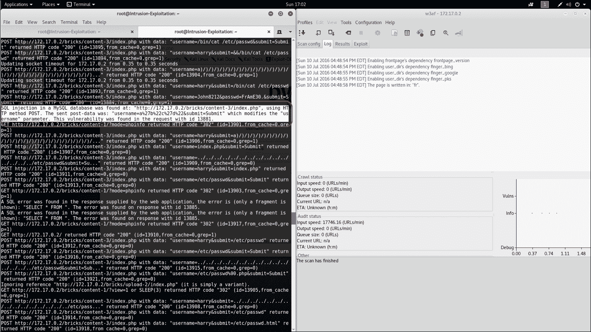

7.  Once the scan has started, you can traverse the tabs and click on **Results** and start seeing the vulnerabilities appear as and when they are discovered, as shown in the following screenshot:

    

8.  Next, click on the **URL** subtab, where you can see all the URLs discovered and drawn in the form of a nice sitemap, as shown in the following screenshot:

    

9.  While your scan is running, you can still see the latest plugins running and the vulnerabilities found over in the log window, as shown in the following screenshot:

    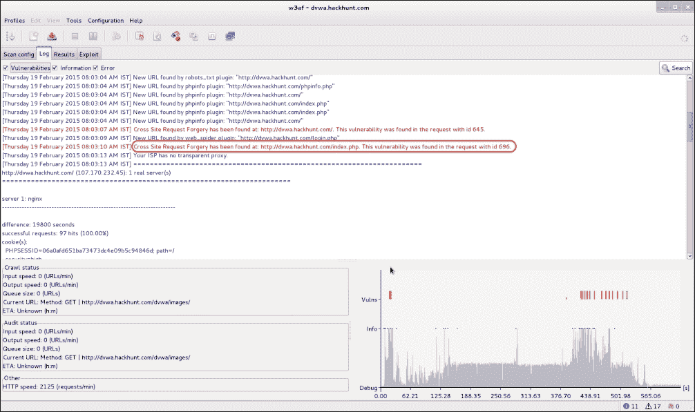

    扫描完成后，结果将保存在运行 w3af 的目录中。在我们的例子中，我们从默认路径`/root/`调用，如下面的屏幕截图所示：

    

## 它是如何工作的。。。

在这个配方中，我们使用了`w3af_gui`并配置了各种插件，对 IP `http://172.17.0.2/dvwa/login.php` Docker 容器中托管的易受攻击的 web 应用程序进行了身份验证扫描，并演示了 w3af 在执行实际漏洞评估时的工作方式。W3af 的功能不仅限于漏洞评估。它还可以利用类似 sqlmap、RFI 和 Metasploit 的工具，也可以用于执行利用。

# 使用 Nikto 进行 web 服务器评估

在本食谱中，我们将了解 Nikto 及其 web 服务器扫描功能。Nikto 是一款开源（GPL）web 服务器扫描仪，可对多个项目的 web 服务器执行全面测试，包括 6700 多个潜在危险的文件/程序，检查 1250 多台服务器的过时版本，还可检查 270 多台服务器上的版本特定问题。

## 准备好了吗

要完成这一步骤，您需要在 Oracle Virtualbox 上运行 Kali Linux 并连接互联网。不需要其他先决条件。

## 怎么做。。。

对于此配方，您需要执行以下步骤：

1.  Open the terminal and type `Nikto`, Nikto will display its help and switches available for use (you can also use the main Nikto for a detailed description of each switch), as shown in the following screenshot:

    

2.  要开始扫描，请键入以下命令：

    ```
    nikto -host http://172.17.0.2/wordpress/ -nossl -o wordpress-      nikto-scan.xml

    ```

3.  Let Nikto do its work and wait for it to complete; when it is complete, the console shows the following output:

    

## 它是如何工作的。。。

在这个方法中，我们必须在`http://172.17.0.2/wordpress/`的 Docker 容器中本地托管的 web 服务器和 web 应用程序上执行扫描。`-host`开关用于指定 URL。

有时，像其他任何工具一样，Nikto 也会显示一些误报，需要通过访问工具和 URL 中检测到的链接来手动验证。但请放心；运行 Nikto 是值得你花时间的，因为它总能在你的发现列表中发现一些独特和新的东西，让你大吃一惊。

# 利用飞鱼进行脆弱性评估

在这个食谱中，我们将学习如何使用鱼鳞鱼。Skipfish 完全是用 C 编写的。它经过高度优化，可以处理 HTTP 请求。Skipfish 每秒可以处理 2000 个请求，如[所述 http://tools.kali.org/web-applications/skipfish](http://tools.kali.org/web-applications/skipfish) 。

## 准备好了吗

要完成这一步骤，您需要在 Oracle Virtualbox 上运行 Kali Linux 并连接互联网。不需要其他先决条件。

## 怎么做。。。

对于此配方，您需要执行以下步骤：

1.  打开终端。要启动`Skipfish`，您必须提到输出目录名。如果输出目录不存在，它将自动创建目录并保存结果。要启动 Skipfish，请在终端中键入以下命令：

    ```
    skipfish -o /root/dvwa-skipfish-results http://172.17.0.2      /dvwa/login.php

    ```

2.  Before Skipfish starts scanning, it shows the list of tips on the screens, which helps you understand how Skipfish will behave for this specific scan:

    

3.  Once Skipfish starts, it will start showing the scan details, the number of requests sent, and other details on the screens, as shown in the following screenshot:

    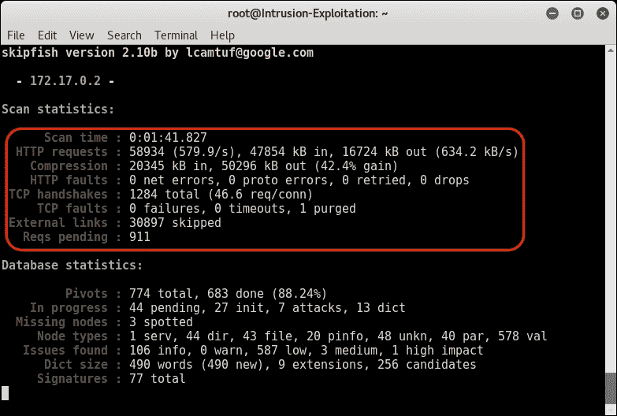

4.  Once the scan is complete, compile everything and create the HTML report in that folder. This will show the following output on the screen:

    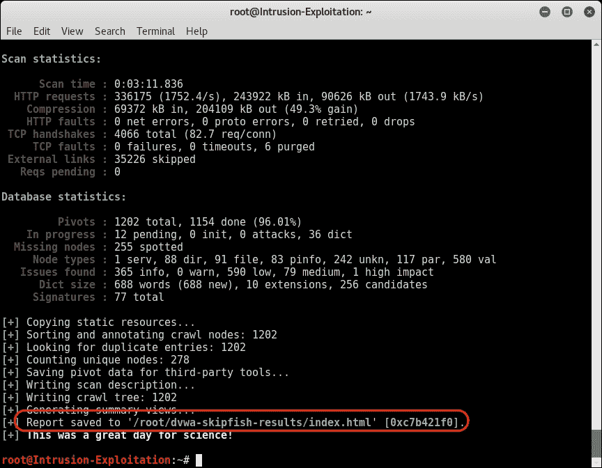

5.  Go to the mentioned output directory and open the HTML in the browser, as shown in the following screenshot:

    

## 它是如何工作的。。。

由于 Skipfish 是用 C 语言编写的，因此它是处理 HTTP 流量方面最有效的工具之一。Skipfish 还可以使用`--auth-form`、`--auth-user`和`-auth-password`开关运行经过验证的扫描。

默认情况下，Skipfish 将所有 URL 作为作用域；如果有任何页面或 URL 不在您的测试范围内，您将明确提到使用`-X`开关让 Skipfish 知道它不需要扫描。

对于经过身份验证的扫描，您可以使用`-X`开关提及注销链接，以确保 Skipfish 不会意外地在该链接上爬行，并最终使用注销会话扫描主机。

# 使用 Burp 代理拦截 HTTP 流量

在这个方法中，我们将使用 Burp 代理拦截浏览器流量，并在移动中操纵参数。

## 准备好了吗

要完成这一步骤，您需要在 Oracle Virtualbox 上运行 Kali Linux 并连接互联网。不需要其他先决条件。

## 怎么做。。。

对于此配方，您需要执行以下步骤：

1.  To start Burp, go to **Menu** | **Kali Linux** | **Applications** | **burpsuite** and click on the **Start burpsuite**, as shown in the following screenshot:

    

2.  Also open Firefox and navigate to **Edit Menu** | **Preferences** | **Advance Tab** | **Network** | **Settings** and set the proxy as `127.0.0.1` and the port as `8080`, as shown in the following screenshot:

    

3.  Click on **OK** and go to **Burp** | **Proxy**, as shown in the following screenshot:

    

4.  Now, come back to the Firefox window and open `http://172.17.0.2/dvwa/login.php` and press *Enter*; the moment you press *Enter*, the request will be intercepted by Burp, as shown in the following screenshot:

    

5.  Click on **Forward** to let go of any requests that are being intercepted and let the login page load. Enter the username and password in the field and click on **Submit**, as shown in the following screenshot:

    

6.  Open the **Burp** window. As you can see, the submit request gets intercepted here and can be manipulated in a raw form or in the parameter form:

    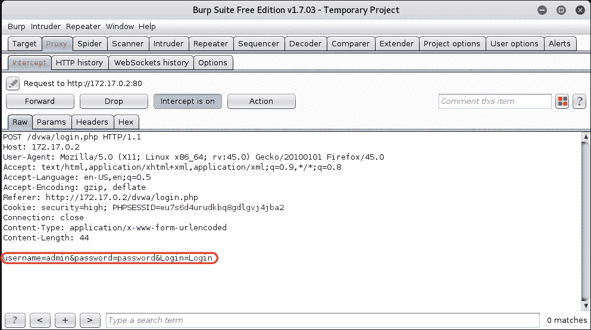

## 它是如何工作的。。。

在这个方法中，我们只需在连接到 Internet 之前，将 web 浏览器配置为在我们自己的本地机器上运行的代理服务器（在端口`8080`上）。当我们在浏览器中打开任何 URL 时，它会将所有流量重定向到在端口`8080`上运行的 Burp，在端口`8080`上，您可以在任何请求离开系统之前对其进行操作。

代理应用程序通常用于绕过浏览器中 web 应用程序的客户端限制。

# 使用 Burp 入侵者定制攻击自动化

在此配方中，我们将学习如何使用 Burp 入侵者执行应用程序登录 bruteforce 和目录 bruteforce。入侵者可以在需要进行暴力攻击的任何场景中使用，并且可以根据您的需求进行定制。

## 准备好了吗

要完成这一步骤，您需要在 Oracle Virtualbox 上运行 Kali Linux 并连接互联网。不需要其他先决条件。

## 怎么做。。。

对于此配方，您需要执行以下步骤：

1.  Open the **Damn Vulnerable Web Application** page in the browser and traverse to the **Brute Force** section, as shown in the following screenshot:

    

2.  Intercept the request using Burp, as shown in the following screenshot:

    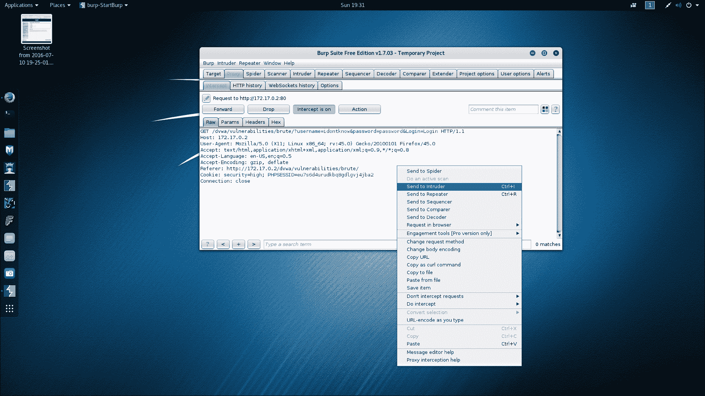

3.  As shown earlier, send this request to the intruder within Burp, select the **Intruder** tab, and then select the **Positions** subtab, as shown in the following screenshot:

    

4.  To use intruder to bruteforce a common username and password, we will need to select only username and password; the rest of the highlighted parameters can be cleared by selecting them and clicking on the **Clear $** button, which will ensure that bruteforcing will happen only on selected parameters and not on all the parameters selected by default.

    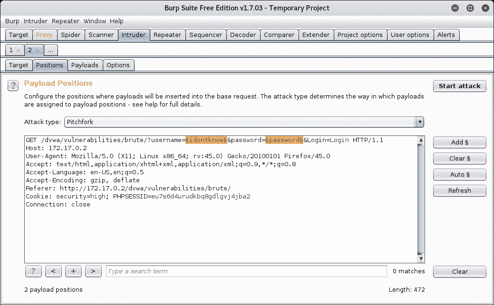

    打嗝入侵者有四种攻击类型，即狙击手、击槌、干草叉和集束炸弹。默认设置为狙击手。把它换成撞锤。

5.  Now, when we have parameters selected for bruteforcing, we need to set the payloads; for that, we will traverse the payload tab and set the payload set as **1** from the dropdown. Just to demonstrate how it works, we will enter a small list of usernames, as shown in the following screenshot:

    

6.  Now select the payload set as **2** and set the payload for the second parameter, as shown in the following screenshot:

    

7.  Now go to the **Options** tab; this is important because we need some kind of proof that bruteforcer has been able to detect a valid attempt, so for that, we will need to see an error message in case of wrong credentials and a message in case of correct credentials. Open the browser and enter the wrong password, as shown in the following screenshot:

    

8.  In the case of incorrect credentials, it shows the following message:

    ```
            Username and/or password incorrect.
    ```

    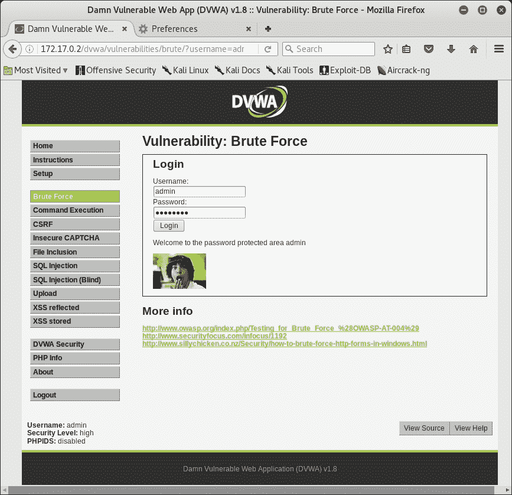

9.  Go to **Options** | **Grep Match Section** and remove all string patterns and add the **Welcome to the password protected area admin** pattern, which will indicate that the credentials are valid, as shown in the following screenshot:

    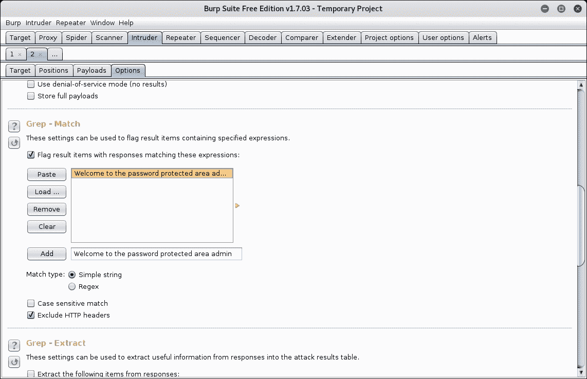

10.  Finally, click on the **Intruder** tab in the top-left corner and click on **Start attack**, as shown in the following screenshot:

    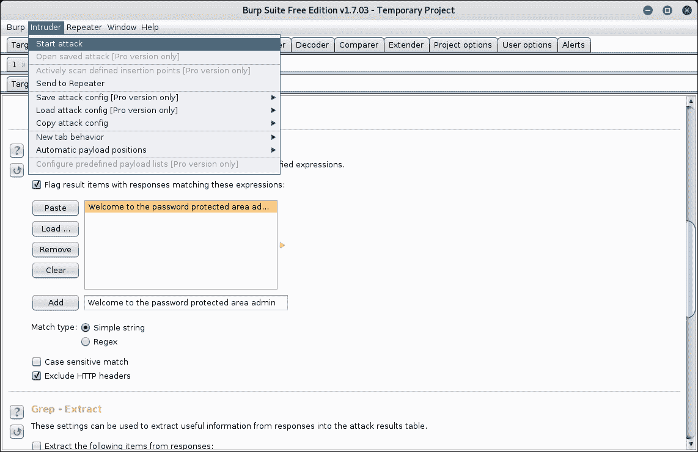

11.  Once started, intruder will try all possible combinations from these two payload lists and the grep match will show when there is any match with that in the response, as shown in the following screenshot:

    

## 它是如何工作的。。。

在这个配方中，我们使用了 Burp 入侵者，并针对特定的暴力攻击对其进行了高度定制。入侵者的能力远不止这些。如果您发现 SQL 注入也可以使用它。

# 使用 Burp Sequencer 测试会话随机性

在此配方中，我们将学习如何使用 Burp Sequencer 工具检查 web 应用程序中会话令牌的随机性。

## 准备好了吗

要完成这一步骤，您需要在 Oracle Virtualbox 上运行 Kali Linux 并连接互联网。不需要其他先决条件。

## 怎么做。。。

对于此配方，您需要执行以下步骤：

1.  Open the application in the browser and intercept the request using Burp, as shown in the following screenshot:

    

2.  We need to analyze the response for the request, forward this request, and capture the response from the server, as shown in the following screenshot:

    

3.  Since the server has set up `Set-Cookie PHPSESSIONID`, in order to analyze this session token, we need to send it to the sequencer, as shown in the following screenshot:

    

4.  Now open the Burp Sequencer. To check the randomness, Burp needs to know the location cookie in the request and then we will have start the live capture, as shown in the following screenshot:

    

5.  To perform the session randomness analysis, Burp requires at least 100 min. At least 100 PHPSessionID's at minimum to start analyzing:

    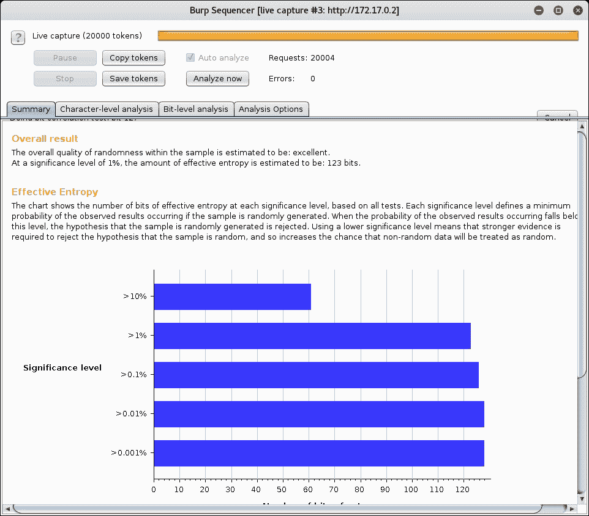

6.  As we can see, the **Overall result** section shows information about the randomness of `PHPSESSID` within the sample of 462 requests. You can save the values of `PHPSESSID` to a file **Save tokens** button, as shown in the following screenshot:

    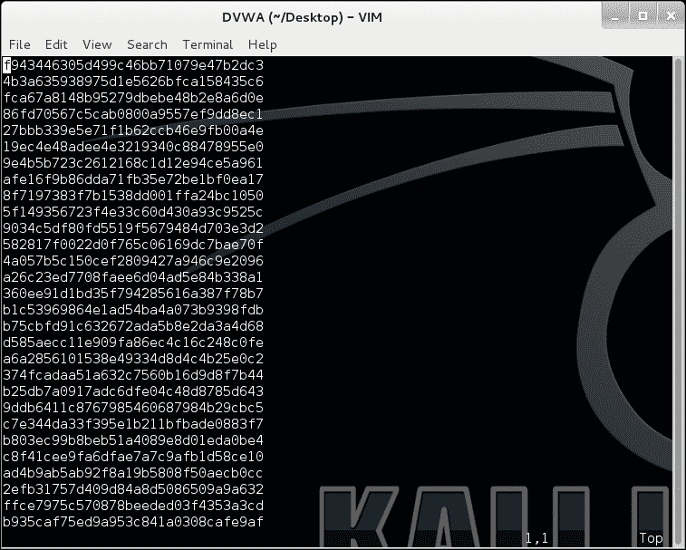

## 它是如何工作的。。。

如果会话令牌很容易猜测且不够随机，则攻击者可以在应用程序上轻松模拟用户会话。在此配方中，我们使用 Burp Sequencer 工具从 Burp 代理导入会话 ID 并对其运行分析。此 Sequencer 可用于我们必须处理令牌（如 CSRF）的其他情况。Sequencer 也可用于以类似方式检查 CSRF 令牌的随机性。