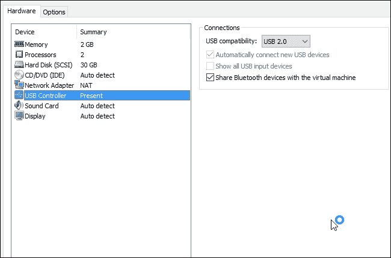
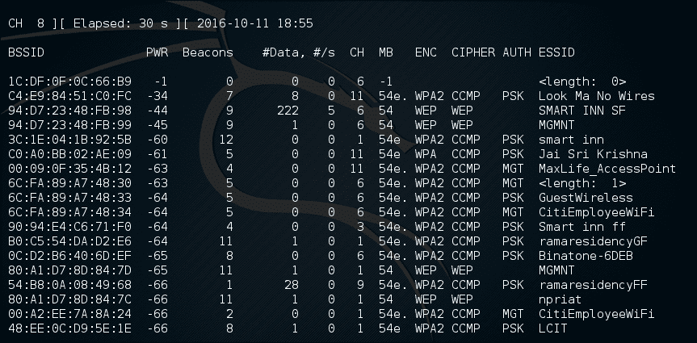
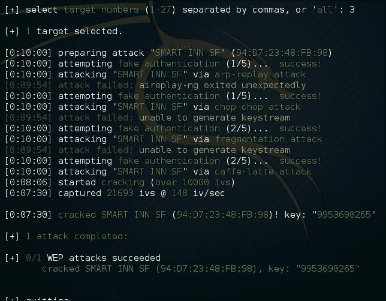
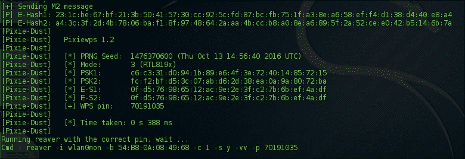

# 第十章无线利用

在本章中，我们将介绍以下配方：

*   建立无线网络
*   绕过 MAC 地址过滤
*   嗅探网络流量
*   破解 WEP 加密
*   破解 WPA/WPA2 加密
*   开裂 WPS
*   阻断服务攻击

# 导言

无线网络在当今时代正在兴起。对移动中即时网络访问或在任何地点的任何时间点上网的需求正在增加。员工和客人都进入公司网络，需要访问互联网进行演示或推销他们的产品；甚至员工移动设备也可能需要遵循 BYOD 策略进行无线访问。然而，人们应该知道，无线协议在安全性方面确实存在很多问题。猜测设备正确性的唯一方法是通过 Mac ID，可以利用 Mac ID。在本章中，我们将探讨无线网络中观察到的不同漏洞。在开始之前，让我们先了解一些术语：

*   **Wi-Fi interface modes**

    *   **主控**：接入点或基站
    *   **托管**：基础架构模式（客户端）
    *   **特设**：设备对设备
    *   **网格：**（网格云/网络）
    *   **中继器**：范围扩展器
    *   **监视器：**RFMON=

*   **Wi-Fi frames**

    *   **Management frames**:

        *   **信标帧**：接入点定期发送一个信标帧，向范围内的无线 NIC 宣布其存在和中继信息，如时间戳、SSID 和其他关于接入点的参数。无线 NIC 不断扫描所有 802.11 无线信道，并监听信标，以此作为选择最佳关联接入点的基础。

    *   **Probe**: Two types: Probe request and Probe response:

        *   **探测请求帧**：一个站点需要从另一个站点获取信息时发送探测请求帧。例如，无线电 NIC 将发送探测请求以确定哪些接入点在范围内。
        *   **探测响应帧**：站点接收到探测请求帧后，会响应一个探测响应帧，包含能力信息、支持的数据速率等。

# 建立无线网络

无线测试最关键的部分是确保测试仪无线设置的正确性。适当的测试环境需要广泛的配置，而且用户应该对无线通信协议有相当的了解。整个测试所基于的核心组件之一是无线适配器。错误的无线适配器会阻碍整个测试活动。依赖于软件，主要由专为无线测试设计的 aircrack ng 套件发挥作用。无线适配器的兼容性列表见[https://www.aircrack-ng.org/doku.php?id=compatibility_drivers](https://www.aircrack-ng.org/doku.php?id=compatibility_drivers) 。出于演示目的，我们将使用阿尔法卡型号名称**阿尔法 AWUS0360H****；**支持**b**和**g**协议。Kali 支持的一些无线适配器包括：

*   动脉粥样硬化 AR9271
*   瑞林 RT3070
*   瑞林 RT3572
*   Realtek 8187L（无线 G 适配器）

选择 Wi-Fi 卡时，请记住以下几点，以便更好地选择：

*   802.11a-5 GHZ 速率：高达 54 Mbps
*   802.11b-2.4 GHZ 速率：高达 11 Mbps
*   802.11g-2.4 GHZ 速率：高达 54 Mbps
*   802.11n-2.4 GHZ 速率：高达 300 Mbps
*   802.11ac（草案）-5 GHZ 速率：高达 1.73Gps！！！

## 准备好了吗

我们将通过虚拟机上的 Kali 机器执行无线测试。为了建立无线网络，我们需要一个 Kali 操作系统、无线适配器和一个目标无线连接。一旦这些可用，我们就可以开始笔测试阶段。

## 怎么做。。。

1.  To set up the card on to a virtual machine, we will have to ensure that the option **Automatically connect new USB devices** is turned on in the edit virtual machine settings of VMplayer, as shown in the following screenshot:

    

    一旦检测到设备，请使用以下命令进行检查：

    ```
          ifconfig wlan0

    ```

    输出将如以下屏幕截图所示：

    

2.  Let's check if we can enable the monitor mode. **Monitor** mode allows a computer with a **Wireless Network Interface Controller** (**WNIC**) to monitor all traffic received from the wireless network:

    ```
          airmon-ng start wlan0

    ```

    输出将如以下屏幕截图所示：

    

3.  As we see some potentially troublesome services are running; we will have to disable them. We can do so by killing the process using the `kill` command and the process ID (`PID`) mentioned in the preceding screenshot:

    ```
          airmon-ng stop wlan0mon
          kill ( PID's)

    ```

    输出将如以下屏幕截图所示：

    

4.  Now we can begin to check if **Monitor** mode can be turned on:

    

5.  我们能够设置适配器并打开监视器模式。我们现在可以开始练习了。

# 绕过 MAC 地址过滤

MAC 地址是试图通过无线网络进行身份验证的用户的唯一身份。通常，作为最佳实践，用户更喜欢 Mac 过滤他们的网络，以保护自己免受攻击者的攻击；但是，更改 Mac 地址和攻击网络非常容易。在这个配方中，我们将看到如何更改无线网卡的 Mac 地址。

## 准备好了吗

执行此练习需要无线网卡和 Kali 机器。在此配方中，我们将扫描可用网络和连接到该网络的设备，然后将无线网卡的 Mac ID 更改为连接到网络的主机的 Mac ID。

## 怎么做。。。

1.  在我们开始之前，确保您通过在其界面上发出停止监视器命令

    ```
          airmon-ng stop wlan0mon

    ```

    来停止**监视器**模式（在上一个配方中启用）
2.  Let us check our MAC address for our device, using the following command:

    ```
          ifconfig wlan0

    ```

    输出将如以下屏幕截图所示：

    

3.  现在我们将使用以下命令禁用网络接口：

    ```
          ifconfig wlan0 down

    ```

4.  We now select one of the Network device and use `macchanger` to change our Mac address. We will change it to a legitimate authenticated user's Mac, which can be found by running the `airodump-ng` command explained in the next recipe to see which Mac ID is connected to our target router:

    ```
          macchanger -m xx:xx:xx:xx:xx:xx wlan0

    ```

    输出将如以下屏幕截图所示：

    

5.  In the absence of Mac filtering, if the user decides to maintain anonymity, a random Mac address can be obtained from:

    ```
          macchanger -r wlan0

    ```

    输出将如以下屏幕截图所示：

    

6.  现在我们可以使用以下命令启用无线设备：

    ```
          ifconfig wlan0 up

    ```

## 还有更多。。。

这是任何 pen 测试活动开始之前的基本步骤，现在我们将研究如何破解无线协议。

# 嗅探网络流量

在本食谱中，我们将了解使用无线适配器嗅探无线数据包的基础知识；为此，我们必须将无线网卡更改为**监视器**模式。对于嗅探，我们将使用`aircrack-ng`套件中的`airodump-ng`命令。

## 准备好了吗

我们将使用 Alfa 卡进行此练习；确保无线适配器已按前面的方法连接，我们可以开始嗅探流量。

## 怎么做。。。

1.  如果无线设备未打开，请使用以下命令将其打开：

    ```
    ifconfig wlan0 up 

    ```

2.  Put the card into monitor mode using the following command:

    ```
          airmon-ng start wlan0

    ```

    输出将如以下屏幕截图所示：

    

3.  Now that we have a monitor interface on we will issue:

    ```
    airodump-ng wlan0mon 

    ```

    输出将如以下屏幕截图所示：

    

4.  We can capture a particular ESSID as well; all we have to do is mention a specific channel and write to a file; in this case we are writing into a file called sniff:

    ```
          airodump-ng wlan0mon --channel 6 -w sniff

    ```

    输出将如以下屏幕截图所示：

    

    

5.  These packets can then be viewed in the browser, Wireshark, or Excel based on the extension. Wireshark is used to open the CAP file, as shown in the following screenshot:

    

6.  一旦我们捕获完数据包，我们就可以使用键盘组合*Ctrl*+*C*终止它，并使用 CAP 扩展名保存文件。

## 它是如何工作的。。。

`airodump-ng`命令是`aircrack-ng`套件的一部分，它执行将所有嗅探到的数据包转储到网络上的任务；这些文件通过`.cap`扩展名保存，可以在 Wireshark 中打开。

## 还有更多。。。

到目前为止，我们已经介绍了嗅探无线数据包的基本知识。除此之外，我们可以开始了解无线加密是如何被破解的。

# 破解 WEP 加密

在本食谱中，我们将学习 WEP 加密破解。**有线等效隐私**（**WEP**是 IEEE**无线保真度**（**Wi-Fi**标准 802.11b 中规定的安全协议，旨在提供**无线局域网**（**WLAN**）其安全性和隐私性水平与有线局域网的预期水平相当。WEP 使用 RC4 加密，并作为 HTTPS 的一部分在互联网上广泛使用。这里的缺陷不是 RC4，而是 RC4 的实现方式。问题是静脉注射的重复使用。在本练习中，我们将使用名为**Wifite**的工具。此工具用于攻击连续的多个 WEP、WPA 和 WPS 加密网络。此工具是可自定义的，只需几个参数即可实现自动化。Wifite 的目标是成为“置其于不顾”的无线审计工具。

## 准备好了吗

对于此活动，我们需要 wifite（预先安装在 Kali 中）、一个活动且正在运行的无线适配器和一个运行 WEP 加密的无线路由器。

## 怎么做。。。

1.  要确保更新 wifite 框架，请输入以下命令：

    ```
          wifite -upgrade

    ```

2.  To list all the available wireless networks, enter the following command:

    ```
          wifite -showb

    ```

    输出将如以下屏幕截图所示：

    

    

3.  有了它，你可以看到附近所有可用的无线设备。使用*Ctrl*+*C*突破脚本。
4.  Use the following command to start Wifite again:

    ```
          Wifite

    ```

    输出将如以下屏幕截图所示：

    

5.  As we can see, the command has listed all the detected wireless networks with their ESSID, BSSID, and more. Keep in mind the number corresponding to the target ID. Now we should break out of the listing mode and enter the following keyboard combination:

    ```
          Ctrl + C
          3

    ```

    输出将如以下屏幕截图所示：

    

6.  一旦我们点击*Ctrl*+*C*组合，它会提示我们提供目标号码。完成后，wifite 将自动开始 WEP 破解工作，并提供密码。

## 它是如何工作的。。。

在后台，框架最初做的是使用`aircrack-ng`套件的一部分`airmon-ng`命令将无线适配器置于监控模式，并启动枚举列表：

*   `wifite -upgrade`：此命令将 wifite 框架升级至最新版本
*   `wifite -showb`：此命令列出通过网络检测到的所有可用无线网络

WEP 开裂工程的详情如下：

WEP 准备密钥计划（seed）；这是用户共享密钥与随机生成的 24 位初始化向量（IV）的串联。IV 增加了密钥的使用寿命，因为站点可以为每个帧传输更改 IV。然后，WEP 将该输出作为结果“种子”发送到伪随机数生成器，该生成器生成密钥流。此密钥流的长度等于帧有效负载的长度加上 32 位（**完整性检查值**（**ICV**）。

WEP 失败的原因是 IVs 简短且文本清晰；RC4 生成的 24 位字段密钥流相对较小。由于 IV 是静态的，并且 IV 流很短，因此它们可以重复使用。没有关于如何设置或更改 IV 的标准；在某些可能的情况下，来自相同供应商的无线适配器最终具有相同的 IV 序列。

攻击者可以不断嗅探数据并收集所有可用的 IVs，然后成功破解密码。欲了解更多信息，请访问[http://www.isaac.cs.berkeley.edu/isaac/wep-faq.html](http://www.isaac.cs.berkeley.edu/isaac/wep-faq.html) 。

## 还有更多。。。

当 wifite 提示我们选择网络时，我们可以使用`all`功能；然而，你应该记住你国家的 IT 和网络法律，以避免做任何非法的事情。

# 破解 WPA/WPA2 加密

在此配方中，我们将看到攻击者如何破坏 WPA2 加密。在意识到 WEP 加密失败后，WPA Wi-Fi 保护访问是 WEP 加密的后续。在 WPA2-PSK 中，我们强制受害者与无线路由器进行多次身份验证握手，并捕获所有通信量，因为握手包含预共享密钥。一旦我们获得了大量的握手，我们就会尝试对捕获的数据包进行基于字典的密码猜测，看看我们是否能够成功地猜测密码。在这个配方中，我们将看到如何破解 WPA/WPA2。

## 准备好了吗

为此，我们将完全依赖`aircrack-ng`套件；因为它是在 Kali 中预先构建的，所以我们不需要进行太多配置。我们需要的另一件事是使用 WPA/WPA2 加密的无线路由器。让我们开始吧。

## 怎么做。。。

1.  首先，我们将使用以下命令将无线设备切换到监控模式：

    ```
          airmon-ng start wlan0

    ```

2.  We can list all available wireless networks using the following command:

    ```
          airodump-ng wlan0mon

    ```

    输出将如以下屏幕截图所示：

    

3.  Now that we have a list of available wireless networks and our network BSSIDs and ESSID available, we can start capturing the packets dedicated to that channel only:

    ```
          airodump-ng --bssid xx:xx:xx:xx:xx:xx -c X --write WPACrack        wlan0mon

    ```

    输出将如以下屏幕截图所示：

    

4.  Now we will have to de-authenticate an existing client to capture their handshake request to the wireless router as it will contain the authentication creds. Only during deauth will we be able to successfully capture the encrypted password:

    ```
          aireplay-ng --deauth 1000 -a xx:xx:xx:xx:xx:xx wlan0mon

    ```

    输出将如以下屏幕截图所示：

    

5.  现在，经过身份验证的用户将被迫重新验证近 1000 次，之后，如果我们查看右上角的`airodump-ng`，我们将发现 WPA 握手，这意味着我们已经成功捕获了流量。我们现在可以通过按*Ctrl*+*C*终止转储。身份验证数据包越多，破解密钥的机会就越大。
6.  We will now commence with the WPA cracking on the dumped file. We need to note that the file name gets saved in multiple extensions and gets appended by `-01` based on iteration numbers; `rockyou.txt` is a dictionary of words containing popular passwords and alphanumeric combinations that will be used against the capture file to guess the password:

    ```
          aircrack-ng WPACrack-01.cap -w /usr/share/wordlists/rockyou.txt

    ```

    输出将如以下屏幕截图所示：

    

7.  我们已成功解密密码。

## 它是如何工作的。。。

让我们了解前面配方中的命令：

*   `airmon-ng start wlan0`：启动无线适配器并将其设置为监控模式；监视模式对于通过网络注入和嗅探数据包至关重要
*   `airodump-ng wlan0mon`：此命令列出可用的无线网络，我们可以捕获其数据包

```
      airodump-ng --bssid xx:xx:xx:xx:xx:xx -c X --write WPACrack      wlan0mon:
```

以下是对该命令的说明：

*   `--bssid`：这是路由器的 MAC 地址，路由器是提供无线网络的站点

```
      aireplay-ng --deauth 100 -a xx:xx:xx:xx:xx:xx wlan0mon:

```

以下是对该命令的说明：

*   `--deauth`：该命令向经过身份验证的客户端发送`RESET`数据包，以便在客户端尝试重新身份验证时；握手被抓拍下来让我们破解。

`Aireplay-ng`、`airodump-ng`和`airmon-ng`指令都是机组的一部分。

## 还有更多。。。

这种方法基本上被认为是蛮力，这是目前唯一可以破解 WPA 的方法。支持 WPS 的路由器也可能被破解。在下一个配方中，我们将研究如何破解 WPS。

# 开裂 WPS

**WPS**代表**Wi-Fi 保护设置**。这是在 2006 年引入的，WPS 的主要目的是简化向网络添加新设备的过程；不需要记住很长的 WPA 或 WEP 密码短语。然而，WPS 的安全性是短暂的；2011 年，一个主要的安全漏洞被发现，影响了支持 WPS 的无线路由器。

## 准备好了吗

对于这个配方，我们将使用一个名为**收割者**的工具。它是一个预装在 Kali Linux 中的开源 WPS 破解工具。“掠夺者”对 WPS pin 码执行暴力攻击。一旦我们获得 WPS PIN，WPA PSK 就会恢复。在本练习中，我们需要启用 WPS 功能的无线路由器。

## 怎么做。。。

1.  To scan for WPS enabled routers there is a package that comes with Reaver called `wash`; enter the following command to list the WPS-enabled device. Note that monitor mode is required to see the Beacon packets, understand whether the AP supports WPS, and tell whether WPS access is locked. This helps us in understand if the attack is possible or not:

    ```
          wash -i wlan0mon

    ```

    输出将如以下屏幕截图所示：

    

2.  If case a user is getting an error like the one below, enter the following command:

    ```
          wash -i wlan0mon -C

    ```

    输出将如以下屏幕截图所示：

    

3.  We use the `-C` command to ignore **FCS** (**Frame Check Sequence**) errors. Once we get the AP's BSSID we will use the `reaver` command to attempt a WPS attack using the Pixie Dust method:

    ```
    reaver -i wlan0mon -c 1 -b xx:xx:xx:xx:xx:xx -K X -vv 

    ```

    输出将如以下屏幕截图所示：

    

4.  The network name is mentioned if the wireless device contains spaces. The Reaver starts the Pixie Dust attack to bruteforce the PINs and the approximate time is 5 to 10 minutes. **PixieWPS** is a tool used for the offline brute forcing of WPS pins, while exploiting the low or non-existing entropy of some wireless access points. If we run a non-Pixie Dust attack, the time may escalate to 5 or 6 hours:

    

## 它是如何工作的。。。

Let's dive through the commands and what they do:

*   `wash -i wlan0mon`：此命令扫描所有启用 WPS 的设备
*   `wash -i wlan0mon -C`：`-C`命令忽略 FCS 数据包
*   `reaver -i wlan0mon -c X -b xx:xx:xx:xx:xx:xx -K x -vv`
*   `-i`：指定与指定接口的交互
*   `-b`：指定使用 BSSID
*   `-K (x)`：`X`为数值型，`K`为设置精灵尘的参数
*   `-c`：指定网络运行的通道
*   `-vv`：这向我们展示了更多关于流程的非关键信息，以便更好地理解脚本正在做什么

## 还有更多。。。

PixieWPS 是一种用于离线暴力强制 WPS 引脚的工具，同时利用某些无线接入点的低熵或不存在熵，也称为 Pixie Dust 攻击；它是由多米尼克·邦加德发现的。PixieWPS 工具（由 wiire 开发）诞生于 Kali 论坛。

在下一个配方中，我们将看到拒绝服务攻击是如何在网络上发生的。

# 拒绝服务攻击

最主要的攻击之一是拒绝服务攻击，整个无线网络都可能被破坏；在此攻击中，合法用户将无法访问网络。无线网络很容易受到此类攻击。由于用户的标识基于 Mac 地址，因此很难跟踪此活动的来源。有几种方法可以实现这一点，例如通过欺骗假源地址，或者通过复制路由器请求配置更改。一些设备还通过完全关闭网络来响应 DoS 攻击。一种方法是向无线网络发送垃圾邮件或垃圾邮件，或者继续向网络上的所有用户发送 Deauth 数据包。

在本食谱中，我们将看到 DoS 攻击是如何发生的。

## 准备好了吗

我们将需要一个用户谁是积极浏览互联网或网络，在另一端，我们将有我们的卡利 Linux 机器和无线适配器连接到它。

## 怎么做。。。

1.  One of the simplest ways to execute a DoS attack is the Deauth attack; here we will use `aireplay` to perform a Deauth attack over a network via the following command:

    ```
          aireplay-ng --deauth 100 -a (BSSID) -c wlan0mon

    ```

    输出将如以下屏幕截图所示：

    

2.  Also there are a few payloads available in Websploit; one is called Wi-Fi jammer. Use the following command in the Kali terminal to execute this:

    ```
          websploit
          use wifi/wifi_jammer
          show options
          set bssid xx:xx:xx:xx:xx:xx
          set essid xx:xx:xx:xx:xx:xx
          set interface wlanx
          set channel x
          run

    ```

    输出将如以下屏幕截图所示：

    

3.  And the connection with the `bssid` is rendered inaccessible:

    

## 它是如何工作的。。。

Let us understand the commands that have been used in this recipe:

*   `aireplay-ng --deauth 100 -a (BSSID) -c wlan0mon`：这里，`--deauth`命令启动`deauth`请求，后跟`100`，指定`deauth`请求发送 100 次。

如果攻击者希望持续发送 Deauth 且永不停止，可以使用`--deauth 0`向目标发送永不停止的`deauth`请求。

*   `websploit`：这将初始化 Websploit 框架
*   `use wifi`/`wifi_jammer`：此命令将加载干扰机模块
*   `set bssid xx:xx:xx:xx:xx:xx`：其中`xx:xx:xx:xx:xx:xx`为`bssid`；同样适用于`essid`
*   `set interface wlanx`：其中`wlanx`将是我们的适配器连接的接口
*   `run`：执行脚本并发起攻击

## 还有更多。。。

无线攻击很难发现；最好的办法是采取预防和强化措施。SANS 开发了一个非常好的清单，讨论了无线网络的加固问题。这可以在[找到 https://www.sans.org/score/checklists/wireless](https://www.sans.org/score/checklists/wireless) 。

还有其他工具为无线攻击提供上述功能。

此外，以下是对无法理解 BSSID、ESSID 和监视器模式的读者的解释：

*   **BSSID**：接入点的 Mac 地址；BSSID 代表基站服务站 ID。
*   **ESSID**：这是 WLAN 网络的名称，用户连接到 WLAN 网络时看到的可读名称。
*   **监控模式**：这允许无线网络接口监控无线网络上的所有流量，无论是从客户端到 AP、AP 到客户端或 AP 到客户端的广播。监控模式用于数据包分析，上面提到的大多数工具都使用这种模式。

**AP**表示接入点。它也被视为用于连接客户端的无线设备；无线路由器是一个接入点。攻击者可以创建假访问点，并操纵用户连接到该点。

**信标帧**是无线标准中的管理帧；它包含有关网络的信息，并定期发送这些信息以宣布 WLAN 网络的存在。

这将我们带到无线测试一章的末尾。