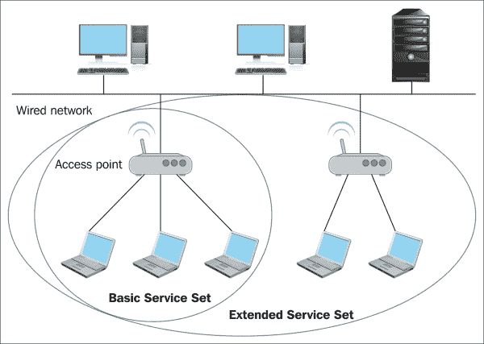
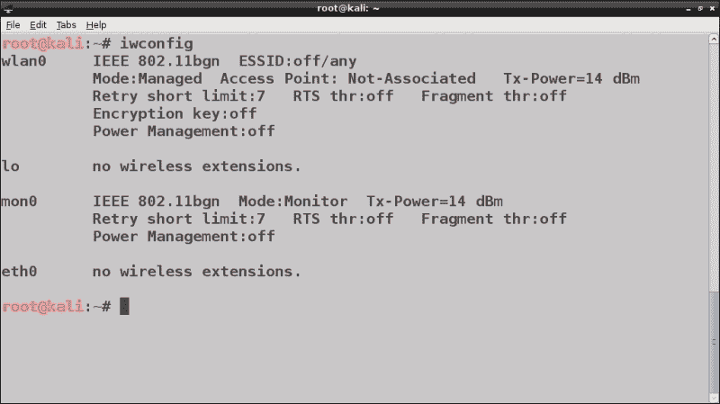
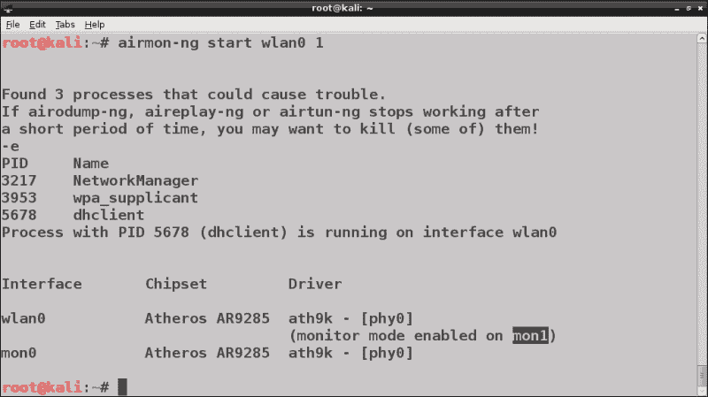
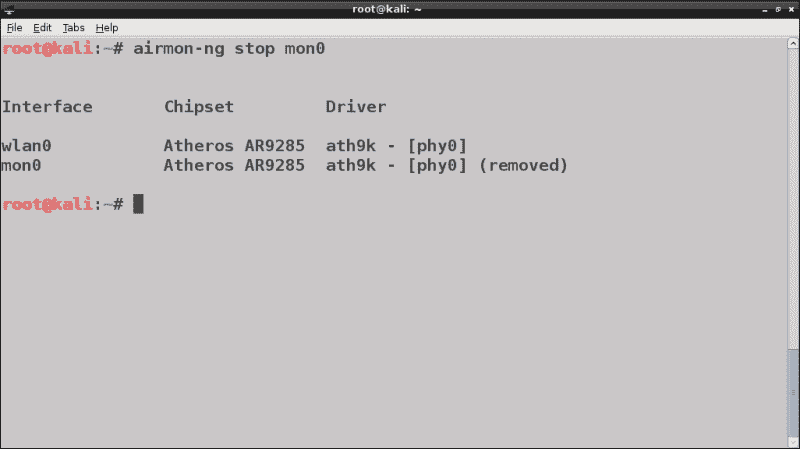
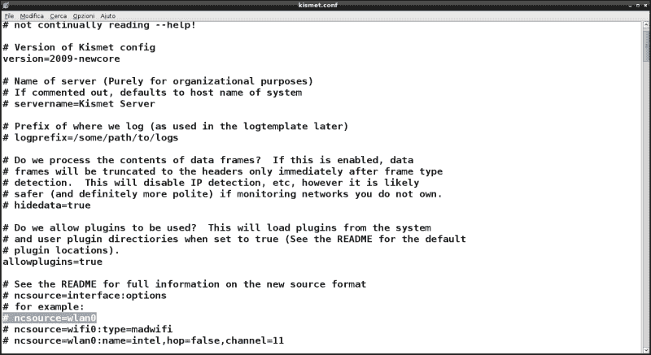
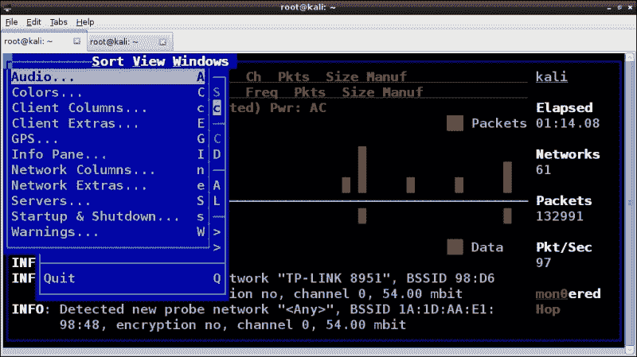
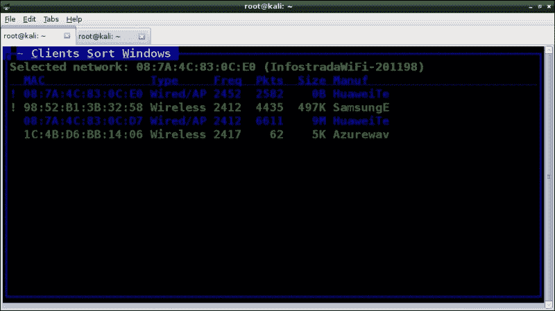

# 三、WLAN侦察

在本章中，我们将介绍无线**局域网**（**局域网**）背后的基本概念，并了解如何进行渗透测试的侦察和信息收集阶段。

本章涉及无线网络扫描和信息收集，列举可见和隐藏的网络，识别使用的安全协议，其可能的漏洞和连接的客户端。所涵盖的主题如下：

*   802.11 标准与WLAN简介
*   无线扫描简介
*   使用`airodump-ng`进行无线扫描
*   Kismet 无线扫描

# 802.11 标准及WLAN介绍

在深入实际操作之前，有必要回顾一下WLAN所基于的 802.11 标准的基本概念。

802.11 是由 IEEE 开发的用于实现WLAN的第二层（链路层）标准。使用 802.11 标准的设备和网络通常被称为**Wi-Fi**，是**Wi-Fi 联盟**的商标。

随着时间的推移，该标准已有后续规范，主要有 802.11a、802.11b、802.11g 和 802.11n。

802.11a 在 5 GHz 频率范围内运行，而 802.11b/g 在 2.4 GHz 频率范围内运行，这是目前 Wi-Fi 网络使用最多的频率范围。802.11n 支持这两个频段，并与其他 802.11 规范向后兼容。

Wi-Fi 信号的范围取决于使用的标准、发射设备的功率以及是否存在物理障碍物和无线电干扰。

对于普通的 Wi-Fi 设备，通常从室内最大 20-25 米到室外 100 米甚至更多不等。

802.11 标准的最大吞吐量（即最大数据速率）从 802.11a/b 标准的 11 Mbps 到 802.11n 标准的 600 Mbps 不等。

每个频带细分为多个信道，这些信道是包含较小频率范围的子集。2.4 GHz 频段被细分为 14 个不同的信道，但并非所有信道都一直使用。大多数国家通常只允许这些频道的一个子集，而一些国家允许所有频道。

例如，美国允许 1 到 11 个频道，而日本允许所有 14 个频道。事实上，每个国家都建立了自己的*监管域*（*监管域*），这是一套定义无线传输无线频谱分配的规则。监管域还定义了允许的最大发射功率。

### 注

**关于 Wi-Fi 频道**

要获得更多关于 Wi-Fi 频道和监管领域的信息，请参阅维基百科上的资源[https://en.wikipedia.org/wiki/List_of_WLAN_channels](https://en.wikipedia.org/wiki/List_of_WLAN_channels) 。

## 802.11 帧、类型和子类型

802.11 帧由**MAC 头**、**有效载荷**和**帧检查序列**（**FCS**段）组成，如下图所示：


MAC 头段分为多个字段，其中有**类型**和**子类型**字段。802.11 标准定义了三种不同类型的帧：

*   **管理帧**：这些帧协调WLAN上接入点和客户端之间的通信。管理框架包括以下子类型：
    *   **信标帧**：这些帧用于宣布接入点（AP）的存在和基本配置。
    *   **探测请求帧**：这些帧由客户端发送，用于测试是否存在要连接的 AP 或特定 AP。
    *   **探测响应帧**：AP 响应探测请求发送，包含网络信息。
    *   **认证请求帧**：由客户端发送，在连接到 AP 之前开始认证阶段。
    *   **认证响应帧**：由 AP 发送，用于接受或拒绝客户端的认证。
    *   **关联请求帧**：客户端用来关联 AP。它必须包含 SSID。
    *   **关联响应帧**：AP 发送，接受或拒绝与客户端的关联。
*   **控制帧**：用于控制网络上的数据流量。控制帧的子类型是**请求发送**（**RTS**帧）和**清除发送**（**CTS**帧），它们提供了减少帧冲突和**确认**（**确认**的可选机制由接收站发送以确认正确接收数据帧的帧。
*   **数据帧**：这些帧包含通过网络传输的数据，在 802.11 帧中封装了更高层协议的数据包。

在下一节中，我们将回顾无线网络的结构和构建块。

## 基础设施模式及无线接入点

Wi-Fi 网络在基础设施模式下使用 802.11 标准。在此模式下，称为**接入点**（**AP**的设备用于将无线客户端站与有线 LAN 或互联网连接。接入点可视为有线网络交换机的模拟物，但它们通过远程控制台或 web 管理面板提供更多功能，如网络层路由、DHCP、NAT 和高级管理功能。

由单个 AP 组成的无线网络称为**基本业务集**（**BSS**），而具有多个 AP 的网络称为**扩展业务集**（**ESS**。每个 AP 由**基本业务集 ID**（**BSSID**标识），通常对应于 AP 上无线接口的 MAC 地址。无线 LAN 由**服务集 ID**（**SSID**）或**扩展服务集 ID**（**ESID**）标识，通常是用作网络名称的可读的字符串。



接入点定期发送广播信标帧以宣布其存在。通常，信标还包含 AP 的 SSID，因此客户端很容易识别该 SSID，客户端可以向 AP 发送身份验证和关联请求以连接到无线网络。

## 无线安全

就物理媒体而言，无线网络上的数据传输本质上比有线网络更不安全，因为附近的任何人都可以很容易地嗅到流量。WLAN可以使用开放式身份验证，比如免费的 Wi-Fi 热点，在这种情况下，不需要来自客户端的身份验证，流量也不加密，使得开放式网络完全不安全。

随着时间的推移，已经开发了两种为WLAN提供身份验证和加密的安全协议：**有线等效隐私**（**WEP**）和**Wi-Fi 保护访问**（**WPA**/**WPA2**）。

WEP 和 WPA/WPA2 认证协议及其相关破解技术将分别在[第 4 章](4.html "Chapter 4. WEP Cracking")、*WEP 破解*和[第 5 章](5.html "Chapter 5. WPA/WPA2 Cracking")、*WPA/WPA2 破解*中讨论。

# WLAN扫描

彻底检查无线电波以找到无线网络的过程称为*无线扫描*。

无线网络扫描已经变得相当流行，即使是在非技术人员中，也是由于所谓的*防护*现象。Wardriving 是指在户外精确定位无线网络的活动，通常是驾驶汽车，配备笔记本电脑、高增益天线和 GPS 接收器。

扫描主要有两种类型：**主动**和**被动**。

*   主动扫描包括发送广播探测请求数据包并等待来自接入点的探测响应数据包，同时记录发现的数据包。这是客户端用来识别附近可用无线网络的标准方法。这种方法的缺点是，接入点可以配置为忽略广播探测请求包，并将其 SSID 从其发送的信标中排除（**隐藏 AP**），因此在这种情况下，主动扫描无法识别网络。
*   被动扫描在无线侦察方面提供了更好的效果，是无线扫描仪采用的方法。在被动扫描中，我们不发送广播探测请求。无线适配器被置于监控模式，以便它能够嗅探 Wi-Fi 频率范围内给定通道上的所有流量。对捕获的数据包进行分析，以确定哪些接入点正在从信标中包含的 BSSID 进行传输，以及连接了哪些客户端。这样，还可以显示隐藏在活动扫描中的访问点。

Kali Linux 中包含的用于扫描无线网络的工具属于被动扫描仪。在本章中，我们将介绍这两种最流行的工具，`airodump-ng`和`Kismet`，但也可以使用 Fern Wi-Fi Cracker 和 Wifite 等工具来实现这一目的。在接下来的小节中，我们将看到如何在监视器模式下配置无线适配器。

## 在监控模式下配置无线适配器

在上一章中，我们已经看到了如何将无线接口置于监控模式，以验证它是否与包嗅探兼容。现在，我们分析这个过程的细节。

回想一下，我们发出了`airmon-ng start wlan0`命令，如下面的屏幕截图所示：


`airmon-ng`工具还指示我们适配器正在使用的芯片组和驱动程序。请注意，`mon0`接口是在启用监控模式的情况下创建的，`wlan0`接口处于管理模式（这是无线适配器的默认模式），如`iwconfig`命令的以下输出所示：



`mon0`接口正在监听所有通道。如果我们想收听某个特定频道，我们可以发出的`airmon-ng start wlan0 <channel>`命令：



我们看到在监控模式下创建了另一个名为`mon1`的接口。我们可以创建与物理无线接口相关的多个监控模式接口。在运行`airmon-ng`时，我们注意到一个警告，告诉我们某些进程可能会干扰`Aircrack-ng`套件的其他工具。要停止这些进程，我们可以执行`airmon-ng check kill`。

如果我们想停止`mon0`接口，我们运行`airmon-ng stop mon0`命令：



现在界面处于监控模式，我们可以继续进行无线扫描。

## 使用 airodump ng 进行无线扫描

`airodump-ng`工具是`Aircrack-ng`套件中包含的众多工具之一。它能够嗅探并捕获 802.11 帧，同时记录与发现的接入点和客户端相关的信息。`Airodump-ng`扫描 Wi-Fi 频段，从一个频道跳到另一个频道。要使用它，在将无线接口置于监控模式后，正如我们前面所看到的，我们运行`airodump-ng mon0`命令。以下屏幕截图显示了其输出：


第一行显示 AP 和客户端之间的最后关联，以及当前通道、经过的运行时间和使用的安全协议。正如我们在前面的屏幕截图中所注意到的，屏幕的上半部分显示 AP，而下半部分显示客户端。

对于找到的每个 AP，显示以下信息：

*   BSSID（MAC 地址）
*   信号的功率电平（PWR）和接收质量（RXQ）
*   发送的信标数和捕获的数据包数
*   海峡（CH）
*   支持的最大速度（MB）
*   使用的加密算法（ENC）、密码（cipher）和身份验证协议（AUTH）
*   无线网络名称或 SSID（ESSID）

如果`<length: number>`出现在 ESSID 字段中，则表示 SSID 被隐藏，AP 仅显示其长度（字符数）。如果数字为 0 或 1，则表示 AP 未显示 SSID 的实际长度。

在下半部分，`STATION`字段是关于客户端的 MAC 地址，可以与 AP 关联。如果关联，则 AP 的 BSSID 显示在相对字段中；否则显示`not associated`状态。

`Probes`字段表示客户端试图连接到的 AP 的 SSID（如果当前未关联）。当 AP 响应探测请求或来自客户端的关联请求时，这可能会显示隐藏的 AP。

还有其他方法可以获得隐藏的 SSID。我们可以强制连接的客户端与 AP 重新关联，并向其发送取消身份验证数据包，如[第 7 章](7.html "Chapter 7. Wireless Client Attacks")、*无线客户端攻击*所示。我们还可以分析捕获的关联并使用 Wireshark 探测请求/响应数据包，以恢复 SSID。我们将介绍关于 WEP 和 WPA/WPA2 破解的[第 4 章](4.html "Chapter 4. WEP Cracking")、*WEP 破解*和[第 5 章](5.html "Chapter 5. WPA/WPA2 Cracking")、*WPA/WPA2 破解*的倒包和分析。

我们可以使用`-w`或-`-write`选项，后跟文件名，将输出写入文件。`Airodump-ng`可将输出保存为多种格式（`pcap`、`ivs`、`csv`、`gps`、`kismet`、`netxml`），兼容 Kismet 和 Wireshark 等包分析工具。

`Airodump-ng`还允许通过-`-channel`或`-c <ch_nr1,ch_nr2…..ch_nrN>`选项选择特定频道：

```
airodump-ng -c 1 -w output mon0

```


# Kismet 无线扫描

Kismet 是一款功能强大的被动扫描仪，可用于不同的平台，默认情况下安装在 Kali 上。它不仅仅是一个扫描仪，也是一个无线帧分析和入侵检测工具。

Kismet 由两个主要流程组成：`kismet_server`和`kismet_client`。`kismet_server`组件完成捕获、记录和解码无线帧的工作。其配置文件为`kismet.conf`，在 Kali Linux 上位于`/etc/kismet/`。`kismet_client`前端是一个基于 ncurses 的界面，显示检测到的 AP、统计信息和网络详细信息。要运行它，我们在命令行上键入`kismet`或从**应用程序**菜单导航到**Kali Linux****无线攻击****802.11 无线工具****Kismet**：


如我们所见，Kismet 提示我们启动服务器，我们在下面的提示中选择`Yes`，然后选择`Start`。然后会出现一条消息，说明未定义数据包源，并要求我们添加数据包源：


数据包来源为我们的监控模式接口`mon0`，我们在后续提示的`Intf`字段中插入：


也可以在`kismet.conf`文件中的`ncsource`指令中设置数据包源，如下面的屏幕截图所示：



这是推荐的配置数据包源的方法，避免每次 Kismet 启动时手动配置。

我们关闭服务器控制台并显示客户端界面。要访问窗口顶部的菜单，我们按*~*键，然后用箭头键移动条目。Kismet 界面和行为可通过导航至**Kismet****首选项**进行自定义：



屏幕从上到下分为以下主要部分：网络列表、客户端列表、数据包图、状态和右侧的常规信息侧面板。您可以在**视图**菜单中选择要可视化的部分：


网络列表显示默认自动适应模式下检测到的网络。

要选择一个网络并查看其详细信息和连接的客户端，我们需要将排序方法更改为另一种，例如使用**排序**菜单中的**类型**或**频道**。然后我们可以用鼠标点击列表中的一个网络：


导航至**Windows****网络详细信息**了解更多详细信息，如 BSSID、信道、制造商、信号电平、分组速率等：


如果我们选择**客户端**选项，我们可以看到连接到网络的客户端，以及有用的信息，如 MAC 地址、交换的数据包和客户端设备制造商。



如果网络具有隐藏的 SSID，Kismet 会显示字符串`<Hidden SSID>`来代替网络名称。当客户端尝试连接到网络时，AP 在响应数据包中以明文形式发送 SSID，让 Kismet 发现它，正如我们在`Airodump-ng`中已经看到的那样。

Kismet 默认在启动它的目录中生成以下日志文件（但我们可以在`kismet.conf`中的`logtemplate`指令中对此进行更改）：

*   包捕获文件
*   文本格式的网络（`.nettxt`
*   XML 格式的网络（`.netxml`
*   XML 格式的 GPS 数据（`.gpsxml`

然后 Wireshark 可以检查数据包捕获文件，其中可以包含频谱数据、信号和噪声级以及 GPS 数据。

事实上，Kismet 以及`Airodump-ng`可以通过`gpsd`守护进程与 GPS 接收机集成，以建立网络坐标，也可以使用合适的工具（如 Giskimet）实现图形地图。

### 注

**吉斯基米特**

Giskimet 是 Kismet 的可视化工具，默认情况下包含在 Kali Linux 中，允许将`.netxml`文件导入 SQLite 数据库，以便我们可以在其上执行 SQL 查询，并构建网络的图形和地图。此工具非常有用，尤其是在扫描具有多个接入点的大型网络时。欲了解更多信息，请访问 Giskimet 网站[http://trac.assembla.com/giskismet/wiki](http://trac.assembla.com/giskismet/wiki) 。

# 总结

在本章中，我们介绍了 IEEE 802.11 标准和基础设施模式下典型的WLAN部署。然后，我们介绍了无线扫描的基本概念，并了解了如何使用 Kali Linux 中包含的两个最有效的工具`airodump-ng`和 Kismet 来实际发现和收集有关无线网络的信息。

在下一章中，我们将介绍 WEP 协议，解释它不安全的原因，并了解如何使用 Kali Linux 提供的工具破解它。