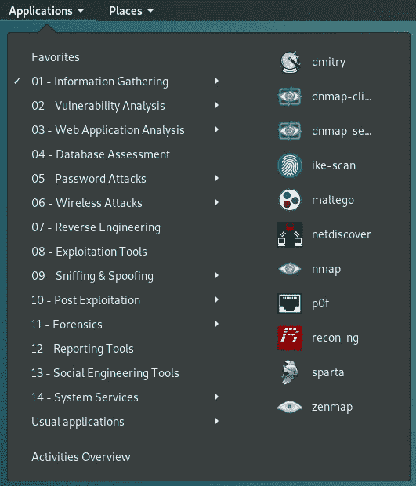
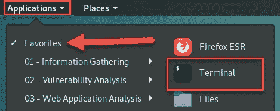
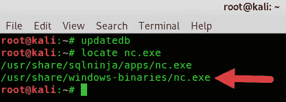
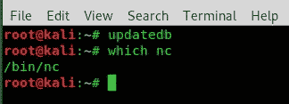

# 适应 Kali Linux 2019

如果你在网络安全领域起步，特别是在攻击性安全测试（渗透测试）领域，你很可能会遇到 Kali Linux 操作系统。Kali Linux 有很多特性和工具，使渗透测试人员或安全工程师在现场或工作中的工作更容易。有许多工具、脚本和框架可用于完成各种任务，例如收集目标信息、执行网络扫描，甚至利用漏洞等。作为初学者，我们面临的挑战是学习和适应新环境。

在本章中，我们将学习如何作为用户和渗透测试人员更有效地使用 Kali Linux。此外，您将学习如何使用 Linux 操作系统执行各种任务，并更加熟悉它。如果不了解 Kali Linux 是如何工作的，您可能会在后面更高级的渗透测试章节中面临挑战。

在本章中，我们将介绍以下主题：

*   理解 Kali Linux
*   Kali Linux 2019 有什么新功能？
*   Kali Linux 基础知识

# 技术要求

Kali Linux 是本章的唯一技术要求。

# 理解 Kali Linux

让我们回顾一下回溯的历史（[https://www.backtrack-linux.org/](https://www.backtrack-linux.org/) ）。回溯操作系统是由审计员安全收集和 Whax 组织在 2006 年开发和维护的。当时，BackTrack 基于 Linux 操作系统 Ubuntu。基于 Linux 意味着 BackTrack 为渗透测试人员提供了许多机会，其优点之一是能够从 live CD 和 live USB 可引导介质引导。然而，回溯操作系统的最新版本是**回溯 5**，它是在项目归档之前于 2011 年发布的。2012 年，新一代操作系统，现在是 BackTrack 的继承者，被称为**Kali Linux**，它是从头开始构建的。2013 年 3 月，Kali Linux 正式向公众发布。

在网络安全领域，特别是渗透测试领域，大多数最棒的工具都是为 Linux 操作系统而不是为 Microsoft Windows 创建的。因此，在大多数网络安全培训计划中，您会注意到 Linux 是执行安全测试的首选操作系统。

使用 Kali Linux 的一些好处如下：

*   它支持开源渗透测试工具。
*   默认情况下，它包含 300 多个工具。
*   基于 Linux 允许将其安装在磁盘驱动器上或通过实时引导介质（DVD 或 USB）使用。
*   它支持在 OnePlus 智能手机和 Raspberry Pi 等移动设备上安装。
*   它不需要太多的资源，比如 RAM 或 CPU。
*   Kali Linux 可以作为虚拟机安装在本地磁盘驱动器、可引导 USB 闪存驱动器、Raspberry Pi 和各种其他设备上。

Kali Linux 操作系统构建于 Debian 之上，由 300 多个预装工具组成，功能从侦察到攻击，甚至取证。Kali Linux 操作系统不仅是为安全专业人员设计的，而且也是为 IT 管理员甚至 IT 领域的网络安全专业人员设计的。作为一个免费的安全操作系统，它包含进行安全测试所需的工具。

在 Kali Linux 操作系统中，有许多流行的工具目前正在业界使用，如**网络映射器**（**Nmap**）、aircrack ng 和 Metasploit 框架。操作系统的部署和使用非常灵活，仅受您想象力的限制。

Kali Linux 是一个预先打包的多功能操作系统，其中包含渗透测试、数字取证、逆向工程等工具，绝对是渗透测试人员的首选。在下一节中，我们将深入了解 Kali Linux 2019 中的新功能。

# Kali Linux 2019 有什么新功能？

Kali Linux 2019 附带了 4.19.13 的升级内核，以及操作系统中的许多更新包和错误修复。主要升级之一是 Metasploit 框架。Metasploit 的前一个版本是 2011 年发布的 4.0 版，但在 2019 年的 Kali Linux 中，它升级到了 5.0 版。

新的 Metasploit 版本 5.0 带来了新的规避技术、数据库更新和 API 自动化。Kali Linux 2019 还包含以下工具的升级：

*   收割机
*   dbeaver
*   变质岩
*   exe2hex
*   msfpc
*   秘书长

Further information on the new evasion techniques in Metasploit 5.0 can be found at [https://www.rapid7.com/info/encapsulating-antivirus-av-evasion-techniques-in-metasploit-framework/](https://www.rapid7.com/info/encapsulating-antivirus-av-evasion-techniques-in-metasploit-framework/).

Kali Linux 操作系统是目前最流行的渗透测试 Linux 发行版之一，它的开发人员和用户社区继续增长。未来将有更多的更新和改进。

现在您已经了解了 Kali Linux 2019 的最新变化，我们将学习如何使用 Kali Linux。

# Kali Linux 基础知识

在数字生活的大部分时间里，习惯于操作系统有时是好事，有时是坏事。最有可能的情况是，您是 Windows 或 macOS 用户，对这些特性和功能非常熟悉，并且知道如何在当前选择的操作系统中找到解决方法。然而，对于一些人来说，学习一个新的平台，甚至是一个新的用户界面都是相当具有挑战性的。这就像是一个安卓用户切换到苹果 iOS，反之亦然。刚开始的时候会有点困难，但通过不断的练习，你会成为一名绝地大师。

在接下来的几节中，我们将深入学习作为渗透测试人员导航 Linux 操作系统的基础知识。

# 终端和 Linux 命令

Linux 终端几乎是 Linux 操作系统中最强大的接口，因为这是所有神奇的地方。大多数 Linux 工具都是基于命令行的。大多数渗透测试工具也是基于命令行的，这有时会对新用户和刚刚开始网络安全领域或直接进行渗透测试的人造成威胁。

以下练习将帮助您更加熟悉 Linux 终端和命令的使用：

*   要更改当前用户帐户上的密码，请执行`passwd`命令。无论何时在 Linux 终端/外壳上键入密码，密码本身都是不可见的。
*   要在终端中查看您当前的工作目录，请使用`pwd`命令。
*   要查看当前目录中的文件和文件夹列表，请使用`ls`命令。此外，`ls –la`命令可用于提供具有权限的所有文件（包括隐藏文件）的列表。
*   要更改目录或导航文件系统，请使用`cd`命令，后跟目录。

下面是演示这些命令使用的屏幕截图。执行`pwd`命令后可以看到当前工作目录，使用`ls -l`命令可以看到文件和文件夹列表，使用`cd`命令可以看到更改工作目录的选项：

此外，如果我们的目录中有一个文本文件，我们可以使用`cat`命令查看其内容。此外，我们还可以使用`echo "text" >> filename.txt`语法直接从终端向现有文件添加额外的文本行，如下面的屏幕截图所示。仔细看，`ls`命令用于在桌面上显示文件，`cat`命令用于在终端上打印`Test.txt`文件的内容，`echo`命令用于添加文本：

使用`>>`开关将向现有文本文件添加另一行（换句话说，插入新行）。但是，使用一个`>`将用新字符串覆盖所有内容，我们可以在这里看到：

`Test.txt`文件现在包含最新的文本字符串。

如果您有兴趣了解更多关于 Linux 的知识，请查看思科网络学院的*Linux Unhatched*和*Linux Essentials*课程：[https://www.netacad.com/courses/os-it](https://www.netacad.com/courses/os-it) 。

请记住，使用 Linux 操作系统的练习越多，执行任务就越容易。

下一步，我们将演示如何使用各种实用程序找到您在 Kali Linux 中的使用方法。

# 在 Kali Linux 中导航

在本节中，我们将指导您了解操作 Kali Linux 操作系统的基础知识。如前所述，Kali Linux 基于 Linux 的 Debian 风格。这意味着所有其他基于 Debian 的操作系统都将具有类似的用户界面。

Kali Linux 启动后，您将看到登录屏幕；登录 Kali Linux 的默认用户名和密码为`root`/`toor`。登录后，您将看到一个非常漂亮、干净、精致的用户界面。在左上角，您首先会注意到的是应用程序下拉菜单。这是保存所有渗透测试和取证工具的菜单。如以下屏幕截图所示，应用程序菜单分为各种类别，如信息收集、漏洞分析和 Web 应用程序分析：

此外，将鼠标悬停在某个类别上将显示此部分的常用工具。但是，单击一个类别将扩展更多的子类别，每个子类别包含更多的工具。让我们点击应用程序| 02–漏洞分析| Cisco 工具。您将看到右侧打开的附加菜单，显示与 Cisco 设备相关的所有漏洞工具，如以下屏幕截图所示：

当您成为 Linux 用户时，您很快就会意识到操作系统上最强大的应用程序之一是 Linux 终端。该终端相当于 Windows 操作系统中的命令提示符。许多任务和工具通常通过终端窗口初始化。你可能想知道：Kali Linux 有一个**图形用户界面**（**GUI**），所以它的所有内置工具不都有 GUI 吗？简而言之，答案是否定的。

Kali Linux 的大部分强大工具仅由**命令行界面**（**CLI**控制）；但是，有些用户可以选择使用 GUI。使用 CLI 的好处是，与 GUI 相比，工具的输出在终端上更加详细。我们将在本书后面的部分研究这个概念。要打开终端，请选择应用程序|收藏夹|终端：

Kali Linux 具有任何其他操作系统所具有的所有常规特性和功能。这意味着存在用户目录，如`Home`、`Desktop`、`Documents`、`Downloads`、`Music`和`Pictures`。要使用 Kali 快速访问任何位置，只需单击位置下拉菜单：

现在，普通的 Windows 用户在拥有类似于控制面板的东西之前不会觉得他们的体验是完整的。要访问 Kali Linux 中的等效控制面板，只需单击右上角的电源按钮图标。这将创建一个下拉菜单，您将看到扳手和螺丝刀图标，如以下屏幕截图所示。

单击此图标将打开操作系统的设置菜单：

在左侧列中，您将找到主要类别。右侧显示了每个的展开：

在 Kali Linux 上进行任何配置更改之前，请确保记录默认设置。这是为了确保在进行更改后，如果出现任何问题，可以恢复到以前的状态。此外，在进行任何重大更改之前，请创建虚拟机的快照。

现在您已经更好地了解了流行目录和设置的位置，我们可以继续学习如何在 Kali Linux 上更新和安装程序。

# 更新源和安装程序

有时，工具可能无法按预期工作，甚至在渗透测试或安全审计期间意外地在我们身上崩溃。开发人员经常为他们的应用程序发布更新。这些更新旨在修复 bug 并为用户体验添加新功能。

要在我们的 Kali Linux 操作系统上更新软件包，我们必须首先将包索引文件与其源重新同步。让我们开始：

1.  打开终端，执行`apt-get update`命令：

索引位于`/etc/apt/sources.list`文件中。

这一过程通常需要一到两分钟才能完成，并实现稳定的互联网连接。

2.  如果要将 Kali Linux 机器上的当前软件包（应用程序）升级到其最新版本，请使用`apt-get upgrade`命令：

执行升级时，在执行渗透测试之前，请确保所有工具和脚本都能正常工作。

如果在 Kali Linux 上升级软件包时遇到错误，请使用`apt-get update --fix-missing`命令解决任何依赖项，然后再次执行`apt-get upgrade`命令。

3.  在输出结束时，交互式菜单将要求您选择是（`y`）或否（`n`）以继续升级过程。选择“是”后，操作系统将下载每个软件包的所有最新版本并逐个安装。这个过程需要一些时间才能完成。

或者，如果您想将您的 Kali Linux 版本升级到最新的发行版，请使用`apt-get dist-upgrade`命令。在撰写本文时，我们正在使用 Kali Linux 2019.2。

此外，通过删除任何旧的或不再需要的包文件，执行`apt autoremove`命令将在您的 Kali Linux 操作系统上执行清理操作：

现在我们对如何更新和升级操作系统有了清晰的了解，让我们来看看如何在 KALI Linux 2019 中安装新的应用程序（包）。一个非常著名的漏洞扫描器是**开放式漏洞评估系统**（**开放式漏洞评估系统**。但是，默认情况下，Kali Linux 2019 中不包括 OpenVAS。在本练习中，我们将在 Kali 机器上安装 OpenVAS 应用程序。要开始，请确保您的 Kali 机器上有 internet 连接。

使用`apt-get install openvas`命令搜索存储库，下载并安装包及其所有依赖项：

此过程需要几分钟才能完成。确保在 Kali Linux 上安装任何软件包之前执行`apt-get update`命令。安装软件包（应用程序）后，它将出现在应用程序菜单的指定类别中，如以下屏幕截图所示：

请务必在[查看您的 Kali Linux 版本的发行说明 https://www.kali.org/category/releases/](https://www.kali.org/category/releases/) 。

有时，更新源文件将有助于在 Kali Linux 上更新、升级和检索软件包。`sources.list`文件的最新更新可在[找到 https://docs.kali.org/general-use/kali-linux-sources-list-repositories](https://docs.kali.org/general-use/kali-linux-sources-list-repositories) 。

在下一节中，我们将深入了解 Kali Linux 操作系统中三个最重要的工具。

# “查找”、“定位”和“哪些命令”

在 Kali Linux 操作系统中，用户可以通过多种方法查找文件和目录。在本节中，我将向您介绍`find`、`locate`和`which`实用程序。这些实用程序中的每一个都执行类似的任务，但返回的请求信息彼此略有不同。

在使用这些命令之前，我们必须首先执行`updatedb`命令，为 Kali Linux 上当前文件系统中的每个文件构建本地数据库。这个过程通常需要几秒钟才能完成。

在下一节中，我们将深入了解每个 Linux 实用程序以及它们的使用方式。

# 定位命令

一旦数据库构建完成，我们可以使用`locate`实用程序查询数据库中的本地文件。在本例中，我们试图使用`locate nc.exe`命令定位 Netcat Windows 可执行文件的目录：

正如我们所看到的，`locate`实用程序能够为我们检索文件系统中`nc.exe`文件的位置。

# 哪个命令

接下来，我们将使用`which`实用程序帮助我们搜索目录。与前面的示例不同，我们不需要指定文件扩展名；`which`实用程序用于定位可执行文件的文件路径。简单地说，`which`实用程序将仅为您提供文件路径：

前面的屏幕截图显示了在 Kali Linux 中使用`which nc`命令检索 Netcat 路径的位置。

# find 命令

`find`实用程序比`locate`和`which`更具攻击性。`find`实用程序将返回包含我们指定的关键字或字符串的所有结果。在我们的示例中，我们使用了`find`命令为我们提供了以`nc`：
开头的所有文件（包括其目录）的列表

`man`命令可以帮助我们了解工具或实用工具是如何工作的。`man`命令用于为我们提供工具的手册页面。我们可以使用`man find`命令查看`find`实用程序的`man`页面：

当您想了解 Linux 上的新工具和现有工具时，`man`命令非常有用。

在下一节中，我们将讨论如何在 Kali Linux 中管理服务，并查看一些实际示例。

# 管理 Kali Linux 服务

Kali Linux 操作系统可以作为各种类型服务的服务器，例如**安全外壳**（**SSH**）、**超文本传输协议**（**HTTP**）等等。在本节中，我将演示如何启用和禁用各种服务。一旦服务在系统上运行，就会打开关联的网络端口。例如，如果机器上启用了 HTTP，则默认逻辑端口为`80`；对于 SSH，端口为`22`。

有关服务和端口号分配的更多信息，请访问**互联网分配号码管理局**（**IANA**）网站[https://www.iana.org/assignments/service-names-port-numbers/service-names-port-numbers.xhtml](https://www.iana.org/assignments/service-names-port-numbers/service-names-port-numbers.xhtml) 。

要在 Kali Linux 中启用服务，我们可以使用`service <service-name>`命令语法。在我们的示例中，我们将启用 Apache web 服务器，使用`netstat –antp | grep <service-name>`命令，我们可以验证相关服务是否正在运行以及网络端口是否打开，如以下屏幕截图所示：

最后一列包含服务名称；在我们的练习中，我们可以看到`apache2`列表。这表明 web 服务正在具体运行，Apache2 web 服务在 Kali Linux 上处于活动状态。

要启用 SSH，我们可以使用`service ssh start`命令。

此外，由于它是一个 web 服务器，我们可以打开 web 浏览器并输入环回 IP 地址`127.0.0.1`，以验证默认 Apache 网页是否正在我们的屏幕上加载：

但是，如果我们的 Kali Linux 机器断电或重新启动，我们以前启用的服务将恢复为默认的启动设置。如果我们想确保某些服务总是在 Kali Linux 的引导过程中启动，该怎么办？这可以通过使用终端窗口中的`update-rc.d <service-name> enable`命令来完成：

在我们的示例中，我们启用了 SSH 服务，这将允许我们通过网络安全地远程访问我们的 Kali Linux 机器。HTTP 服务器将允许我们访问 web 服务器页面。

最后但并非最不重要的一点是，我们可以禁用单个服务，并禁用在引导过程中自动启动的服务，如以下屏幕截图所示：

在成龙历险记叔叔的声音中，“*O**ne 更多东西！*”，我建议更改 Kali Linux 上 root 帐户的默认密码。要更改密码，请打开终端窗口并执行`passwd`命令。交互式提示将要求您输入新密码并进行验证。

请注意，在基于 Linux 的操作系统上的终端界面上输入密码时，您输入的字符不会出现在屏幕/终端上。

在本节中，您学习了使用 Kali Linux 操作系统的基本技能。这些技能包括导航文件系统、更新和安装软件包，以及启用和禁用服务。

# 总结

在本章中，我们讨论了使用 Kali Linux 操作系统作为首选渗透测试发行版的好处。我们介绍了操作系统的基本操作和查找方法，就像其他操作系统一样。然后，我们查看了更新源文件和升级现有软件包的情况，并演示了如何安装新的应用程序和删除过时的软件包。最后，我们介绍了如何使用`find`、`locate`和`which`实用程序在 Kali Linux 操作系统中快速查找文件和目录。

学习 Kali Linux 的基本要素将在您的未来旅程中取得丰硕成果。本章所教的技能将帮助您了解使用 Kali Linux 时的一些简单问题，其中一些问题经常被忽略。知道如何收集目标上的信息而不知道如何在 Kali Linux 操作系统中查找或定位文件和目录是毫无意义的，因此学习基础知识将花费您很长的时间。

在下一章中，我们将介绍**被动信息收集**，这是渗透测试侦察阶段的开始。

# 问题

1.  Kali Linux 的前身是什么？
2.  如何在 Kali Linux 上更新存储库？
3.  如何在 Linux 上升级当前的软件包？
4.  哪个命令从官方在线存储库安装新的应用程序？
5.  如何在文件系统中快速找到文件？

# 进一步阅读

*   **卡利 Linux 2019.2 发布信息**：[https://www.kali.org/news/kali-linux-2019-2-release/](https://www.kali.org/news/kali-linux-2019-2-release/)
*   **卡利 Linux 官方文档**：[https://www.kali.org/kali-linux-documentation/](https://www.kali.org/kali-linux-documentation/)