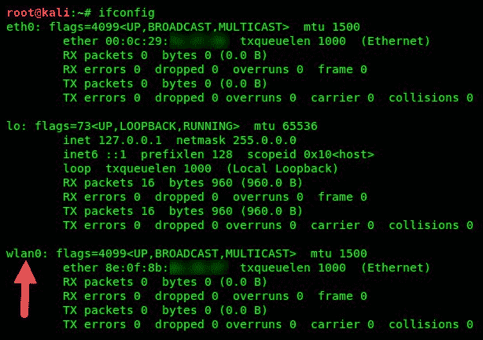
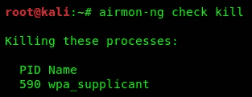

# 理解网络渗透测试

在网络渗透测试的准备阶段，了解目标系统和/或网络基础设施的安全测试目标至关重要。在启动任何类型的攻击模拟之前，通过欺骗设备的 MAC 地址并配置无线网络适配器以监视和捕获 IEEE 802.11 无线网络上的无线流量，在网络上成为匿名用户（或假装为合法用户）是很重要的。

网络渗透测试侧重于进入网络并对目标组织内部网络内的网络安全设备、设备和系统执行安全审计（渗透测试）。在本章中，您将了解可以在 Kali Linux 的无线适配器上配置的各种模式，如何欺骗您的 MAC 地址，以及如何在无线网络上捕获数据包。

在本章中，我们将介绍以下主题：

*   网络渗透测试简介
*   理解 MAC 地址
*   将无线适配器连接到 Kali Linux
*   管理和监控无线模式

# 技术要求

本章的技术要求如下：

*   Kali Linux（[https://www.kali.org/](https://www.kali.org/) ）
*   VMware Workstation 或 Oracle VM VirtualBox
*   支持分组注入的无线**网络接口****卡**（**网卡**）

并非所有无线网卡都支持监控模式和数据包注入。然而，芯片组中的微小修改可能会导致该卡无法在监视器模式下工作，有些卡可能需要编译驱动程序，并且可能无法开箱即用。

以下是 Kali Linux 支持的外部无线 NIC 列表：

*   Atheros:ATH9KHTC（AR9271、AR7010）
*   rLink:RT3070
*   Realtek:RTL8192CU
*   TP 链路 TL-WN722N
*   TP 链路 TL-WN822N v1-v3
*   阿尔法网络 AWUS036NEH
*   阿尔法网络 AWUS036NHA
*   阿尔法网络 AWUSO36NH

我个人建议使用**阿尔法网络 AWUS036NHA**卡。

# 网络渗透测试简介

网络渗透测试的目标是发现目标网络基础设施上的任何安全漏洞。这种类型的渗透测试可以从组织外部（外部测试）或内部（内部测试）进行。作为渗透测试人员，我绝对建议在目标网络上执行内部和外部安全测试。

以下是网络渗透测试的一些目标：

*   绕过外围防火墙
*   规避**入侵检测系统/防御系统**（**IDS/IPS**）
*   路由和交换错误配置测试
*   检测不必要地打开的网络端口和服务
*   查找敏感目录和信息

执行网络渗透测试有助于 IT 专业人员关闭不必要的网络端口、禁用服务、解决问题，并以更好的方式配置安全设备以减轻威胁。

在外部网络渗透测试期间，渗透测试人员试图通过突破防火墙和任何 ID/IP，通过 internet 访问目标组织的网络。但是，内部网络渗透测试涉及到组织网络内部的安全测试，该网络已经在外围防火墙设备后面。

以下是网络渗透测试过程中需要遵循的六个步骤：

1.  信息收集
2.  端口扫描
3.  操作系统和服务指纹
4.  脆弱性研究
5.  利用漏洞验证
6.  报告

在下一节中，我们将简要介绍渗透测试的不同方法。

# 渗透试验的类型

以下是通常由渗透测试人员进行的三种类型的安全测试：

*   **白盒**：白盒测试包括在网络渗透测试之前，对网络和系统有完整的了解，包括网络图、IP 寻址方案和其他信息。这种类型的测试比灰盒和黑盒测试容易得多，因为渗透测试仪不需要在目标网络和系统上执行任何类型的信息收集。
*   **灰箱**：在灰箱测试中，渗透测试人员在进行网络渗透测试之前，对组织的网络基础设施和系统了解有限。
*   **黑箱**：在黑箱测试中，渗透测试人员没有事先了解目标组织或其网络和系统信息。提供的有关目标的信息通常只是组织的名称。

现在我们已经完成了网络渗透测试的介绍部分，让我们深入了解 MAC 地址的要点。

# 理解 MAC 地址

在网络领域内，网络专业人员在进行故障排除时经常会提到两种模式。这些模型被称为**开放系统互连**（**OSI**参考模型）和**传输控制协议/互联网协议**（**TCP/IP**堆栈。

下表概述了每个模型的层，并显示了 OSI 模型、**协议数据单元**（**PDU**）和 TCP/IP 协议套件：


通常，术语**包**和**帧**将互换使用，但它们之间存在差异。让我们更多地关注一下框架及其组成的特征。

在本节中，我们将重点关注 OSI 模型的数据链路层（第 2 层）。数据链路层负责将设备上的软件应用程序之间的数据移动到网络的物理层。这是由 NIC 完成的。另外，在将数据放置到物理层之前，数据层将 NIC 的物理地址即**媒体访问控制**（**MAC**地址）插入到帧中。该地址有时被称为**老化地址**（**BIA**）。

设备的 MAC 地址长度为 48 位，以十六进制格式写入；因此，每个字符的范围在 0-9 和 A-F 之间。前 24 位被称为**组织唯一标识符**（**OUI**），并由**电气和电子工程师协会**（**IEEE**分配给供应商和制造商。通过了解任何有效 MAC 地址的前 24 位，您可以确定 NIC 和/或设备的供应商/制造商。最后 24 位是唯一的，由供应商分配，从而为每个设备创建唯一的 MAC 地址。

以下是 MAC 地址的细分：


要在 Windows 上查看 MAC 地址，请使用`ipconfig /all`命令：


但是，在基于 Linux 的操作系统上，您需要使用`ifconfig`命令：


我们现在对设备和网络上 MAC 地址的用途有了更好的了解。现在，让我们深入学习如何改变（欺骗）我们的 KI Linux 中的 MAC 地址。

# 如何欺骗 MAC 地址

**欺骗**是网络上的一种模仿形式；它隐藏了你作为渗透测试者的身份。离开 Kali Linux 机器的所有流量都将包含源的新配置 MAC 地址。

在本练习中，我们将更改 Kali Linux 机器上 LAN 接口的 MAC 地址。请按照以下简单步骤进行操作：

1.  使用以下命令关闭网络接口：

```
ifconfig eth0 down
```

2.  一旦接口关闭，我们可以使用`macchanger`工具在接口上修改我们的 MAC 地址。`macchanger`工具允许您自定义新的（伪造的）地址。要查看所有可用选项，请使用`macchanger --help`命令。
3.  要更改以太网（网络）接口上的 MAC 地址，我们将使用`macchanger --random eth0`命令，如以下屏幕截图所示：


4.  成功更改 MAC 地址后，使用以下命令打开以太网接口：

```
ifconfig eth0 up
```

5.  最后，我们现在可以使用`ifconfig`命令验证新的 MAC 地址是否在接口上注册，如下图所示：


完成此练习后，您现在可以在 Kali Linux 中欺骗每个网络接口上的 MAC 地址。在下一节中，我们将学习如何将无线适配器连接到 Kali Linux 机器。

# 将无线适配器连接到 Kali Linux

在无线网络渗透测试期间，您需要将外部无线 NIC 连接到您的 Kali Linux 机器。如果您将 Kali Linux 直接安装在磁盘驱动器上，那么连接无线 NIC 就像通过 USB 连接一样简单。适配器将自动出现在网络设置中。

然而，当使用虚拟机时，事情会变得有点棘手。在本节中，我将演示如何将无线网络适配器连接到**VMware Workstation**和**Oracle VM VirtualBox**。

如果您使用的是 VMware Workstation，请执行以下步骤：

1.  首先，选择 Kali Linux 虚拟机并单击编辑虚拟机设置：


2.  然后，虚拟机设置将打开，为您提供了添加、删除和修改模拟硬件资源的许多选项。选择**USB 控制器**；这些选项将显示在窗口的右侧。根据计算机上的物理 USB 控制器选择适当的 USB 版本，并确保在**显示所有 USB 输入设备**的复选框中打勾：


3.  完成后，单击**确定**保存设置。打开 Kali Linux 虚拟机电源，并将无线适配器插入计算机上可用的 USB 端口。

在 VMware Workstation 的右下角，您将看到一些图标。这些图标表示物理硬件组件或设备。褪色的图标表示硬件或设备未连接到虚拟机，而鲜艳的图标表示组件或设备已连接。

4.  单击以下屏幕截图中突出显示的 USB 图标。将出现一个菜单，提供将 USB 设备从主机连接到虚拟机的选项。选择无线适配器：


5.  成功连接 USB 无线适配器后，图标应亮起。现在，是时候验证 Kali Linux 是否能够看到无线适配器了。打开终端，执行`ifconfig`命令：



所有无线适配器均表示为`wlan`，后跟一个数字。我们的无线适配器是`wlan0`。

对于那些正在使用**Oracle VM VirtualBox**的用户，该过程与前面提到的 VMware 类似。使用以下步骤完成此练习，即通过虚拟机监控程序将无线适配器连接到 Kali Linux：

1.  要开始，请在仪表板中选择 Kali Linux 虚拟机，然后单击**设置**：


2.  设置菜单打开后，选择左列的**USB**类别。确保无线适配器已插入计算机上的 USB 端口，并与我们为 VMware Workstation 所做的类似，选择**USB 2.0（EHCI）控制器**版本。
3.  接下来，单击旁边带有+符号的**USB**图标，将 USB 设备连接到虚拟机。选择 USB 无线适配器：


无线适配器将插入**USB 设备过滤器**字段，如下图所示：


4.  点击**确定**保存虚拟机的设置。打开 Kali Linux 虚拟机电源，并使用`ifconfig`命令验证无线适配器的状态。

完成本节内容为您提供了将无线适配器成功连接到 Kali Linux 虚拟机的必要技能。在下一节中，我们将了解如何在 Kali Linux 中管理和监视无线模式。

# 管理和监控无线模式

Linux 操作系统允许用户手动配置无线适配器的操作模式。

以下是不同的模式以及它们所包含的内容的解释：

*   **特设**模式用于在不使用无线路由器或接入点的情况下互连多个终端设备，如笔记本电脑。
*   默认操作模式为**管理**。此模式允许设备（即主机）连接到无线路由器和接入点。但是，有时您可能需要在组织的 Wi-Fi 网络上执行无线渗透测试。处于管理模式的无线适配器不适用于此类任务。
*   **主控**模式允许 Linux 设备作为接入点运行，以允许其他设备同步数据。
*   **直放站**模式允许节点设备向网络上其他节点转发报文；中继器通常用于扩展无线信号的范围。
*   **辅助**模式允许设备作为主机或中继器的备份。
*   **监视器**模式允许设备以 IEEE 802.11 的频率传递监视器数据包和帧。该模式允许渗透测试仪不仅监控流量，还可以捕获数据，并使用兼容的无线适配器执行**数据包注入**。

操作模式取决于网络拓扑和 Linux 操作系统在网络中的角色。

我们可以使用两种方法在监控模式下配置无线适配器：手动和使用`airmon-ng`工具。

在下一节中，我们将了解如何执行以下操作：

*   手动启用监视模式
*   使用 airmon ng 启用监视器模式

让我们更详细地了解每种方法。

# 手动启用监视模式

在本节中，我将指导您完成在 Kali Linux 机器的无线 NIC 上手动启用监视器模式所需的步骤。

以下说明将指导您完成在 Kali Linux 机器上手动启用监视器模式的过程。

要开始，请打开新的终端窗口并执行以下命令：

1.  执行`ifconfig`命令，确定无线适配器是否已连接并被 Kali Linux 操作系统识别。另外，注意界面 ID，在下面的截图中，界面为`wlan0`：


2.  现在我们有了接口 ID，使用`ifconfig wlan0 down`通过操作系统逻辑关闭接口。在更改任何接口的模式之前，这是必需的。
3.  现在界面已经关闭，是时候将我们的`wlan0`界面配置为监控模式了。`iwconfig wlan0 mode monitor`命令将启用监控模式。完成后，我们需要验证接口上的模式是否已成功更改。执行`iwconfig`命令。您应该看到模式已更改为`Monitor`，如下图所示：


4.  最后，我们需要使用`ifconfig wlan0 up`命令打开`wlan0`接口。

完成此练习后，您已经掌握了在 Kali Linux 中启用监视模式所需的技能。在下一节中，我们将了解如何使用 airmon ng 配置无线适配器。

# 使用 airmon ng 启用监视器模式

airmon ng 是 aircrack ng 无线安全审计工具套件的一部分。airmon ng 是一种用于将无线适配器配置为进入（或退出）监视模式的工具。

让我们看看如何启用和禁用监视器模式：

1.  要开始，请打开一个新的终端窗口并执行`ifconfig`或`iwconfig`命令以验证无线适配器状态和 ID：


2.  在启用监视模式之前，我们需要终止任何可能阻止适配器转换为监视模式的后台进程。通过使用`airmon-ng check kill`命令，工具将检查可能阻止适配器转换为监控模式的任何进程，并终止它们：



3.  接下来，执行`airmon-ng start wlan0`以启用监控模式。此外，将创建一个新的逻辑接口，如以下屏幕截图所示：


4.  `wlan0mon`接口将用于监控 IEEE 802.11 网络。要禁用监控模式，只需使用`airmon-ng stop wlan0mon`命令。

通过完成此练习，您现在可以使用手动方法和 airmon ng 工具在无线适配器上启用监视。

# 总结

在本章中，我们讨论了网络渗透测试的基本原理和概念及其重要性。我们介绍了将无线适配器连接到 Kali Linux 机器的实际操作信息，讨论了 MAC 地址的用途及其组成，并讨论了如何通过修改来欺骗我们的身份。此外，我们还研究了如何通过手动配置和使用 airmon ng 工具将无线适配器的默认模式更改为监视模式。

现在您已经完成了本章，您知道如何使用`airmon-ng`工具和通过 Kali Linux 操作系统手动正确启用监控模式。此外，您现在可以在无线网络上执行监视。

我希望本章内容丰富，能够帮助和指导您在网络安全领域的旅程。在下一章[第 9 章](09.html)*网络渗透测试-连接前攻击*中，我们将通过一些实践练习深入了解网络渗透测试。

# 问题

以下是基于本章所述主题的一些问题：

1.  在 Kali Linux 中，可以使用什么工具来更改 MAC 地址？
2.  您能说出无线适配器可以配置为运行的不同模式吗？
3.  如何查看网络接口的 MAC 地址？
4.  如何终止可能阻止适配器转换为监视模式的任何后台进程？

# 进一步阅读

*   有关 OSI 模型和 TCP/IP 协议栈的更多详细信息，请参见*CompTIA 网络+认证指南*中的[https://www.packtpub.com/networking-and-servers/comptia-network-certification-guide](https://www.packtpub.com/networking-and-servers/comptia-network-certification-guide) 。
*   有关机组 ng 和 airmon ng 的更多信息，请参见[https://www.aircrack-ng.org/documentation.html](https://www.aircrack-ng.org/documentation.html) 。