# 第一章实验室设置

在本章中，我们将演示本书实际操作工作经验所需的完整实验室设置。要建立实验室，我们需要三样东西：Oracle VM VirtualBox、Microsoft Windows XP SP2 和 BackTrack 5 R2。

Oracle VM VirtualBox 是 Sun Microsystems 的产品。它是一个软件虚拟化应用程序，用于在一台计算机上运行多个操作系统。它支持许多操作系统，包括 Linux、Macintosh、Sun Solaris、BSD 和 OS/2。每个虚拟机都可以与主机操作系统并行执行自己的操作系统。它还支持虚拟机中的网络适配器、USB 设备和物理磁盘驱动器。

微软视窗 XP 是微软公司生产的操作系统。它主要用于个人电脑和笔记本电脑。

BackTrack 是一个基于 Linux 的免费软件操作系统。它被安全专业人员和渗透测试人员广泛使用。它由许多用于渗透测试和数字取证的开源工具组成。

现在，我们将在 Oracle VM VirtualBox 中安装这两个操作系统，并使用 BackTrack 作为攻击者机器，使用 Windows XP 作为受害者机器。

# 安装 Oracle VM VirtualBox

安装 Oracle VM VirtualBox 的步骤如下：

1.  First, run the setup file to start the installation procedure and then click on **Next >**.

    

2.  Now choose the installation directory where you want to install and click on **Next >**.

    

3.  如果要在桌面或启动栏中创建快捷方式图标，请选择快捷方式选项，然后单击**下一步>**。
4.  It will then reset the network connectivity and display a warning sign; click on **Yes** and continue the installation of the wizard.

    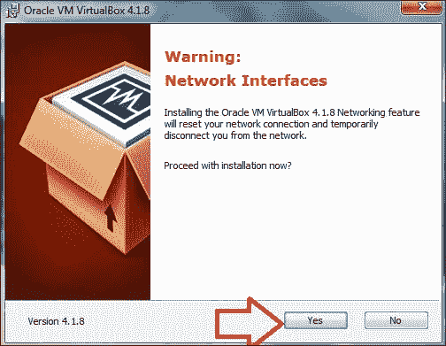

5.  The setup wizard is ready for the installation, click on **Install** to continue.

    

6.  安装已开始安装，需要几分钟才能完成。
7.  Now it will ask to install the USB device driver, click on **Install** to install the driver software.

    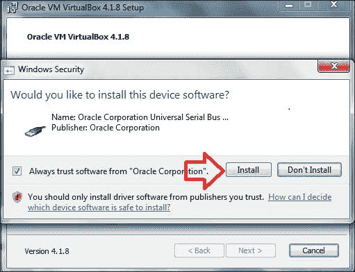

8.  After a few minutes the installation wizard is finished and Oracle VM VirtualBox is ready for use. Click on **Finish**.

    

# 在 Oracle VM VirtualBox 上安装 WindowsXP

现在我们将在 VirtualBox 中安装 Windows XP SP2。只需执行以下步骤即可成功安装：

1.  First, launch your VirtualBox and click on **New**.

    

2.  您将看到一个新窗口，其中显示消息**欢迎使用新虚拟机向导**；点击**下一步**。
3.  You will get a new window showing memory options, here we will need to specify the amount of base memory (RAM) for our virtual machine. Select the amount of memory and then click on **Next**.

    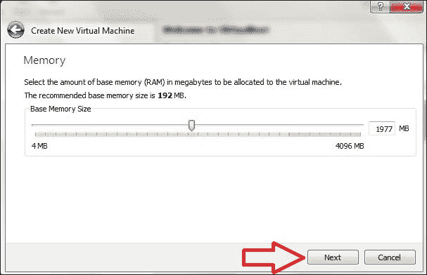

4.  After this we will get a new window with the option to create a virtual hard disk. Here we will select **Create new hard disk** and click on **Next**.

    

5.  We then get a new window with the message **Welcome to the Virtual disk creation wizard**. Here we have some options for the hard disk file type; we select **VDI (VirtualBox Disk Image)**. You may select another type of file, but VDI is recommended for best performance. After selecting the file type, click on **Next**.

    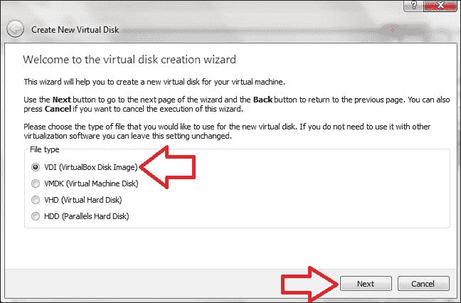

6.  We then see a new window named **Virtual disk storage details**. In this window we can see details of the two types of storage: **Dynamically allocated** and **Fixed size**. The details of these two types of storage are mentioned in this window. So it depends upon the user as to what kind of storage he may prefer. In this case we will select **Dynamically allocated**; click on **Next** to continue.

    

7.  Now we will get a new window with options for the **Location** and **Size** of the virtual disk file. We choose the location where we want to create the file for the virtual disk. After that, select the size for your virtual disk. In this case we are specifying 10 GB space for virtual disk. Then click on **Next** to continue.

    

8.  We then get a new window with the summary of our virtual machine settings. In this window we can check the settings we previously provided for our virtual machine, such as the file type of our hard disk, storage details, location details, and the size of our hard disk. After checking the settings we then click **Create**.

    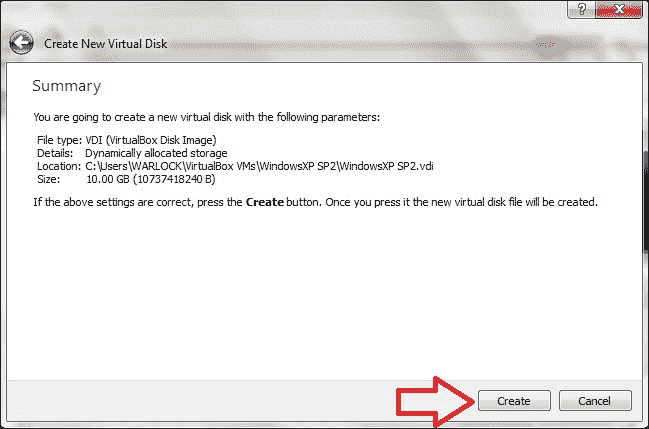

9.  我们将获得**摘要**窗口，该窗口将显示它将创建具有以下参数的虚拟机：虚拟机名称、操作系统类型、基本内存（RAM）和硬盘大小。验证所有设置后，点击**创建**创建虚拟机。
10.  Now **Oracle VM VirtualBox Manager** will open, and it will show the virtual machine in the right pane. Select that virtual machine and click on **Start** to start the installation process for Windows XP.

    

11.  A new window will appear with the message **Welcome to the First Run Wizard!** Click on **Next** to begin.

    

12.  Now a new window will appear with the option of selecting the source installation media. This option allows us to select the ISO image of Windows XP or the DVD-ROM drive to install from the CD/DVD. Select the appropriate option and then click on **Next**.

    

13.  A new **Summary** window will open and it will show the type of media that was selected for installation, the media source, and the type of device. Click on **Start**.

    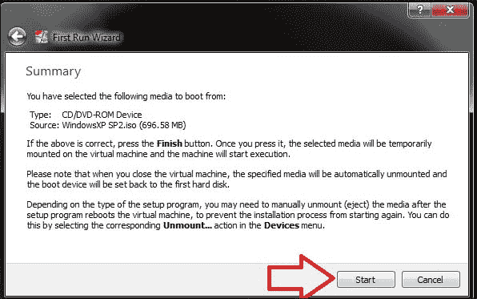

14.  Windows XP installation will start and a blue screen appears with the message **Windows Setup** on the upper-left side.

    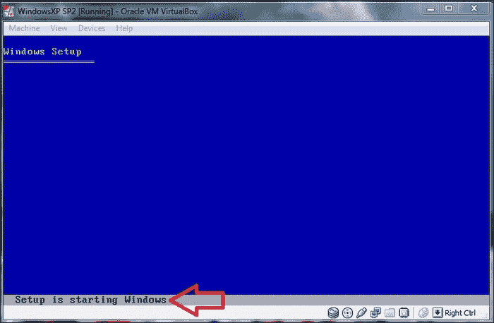

15.  Now we will get a new window with the message **Welcome to setup**. Here we can see three options, the first option is **To set up Windows XP now, press ENTER**.

    

16.  然后我们将被提示同意 Windows XP 许可证；按*F8*接受。
17.  After accepting the agreement we will see the unpartitioned space dialog. We will need to create partitions from this unpartitioned space. Select the second option **To create partition in the unpartitioned space, press C**.

    

18.  After pressing *C*, the next step is to set the size of the new partition and then press **Enter**.

    

19.  After creating the new partition, we can now see three options here; select the first option **To set up Windows XP on the selected item, press ENTER** to continue.

    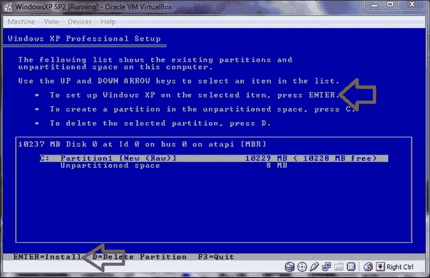

20.  Now we have to format the selected partition before continuing the installation process. Here we see four options for formatting and select the first option which is **Format the partition using the NTFS file system (Quick)** and press *Enter*.

    

21.  Now setup will format the partition.

    

22.  After formatting the partition, the setup will copy the Windows files.

    

23.  After copying the Windows files it will restart your virtual machine after 10 seconds, or press **ENTER** for immediate restart.

    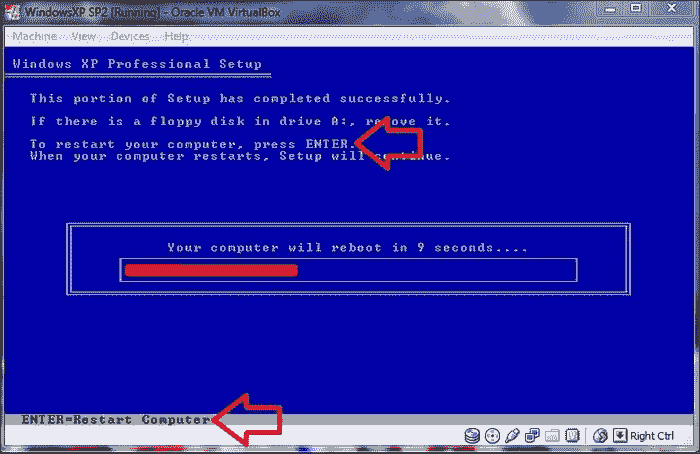

24.  重新启动虚拟机后，您将看到 Windows XP 启动屏幕。
25.  Windows 安装过程将启动，大约需要 40 分钟才能完成。
26.  Now a new window will appear for **Regional and language Options**, just click on **Next >**.

    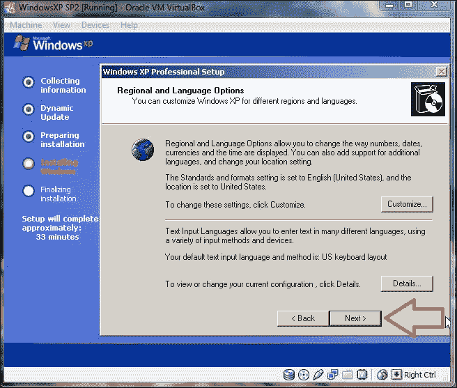

27.  After that a new window will appear asking for your **Name** and **Organization** name; enter these details and click on **Next >**.

    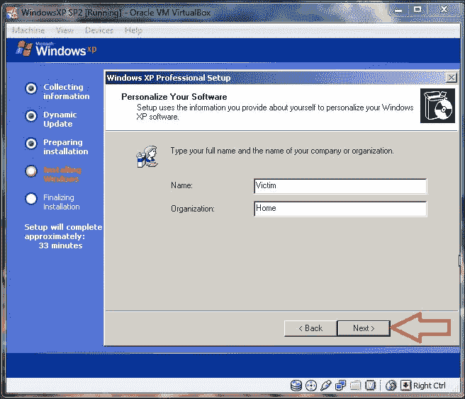

28.  A new window will appear asking for the **Product Key**; enter the key and click on **Next >**.

    

29.  The next wizard will ask for a **Computer name** and **Administrator password**, enter these details and click on **Next >**.

    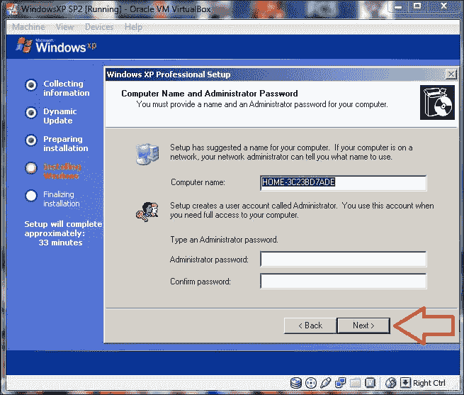

30.  This will be followed by a screen to enter the date, time, and time zone settings. Select the time zone according to your country, enter the date and time, and then click on **Next >**.

    

31.  We will see the installation screen again, with **Installing Network** settings.

    

32.  A new window will prompt us to choose the network settings. Select **Typical settings**. If we want to configure our network settings manually, we can select **Custom settings** and then click on **Next >**.

    

33.  The wizard will ask if we want to make the computer a member of the workgroup or domain. For our lab we select **WORKGROUP** and click on **Next >**.

    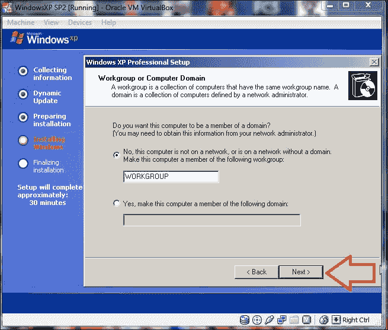

34.  然后我们将看到 Windows XP 启动屏幕。
35.  After Windows XP has booted, we will see a message **Welcome to Microsoft Windows**. To continue, click on **Next**.

    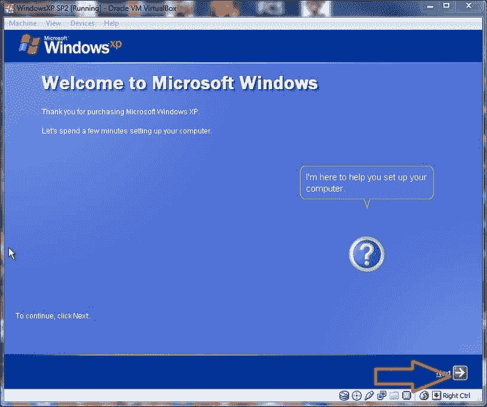

36.  向导将询问我们是否打开自动更新。根据您的喜好进行选择，然后点击**下一步**。
37.  The next wizard will ask about internet connectivity; we suggest you skip it by clicking on **Skip**.

    

38.  Now the wizard will ask about online registration; we do not want to register, so we select the second option and click on **Next**.

    

39.  Next the wizard will ask for the usernames of the people who will use this computer. Enter the names and click on **Next**.

    

40.  您将看到**感谢**消息；点击**完成**。
41.  Now your Windows XP installation is ready for use.

    

# 在 Oracle 虚拟机虚拟盒上安装 BackTrack5 R2

现在我们正在去在虚拟盒上安装 BackTrack 5 R2。执行以下步骤：

1.  First, launch your Oracle VM Virtual Box.

    

2.  将出现一个新窗口，显示消息**欢迎使用新虚拟机向导**；点击**下一步**。
3.  We follow the same process which we followed during our Windows XP virtual machine creation for the BackTrack virtual machine setup. Our BackTrack machine will be set up and the summary displayed as shown in the following screenshot. Click on **Create**:

    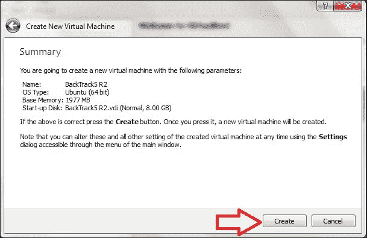

4.  Now **Oracle VM VirtualBox Manager** will open and will show the new virtual machine in the right pane. Select that virtual machine and click on **Start** to start the installation process of BackTrack 5.

    

5.  A new window will appear with the message **Welcome to the First Run Wizard!**; click on **Next** to begin.

    

6.  A new window will appear with options for selecting source installation media. Select the ISO image of BackTrack 5 or the DVD Rom drive to install from CD/DVD, and then click on **Next**.

    

7.  A new **Summary** window will open, and it will show the type of media that was selected for installation, the media source, and the type of device; now click on **Start**.

    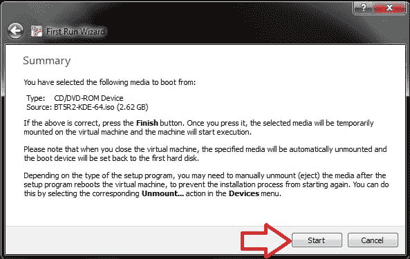

8.  We will see a black boot screen; just press *Enter*.

    

9.  The BackTrack boot screen with a command-line interface will appear, showing the prompt: **root@bt:~#**; type `startx` as the value of this command and press *Enter*.

    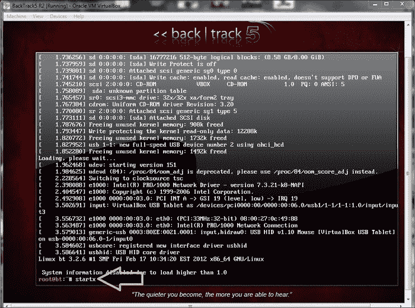

10.  Now the BackTrack GUI interface will start and we will see an icon named **Install BackTrack**. We will have to click on that icon to continue the installation process.

    

11.  After that, the installation wizard will start. Select the language and click on **Forward**.

    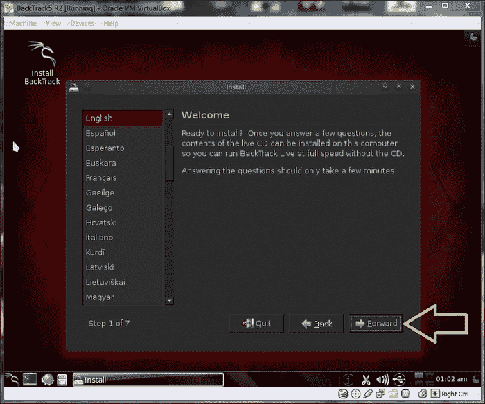

12.  安装向导将自动从网络时间服务器设置时间。
13.  Select the **Time Zone** and **Region**, and click on **Forward**.

    

14.  The next wizard will ask for the **Keyboard layout**. Select the appropriate layout according to your language and click on **Forward**.

    

15.  The disk partition wizard will appear. Just use the default settings and click on **Forward**.

    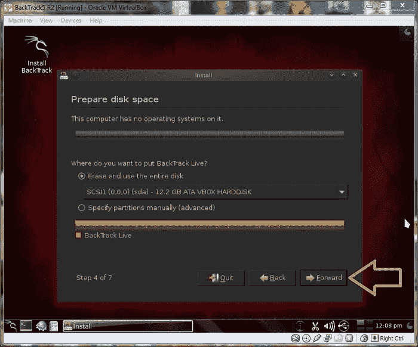

16.  Now click on **Install**.

    

17.  设置将开始复制文件。完成安装大约需要 40 分钟。
18.  After finishing the installation, just click on **Restart**, and now the BackTrack installation is ready for use.

    

# 总结

在本实验室设置中，我们设置了受害者和攻击者机器，我们将在实际会话中使用它们。下一章将介绍 Metasploit 框架组织、基础知识、体系结构以及对其的简要介绍。