# 五、漏洞扫描和信息收集

在前一章中，我们介绍了 MeterMeter 的各种功能以及客户端利用应采用的方法。现在，我们慢慢深入探讨利用原则，第一阶段是信息收集。我们解释了各种技术，通过这些技术，我们可以收集受害者的信息，以便进行攻击前分析。这些信息用于更好地了解受害者，并收集平台丰富的信息，用于攻击系统。漏洞数量的增加使我们转向使用自动漏洞扫描器。本章旨在掌握漏洞扫描的艺术，这是利用漏洞的第一步。将涵盖的部分模块如下：

*   通过 Metasploit 收集信息
*   使用 Nmap
*   与 Nessus 合作
*   在 Metasploit 中导入报表

# 通过 Metasploit 收集信息

信息收集是通过各种技术收集被害人信息的过程。这基本上分为足迹和扫描两个步骤。通过组织的网站、商业新闻、工作门户、不满的员工等，可以公开获取组织的大量信息。恶意用户可以通过此阶段查找属于某个组织的域名、远程访问信息、网络体系结构、公共 IP 地址等。

Metasploit 是一个非常强大的工具，它的工具包中包含了一些强大的工具，用于信息收集和分析。其中包括：Nmap、支持 Postgres 移植报告的 Nessus，然后使用 Metasploit 收集的信息进行攻击，等等。Metasploit 已经与 Postgres 集成，这间接有助于在测试阶段将渗透测试结果存储更长的时间。信息收集阶段被认为非常重要，因为攻击者使用这些工具来收集重要信息，以危害其受害者。Metasploit 辅助模块具有从 ARP 到 SYN 的各种扫描，甚至还有基于服务的扫描，如 HTTP、SMB、SQL 和 SSH。这些实际上有助于提取服务版本的指纹，甚至有助于提取有关可能使用该服务的平台的一些信息。因此，通过这些规范，我们的攻击范围在打击受害者时受到了进一步的限制。

图片取自[http://s3.amazonaws.com/readers/2010/12/20/spyware_1.jpg](http://s3.amazonaws.com/readers/2010/12/20/spyware_1.jpg)

在 Metasploit 的帮助下，我们将着手进行信息收集。让我们假设我们是攻击者，并且我们有一个必须被利用的域。第一步应该是检索有关域的所有信息以用于恶意目的。`Whois`是收集信息的最佳方法之一。它广泛用于查询存储 Internet 资源（如域名、IP 地址等）的注册用户的数据库。

打开`msfconsole`并输入`whois <domain name>`。例如，这里我们使用的是我自己的域名`whois <techaditya.in>`。

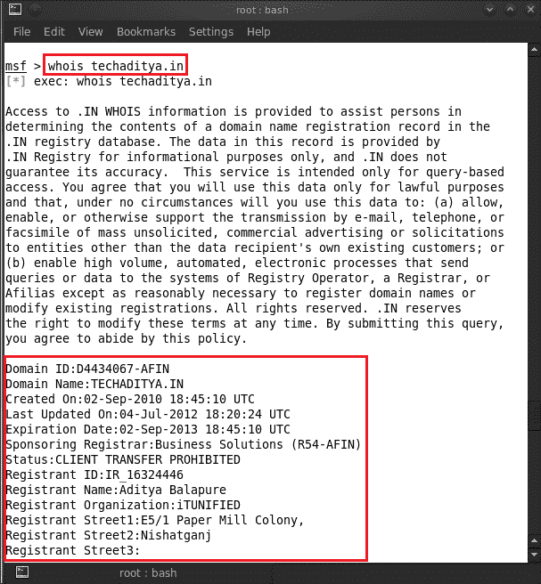

我们可以看到收集到的与我们的领域相关的信息量。在 Metasploit 中，有许多辅助扫描仪，它们对于通过电子邮件收集信息非常有用。电子邮件捕获是获取与特定域关联的电子邮件 ID 的非常有用的工具。

用于使用`use auxiliary/gather/search_email_collector`中的电子邮件收集器辅助模块类型。

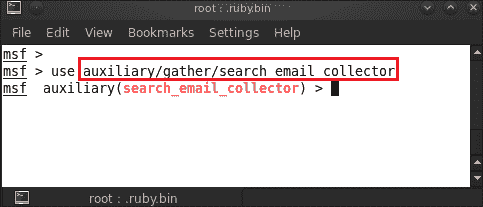

让我们看看可用的选项。为此，请键入`show options`。

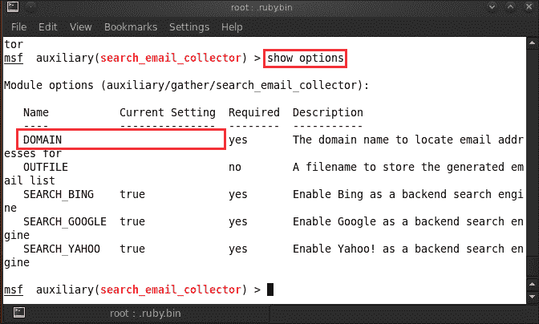

我们可以看到域是空的，我们必须设置域地址。所以只要输入`set domain <domain name>`；例如，我们在这里使用`set domain techaditya.in`。

现在让我们运行辅助模块；只需输入`run`即可显示结果。

通过这些步骤，我们收集了大量关于受害者的公开信息。

# 主动信息采集

现在让我们继续进行一些积极的信息收集，以利用我们的受害者。另一个有用的辅助扫描器是 telnet 版本扫描器。要使用此选项，请键入`use auxiliary/scanner/telnet/telnet_version`。

之后，输入`show options`查看可用选项。

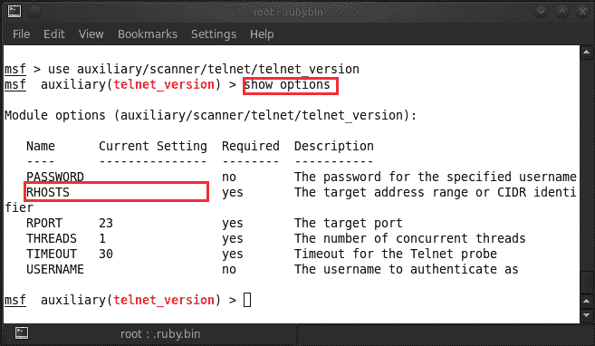

我们可以看到，`RHOSTS`选项为空，并且我们已经设置了扫描 telnet 版本的目标 IP 地址，所以输入`set RHOSTS<target IP address>`。例如，我们在这里键入`set RHOSTS 192.168.0.103`，然后键入`run`进行扫描。

我们的受害者已经被扫描，我们可以看到他的机器的 telnet 版本。

我们将使用另一个扫描仪来确定**远程桌面**连接（**RDP**是否可用，这就是 RDP 扫描仪。但出于这个目的，我们必须知道远程桌面连接的端口号，即 3389，也称为 RDP 端口。输入`use auxiliary/scanner/rdp/ms12_020_check`然后输入`show options`查看使用的详细选项。

我们可以看到从 1-10000 预定义的选项和端口。我们不需要扫描所有端口，因此我们定义了默认情况下运行 RDP 的端口号。之后，我们将`RHOST`设置为我们的目标地址。输入`set PORTS 3389`并按*进入*，然后输入`set RHOST 192.168.11.46`。

一旦我们设置了所有选项，输入`run`。

我们可以在结果中看到用于远程桌面连接的 TCP 端口 3389 是打开的。

# 与 Nmap 合作

Nmap 是由*Gordon Lyon*利用的功能强大的安全扫描仪，用于计算机网络上的主机、服务和开放端口检测。它具有许多功能，如隐形扫描、攻击性扫描、防火墙规避扫描，并具有对操作系统进行指纹识别的能力。它有自己的 Nmap 脚本引擎，可以与 Lua 编程语言一起使用来编写定制脚本。

我们从使用 Metasploit 的 Nmap 扫描的基本技术开始。

在没有命令选项的情况下扫描运行 Nmap 的单个目标将对目标地址执行基本扫描。目标可以指定为 IPV4 地址或其主机名。让我们看看它是如何工作的。打开终端或`msfconsole`，并键入`nmap <target>`，例如`nmap 192.168.11.29`。

扫描结果显示目标上检测到的端口的状态。结果分为三个不同的列，即`PORT`、`STATE`和`SERVICE`。`PORT`列显示端口号，`STATE`列显示端口状态，无论是打开还是关闭，`SERVICE`列显示该端口上运行的服务类型。

端口的响应分为六种不同的状态消息：打开、关闭、过滤、未过滤、打开过滤和关闭过滤。

以下是用于扫描多台主机的一些不同类型的 Nmap 扫描选项：

*   **Scanning multiple targets**: Nmap scans for multiple hosts at the same time. The easiest way to do this is by putting all the targets in a string separated by a space. Type in `nmap <Target Target>`, for example, `nmap 192.168.11.46 192.168.11.29`.

    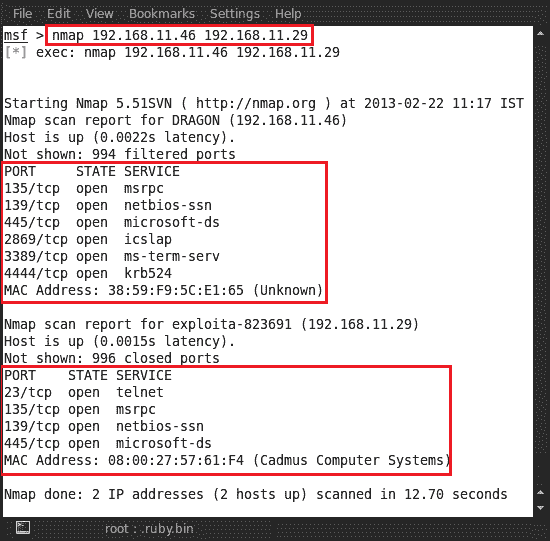

我们可以看到这两个 IP 地址的结果。

*   **Scanning a list of targets**: Suppose we have a large number of target computers to scan. Then the easiest way to scan all the targets would be by putting all the targets in a text file. We just need to separate all targets by a new line or space. For example, here we have created a list named `list.txt`.

    

现在要扫描整个列表，请键入`nmap –iL <list.txt>`。这里，语法`–iL`用于指示 Nmap 从`list.txt`中提取目标列表，例如`nmap –iL list.txt`。

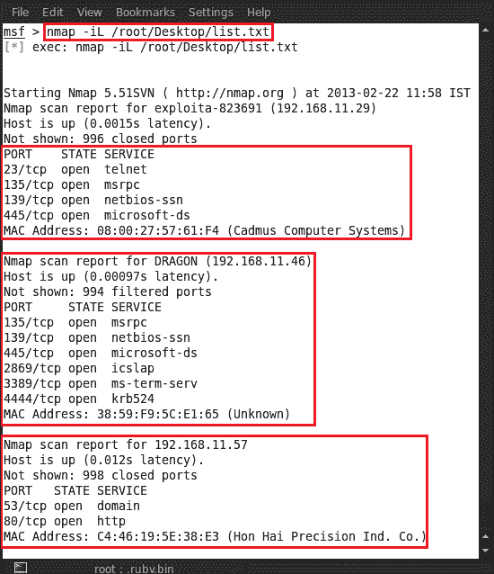

现在我们继续讨论各种 Nmap 发现选项。那么 Nmap 实际上是如何工作的呢？每当 Nmap 执行扫描时，它都会向目的地发送 ICMP 回显请求，以检查主机是否处于活动状态。当 Nmap 一次扫描多个主机时，此过程为 Nmap 节省了大量时间。有时，ICMP 请求会被防火墙阻止，因此作为辅助检查，Nmap 会尝试连接到 web 服务器或 HTTP 使用的默认开放端口，如 80 和 443。

## Nmap 发现选项

现在我们将继续讨论各种 Nmap 命令选项，这些选项可用于基于场景的主机发现。

在前面的屏幕截图中，我们可以看到 Nmap 中所有可用的扫描选项。让我们测试一些，因为命令的完整内容超出了本书的范围。

*   **Ping only scan**: This scan is used for finding the live hosts in a network. For executing the ping only scan, we use the command `nmap –sP <Target>`; for example, here we set `nmap –sP 192.168.11.2-60`.

    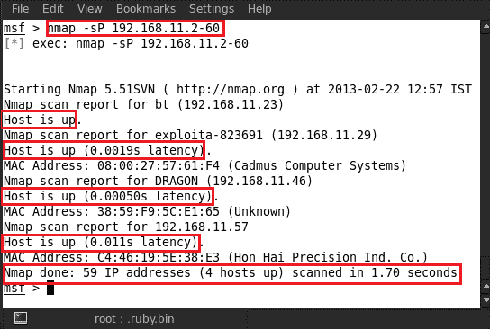

在结果中我们看到有四台主机启动。因此，这种扫描节省了在大型网络中执行扫描的时间，并识别了所有活动主机，留下了非活动主机。

*   **TCP ACK ping**: This scan sends TCP ACK packets to the target. This method is used to discover hosts by collecting TCP responses from hosts (depends on TCP three-way handshake). When ICMP requests are blocked by the firewall, this method is useful for gathering information. For performing this scan, we use the command `nmap –PA <target>`; for example, here we set `nmap –PA 192.168.11.46`.

    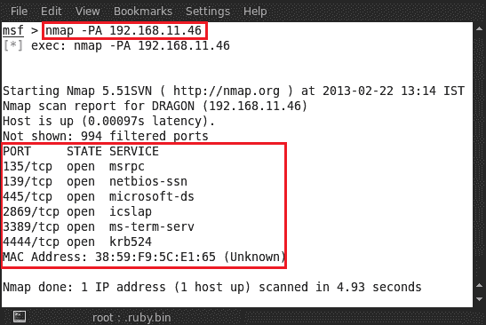

*   **ICMP echo ping**: This option sends ICMP requests to the target for checking whether the host replies or not. This type of scan works best on the local network where ICMP packets are easily transmitted over the network. But many hosts do not respond to ICMP packet requests for security reasons. The command for this option is `nmap –PE 192.168.11.46`.

    

*   **Force reverse DNS resolution**: This scan is useful for performing reconnaissance on a target. Nmap will try to resolve the reverse DNS information of the target address. It reveals juicy information about the target IP address as you can see in the following screenshot. The command we used for scanning is `nmap –R <Target>`; for example, here we set `nmap –R 66.147.244.90`.

    

## Nmap 高级扫描选项

现在让我们来看一些高级扫描选项。主要用于绕过防火墙，查找不常见的服务。选项列表显示在以下屏幕截图中：

我们将对其中一些问题作如下解释：

*   **TCP SYN scan**: TCP SYN scan attempts to identify ports by sending a SYN packet to the target and waiting for a response. A SYN packet is basically sent to indicate that a new connection is to be established. This type of scan is also known as the stealth scan because it does not attempt to open a full-fledged connection to the remote host. For performing this scan, we use the command `nmap –sS <target>`; for example, here we are using `nmap –sS 192.168.0.104`.

    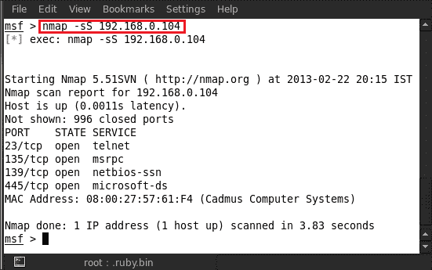

*   **TCP null scan**: This type of scan sends packets without TCP flags enabled. This is done by setting the header to zero. This type of scan is used for fooling a firewalled system in getting a response from them. The command for null scan is `nmap –sN <target>`; for example, here we are using `nmap –sN 192.168.0.103`.

    

*   **Custom TCP scan**: This type of scan performs a custom scan using one or more TCP header flags. Any combination of flags can be used in this scan. The various types of TCP flags are shown in the following figure:

    

这些标志的任何组合均可用于此扫描。使用的命令为`nmap –scanflags SYNURG <target>`；例如，这里我们设置了`nmap –scanflags SYNURG 192.168.0.102`。

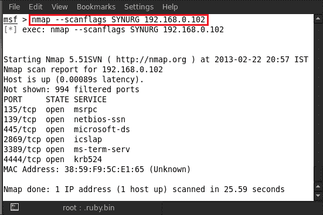

## 端口扫描选项

接下来我们继续针对特定端口、一系列端口以及基于协议、名称等的端口扫描的更多扫描技术。

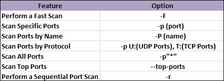

*   **Fast scan**: In this scan, Nmap does a quick scan for only 100 ports out of the 1000 most common ports. Thus, the Nmap scanning speed gets tremendously increased by reducing the number of ports during the scan. The command used for fast scan is `nmap –F <Target >`; for example, here we are using `nmap –F 192.168.11.46`.

    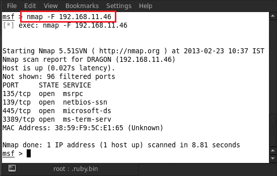

*   **Scan ports by name**: Scanning ports by name is very easy and we just have to specify the port name during the scan. The command used is `nmap –p (portname) <target>`; for example, here we are using `nmap –p http 192.168.11.57`.

    

*   **Performing a sequential port scan**: With the help of the sequential port scanner, Nmap scans its target by a sequential port order. This technique is quite useful for evading firewall and **Intrusion Prevention System**. The command used is `nmap –r <target>`; for example, here we are using `nmap –r 192.168.11.46`.

    

扫描时收到过滤端口结果时，有时会遇到问题。当系统受到防火墙或入侵防御系统的保护时，会出现这种情况。Nmap 的一些特性也有助于绕过这些保护机制。我们在下表中列出了几个选项：

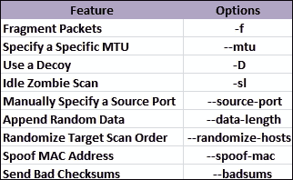

我们将对其中一些问题作如下解释：

*   **Fragment Packets**: By using this option, Nmap sends very small 8 byte packets. This option is very useful for evading improperly configured firewall systems. The command used is `nmap –f <target>`; for example, here we are using `nmap –f 192.168.11.29`.

    

*   **Idle Zombie Scan**: This is a very unique scanning technique in which Nmap uses a zombie host for scanning the target. It means, here Nmap uses two IP addresses for performing a scan. The command used is `nmap –sI <Zombie host> <Target>`; for example, here we are using `nmap –sI 192.168.11.29 192.168.11.46`.

    

*   **Spoof MAC Address**: This technique is useful when a firewalled-system detects a scanning process via the system's MAC address, and blacklists those MAC addresses. But Nmap has a feature of spoofing MAC addresses. MAC addresses can be spoofed via three different arguments, which are listed in the following screenshot:

    

用于此操作的命令为`nmap –spoof-mac <Argument> <Target>`；例如，这里我们使用的是`nmap –spoof-mac Apple 192.168.11.29`。

在学习了不同类型的扫描技术之后，接下来我们将讨论如何以各种方式和格式保存 Nmap 输出结果。下图列出了这些选项：

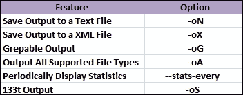

让我们将 Nmap 输出结果保存在 XML 文件中。使用的命令为`nmap –oX <scan.xml> <Target>`；例如，这里我们使用的是`nmap –oN scan.txt 192.168.11.46`。

# 与 Nessus 合作

Nessus 是一款专有漏洞扫描器，可免费用于非商业用途。它检测目标系统上的漏洞、错误配置、默认凭据，并用于各种法规遵从性审核。

在 Metasploit 中启动 Nessus 时，打开`msfconsole`并键入`load nessus`。

让我们通过键入`nessus_help`来使用 Nessus`help`命令。

我们有各种 Nessus 命令行选项的列表。接下来，我们从本地主机连接 Nessus 以启动扫描。连接本地主机时，使用的命令是`nessus_connect <Your Username>:<Your Password>@localhost:8834 <ok>`，这里我们使用的是`nessus_connect hacker:toor@localhost:8834 ok`。

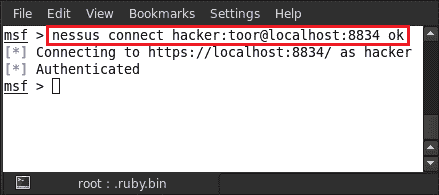

在成功连接到 Nessus 的默认端口后，我们现在将检查 Nessus 扫描策略。为此，我们输入`nessus_policy_list`。

在这里我们可以看到尼索斯的四项政策；第一种是外部网络扫描，用于外部扫描网络漏洞。二是内部网络扫描，用于内部扫描网络漏洞。第三个是 Web 应用程序测试，用于扫描 Web 应用程序的漏洞。第四个是 PCI-DSS（支付卡行业数据安全标准）审计，在支付卡行业用作数据安全标准。

现在我们要扫描受害者的机器。对于扫描机器，我们必须创建一个新的扫描，使用的命令是`nessus_new_scan <policy ID> <scan name> <Target IP>`；例如，这里我们使用的是`nessus_new_scan -2 WindowsXPscan 192.168.0.103`。

我们可以通过输入`nessus_scan_status`来检查扫描过程的状态；它将向我们显示扫描过程的状态，无论扫描是否已完成。

完成扫描过程后，现在是检查报告列表的时候了，请键入`nessus_report_list`。

我们可以看到带有**ID**的报告。其**状态**标记为**已完成**。打开报告时使用命令`nessus_report_hosts <report ID>`；例如，这里我们使用的是`nessus_report_hosts dc4583b5-22b8-6b1a-729e-9c92ee3916cc301e45e2881c93dd`。

在前面的屏幕截图中，我们可以看到 IP 为`192.168.0.103`的机器的结果，其总严重性为`41`。这意味着漏洞总数为 41 个。

以下是不同漏洞的分类：

*   Sev 0 表示高级漏洞，为 4
*   Sev 1 表示中等级别的漏洞，为 28
*   Sev 2 表示低级别漏洞，即 4
*   Sev 3 表示信息漏洞，它们是 9

我们可以使用命令`nessus_report_hosts_ports <Target IP> <Report ID>`通过协议名称和服务详细查看漏洞；例如，这里我们使用`nessus_report_host_ports 192.168.0.103 dc4583b5-22b8-6b1a-729e-9c92ee3916cc301e45e2881c93dd`。

# 在 Metasploit 中导入报表

将漏洞扫描程序的报告导入 Metasploit 数据库是 Metasploit 提供的一项非常有用的功能。在本章中，我们使用了两种扫描仪，即 Nmap 和 Nessus。我们已经看到了 Nmap 在不同情况下使用的各种扫描技术。现在我们将看到如何通过 PostgreSQL 数据库中的`msfconsole`导入 Nmap 报告。

扫描任意主机并以 XML 格式保存 Nmap 报告，因为`msfconsole`不支持 TXT 格式。这里我们已经有了一个 XML 格式的扫描报告，名为`scan.xml`。现在我们要做的第一件事是使用命令`db_status`检查数据库与`msfconsole`的连接。

我们的数据库与`msfconsole`连接，现在是导入 Nmap 报告的时候了。我们使用命令`db_import <report path with name>`；例如，这里我们从桌面导入报告，所以我们给出了`db_import /root/Desktop/scan.xml`。

将报表导入数据库成功后，我们可以从`msfconsole`进行访问。我们可以通过输入`host <hostname on which nmap scan performed>`查看主机详细信息；例如，这里我们使用的是`host 192.168.0.102`。

这里我们有一些关于主机的重要信息，比如 MAC 地址和操作系统版本。现在，在选择主机之后，让我们检查开放端口的详细信息以及在这些端口上运行的服务。使用的命令为`services <hostname>`；例如，这里我们使用的是`services 192.168.0.102`。

我们这里有的是受害者机器上运行的开放端口和服务的所有信息。现在，我们可以搜索进一步攻击的漏洞，这在上一章中已经做过。

接下来我们将学习在`msfconsole`中导入 Nessus 的报告。只需使用相同的命令`db_import <report name with file location>`导入 Nmap 报表即可；例如，这里我们使用的是`db_import /root/Desktop/Nessus_scan.nessus`。

我们可以看到主机 192.168.0.103 的报告已经成功导入，现在我们可以通过输入`vulns <hostname>`来检查该主机的漏洞；例如，这里我们使用的是`vulns 192.168.0.103`。

现在我们可以看到受害者机器的漏洞；根据这些漏洞，我们可以搜索漏洞、有效负载和辅助模块，以执行进一步的攻击。

# 总结

在本章中，我们介绍了使用 Metasploit 模块收集受害者信息的各种技术。我们介绍了一些免费提供的工具以及一些辅助扫描仪。使用一些辅助扫描器，我们实际上能够对特定的运行服务进行指纹识别。通过 Nmap，我们学会了对实时系统、防火墙保护系统和各种其他扫描技术执行网络扫描，这些扫描技术可用于不同的场景。我们看到 Nessus 是一个非常大的工具，可以用来评估受害者机器的脆弱性。我们还学习了将 Nmap 和 Nessus 报告导入 Metasploit。在本章中，我们已经在利用受害者方面领先了一步，并将在下一章中继续介绍客户端利用。

# 参考文献

以下是一些有用的参考资料，进一步阐明了本章所涵盖的一些主题：

*   [https://pentestlab.wordpress.com/2013/02/17/metasploit-storing-pen-test-results/](https://pentestlab.wordpress.com/2013/02/17/metasploit-storing-pen-test-results/)
*   [http://www.offensive-security.com/metasploit-unleashed/Information_Gathering](http://www.offensive-security.com/metasploit-unleashed/Information_Gathering)
*   [http://www.firewalls.com/blog/metasploit_scanner_stay_secure/](http://www.firewalls.com/blog/metasploit_scanner_stay_secure/)
*   [http://www.mustbegeek.com/security/ethical-hacking/](http://www.mustbegeek.com/security/ethical-hacking/)
*   [http://backtrack-wifu.blogspot.in/2013/01/an-introduction-to-information-gathering.html](http://backtrack-wifu.blogspot.in/2013/01/an-introduction-to-information-gathering.html)
*   [http://www.offensive-security.com/metasploit-unleashed/Nessus_Via_Msfconsole](http://www.offensive-security.com/metasploit-unleashed/%E2%80%A8Nessus_Via_Msfconsole)
*   [http://en.wikipedia.org/wiki/Nmap](http://en.wikipedia.org/wiki/Nmap)
*   [http://en.wikipedia.org/wiki/Nessus_（软件）](http://en.wikipedia.org/wiki/Nessus_(software))