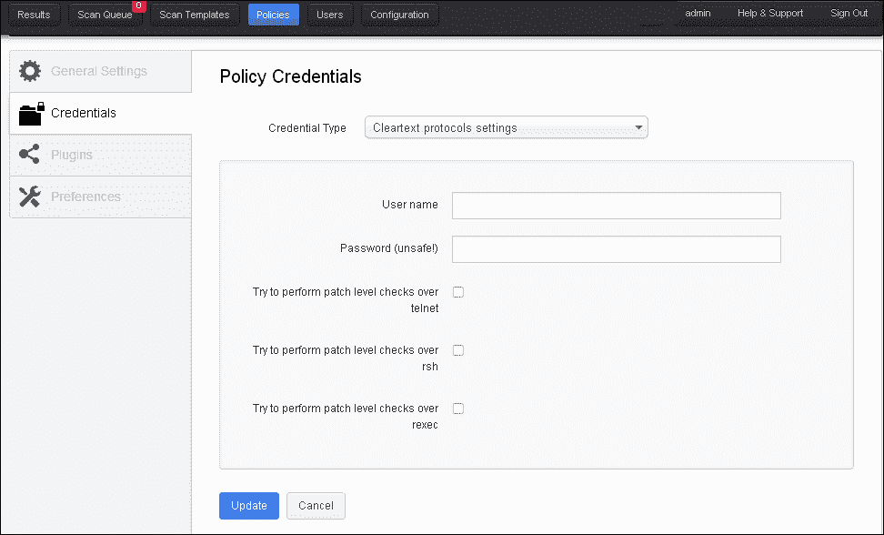
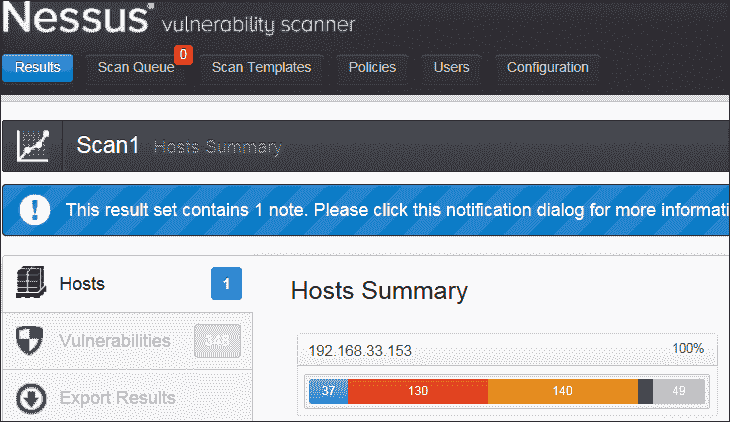

# 第二章扫描

漏洞扫描，或者换句话说，识别目标基础设施中的漏洞，是任何漏洞扫描程序（如 Nessus）执行的关键活动。在使用此类扫描仪执行漏洞评估时，最重要的是以最有效的方式配置扫描参数，同时牢记目标基础设施。这将导致在优化的扫描时间内获得最有效的扫描结果。

本章将介绍如何设置 Nessus 进行漏洞扫描。Nessus 中的扫描配置包括两个主要步骤，即配置扫描策略和使用配置的策略启动扫描。本章将涵盖的关键领域如下：

*   扫描先决条件
*   策略配置
*   凭证和非凭证扫描
*   扫描配置
*   扫描执行和结果

# 扫描先决条件

成功的漏洞扫描需要正确设置 Nessus，并具备某些先决条件。这将确保在扫描之前，所有批准都已记录在案，所有备份都已准备就绪，并且扫描窗口已获得同意。Nessus 无法通过防火墙到达目标，防火墙阻止流量/数据包。

现在我们将看到适用于大多数 Nessus 扫描的最常见的先决条件；但是，我鼓励您根据扫描环境和组织的适用性进行分析。

## 基于扫描的目标系统管理员凭据

始终建议使用凭证扫描运行，以获得更好的结果；这意味着在扫描目标系统之前，您应该获得目标系统的凭据，或者让某人在 Nessus GUI 中键入目标系统管理凭据，而无需在开始扫描之前与您共享。这将帮助 Nessus 越来越多地探测目标系统，以发现最大的漏洞。如果您正在执行黑盒扫描，但无法访问凭据，则此特定先决条件不适用。

## 无防火墙的直接连接

建议将 Nessus 与目标系统直接连接，以获得更好的效果；这意味着 Nessus 和目标系统之间不应存在防火墙或任何其他设备阻止流量。如果防火墙位于 Nessus 和目标系统之间，则应配置防火墙规则以允许 Nessus 和目标系统之间的所有流量。扫描完成后，不要忘记立即删除或停用此规则。这是必需的，因为 Nessus 会向目标系统生成大量恶意数据包/流量，以探测漏洞。如果有防火墙，这将阻止所有此类恶意数据包到达目标系统。

## 扫描窗口待商定

目标系统的所有者可以根据目标系统的峰值和非峰值负载，让您知道漏洞扫描的最佳合适时间。这个合适的时间窗口称为**扫描窗口**。如果您正在生产系统上运行扫描，那么就扫描窗口达成一致非常重要，最好与目标系统所有者达成一致。建议在目标系统负载最小的非高峰时间运行 Nessus 扫描。

## 审批扫描及相关文书工作

重要的是与目标系统所有者进行清晰的讨论，使他们了解恶意扫描可能产生的影响，恶意扫描可能是入侵扫描，也可能不是入侵扫描。各方应了解进行漏洞扫描的风险并同意。出于法律目的，应将其记录在案。此外，进行脆弱性评估或渗透测试的团队的每个人都应正式签署保密协议。

## 所有系统的备份，包括数据和配置

在执行扫描之前，对目标系统进行完整备份非常重要。这将确保如果由于漏洞扫描导致目标机器出现问题，可以立即恢复最新的备份以恢复目标机器。备份管理员应确保执行完整备份，包括所有数据、配置、集成信息、代码、发行说明和特殊配置、IOS 等。

## 更新 Nessus 插件

Nessus 插件应在运行扫描前更新最新定义；这将确保您的 Nessus 加载了所有最新的检查，以发现最新的漏洞。

## 根据目标系统操作系统和信息创建扫描策略

在运行扫描之前，应根据目标系统操作系统和环境配置扫描策略。应在 Nessus 中相应地配置策略。如何创建策略将在本章的下一节中进行说明。

## 配置扫描策略以检查组织的安全策略合规性

每个组织都有自己的安全策略。Nessus 提供了基于组织策略定制扫描策略的功能；例如，密码复杂性。配置 Nessus 策略时，应注意根据目标组织的密码策略自定义密码策略。如果密码长度小于 6 个字符，则组织的密码策略可能会说配置的任何密码都不符合要求，而其他组织可能会说少于 8 个字符是不符合要求的。Nessus 为您提供了在运行扫描之前根据需求定制策略的灵活性。

## 收集目标系统信息

在上一章中，我们看到了脆弱性评估的不同阶段。扫描前的一个阶段是收集信息，这也是扫描阶段的先决条件。您应该从公共网站、互联网和内部员工处收集所有可能的信息（如果是内部扫描或灰盒扫描）。此信息有助于调整 Nessus 扫描策略，以便根据您获得的有关目标系统的信息配置或选择所需的检查，也有助于映射网络以包括 IP 地址。

## 有足够的网络带宽来运行扫描

使用良好的网络带宽运行扫描非常重要；如果在低带宽上运行扫描，数据包可能会在这段时间内丢失，扫描可能会在这段时间内中断。为避免所有此类情况，始终建议在网络带宽良好时运行扫描。这也将帮助您及时完成扫描。

## 目标系统支持人员

建议由目标系统管理员或专家支持人员分析目标系统的运行状况和性能。如果它们在扫描窗口期间可用，它们可以连续监视目标系统并发出警报。如果系统运行不正常，停止扫描；或者，如果出现问题，系统可以恢复。

# 策略配置

策略配置是扫描前执行的主要步骤。简单地说，策略配置意味着根据目标基础架构为 Nessus 设置最优化的扫描配置。

设置策略时可以配置的关键参数如下：

*   保单名称
*   需要的端口扫描类型
*   扫描的性能取决于每次并行扫描的最大检查次数等，这将决定扫描时间
*   为本地扫描的基础结构输入凭据的选项
*   选项选择最合适的插件
*   高级首选项选项，提供不同的下拉选项选择配置，根据目标进一步微调策略；例如，数据库符合性检查、Cisco IOS 符合性检查等

Nessus 提供了一个选项，如果您已经从其他地方拥有扫描策略，则可以上载该策略。同样，还可以选择导出和复制现有策略。如果您有多个 Nessus 系统，您可能希望使用导出和上载选项在所有 Nessus 系统上具有相同的策略。如果不再使用策略，也可以删除该策略。

## 默认策略设置

默认情况下，Nessus 扫描器中预加载了四个默认策略模板；这些模板将使用户能够开始使用这些基本策略进行扫描，并了解典型策略配置的外观，或根据我们的要求进行自定义。

默认策略如下所示：

*   外部网络扫描
*   内部网络扫描
*   PCI DSS 审核策略
*   Web 应用程序测试策略

这些政策是不言自明的。如果要扫描外部网络，请使用外部网络扫描策略；如果要扫描内部网络，请使用内部网络扫描策略；如果要执行 PCI DSS 扫描，请使用 PCI DSS 审核策略；最后，如果要扫描应用程序以查找与 web 应用程序相关的漏洞，如跨站点请求伪造、跨站点脚本和 SQL 注入，请使用 web 应用程序测试策略。

建议使用这些默认策略作为基本模板来创建您自己的自定义策略。您可能希望复制现有默认策略，并根据扫描要求使用新名称保存该策略。

## 新政策创建

下一节将让您熟悉在 Nessus 中设置扫描策略时可用的不同选项。要开始配置新的扫描策略，请单击策略选项卡下的**+新策略**选项。该页签下有四个策略设置选项，分别为**常规设置**、**凭证**、**插件**、**首选项**。

### 一般设置

**常规设置**页签允许用户设置常规信息，如扫描名称、扫描设置类型、描述等。此设置下可用的设置有基本、端口扫描、性能和高级。

**基本**设置包括以下选项：

*   **名称**：此选项允许为策略分配唯一的名称
*   **可见性**：此选项允许策略与他人共享或保留供私人使用；仅允许管理用户共享策略
*   **说明**：此选项提供了一个选项，可以在策略中添加说明以备将来参考；例如，可以更新为数据库扫描配置的策略的描述，以便用户根据策略设置的目的调用和使用策略
*   **允许端口-扫描报告编辑**：此选项允许删除报告端口扫描后的项目；通常，在从法规遵从性角度执行扫描以显示报告未被篡改时，应禁用此功能，如以下屏幕截图所示：

**端口扫描**设置包括以下选项：

*   **端口扫描范围**：指定要扫描的端口数。**默认**表示 Nessus 服务文件中找到的 4790 个公共端口，**ALL**表示所有 65365 个端口。还可以使用`-`符号指定特定的端口范围。此外，在同一策略中扫描不同范围的 TCP 和 UDP 端口时，可以使用`t:`和`u:`后跟端口范围。可以使用逗号符号指定同一策略中 TCP/UDP 的不同端口范围；例如，`T 90;1000,U:350-400`。
*   将 TuntT0 考虑为未扫描的端口作为关闭的对象 T1：如果在策略中选择了这个选项，如果涅索斯不能扫描端口，涅索斯会认为端口是关闭的。
*   **Nessus SNMP Scanner**：允许 Nessus 在扫描时针对 SNMP 服务；通过在策略的**首选项**部分中添加 SNMP 设置，可以获得更好的扫描结果。
*   **netstat portscanner（SSH）**：此选项使用 SSH 连接上可用的`netstat`命令查找 UNIX 系统中打开的端口。此命令需要身份验证凭据。
*   **Ping 远程主机**：此选项通过 Ping 端口帮助查找实时系统。根据的 ping 响应，Nessus 会将其标识为打开。
*   **Netstat 端口扫描程序（WMI）**：此选项使用 WMI 连接上可用的`netstat`命令查找 Windows 系统中打开的端口。此命令需要身份验证凭据。
*   **Nessus TCP 扫描器**：此选项为 Nessus 内置选项，用于查找打开的 TCP 端口。
*   **Nessus 同步扫描仪**：此选项使用 Nessus 内置同步扫描功能来识别打开的端口。

**性能**设置包括以下选项：

*   **每个主机的最大检查次数**：此选项使 Nessus 能够执行 Nessus 一次针对单个目标机器启动的最大检查次数。
*   **每次扫描的最大主机数**：此选项使 Nessus 能够扫描 Nessus 将并行扫描的最大主机数。
*   **网络接收超时（秒）**：此选项显示 Nessus 等待主机响应的最长时间。该值默认设置为 5 秒，也可以被特定插件中提到的值取代。在连接速度较慢的情况下，可以将其设置为更高的值。
*   **每个主机的最大并发 TCP 会话数**：此选项限制单个目标机器的最大 TCP 会话数。
*   **每次扫描的最大同时 TCP 会话数**：此选项限制整个扫描期间的最大 TCP 会话数，无论扫描多少台目标机器。
*   **减少拥塞时的并行连接**：此选项使 Nessus 能够减少网络上发送的数据包数量，以避免阻塞网络带宽。
*   **使用内核拥塞检测（仅限 Linux）**：此功能可用于部署在 Linux 上的 Nessus 扫描仪。启用此选项后，Nessus 将监视 CPU 和其他内部参数，并相应地修改资源利用率。

**高级**设置包括以下选项：

*   **安全检查**：此选项禁用插件，这可能会影响目标机器。选择此选项以运行安全扫描非常重要。
*   **静默依赖项**：如果选中此选项，则包括不在报告中的依赖项列表。
*   **服务器**日志扫描详细信息：此选项将附加信息记录到 Nessus 服务器日志中；这有助于从插件的角度评估扫描，也就是说，它有助于确定是否启动和使用了特定插件。
*   **断开连接时停止主机扫描**：如果启用此选项，Nessus 将停止扫描目标机器，如果它感觉目标机器没有响应发送的数据包。这可能是由于某些原因造成的，例如目标计算机被关闭或到目标计算机的通信被阻塞。
*   **避免顺序扫描**：可以将扫描范围内的主机列表馈送给 Nessus；如果选择此选项，Nessus 将以随机方式进行扫描，而不是按顺序进行。
*   **通过 DNS 名称**指定主机：此选项允许在扫描后准备的报告中使用主机名，而不是目标机器的 IP 地址。

### 认证扫描

Nessus 提供了一种功能，可以执行经认证或验证的扫描。通过此选项，Nessus 可以登录本地系统 t 以查找本地系统级漏洞，例如缺少补丁和操作系统设置。通常，Nessus 不会在网络上进行非必要扫描时突出显示这些漏洞。简而言之，凭证扫描选项有助于在使用提供的凭证登录系统后查找系统的本地漏洞。凭证扫描执行与系统本地用户相同的操作；这取决于 Nessus 使用的本地用户帐户的访问权限级别。

以下屏幕截图显示了为**Windows 凭据**、**SSH 设置**、**Kerberos 配置**和**明文协议设置**配置凭据扫描的选项：

#### Windows 凭据选项

在 Windows 凭据选项下，Nessus 捕获了**服务器消息块**（**SMB**的配置详细信息。SMB 是一种文件共享协议，它将帮助 Nessus 发现 Windows 系统中的本地漏洞。始终建议使用具有管理权限的帐户，以获得最佳的认证扫描结果。

#### Windows 用户名、密码和域

SMB 域字段是可选的，Nessus 将能够在没有此字段的情况下使用域凭据登录。用户名、密码和可选的域是指目标机器知道的帐户。

即使未使用凭据，Nessus 也会尝试使用以下组合登录到 Windows 服务器：

*   没有密码的管理员
*   用于测试来宾帐户的随机用户名和密码
*   没有用于测试空会话的用户名或密码

Nessus 为基于 Windows 的系统支持几种不同类型的身份验证方法。这些方法中的每一个都采用用户名、密码和域名（有时是可选的身份验证）。通过设置选项，可以指定 NTLM 或 Kerberos 选项的使用。

#### SSH 设置选项

下拉菜单中的**SSH 设置**选项允许您输入扫描 UNIX 系统的凭据。凭据用于从远程 UNIX 系统获取本地信息。用于输入帐户的 SSH 用户名的字段将在目标 UNIX 系统上执行检查，同时检查 SSH 密码或 SSH 公钥和私钥对。如果需要，还有一个字段用于输入 SSH 密钥的密码短语。

当提供的凭证具有`root`权限时，最有效的凭证扫描。由于许多网站不允许像`root`那样远程登录，Nessus 用户可以为已设置为具有`su`或`sudo`权限的帐户使用单独的密码调用`su`、`sudo`、`su+sudo`或`dzdo`。

如果 SSH`known_hosts`文件可用并作为扫描策略的一部分提供，Nessus 将仅尝试登录到此文件中的主机。如果首选 SSH 端口在 22 以外的端口上运行，则可以将其设置为指示 Nessus 连接到 SSH。如果要使用 root 以外的帐户进行权限提升，则可以在**使用**选项提升权限下提及该帐户。

最佳实践建议使用 SSH 密钥进行身份验证，而不是使用 SSH 密码。这将确保用于审核 SSH 服务器的相同用户名和密码不会用于尝试登录到您可能无法控制的系统。

#### Kerberos 配置选项

**Kerberos 配置**选项允许您使用来自远程系统的 Kerberos 密钥指定凭据。

#### 明文协议设置选项

如果无法使用安全加密选项进行凭证扫描，Nessus 将为`telnet`、`rsh`、`rexec`提供通过明文协议进行扫描的功能。在此选项中，密码在明文通道中不安全地传输。此选项还允许您检查修补级别。

### 插件

插件是 Nessus 用于漏洞检查的文件。这些插件在可用时会定期更新，并进行最新的漏洞检查。

插件被划分为产品系列，以便能够将类似的插件准确有效地组合在一起。因此，通过选择合适的插件系列，可以有效地启用或禁用大量适用/不适用的插件，并且只需很少的点击。

此外，Nessus 会在新漏洞发布时发布新插件。

以下屏幕截图显示了**策略插件配置**窗口的外观：

下表表示插件颜色及其含义。基本上，这表示从特定插件系列中启用的插件数量。

<colgroup><col style="text-align: left"> <col style="text-align: left"></colgroup> 
| 

颜色

 | 

意思

 |
| --- | --- |
| 绿色 | 它表示一个系列中的所有插件都已启用。 |
| 灰色 | 它表示该系列中的所有插件都已禁用。 |
| 蓝色 | 它代表了一种混合选择，在插件系列中，一些插件被选中，一些插件被取消选中。 |

所选插件的详细信息也将在针对特定插件所发现漏洞的报告中显示。

#### 过滤

在**插件**页面的顶部，提供了一个过滤选项。此选项允许选择插件，这是通过应用过滤器的策略启用的。

可分别使用**添加过滤器**和**清除过滤器**按钮添加和删除过滤器。Nessus 还为**任意**和**全部**提供了**匹配**选项。**任意**选项表示满足指定的任何一个过滤器选项。**All**选项意味着应该指定所提到的整个过滤条件。

通过使用过滤器选项，可以选择最优化的扫描插件。此外，建议首先显示所有筛选器，并使用筛选选项应用策略。

关于不同插件系列和过滤标准的详细信息，请参见*可成立的文档*：

> *“拒绝服务”系列包含一些插件，如果未启用“安全检查”选项，可能导致网络中断，但确实包含一些不会造成任何伤害的有用检查。“拒绝服务”系列可与“安全检查”一起使用“以确保没有运行任何潜在危险的插件。但是，建议不要在生产网络上使用“拒绝服务”系列。“*

### 偏好

偏好是 Nessus 政策的深层次设置，本质上是动态的。动态意味着下拉菜单中配置首选项设置的选项可能因插件和提要许可证而异。

创建扫描策略的人员可以根据目标系统的要求选择这些设置。例如，如果您计划扫描数据库，则在创建策略时，从**首选项**下拉菜单中选择**数据库设置**。此特定设置允许您使用数据库凭据键入数据库详细信息，以进一步探测数据库。这将允许您的 Nessus 扫描发现更多漏洞。

我推荐 Nessus 网站[http://www.tenable.com](http://www.tenable.com) ，了解最新设置及其说明。

# 扫描配置

在进入本节之前，读者需要依次阅读本章。在前面的部分中，我们已经解释了在运行扫描之前应该注意的先决条件。此外，还讨论了如何根据目标组织的安全策略配置和定制扫描策略，以及凭证扫描和非凭证扫描之间的区别。

## 配置新扫描

本节说明了如何启动和执行扫描。为了启动扫描，我们假设已经执行了本章前面提到的扫描先决条件。要启动扫描，请使用您的 Nessus 凭据登录 Nessus，然后单击 Nessus 最上方栏中的**扫描队列**。

**扫描队列**栏有两个按钮，即**新扫描**和**选项**，这是一个下拉菜单，为您提供恢复扫描、暂停扫描或停止运行扫描的选项。点击**新扫描**按钮启动新扫描。

在最左侧的面板中有两个选项，一个用于常规设置，另一个用于电子邮件设置。

### 一般设置

常规设置是新扫描的设置，例如扫描的名称、是否要立即运行扫描或将其保存为模板、可以稍后运行哪个扫描，或者您可能希望将扫描安排在所需时间，以及在哪个扫描上自动进行。您还可以从策略的下拉菜单中选择要用于此新扫描的策略。此外，这里是提供要扫描的 IP 的地方。这还使您能够上载文件，其中包含在新扫描期间要扫描的 IP 列表。

下表介绍了前面屏幕截图中给出的设置：

<colgroup><col style="text-align: left"> <col style="text-align: left"></colgroup> 
| 

一般扫描设置

 | 

描述

 |
| --- | --- |
| **名称** | 您希望如何命名扫描 |
| **型** | 下拉菜单中有以下三个选项：

*   **立即运行**：如果您想立即运行扫描
*   **模板**：如果要将扫描保存为模板，以后可以运行
*   **定时**：如果您想将扫描安排在所需的时间，此时扫描将自动启动

 |
| **政策** | 这也是一个下拉菜单，列出了所有 Nessus 扫描策略。我们在上一节讨论了如何创建策略。应从下拉菜单中选择此策略，该菜单将用于扫描。 |
| **扫描目标** | 此处应列出所有需要扫描的 IP。 |
| **上传目标** | 如果您有一个文本文件，其中包含要扫描的 IP 列表，则可以在 Nessus 中导入相同的文件。 |

最后，您有一个**运行扫描**按钮，该按钮将启动扫描。

### 电子邮件设置

如果 Nessus 配置了 SMTP 服务器，则可以为扫描配置电子邮件设置。这用于在完成后自动通过电子邮件发送扫描结果。在**收件人**输入框中输入收件人的电子邮件 ID。此外，还可以配置报告过滤器。在这种情况下，如果报告筛选器匹配，结果将通过电子邮件发送给收件人，如以下屏幕截图所示：

下表描述了上一屏幕截图中给出的设置：

<colgroup><col style="text-align: left"> <col style="text-align: left"></colgroup> 
| 

电子邮件扫描结果设置

 | 

描述

 |
| --- | --- |
| **收件人** | 您希望将扫描结果的自动电子邮件发送给谁，此处将提供收件人的电子邮件 ID。 |
| **报表过滤器** | 可以在此处配置报告筛选器以匹配特定条件或筛选器。如果匹配，将自动向收件人发送结果电子邮件。 |

最后，您有一个**运行扫描**按钮，该按钮将启动扫描。

## 扫描执行及结果

在上一节中，我们已经了解了如何启动扫描。单击**运行扫描**后，将进行扫描。

已完成扫描的结果可在**结果**选项卡下查看。双击扫描结果将打开特定扫描结果的详细视图。这有三个不同的选项卡，即**主机**、**漏洞**和**导出结果**。在**主机**页签下，可以看到主机摘要。这有一个严重性方面的漏洞计数（严重、高、中、低和信息性）。

以下屏幕截图显示主机被扫描，其中有 37 个关键漏洞、130 个高漏洞、140 个中漏洞、0 个低漏洞和 49 个信息漏洞：

下一页签为**漏洞**；这显示了每个漏洞的风险严重性的漏洞摘要。双击任何漏洞都会带您进入该漏洞的详细视图，其中详细介绍了概要、描述、解决方案、漏洞 web 链接、插件信息、风险信息、漏洞信息、参考信息、插件输出等。详细视图中还提供了风险严重性修改选项。

最后一页签为**导出结果**；这提供了以不同格式（如 HTML、PDF 和 CSV）导出 Nessus 扫描结果报告的选项。还可以从以下选项中选择报告中需要包含的内容：

*   主持人摘要和执行摘要
*   主机的漏洞
*   插件漏洞
*   合规检查主管
*   合规性检查

可以根据需要选择其中一个或多个选项。

本章的一些章节已参考 Nessus 网站上的学习材料：[http://www.tenable.com](http://www.tenable.com) 。

# 总结

在本章中，我们学习了如何设置 Nessus 进行漏洞扫描。Nessus 中的扫描配置包括两个主要步骤，即配置扫描策略和使用配置的策略启动扫描。

还讨论了扫描的先决条件，包括决定扫描范围、获得批准、决定扫描窗口、更新插件、进行备份、打开适当的网络访问、确定联系人以及决定凭证扫描或非凭证扫描。

在这些先决条件中，第一个关键步骤是设置扫描策略，其中包括四个默认策略模板（外部、内部、PCI DSS 和 web 应用程序）。Nessus 还提供了使用**新策略**选项创建自定义策略的选项。

创建新策略时有四个设置选项可用，即**常规设置**和**高级设置**（包括策略名称、可见性、端口扫描选项、扫描性能和安全检查）、认证扫描（通过此选项，Nessus 可以登录到本地系统以查找本地系统级漏洞，例如缺少补丁和操作系统设置）。可用于为不同基础设施添加凭据的选项在本节**插件**中进行了说明（包括根据扫描范围内的基础设施类型选择正确的安全检查系列，如 Windows、Cisco 和数据库）。应避免拒绝服务插件，除非特别要求，否则可能会导致停机。**首选项**菜单包括高级和深层设置，应根据扫描下的基础结构进行配置。

建立一个策略，然后进行实际扫描；关键活动包括选择新扫描、**常规设置**选项，包括**名称**、**类型**和**策略**进行扫描，可以是默认的或自定义的；**扫描目标**包括要扫描的基础设施的 IP（同样可以使用文本文件）。还说明了扫描完成后如何邮寄扫描结果。最后，简要说明了从**结果**选项卡检索扫描结果的选项。

在下一章中，我们将学习如何执行扫描结果分析，包括假阳性分析、漏洞分析、漏洞利用等。