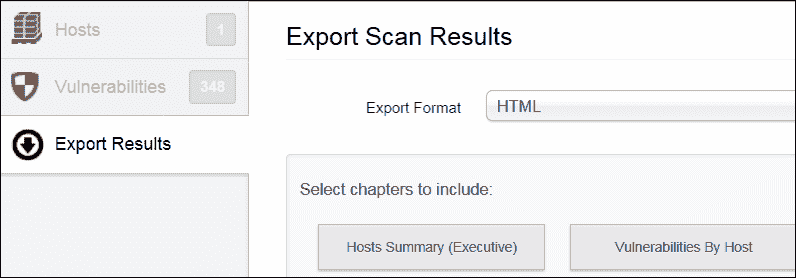
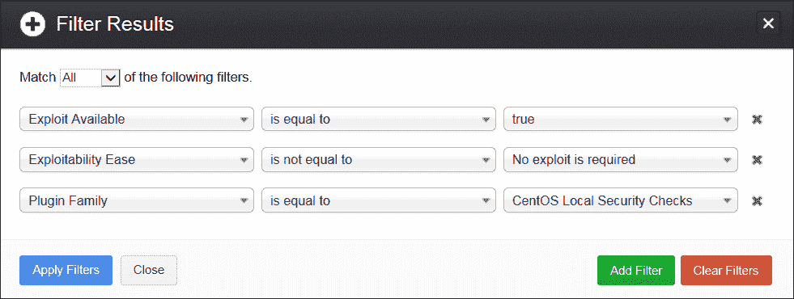

# 第四章报告选项

易于理解和令人印象深刻的报告是成功进行脆弱性评估的关键。在编写漏洞评估报告之前，了解目标受众非常重要。大多数情况下，脆弱性评估报告将由不同群体和不同熟练程度的受众阅读。他们中的一些人可能对技术术语有很强的了解，一些人可能不懂任何技术术语；因此，重要的是，报告要有针对技术和非技术受众的正确材料组合。重要的是生成一份全面的漏洞评估报告，让其他人了解文本格式中发现的漏洞，以便目标读者易于理解。

本章将向您展示如何编写成功的漏洞报告。本章将涵盖的关键领域如下：

*   报告生成
*   报表自定义
*   报告自动化

# 脆弱性评估报告

漏洞评估或渗透测试报告中应包括哪些内容以及不应包括哪些内容一直是讨论的主题。您必须了解，如果没有良好的报告，脆弱性评估将无法实现其目标。

写报告时应牢记读者。在大多数情况下，漏洞评估报告会分发给大型企业中的不同团队，对报告的理解程度各不相同。

管理专业人员对查看每个漏洞的详细信息不感兴趣。他们更愿意看到评估的摘要，以及已识别的漏洞数量的快速截图，按其严重性分类；这可以通过图形表示以及显示严重性/高/中/低漏洞的部分周围的一些文本更好地捕获。另一方面，如果是渗透测试报告，技术人员希望看到更多关于漏洞报告的技术细节和一步一步的程序；这将帮助他们重现漏洞。技术人员还希望收到关于如何修复漏洞的建议。

Nessus 生成成功扫描的报告，该报告捕获每个漏洞的详细信息。根据受众的不同，可以自定义报告。如果您经常执行扫描并希望每次都以相同的格式生成报告，建议选择并应用适当的筛选器来决定报告内容。安全顾问可能不想这样做，因为他们从不同的客户那里得到不同的报告要求。

## Nessus 报告生成

Nessus 为所有已完成的扫描生成报告，可以导出到本地系统，并允许您从以前的扫描生成报告。Nessus 中提供多种报告格式，可在生成报告时选择这些格式。

完成扫描后，Nessus 存储扫描结果。Nessus 将扫描结果存储在**结果**选项卡下，如下图所示：

双击扫描结果将显示该特定扫描结果的详细视图。此视图有三个不同的选项卡：**主机**、**漏洞**和**导出结果**。在**主机**页签下，可以看到主机摘要。这具有漏洞的严重性（严重、高、中、低和信息性）计数。

下面的屏幕截图显示主机已被扫描，其中有三十七个关键漏洞、一百三十个高漏洞、一百四十个中漏洞、零个低漏洞和四十九个信息漏洞：

下一页签为**漏洞**页签；这显示了带有每个漏洞的风险严重性的漏洞摘要。双击任何漏洞都会显示该漏洞的详细视图，其中详细说明了概要、描述、解决方案、漏洞 web 链接、插件信息、风险信息、漏洞信息、参考信息、插件输出等。详细视图中还提供了风险严重性修改选项。以下屏幕截图显示了漏洞摘要视图：

最后一页签为**导出结果**；这提供了以不同格式导出 Nessus 扫描结果报告的选项，如 HTML、PDF 和 CSV。您还可以从以下选项中选择需要包含在报告中的内容：

*   **主机摘要（执行）**：此选项将导出一份报告，其中显示所发现漏洞的高级摘要
*   **主机漏洞**：此选项将导出按主机显示漏洞的报告
*   **合规性检查（执行）**：此选项将导出一份报告，其中显示与所选合规性检查相关的执行摘要
*   **插件漏洞**：此选项将导出按插件显示漏洞的报告
*   **Compliance Checks**: This option will export a report that shows details related to the selected compliance checks

    在以下屏幕截图中可以看到前面的选项：

    

根据需要，可以选择一个或多个选项。

Nessus 为您提供了在导出报告之前移除或删除漏洞的选项，以便如果您知道该漏洞不适用于您，您可以将其从 Nessus 漏洞列表中移除或删除。

### 报表过滤选项

在**结果**页面的顶部有一个过滤选项。此选项允许您根据从下拉菜单中选择的几个可用条件筛选 Nessus 报告。您可以一次添加多个过滤器。

例如，您可以通过选择过滤器下拉菜单中的选项来添加多个过滤器，以获取具有漏洞的报告，这些漏洞具有高风险因素，可以利用 MetaSploit 中的漏洞进行攻击，并且可以利用易用性。

以下屏幕截图显示了如何添加筛选器：

可分别使用**添加过滤器**和**清除过滤器**按钮添加和删除过滤器。Nessus 还提供了一个**匹配**选项与**任何**和**所有**条件匹配。**任何**条件表示是否满足指定的任何一个过滤器选项。**全部**条件表示应满足设置的所有过滤条件。

Nessus 报告工具中的其他选项用于比较两次扫描和审计跟踪的结果。Nessus 还允许您从不同的机器上传扫描结果，使用该机器，您可以根据需要生成报告。

## Nessus 报告内容

Nessus 报告包含了大量有关扫描和漏洞的详细信息。有关扫描的信息以扫描 IP 的列表、扫描的开始时间和结束时间、DNS 名称、Mac 地址、操作系统和结果摘要的形式存在，该结果摘要给出了总体漏洞计数以及漏洞的严重程度分类。

Nessus 报告中捕获了以下扫描信息：

*   目标 IP 地址
*   目标主机名
*   目标 Mac 地址
*   DNS 名称
*   扫描开始时间
*   扫描结束时间
*   目标操作系统

以下屏幕截图中显示了一些字段：

Nessus 报告详细说明了 Nessus 扫描扫描主机时发现的漏洞。这包括有关每个漏洞的以下信息：

*   针对插件编号的漏洞
*   提要
*   描述
*   **另请参见关于该漏洞的**链接
*   解决方案
*   风险因素
*   CVSS 基本分数
*   工具书类
*   插件信息
*   利用
*   港口

以下屏幕截图显示了一个示例漏洞，该漏洞的详细信息显示在 Nessus 生成的报告中：

# 报表定制

在上一节中，我们了解到 Nessus 报告捕获了关于每个漏洞报告的大量详细信息。有时，当您担任漏洞评估报告的顾问时，您可能不想使用 Nessus 生成的报告与客户共享，因为该报告中有很多关于每个漏洞的详细信息；这一点可以被安全顾问很好地理解并对其有用，但对于只需要了解漏洞是什么以及需要采取什么措施来修复漏洞的最终客户来说，这一点是不可能的。另一种情况可能是，您希望以客户提供的不同格式展示报告；为此，您需要相应地自定义报告。

您想在脆弱性评估报告中包含哪些参数完全取决于您。Nessus 生成的默认报告非常好且全面。您可能还需要在报告中看到易于利用漏洞的情况，或者可能需要修复漏洞所需的努力。在脆弱性报告中包括什么和不包括什么完全取决于创建报告的人和组织的要求。您需要相应地自定义报告。

可以通过从默认 Nessus 报告中删除特定字段并向其中添加除默认字段外所需的额外字段来完成自定义。如果需要以 Microsoft Word 格式创建报告，则可以从 Nessus 生成的默认报告中复制和粘贴。

我建议采用以下格式生成令人印象深刻的报告：

*   报告首页：
    *   客户名称
    *   任务或项目名称
    *   提交的报告
*   文件信息页：
    *   文件标题
    *   版本
    *   作者姓名
    *   评论员姓名
    *   批准人姓名
    *   带日期的文档更改历史记录
    *   文件分发列表
    *   文档数据分类
*   每个页面上的页眉和页脚，包括数据分类、页码、文档名称、组织徽标等
*   执行摘要：
    *   关于脆弱性评估项目及其范围的简介
    *   这些漏洞会随着严重性分离而计数
    *   关键、高、中、低和信息性漏洞及其数量的图形表示
    *   IP/漏洞计数图
    *   包含漏洞名称、风险评级、业务影响以及同一报告中详细信息链接的表
*   详情部分：
    *   关键风险漏洞
        *   漏洞的名称
        *   漏洞描述
        *   业务影响
        *   受影响的 IP 或应用程序名称
        *   利用工件（可选）
        *   缓解措施/建议
        *   缓解的先决条件
        *   修补程序名称（如果适用于缓解）
        *   漏洞参考链接
        *   CVE 参考文献
        *   Nessus 插件信息
        *   可利用（Metasploit、核心影响、画布等）
        *   实施步骤
        *   实施成本
        *   实现复杂性
        *   如果缓解未成功，则回滚步骤
    *   高风险脆弱性
        *   与“关键风险漏洞”中提到的字段相同
    *   中等风险漏洞
        *   与“关键风险漏洞”中提到的字段相同
    *   低风险漏洞
        *   与“关键风险漏洞”中提到的字段相同
    *   信息漏洞
        *   与“关键风险漏洞”中提到的字段相同

渗透测试报告与脆弱性评估报告略有不同。渗透测试报告还应包括关于如何利用漏洞的一节，以及显示漏洞如何被利用的证据。

# 报表自动化

报表自动化部分并非 Nessus 独有；通常，市场上提供的多种漏洞评估工具及其旧版本不支持以 Microsoft Excel 或 PDF 格式生成报告。为了最大限度地利用这些自动生成的报告，并使其符合组织首选的报告格式（主要是 Excel 或 Word），可以编写脚本，将这些默认报告转换为根据我们自己的需要生成的报告。

Nessus reports 自动化的另一个需求是，当您使用不同的工具（如 Archer 和 Agiliance）集成 Nessus 报告时，这些工具是治理风险和法规遵从性工具；安全信息和事件管理工具；或您组织中可用的任何其他工具，您希望 Nessus 使用这些工具生成漏洞评估结果。在这些情况下，对于集成，每个工具都有特定的报告必备格式。大多数工具都接受 CSV 格式。为了将报告转换为所需的格式，我建议编写脚本。

# 总结

本章介绍 Nessus 中的报告选项。脆弱性评估报告的内容应定制，以适合报告的受众，从高层管理人员到致力于关闭脆弱性的技术团队。扫描完成后，在 Nessus 的**结果**选项卡下可获得输出。在此选项卡下，我们有主机摘要、发现的漏洞以及导出结果的选项。

结果可以以不同的格式导出，如 PDF、CSV 和 HTML，Nessus 提供了五个选项来决定要包含的内容，即**主机摘要（执行）**、**主机漏洞**、**合规性检查**、**插件漏洞**和**合规性检查（执行）**。**结果**选项卡还有一个过滤选项，下拉菜单过滤所需的漏洞类别和类型，并可从整体输出中过滤。

该报告捕获扫描信息以及漏洞详细信息，包括概要、描述、解决方案、风险、插件、CVSS 分数和其他重要详细信息。

本章还从外部顾问的角度介绍了报告定制，以及应在报告中捕获的各种详细信息。最后，介绍了报表自动化的概念；这可以使用脚本完成，也可以通过与 GRC 合规工具或 SIEM 解决方案集成来完成。