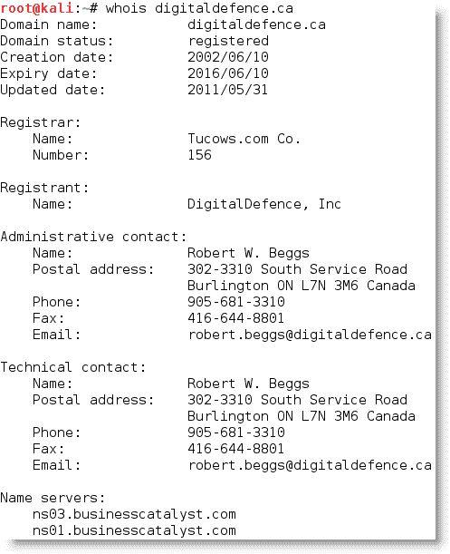
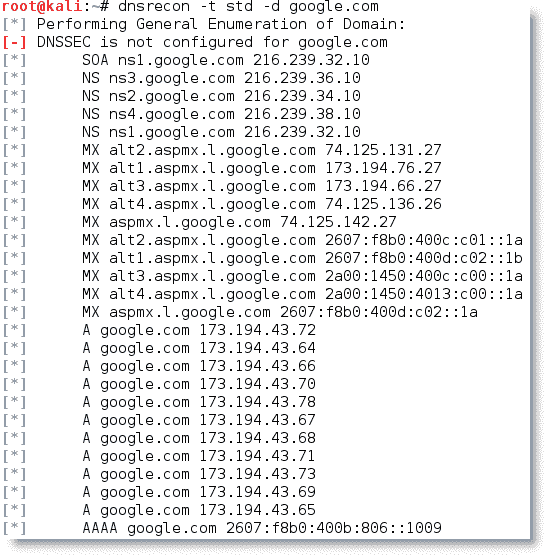
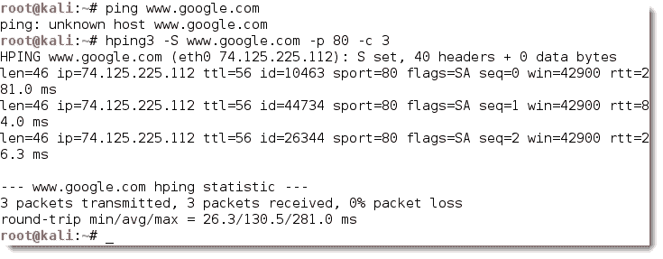
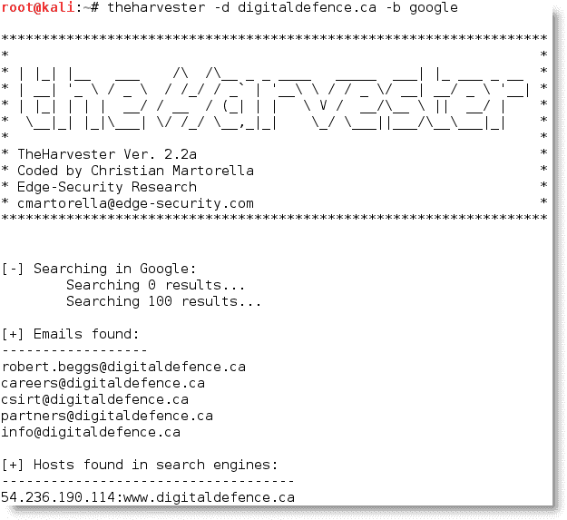
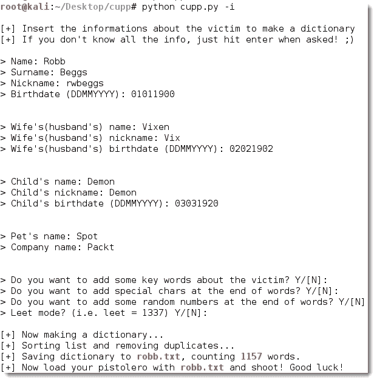

# 第 2 章识别目标-被动侦察

侦察是对网络或服务器目标进行渗透测试或攻击时，杀伤链的第一步。攻击者通常会将渗透测试总工作量的 75%用于侦察，因为正是这一阶段允许定义、映射目标，并探索最终导致攻击的漏洞。

侦察有两种类型：**被动侦察**和**主动侦察**。

通常，被动侦察涉及分析公开获取的信息，通常来自目标本身或在线公共来源。在访问此信息时，测试人员或攻击者不会以异常方式与目标进行交互，不会记录请求和活动，也不会直接跟踪到测试人员。因此，首先进行被动侦察，以尽量减少可能发出即将发生的攻击信号或识别攻击者的直接接触。

在本章中，您将学习被动侦察的原理和实践，包括以下内容：

*   侦察基本原理
*   **开源智能**（**OSIT**）
*   DNS 侦察和路由映射，包括 IPv4 和 IPv6 问题
*   获取用户信息
*   为密码列表分析用户

主动侦察涉及与目标的直接交互，将在[第 3 章](03.html "Chapter 3. Active Reconnaissance and Vulnerability Scanning")、*主动侦察和漏洞扫描*中介绍。

# 侦察基本原则

侦察或侦察是对数据目标进行渗透测试或攻击时杀伤链的第一步。这是在对目标网络进行实际测试或攻击之前进行的。调查结果将为可能需要进行额外侦察的地方，或在利用阶段攻击的漏洞提供方向。

侦察活动在与目标网络或设备的交互性梯度上进行分段。


被动侦察不涉及与目标网络的直接交互。攻击者的源 IP 地址和活动未被记录（例如，谷歌搜索目标的电子邮件地址）。目标很难（如果不是不可能的话）将被动侦察与正常商业活动区分开来。

一般来说，被动侦察的重点是业务和监管环境、公司和员工。这类信息可从互联网或其他公共来源获得，有时被称为开放源代码情报或 OSIT。

*   被动侦察还涉及攻击者以预期方式与目标交互时发生的正常交互。例如，攻击者将登录公司网站，查看各种页面，并下载文档以供进一步研究。这些交互是预期的用户活动，很少被检测为攻击目标的前奏。
*   主动侦察涉及直接查询或其他交互（例如，目标网络的端口扫描），可触发系统警报或允许目标捕获攻击者的 IP 地址和活动。这些信息可用于识别和逮捕攻击者，或在法律诉讼过程中使用。由于主动侦察需要额外的技术才能使测试人员保持不被检测，因此将在[第 3 章](03.html "Chapter 3. Active Reconnaissance and Vulnerability Scanning")、*主动侦察和漏洞扫描*中介绍。

渗透测试人员或攻击者通常遵循结构化信息收集过程，从广泛的范围（业务和监管环境）移动到非常具体的（用户帐户数据）。

为了有效，测试人员应该确切地知道他们在寻找什么，以及在收集开始之前如何使用数据。使用被动侦察和限制收集的数据量可将被目标检测到的风险降至最低。

# 开源智能

通常，渗透测试或攻击的第一步是收集开源情报，或 OSIT。

OSIT 是从公共来源收集的信息，特别是互联网。现有信息量相当大，大多数情报和军事组织都积极参与 OSIT 活动，以收集有关其目标的信息，并防止有关目标的数据泄漏。

OSINT 的收集和分析过程非常复杂，可以形成自己的书；因此，我们将只讨论重要的亮点。

### 提示

美国陆军手册 ATP 2-22.9（[http://www.fas.org/irp/doddir/army/atp2-22-9.pdf](http://www.fas.org/irp/doddir/army/atp2-22-9.pdf) 和北约 OSIT 手册（[http://information-retrieval.info/docs/NATO-OSINT.html](http://information-retrieval.info/docs/NATO-OSINT.html) ）都可以在线获取，并提供关于如何收集和评估 OSIT 的优秀技术评论。

收集的目标信息取决于渗透测试的初始目标。例如，如果测试人员想要访问财务数据，他们将需要相关员工的姓名和履历信息（CFO、应收账款和应付账款等）、用户名和密码。如果攻击路线涉及社会工程，他们可能会用细节来补充这些信息，从而为信息请求提供可信度。

OSIT 收集通常从审查目标公司的官方在线状态（网站、博客、社交媒体页面和公共财务记录等第三方数据存储库）开始。感兴趣的信息包括：

*   办公室的地理位置，尤其是共享公司信息但可能缺乏严格安全控制的远程或卫星办公室。
*   母公司和任何子公司的概述，尤其是通过合并或收购获得的任何新公司（这些公司通常不如母公司安全）。
*   员工姓名和联系信息，特别是姓名、电子邮件地址和电话号码。
*   关于企业文化和语言的线索；这将促进社会工程攻击。
*   可能连接到目标公司网络的业务合作伙伴或供应商。
*   使用中的技术。例如，如果目标发布关于采用新设备或软件的新闻稿，攻击者将查看供应商网站上的错误报告、已知或可疑漏洞以及可用于促进各种攻击的详细信息。

攻击者使用的其他在线信息源可能包括以下内容：

*   谷歌和必应等搜索引擎。从历史上看，这些搜索是高度手动的；攻击者输入特定于感兴趣信息的搜索词；例如，搜索词“公司名称”+密码文件类型：xls 可以识别包含员工密码的 Excel 电子表格。这些搜索词被称为**谷歌 dorks**（[www.exploit-db.com/google-dorks/](http://www.exploit-db.com/google-dorks/)。此后，大多数搜索引擎都发布了 API 以方便自动查找，这使得像**Maltego**这样的工具特别有效。

    ### 提示

    最有效的搜索引擎之一是 **Yandex**（[www.Yandex.com](http://www.yandex.com)）这个俄语搜索引擎是世界第四大搜索引擎，允许用户用多种语言搜索，包括英语。它还支持非常精细的搜索表达式，这使得它在搜索特定信息时比谷歌更有效。

应搜索的其他在线来源包括：

*   政府、金融或其他监管网站，提供并购信息、关键人员姓名和支持数据
*   Usenet 新闻组，特别是来自目标公司员工寻求特定技术帮助的帖子
*   LinkedIn、Jigsaw 和其他提供员工信息的网站
*   求职网站，尤其是为技术职位提供的网站，提供了成功应聘者必须支持的技术和服务列表
*   历史或缓存内容，由搜索引擎检索（缓存：谷歌中的 url，或位于[www.archive.org](http://www.archive.org)的 WayBack 机器）
*   特定国家/地区和语言的社交和商业相关网站（参考[http://searchenginecolossus.com](http://searchenginecolossus.com) ）
*   聚合和比较多个搜索引擎结果的网站，如 Zuula（[www.Zuula.com](http://www.zuula.com)）
*   公司和员工博客，以及关键员工的个人博客
*   社交网络（LinkedIn、Facebook 和 Twitter）
*   提供 DNS、路由和服务器信息查询的网站，特别是 DNSstuff（[www.DNSstuff.com](http://www.dnsstuff.com)）、ServerSniff（[www.ServerSniff.net](http://www.serversniff.net)）、Netcraft（[www.Netcraft.com](http://www.netcraft.com)）和[myipneights.com](http://myIPneighbors.com)
*   Shodan（[www.shodanHQ.com](http://www.shodanHQ.com)，有时被称为“黑客的谷歌”；Shodan 列出了可访问互联网的设备，并允许测试人员搜索具有已知漏洞的设备
*   密码转储站点（粘贴库，使用`site:pastebin.com "targetURL"`搜索）

管理调查结果可能很困难；但是，Kali 附带了 KeepNote，它支持快速导入和管理不同类型的数据。

# DNS 侦察和路由映射

一旦测试人员确定了具有在线状态并包含感兴趣项目的目标，下一步就是确定到目标的 IP 地址和路由。

DNS 侦察涉及识别谁拥有特定域或一系列 IP 地址（`whois`-类型信息），定义实际域名和分配给目标的 IP 地址的 DNS 信息，以及渗透测试人员或攻击者与最终目标之间的路由。

此信息收集是半主动的，部分信息可从免费开放来源获得，而其他信息可从第三方（如 DNS 注册商）获得。尽管注册器可以收集与攻击者请求相关的 IP 地址和数据，但很少向最终目标提供。目标可以直接监视的信息（如 DNS 服务器日志）几乎从未被审查或保留。

由于所需的信息可以使用定义的系统和系统方法进行查询，因此其收集可以自动化。

### 提示

请注意，DNS 信息可能包含过时或不正确的条目。为了尽量减少不准确的信息，可以查询不同的源服务器，并使用不同的工具交叉验证结果。审查结果，并手动验证任何可疑发现。使用脚本自动收集此信息。脚本应该为渗透测试创建一个文件夹，然后为正在运行的每个应用程序创建一系列文件夹。脚本执行每个命令后，通过管道将结果直接传输到特定的保存文件夹。

## 是谁

研究 IP 地址空间的第一步是识别分配给目标站点的地址。这通常通过使用`whois`命令来实现，该命令允许人们查询存储互联网资源注册用户信息（如域名或 IP 地址）的数据库。

根据查询的数据库，对`whois`请求的响应将提供名称、物理地址、电话号码和电子邮件地址（有助于促进社会工程攻击），以及 IP 地址和 DNS 服务器名称。

攻击者可以使用`whois`查询中的信息：

*   支持对查询中标识的位置或人员进行社会工程攻击
*   确定物理攻击的位置
*   识别可用于**战争拨号**攻击或进行社会工程攻击的电话号码
*   进行递归搜索，以定位与目标位于同一服务器上或由同一用户操作的其他域；如果它们不安全，攻击者可以利用它们获得对服务器的管理访问权限，然后危害目标服务器
*   在域即将过期的情况下，攻击者可以尝试夺取该域，并创建一个外观相似的网站，以对认为自己在原始网站上的访问者进行攻击
*   攻击者将使用权威 DNS 服务器（该服务器是该域的查找记录）来促进 DNS 侦察

请注意，使用第三方屏蔽此数据的情况有所增加，一些域，如`.gov`和`.mil`可能无法访问公共域。通常会记录对这些域的请求。有几个在线列表描述分配给政府使用的域和 IP 地址；大多数工具都接受“无联系人”地址的选项，政府域应该输入这些字段以避免错误的注意类型！

发出`whois`查询的最简单方法是从命令行。下面的屏幕截图显示了针对数字防御领域运行的`whois`命令：



返回的`whois`记录包含地理信息、姓名和联系信息，所有这些信息都可用于促进社会工程攻击。

有几个网站可以自动进行`whois`查找查询，攻击者可以利用这些网站在目标和自己之间插入一个步骤；但是，进行查找的站点可能会记录请求者的 IP 地址。

## DNS 侦察

**域名系统****DNS**是一个分布式数据库，它将名称（[www.digitalDefense.ca](http://www.digitaldefence.ca)解析为其 IP 地址（`192.150.2.140`。

攻击者通过以下方式使用 DNS 信息：

*   使用暴力攻击，攻击者可以识别与目标关联的新域名。
*   如果 DNS 服务器配置为允许向任何请求者进行区域传输，它将提供可访问 Internet 的系统的主机名和 IP 地址，从而更容易识别潜在目标。如果目标没有将公共（外部）DNS 信息与私有（内部）DNS 信息隔离，则区域传输可能会泄露内部设备的主机名和 IP 地址。（请注意，如果触发区域转移请求，大多数 IDS 和 IPS 系统将触发警报）。
*   查找易受攻击的服务（例如 FTP）或其他有趣的服务（远程管理面板和远程访问）。
*   发现配置错误和/或未修补的服务器（`dbase.test.target.com`。
*   **服务记录****SRV**提供服务、运输、港口、服务重要顺序等信息。这可能使攻击者推断出软件。
*   **域密钥识别邮件****DKIM**和**发件人策略框架****SPF**记录用于控制垃圾邮件。如果这些记录被识别，攻击者就会知道：

    *   他们比大多数组织更具安全意识。
    *   这可能会影响网络钓鱼和其他社会工程攻击。

Windows 和 Unix 都支持基本的命令行工具，如**nslookup**，Unix 系统支持其他命令行选项，如`dig`。不幸的是，这些命令通常一次查询一台服务器，并且需要交互式响应才能有效。

Kali 提供了几种工具，用于迭代查询特定目标的 DNS 信息。所选工具必须适应用于与目标 IPv4 或 IPv6 通信的 Internet 协议版本。

### IPv4

IP 或互联网协议地址是一个唯一的数字，用于标识连接到专用网络或公共互联网的设备。如今，互联网主要基于 IPv4 版本 4。Kali 包括几个工具，以便于 DNS 侦察，如下表所示：

<colgroup><col style="text-align: left"> <col style="text-align: left"></colgroup> 
| 

应用

 | 

描述

 |
| --- | --- |
| `dnsenum`、`dnsmap`和`dnsrecon` | 这些是全面的 DNS 扫描仪 DNS 记录枚举（A、MX、TXT、SOA、通配符等）、子域暴力攻击、Google 查找、反向查找、区域传输和区域漫游。`dsnrecon`通常是首选，它非常可靠，结果解析良好，数据可以直接导入 Metasploit 框架。 |
| `dnstracer` | 这将确定给定域名系统从何处获取其信息，并沿着 DNS 服务器链返回到知道数据的服务器。 |
| `dnswalk` | 此 DNS 调试器检查指定域的内部一致性和准确性。 |
| `fierce` | 这通过尝试区域传输，然后尝试暴力攻击以获取 DNS 信息，来定位指定域的非连续 IP 空间和主机名。 |

在测试过程中，大多数研究人员运行`fierce`以确认所有可能的目标都已确定，然后运行至少两个综合工具（例如`dnsenum`和`dnsrecon`，以生成最大数量的数据并提供一定程度的交叉验证。

在下面的屏幕截图中，`dnsrecon`用于生成标准 DNS 记录搜索，以及特定于 SRV 记录的搜索。每个案例都显示了结果的摘录。



`DNSrecon`允许渗透测试人员获取 SOA 记录、**名称服务器**（**NS**）、**邮件交换器**（MX）主机、使用**发送方策略框架**（SPF）发送电子邮件的服务器以及使用中的 IP 地址范围。

### IPv6

虽然 IPv4 似乎允许较大的地址空间，但几年前免费可用的 IP 地址已经耗尽，迫使 NAT 和 DHCP 的使用增加了可用地址的数量。一个更持久的解决方案是采用改进的 IP 寻址方案 IPv6。虽然它只占互联网地址的不到百分之五，但它的使用正在增加，渗透测试人员必须准备好解决 IPv4 和 IPv6 之间的差异。

在 IPv6 中，源地址和目标地址的长度为 128 位，产生 2128 个可能的地址，即 340 个未确定的地址！

可寻址地址空间的增加给渗透测试人员带来了一些问题，特别是当使用扫描器在可用地址空间中寻找活动服务器时。然而，IPv6 协议的某些功能简化了发现，特别是使用 ICMPv6 来识别活动链路本地地址。

在进行初始扫描时考虑 IPv6 是很重要的，原因如下：

*   测试工具中对 IPv6 功能的支持参差不齐，因此测试人员必须确保每个工具都经过验证，以确定其在 IPv4、IPv6 和混合网络中的性能和准确性。
*   由于 IPv6 是一个相对较新的协议，目标网络可能包含泄漏重要数据的错误配置；测试仪必须准备好识别和使用此信息。
*   较旧的网络控件（防火墙、ID 和 IP）可能无法检测 IPv6。在这种情况下，渗透测试人员可以使用 IPv6 隧道与网络保持秘密通信，并过滤未被检测到的数据。

Kali 包括几个利用 IPv6 开发的工具（最全面的扫描仪，如`nmap`，现在支持 IPv6），其中一些工具如下：；IPv6 专用工具主要源自 THC-IPv6 攻击工具包。

<colgroup><col style="text-align: left"> <col style="text-align: left"></colgroup> 
| 

应用

 | 

描述

 |
| --- | --- |
| `dnsdict6` | 基于提供的字典文件或其自身的内部列表，使用暴力搜索枚举子域以获取 IPv4 和 IPv6 地址（如果存在）。 |
| `dnsrevenum6` | 在给定 IPv6 地址的情况下执行反向 DNS 枚举。 |

`dnsdict6`命令的执行如下图所示：


## 将路线映射到目标

路由映射最初用作诊断工具，允许您查看 IP 数据包从一台主机到下一台主机的路由。使用 IP 数据包中的**生存时间**（**TTL**字段，从一点到下一点的每个*跳*都会从接收路由器引出一条**ICMP time_ 超出**的消息，将 TTL 字段中的值减 1。数据包统计跳数和所走的路线。

从攻击者或渗透测试人员的角度来看，`traceroute`数据产生以下重要数据：

*   攻击者与目标之间的确切路径
*   有关网络外部拓扑的提示
*   识别可能过滤攻击流量的访问控制设备（防火墙和包过滤路由器）
*   如果网络配置错误，可能会识别内部寻址

    ### 提示

    使用基于网络的 `traceroute`（[www.traceroute.org](http://www.traceroute.org)）可以将各种地理来源的站点追踪到目标网络。这些类型的扫描通常会识别多个连接到目标的不同网络，这是一种信息，如果从靠近目标的位置仅进行一次 `traceroute`扫描，则可能会丢失该信息。基于网状物的 `traceroute`还可以识别将两个或多个网络连接在一起的多主机。这些主机是攻击者的重要目标，因为它们极大地增加了导致目标的攻击面。

在 Kali 中，`traceroute`**是一个命令行程序，使用 ICMP 数据包映射路由；在 Windows 中，程序为`tracert`。**

 **如果您从 Kali 启动`traceroute`，很可能会看到大部分跳数被过滤（数据显示为***）。例如，`traceroute`从作者的当前位置到[www.google.com](http://www.google.com)将产生以下结果：


但是，如果使用 Windows 命令行中的`tracert`运行相同的请求，我们将看到以下内容：


我们不仅得到了完整的路径，而且还可以看到[www.google.com](http://www.google.com)解析到了一个稍有不同的 IP 地址，这表明负载平衡器已经生效（您可以使用 Kali 的`lbd`脚本确认这一点；但是，此活动可能由目标站点记录）。

路径数据不同的原因是，默认情况下，`traceroute`使用 UDP 数据报，Windows`tracert`使用 ICMP 回显请求（ICMP 类型 8）。因此，当使用 Kali 工具完成`traceroute`时，使用多个协议以获得最完整的路径，并绕过包过滤设备是很重要的。

Kali 提供了以下用于完成路线跟踪的工具：

<colgroup><col style="text-align: left"> <col style="text-align: left"></colgroup> 
| 

应用

 | 

描述

 |
| --- | --- |
| `hping3` | 这是一个 TCP/IP 数据包汇编和分析器。这支持 TCP、UDP、ICMP 和原始 IP，并使用类似 ping 的接口。 |
| `intrace` | 这使得用户能够通过利用现有的 TCP 连接（从本地系统或网络或本地主机启动）来枚举 IP 跃点。这对于绕过外部过滤器（如防火墙）非常有用。`intrace`是不太可靠的 0trace 程序的替代品。 |
| `trace6` | 这是一个使用 ICMP6 的`traceroute`程序。 |

`hping3`是最有用的工具之一，因为它提供了对数据包类型、源数据包和目标数据包的控制。例如，谷歌不允许 ping 请求。但是，如果您将数据包作为 TCP SYN 请求发送，则可以 ping 服务器。

在下面的示例中，测试人员尝试从命令行 ping Google。返回的数据标识[www.google.com](http://www.google.com)为未知主机；谷歌显然正在阻止基于 ICMP 的 ping 命令。但是，下一个命令调用`hping3`，指示其执行以下操作：

1.  使用设置了 SYN 标志（`-S`的 TCP 向 Google 发送类似 ping 的命令。
2.  将数据包定向到端口 80；这种类型的合法请求很少被阻止（`- p 80`。
3.  设置向目标发送三个数据包的计数（`-c 3`。

要执行前面的步骤，请使用以下屏幕截图中所示的命令：



`hping3`命令成功识别目标在线，并提供一些基本路由信息。**  **# 获取用户信息

许多渗透测试人员收集用户名和电子邮件地址，因为这些信息经常用于登录目标系统。

最常用的工具是 web 浏览器，用于手动搜索目标组织的网站以及 LinkedIn 或 Jigsaw 等第三方网站。

Kali 附带的一些自动化工具可以补充手动搜索。

### 提示

前雇员的电子邮件地址仍然可以使用。在进行社会工程攻击时，将信息请求定向给前雇员通常会导致重定向，从而使攻击者具有与前雇员打过交道的“可信度”。此外，许多组织没有正确终止员工帐户，并且这些凭据可能仍然允许访问目标系统。

## 收集姓名和电子邮件地址

`theharvester`工具是一个 Python 脚本，通过流行的搜索引擎和其他站点搜索电子邮件地址、主机和子域。

使用`theharvester`相对简单，因为只需设置几个命令开关。可供选择的方案有：

*   `-d`：标识要搜索的域；通常是域或目标的网站。
*   `- b`: This identifies the source for extracting the data; it must be one of the following:

    Bing、BingAPI、Google、Google Profiles、Jigsaw、LinkedIn、People123、PGP 或所有

*   `- l`：此限制选项指示`theharvester`仅从指定数量的返回搜索结果中获取数据。
*   `-f`：此选项用于将最终结果保存到 HTML 和 XML 文件中。如果省略此选项，结果将显示在屏幕上而不保存。

以下屏幕截图显示了对域[DigitalDefense.ca](http://digitaldefence.ca)的谷歌索引进行简单搜索的结果：



## 收集文档元数据

文档元数据是指附加到文档中的信息，以便应用程序可以在创建和存储过程中对其进行管理。通常附加到文档的元数据示例包括：

*   拥有用于创建文档的应用程序的公司或个人
*   文档作者的姓名
*   创建文档的时间和日期
*   上次打印或修改文件的日期；在某些情况下，它将确定是谁进行了修改
*   计算机网络上创建文档的位置
*   一些文件，特别是由相机或移动设备创建的文件，可能包含标识图像创建位置的地理标记

最终用户不能立即看到元数据，因此大多数文档发布时元数据都是完整的。不幸的是，此数据泄漏可能会泄露测试人员或攻击者可用于促进攻击的信息。至少，测试人员和攻击者可以通过将用户名与文档中的数据进行比较来获取用户名；它们可以识别与特定数据类型（如年度财务报告或战略规划）相关的人员。

随着移动设备变得越来越普遍，与地理元数据相关的风险也在增加。攻击者将经常访问的地点（村舍、酒店和餐厅）视为可能允许他们对在公司外围放松警惕的用户发起攻击的地点。例如，如果目标组织的员工在等待通勤列车时定期向社交媒体网站发布图片，攻击者可能会针对该员工进行物理攻击（盗窃移动设备）、无线攻击，甚至偷看受害者的肩膀以记下用户名和密码。

在 Kali 上，工具`Metagoofil`执行谷歌搜索以识别和下载目标网站的文档（doc、docx、pdf、pptx、xls 和 xlsx），并提取用户名、软件版本、路径存储名称以及服务器或工作站名称，如以下屏幕截图所示：


`Metagoofil`将指定数量的文档下载到临时文件夹中，提取并组织相关元数据。它还对以前下载的文件执行此功能，这些文件现在存储在本地。

`Metagoofil`的第一个返回值之一是找到的用户列表。以下是截断列表的屏幕截图：


`Metagoofil`还标识文档的服务器和路径名。如果某些感兴趣的文档是针对特定用户进行本地化的（例如，在行政助理的工作站上找到的财务报告草稿），则该系统可以在稍后的测试中作为目标，如以下屏幕截图所示：


# 为密码列表分析用户

到目前为止，您已经学会了使用被动侦察为被测目标的用户收集姓名和个人信息；这与黑客使用的过程相同。下一步是使用此信息创建特定于用户和目标的密码列表。

常用密码列表可供下载，并本地存储在 Kali 的`/usr/share/wordlists`目录中。这些列表反映了大量用户的选择，应用程序在继续使用队列中的下一个密码之前尝试使用每个可能的密码可能会很耗时。

幸运的是，**通用用户密码分析器**（**CUPP**允许测试人员生成特定于特定用户的`wordlist`。CUPP 出现在回程 5r3 上；但是，它必须下载才能在 Kali 上使用。要获取 CUPP，请输入以下命令：

```
git clone https://github.com/Mebus/cupp.git

```

这将把 CUPP 下载到本地目录。

CUPP 是一个 Python 脚本，只需输入以下命令即可从 CUPP 目录中调用：

```
root@kali:~# python cupp.py -i

```

这将以交互模式启动 CUPP，提示用户在创建`wordlist`时使用特定的信息元素。以下屏幕截图显示了一个示例：



当交互模式完成创建`wordlist`后，将其置于 CUPP 目录中。

# 总结

攻击过程或杀伤链的第一步是进行侦察，以确定目标和潜在攻击路线。被动侦察评估公开可用的数据。这是一种秘密评估，攻击者的 IP 地址或活动与正常访问几乎无法区分。然而，在进行社会工程攻击或促进其他攻击类型时，此信息可能非常关键。

在下一章中，我们将评估更活跃的侦察类型。尽管这些技术产生了更多的信息，但被发现的风险也增加了。因此，重点将放在先进的隐身技术上。**