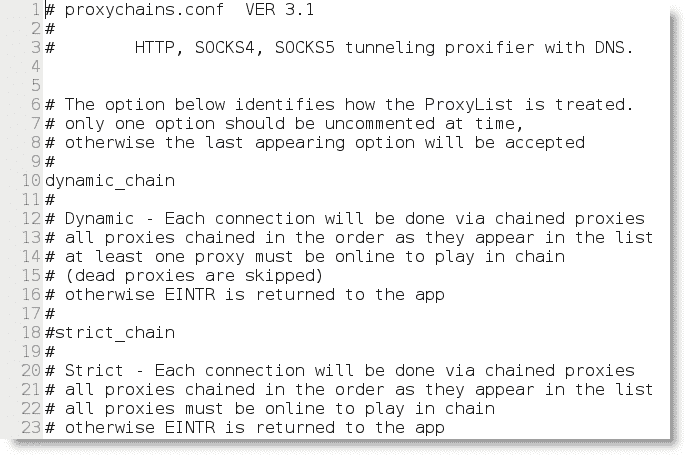
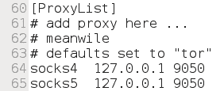
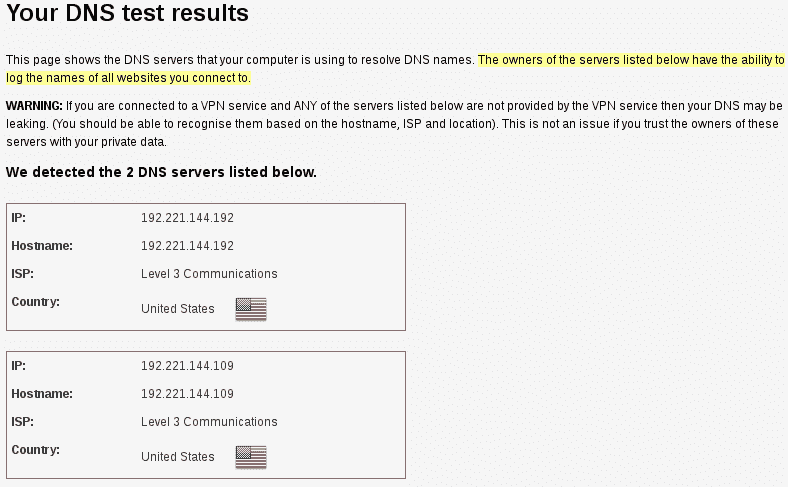
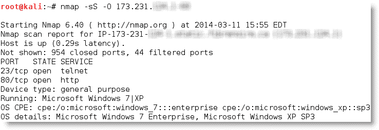
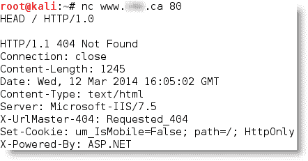
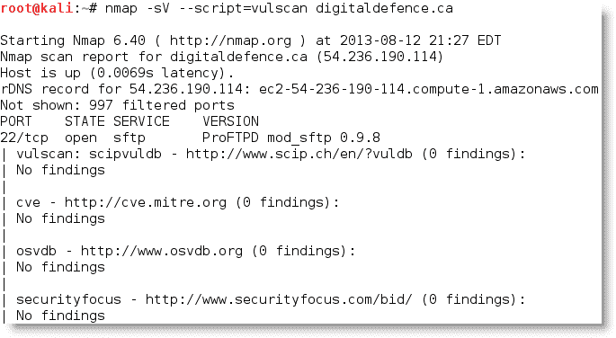
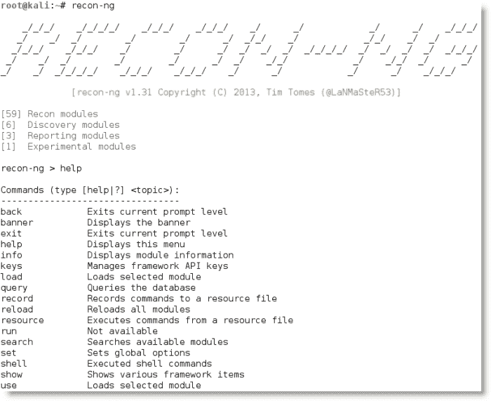
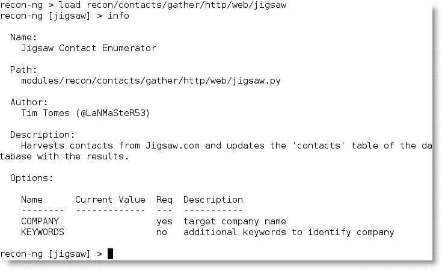

# 第三章主动侦察和漏洞扫描

侦察阶段的目标是收集尽可能多的关于目标的信息，以促进杀伤链的利用阶段。

我们已经看到，几乎无法检测到的被动侦察可以产生有关目标组织及其用户的大量信息。

主动侦察建立在开源情报和被动侦察的基础上，重点是利用探头识别目标的路径和目标暴露的*攻击面*。一般来说，复杂系统具有更大的攻击面，每个攻击面都可能被利用，然后被用来支持其他攻击。

尽管主动侦察会产生更多的信息和更有用的信息，但可能会记录与目标系统的交互，从而通过防火墙和入侵检测系统等保护设备触发警报。随着数据对攻击者的有用性增加，检测风险也随之增加；如下图所示：


为了提高主动侦察在提供详细信息方面的有效性，我们的重点将是使用隐蔽或难以探测的技术。

在本章中，您将学习：

*   隐形扫描策略
*   网络基础架构、主机发现和枚举
*   综合侦察应用，特别是`recon-ng`
*   目标漏洞扫描

# 隐形扫描策略

主动侦察的最大风险是被目标发现。使用测试仪的时间和数据戳、源 IP 地址和其他信息，目标可以识别传入侦察的来源。因此，隐身技术被用来减少被发现的机会。

当使用隐形技术支持侦察时，模拟黑客行为的测试人员将执行以下操作：

*   伪装工具特征以避免检测和触发警报
*   将攻击隐藏在合法流量内
*   修改攻击以隐藏流量的来源和类型
*   使用非标准流量类型或加密使攻击不可见

隐形扫描技术可包括以下部分或全部：

*   调整源 IP 堆栈和刀具标识设置
*   修改数据包参数（`nmap`）
*   使用匿名网络代理（代理链和 Tor 网络）

## 调整源 IP 堆栈和刀具识别设置

渗透测试人员（或攻击者）开始测试之前，必须确保禁用或关闭 Kali 上所有不必要的服务。

例如，如果本地 DHCP 守护进程已启用且不是必需的，则 DHCP 可能与目标系统交互，这可能会被记录并向目标管理员发送警报。

大多数测试人员还禁止 IPv6 在测试系统上运行。这将阻止 IPv6 宣布您在目标网络上的存在，并确保所有流量首先通过 IPv4 socks 代理路由。禁用 IPv6 可以通过编辑`/etc/sysctl.conf`文件以包括以下行来完成：

```
#disable ipv6
  net.ipv6.conf.all.disable_ipv6 = 1
  net.ipv6.conf.default.disable_ipv6 = 1
  net.ipv6.conf.lo.disable = 1 

```

一些商业和开源工具（例如 Metasploit 框架）使用识别序列标记其数据包。尽管这在系统事件日志的测试后分析中很有用（在测试后分析中，特定测试工具启动的事件可以直接与系统的事件日志进行比较，以确定网络如何检测和响应攻击），但它也可以触发某些入侵检测系统。在实验室系统上测试您的工具，以确定标记的数据包，并更改标记或谨慎使用工具。

识别标记的最简单方法是将该工具应用于新创建的虚拟映像作为目标，并查看系统日志以查找该工具的名称。此外，使用 Wireshark 捕获攻击者与目标虚拟机之间的流量，然后在**数据包捕获**（**pcap**）文件中搜索可归因于测试工具的任何关键字（工具名称、供应商、许可证号等）。

元 sploit 框架中的`UserAgent`可以通过修改`http_form_field`选项进行更改。在 msfconsole 提示符下，选择使用`auxiliary/fuzzers/http/http_form_field`的选项，然后设置一个新的 useragent，如下图所示：


在本例中，`UserAgent`被设置为谷歌的索引蜘蛛——谷歌机器人。这是一个常见的自动化应用程序，用于访问和索引网站，很少引起网站所有者的注意。

### 注

要识别合法的`UserAgents`，请参考[www.useragentstring.com](http://www.useragentstring.com)上的示例。

## 修改包参数

最常见的主动侦察方法是对目标进行扫描，向目标发送定义的数据包，然后使用返回的数据包获取信息。这种类型最流行的工具是**网络映射器**（**n****映射器**）。

要有效使用`nmap`，必须以根级别权限运行。这是典型的操作数据包的应用程序，这就是为什么 Kali 在启动时默认为 root。

当尝试最小化检测时，一些避免检测和后续报警的隐形技术包括：

*   测试前确定扫描目标，并发送确定目标所需的最小数据包数。例如，如果要确认是否存在 web 主机，首先需要确定基于 web 的服务的默认端口`port 80`是否打开。
*   避免可能与目标系统连接并泄漏数据的扫描。不要 ping 目标或使用同步（SYN）和非常规数据包扫描，例如确认（ACK）、完成（FIN）和重置（RST）数据包。
*   随机或欺骗数据包设置，例如源 IP 和端口地址以及 MAC 地址。
*   调整定时以减缓数据包到达目标站点的速度。
*   通过分割数据包或附加随机数据来更改数据包大小，以混淆数据包检查设备。

例如，如果您想要进行隐形扫描并最小化检测，可以使用以下`nmap`命令：

```
#nmap --spoof-mac- Cisco --data-length 24 –T paranoid –max-hostgroup 1 – max-parallelism 10 -PN  -f –D 10.1.20.5,RND:5,ME --v –n –sS –sV–oA /desktop/pentest/nmap/out –p T:1-1024 –random-hosts 10.1.1.10 10.1.1.15

```

下表详细说明了上一个命令：

<colgroup><col style="text-align: left"> <col style="text-align: left"></colgroup> 
| 

命令

 | 

根本原因

 |
| --- | --- |
| `--spoof-mac-Cisco` | 伪造 MAC 地址以匹配 Cisco 产品。将`Cisco`替换为`0`将创建一个完全随机的 MAC 地址。 |
| `--data-length 24` | 向发送的大多数数据包追加 24 个随机字节。 |
| `-T paranoid` | 将时间设置为最慢设置-`paranoid`。 |
| `-- max-hostgroup` | 限制一次扫描的主机。 |
| `-- max-parallelism` | 限制发送的未完成探测数。您也可以使用`--scan-delay`选项设置探头之间的暂停；但是，此选项与`--max_parallelism`选项不兼容。 |
| `-PN` | 不 ping 以识别活动系统（这可能会泄漏数据）。 |
| `-f` | 对数据包进行分段；这通常会愚弄低端和配置不当的 ID。 |
| `-D 10.1.20.5, RND:5,ME` | 创建诱饵扫描以与攻击者的扫描同时运行；隐藏实际的攻击。 |
| `-n` | 没有 DNS 解析；nmap 不会主动查询内部或外部 DNS 服务器的 DNS 信息。此类查询经常被记录，因此应禁用查询功能。 |
| `-sS` | 执行隐形 TCP SYN 扫描，该扫描不会完成 TCP 握手。也可以使用其他扫描类型（例如，空扫描）；然而，其中大多数将触发检测设备。 |
| `-sV` | 启用版本检测。 |
| `-oA /desktop/pentest/nmap` | 将结果输出为所有格式（普通格式、greppable 格式和 XML 格式）。 |
| `-p T:1-1024` | 指定要扫描的 TCP 端口。 |
| `-- random-hosts` | 将目标主机顺序随机化。 |

这些选项一起将创建一个非常慢的扫描，隐藏源的真实身份。然而，如果数据包太不寻常，复杂的修改实际上可能会引起目标的注意；因此，许多测试人员和攻击者使用匿名网络来最小化检测。

## 使用匿名网络代理（Tor 和 Privoxy）

**Tor**[www.torproject.org](http://www.torproject.org)是第三代洋葱路由的开源实现，提供对匿名代理网络的免费访问。洋葱路由通过加密用户流量，然后通过一系列洋葱路由器进行传输，从而实现在线匿名。在每个路由器上，删除一层加密以获取路由信息，然后将消息传输到下一个节点。它被比喻为洋葱逐渐剥皮的过程，因此得名。它通过保护用户 IP 流量的源和目标来防止流量分析攻击。

在这个例子中，Tor 将与 PrimoXy，OrthT0.一个非缓存 Web 代理一起使用，它在一个与互联网通信的应用程序的中间使用 Tyt T2^，并使用高级过滤来确保隐私和移除广告和潜在的恶意数据被发送到测试者。

要安装 Tor，执行以下步骤：

1.  发出`apt-get update`和`apt-get upgrade`命令，然后使用以下命令：

    ```
    apt-get install tor

    ```

2.  Once Tor is installed, edit the `Proxychains.conf` file located in the `/etc` directory.

    该文件规定了测试系统将在通往 Tor 网络的路上使用的代理的数量和顺序。代理服务器可能已关闭，或者可能正在经历重载（导致连接缓慢或潜在连接）；如果发生这种情况，定义的或严格的 proxychain 将失败，因为缺少预期的链接。因此，禁用`strict_chains`并启用`dynamic_chains`，这将确保连接将被路由，如以下屏幕截图所示：

    

3.  Next, edit the `[ProxyList]` section to ensure that the `socks5` proxy is present, as shown in the following screenshot:

    

    打开的代理可以很容易地在网上找到并添加到`proxychains`文件中。测试人员可以利用这一点进一步混淆他们的身份。例如，如果有报告称某个国家或 IP 地址块对最近的在线攻击负责，请查找该位置的开放代理并将其添加到您的列表或单独的配置文件中。

4.  要从终端窗口启动 Tor 服务，请输入以下命令：

    ```
    root@kali:~# service tor start

    ```

5.  使用以下命令验证 Tor 已启动：

    ```
    root@kali:~# service tor status

    ```

6.  It is important to verify that the Tor network is working and providing anonymous connectivity. Verify your source IP address first. From a terminal, enter the following command:

    ```
    root@kali:~# iceweasel www.whatismyip.com

    ```

    这将启动 Iceweasel 浏览器，并将其打开到提供与该网页连接的源 IP 地址的站点。记下 IP 地址，然后使用以下`proxychains`命令调用 Tor 路由：

    ```
    root@kali:~# proxychainsiceweasel www.whatismyip.com

    ```

在此特定实例中，IP 地址被标识为`96.47.226.60`。从终端窗口`whois`查找该 IP 地址表明传输现在正从 Tor 出口节点退出，如以下屏幕截图所示：


您还可以通过访问[来验证 Tor 是否正常工作 https://check.torproject.org](https://check.torproject.org) 。

尽管通信现在使用 Tor 网络进行保护，但也有可能发生 DNS 泄漏，当您的系统发出 DNS 请求向 ISP 提供您的身份时，就会发生这种情况。您可以在[www.dnsleaktest.com](http://www.dnsleaktest.com)上检查 DNS 泄漏。

当您测试 DNS 泄漏时，Kali 的 proxychains 配置会响应一个位于**美国**的**三级通信**服务器的默认源 IP 地址，如下图所示。这为测试人员的身份提供了额外的保护。



大多数命令行可以使用`proxychains`从控制台运行，以访问 Tor 网络。

在使用 Tor 时，需要记住的一些注意事项如下：

*   Tor 提供匿名服务，但不保证隐私。出口节点的所有者能够嗅探流量，并且据说可以访问用户凭据。
*   据报道，Tor 浏览器捆绑包中的漏洞已被执法部门用来攻击系统并获取用户信息。
*   代理链不处理 UDP 通信。
*   某些应用程序和服务无法在此环境中运行，尤其是 Metasploit 和`nmap`可能会中断。`nmap`的隐形 SYN 扫描中断 proxychains，而调用 connect 扫描；这可能会向目标泄漏信息。
*   一些浏览器应用程序（ActiveX、Adobe 的 PDF 应用程序、Flash、Java、RealPlay 和 QuickTime）可用于获取您的 IP 地址。
*   确保在浏览之前清除并阻止 Cookie。

### 提示

Tor Buddy 脚本允许您控制 Tor IP 地址刷新的频率，自动使识别用户信息更加困难（[http://sourceforge.net/projects/linuxscripts/files/Tor-Buddy/](http://sourceforge.net/projects/linuxscripts/files/Tor-Buddy/) ）。

# 识别网络基础设施

一旦测试人员的身份得到保护，识别网络中可访问互联网部分的设备是扫描网络的下一个关键的第一步。

攻击者和渗透测试人员使用此信息执行以下操作：

*   识别可能混淆（负载平衡器）或消除（防火墙和数据包检查设备）测试结果的设备
*   识别具有已知漏洞的设备
*   确定继续实施*隐蔽*扫描的要求
*   了解目标公司对安全体系结构和总体安全性的关注

`traceroute`提供包过滤能力的基本信息；Kali 上的其他一些应用程序包括：

<colgroup><col style="text-align: left"> <col style="text-align: left"></colgroup> 
| 

应用

 | 

描述

 |
| --- | --- |
| lbd | 使用两种基于 DNS 和 HTTP 的技术检测负载平衡器（如下屏幕截图所示） |
| 米兰达 | 识别通用即插即用和 UPNP 设备 |
| `nmap` | 检测设备并确定操作系统及其版本 |
| 肖丹 | 基于 Web 的搜索引擎，用于识别连接到 Internet 的设备，包括具有默认密码、已知错误配置和漏洞的设备 |

下面的截图显示了对谷歌运行`lbd`脚本的结果；正如你所看到的，谷歌在其网站上同时使用了`DNS-Loadbalancing`和`HTTP-Loadbalancing`。从渗透测试人员的角度来看，当负载平衡器将特定工具的活动从一台服务器转移到另一台服务器时，这些信息可以用来解释为什么会得到虚假的结果。


# 枚举主机

主机枚举是获取已定义主机的特定细节的过程。仅仅知道服务器或无线接入点存在是不够的；相反，我们需要通过识别开放端口、基本操作系统、正在运行的服务和支持应用程序来扩展攻击面。

这是高度侵入性的，除非小心，否则目标组织将检测并记录主动侦察。

## 实时主机发现

第一步是对目标地址空间运行网络 ping 扫描，并查找指示特定目标处于活动状态且能够响应的响应。从历史上看，ping 指的是 ICMP 的使用；但是，TCP、UDP、ICMP 和 ARP 通信也可用于识别活动主机。

可以从 Internet 上的远程位置运行各种扫描仪来识别活动主机。虽然主扫描器为`nmap`，但 Kali 提供了其他几个同样有用的应用程序，如下表所示：

<colgroup><col style="text-align: left"> <col style="text-align: left"></colgroup> 
| 

应用

 | 

描述

 |
| --- | --- |
| `alive6`和`detect-new-ip6` | IPv6 主机检测。`detect-new-ip6`在脚本基础上运行，并在添加时识别新的 IPv6 设备。 |
| `dnmap` 和`nmap` | `nmap`是标准的网络枚举工具。`dnmap`是`nmap`扫描仪的分布式客户机-服务器实现。PBNJ 将`nmap`结果存储在数据库中，然后进行历史分析以识别新主机。 |
| `fping`、`hping2`、`hping3`和`nping` | 以各种方式响应目标以识别活动主机的数据包工匠 |

对于渗透测试人员或攻击者，实时主机发现返回的数据将识别攻击目标。

### 提示

在执行渗透测试时运行多个主机发现扫描。某些设备可能与时间有关。在一次渗透测试中，发现系统管理员在正常工作时间后设置了游戏服务器。因为它不是经批准的业务系统，管理员没有按照正常流程保护服务器；存在多个易受攻击的服务，并且未收到必要的安全补丁。测试人员能够利用管理员游戏服务器中的漏洞破坏游戏服务器并访问底层公司网络。

# 端口、操作系统和服务发现

Kali 提供了几种不同的工具，可用于识别远程主机上的开放端口、操作系统和已安装服务。这些功能的大部分都可以使用`nmap`来完成。虽然我们将重点介绍使用`nmap`的示例，但基本原则也适用于其他工具。

## 端口扫描

端口扫描是连接 TCP 和 UDP 端口以确定目标设备上正在运行哪些服务和应用程序的过程。每个系统上都有 65535 个 TCP 和 UDP 端口。一些端口已知与特定服务相关（TCP 20 和 21 是**文件传输协议**服务（**FTP**的常用端口）。前 1024 个是众所周知的端口，大多数已定义的服务都在该范围内的端口上运行；接受的服务和端口由 IANA 维护（[http://www.iana.org/assignments/service-names-port-numbers/service-names-port-numbers.xhtml](http://www.iana.org/assignments/service-names-port-numbers/service-names-port-numbers.xhtml) 。

### 提示

尽管特定服务有可接受的端口，例如用于基于 web 的流量的端口 80，但服务可以被引导使用*任何*端口。此选项经常用于隐藏特定服务，特别是已知该服务易受攻击时。但是，如果攻击者完成端口扫描，但未找到预期的服务，或使用异常端口找到该服务，则会提示他们进行进一步调查。

通用的端口映射工具`nmap`依赖于主动堆栈指纹。特制的数据包被发送到目标系统，操作系统对这些数据包的响应允许`nmap`识别操作系统。为了使`nmap`能够工作，必须至少打开一个侦听端口，并且必须知道操作系统并对其进行指纹识别，并在本地数据库中保存该指纹的副本。

使用`nmap`进行端口发现非常*嘈杂*-它将被网络安全设备检测并记录。需要记住的几点如下：

*   专注于隐身的攻击者和渗透测试人员将只测试影响他们跟随其特定目标的杀伤链的端口。如果他们正在发动攻击，利用 web 服务器中的漏洞进行攻击，他们将搜索可访问`port 80`或`port 8080`的目标。
*   大多数端口扫描器都有被扫描端口的默认列表，以确保您知道该列表中有哪些端口以及哪些端口被忽略。同时考虑 TCP 和 UDP 端口。
*   成功的扫描需要深入了解 TCP/IP 和相关协议、网络以及特定工具的工作原理。例如，SCTP 是网络上越来越常见的协议，但很少在公司网络上进行测试。
*   端口扫描，即使速度很慢，也会影响网络。一些旧的网络设备和特定供应商的设备在接收或发送端口扫描时会锁定，从而将扫描转化为拒绝服务攻击。
*   用于扫描端口的工具，特别是`nmap`，在功能方面正在扩展。它们还可用于检测漏洞和利用简单的安全漏洞。

## 对操作系统进行指纹识别

使用两种扫描方式确定远程系统的操作系统：

*   **主动指纹**：攻击者向目标发送正常和错误的数据包，并记录其响应模式，称为*指纹*。通过将指纹与本地数据库进行比较，可以确定操作系统。
*   **被动指纹**：攻击者*嗅探*，或记录并分析数据包流，以确定数据包的特征。

主动指纹比被动指纹更快、更准确。在 Kali 中，两个主要的活动工具是`nmap`和`xprobe2`。

`nmap`工具将数据包注入目标网络，并分析其收到的响应。在下面的屏幕截图中，`-O`标志命令`nmap`确定操作系统。因为它将数据包注入目标，所以`nmap`确定操作系统的准确性取决于打开端口的数量。它通常能有效地区分 Windows 和 Unix 系统，但可能无法提供非常具体的信息，例如区分各种 Unix 内核。下面的屏幕截图显示了 Windows 系统的`nmap`扫描结果。目标系统上只有几个端口可供测试，因此无法区分 Windows 7 enterprise 和 Windows XP sp3



相关程序`xprobe2`使用不同的 TCP、UDP 和 ICMP 数据包绕过防火墙，避免 IDS/IPS 系统检测。`xprobe2`还使用了模糊模式匹配，操作系统未确定为一种类型；相反，它被指定为几个可能的变体之一的概率。正如您在下面的屏幕截图中所看到的，这允许测试人员测试特定于操作系统变体的漏洞；这种特殊性增加了成功的机会，并将使用错误工具尝试利用漏洞时可能发生的风险降至最低。


请注意，目标系统隐藏真正的操作系统很简单。由于指纹识别软件依赖于数据包设置，如生存时间或初始窗口大小，因此更改这些值或其他用户可配置设置可能会更改工具结果。一些组织积极改变这些价值观，使侦察的最后阶段更加困难。

## 确定主动服务

侦察枚举部分的最终目标是识别在目标系统上运行的服务和应用程序。如果可能，攻击者会希望知道服务类型、供应商和版本，以便于识别任何漏洞。

以下是用于确定活动服务的几种技术中的一些：

*   **识别默认端口和服务**：如果远程系统被识别为有一个打开了`port 80`的 Microsoft 操作系统（WWW 服务），攻击者可能会认为安装了 Microsoft IIS 的默认安装。额外测试将用于验证该假设（`nmap`。
*   **横幅抓取**：此使用 amap、netcat、`nmap`和 Telnet 等工具完成。
*   **Review default web pages**: Some applications install with default administration, error, or other pages. If attackers access these, they will provide guidance on installed applications that may be vulnerable to attack. In the following screenshot, the attacker can easily identify the version of Apache Tomcat that has been installed on the target system.

    

*   **Review source code**: Poorly configured web-based applications may respond to certain HTTP requests such as `HEAD` or `OPTIONS` with a response that includes the web server software version, and possibly, the base operating system or the scripting environment in use. In the following screenshot, netcat is launched from the command line and used to send raw `HEAD` packets to a particular website. This request generates an error message (**404 not found**); however, it also identifies that the server is running Microsoft IIS, Version 7.5.

    

# 采用综合侦察应用

尽管 Kali 包含多个工具以便于侦察，但许多工具包含重叠的功能，将数据从一个工具导入另一个工具通常是一个复杂的手动过程。大多数测试人员选择工具的子集并用脚本调用它们。

专注于侦察的综合工具最初是具有一组定义功能的命令行工具；其中最常用的是**Deepmagic 信息收集**l（**DMitry**）。DMitry 可以执行`whois`查找、检索 netcraft.com 信息、搜索子域和电子邮件地址，以及执行 TCP 扫描。不幸的是，它不能扩展到这些函数之外。

最近的进展创造了综合框架应用，结合被动和主动侦察；我们将回顾`nmap`、`recon-ng`和`maltego`。

## nmap

传统上，`nmap`被视为一个简单的映射工具，提供有关主机和端口可用性的数据，以及一些附加数据，如目标设备的可能操作系统。

**Nmap 脚本引擎**（**NSE**已经将`nmap`转化为一个可以进行被动和主动侦察，甚至可以进行基本漏洞扫描的工具（完整的脚本列表可在[上找到）http://nmap.org/nsedoc/](http://nmap.org/nsedoc/) 。

因为脚本是用 Lua 脚本语言编写的，所以渗透测试社区很容易修改和发布脚本。目前，脚本化功能包括：

*   IPv4 和 IPv6 DNS 数据的侦察
*   识别是否存在 web 应用程序防火墙、ID、IP 和其他保护控件
*   测试防火墙规则集（通过 firewalk）并尝试绕过防火墙
*   从目标和在线站点获取用户名
*   针对各种服务和应用程序对密码进行暴力猜测
*   爬行目标网络识别网络共享
*   从已定义网站中的图像提取 EXIF 元数据
*   IP 地址的地理定位
*   进行网络攻击，如 IPv6 数据包泛滥
*   漏洞扫描，包括模糊和 SQL 注入测试

如您所见，使用可扩展语言（如 Lua）编写`nmap`活动脚本的能力增加了该工具的重要性。

Marc Ruef 的**vulscan**（[是一个有用的脚本 http://www.computec.ch/mruef/software/nmap_nse_vulscan-1.0.tar.gz](http://www.computec.ch/mruef/software/nmap_nse_vulscan-1.0.tar.gz) ），它将`nmap`的指纹特征（使用`–sV`标志）与针对主要漏洞的查找相结合，如 MITRE、OSVDB 和 SecurityFocus。

下载脚本包后，解除对文件的加载并将脚本文件移动到`usr/share/nmap/scripts`。

要从命令行调用其中一个脚本，请使用`--script`标志，然后标识脚本名称。一个经常使用的脚本是`nmap`的通用漏洞扫描程序，使用以下命令启动：

```
root@kali:~# nmap -sV --script=vulscan.nse digitaldefence.ca

```

在此特定情况下，漏洞扫描未发现任何已知漏洞，如以下屏幕截图所示：



### 提示

SpiderLabs 脚本是屏幕截图 web 服务的必备脚本。需要下载**wkhtmltoimage**工具（[http://wkhtmltopdf.googlecode.com](http://wkhtmltopdf.googlecode.com) 并放置在`/usr/local/bin`文件夹中。然后应下载屏幕截图脚本本身（[https://github.com/SpiderLabs/Nmap-Tools/blob/master/NSE/http-screenshot.nse](https://github.com/SpiderLabs/Nmap-Tools/blob/master/NSE/http-screenshot.nse) 并放置在`/usr/local/share/nmap/scripts`中。调用此脚本时，会生成所有已识别 web 服务的可视记录，从而更容易选择目标以供以后测试。

## 侦察框架

`recon-ng`框架是一个用于进行侦察（被动和主动）的开源框架。

与 Metasploit 框架和社会工程师工具包一样，`recon-ng`使用模块化框架。每个模块都是一个定制的*cmd*解释器，预配置为执行特定任务。

`recon-ng`框架及其模块是用 Python 编写的，允许渗透测试人员轻松构建或修改模块，以方便测试。

`recon-ng`工具利用第三方 API 进行一些评估；这种额外的灵活性意味着`recon-ng`开展的某些活动可能会被这些缔约方跟踪。用户可以指定自定义的`UserAgent`字符串或代理请求，以尽量减少对目标网络的警报。

`recon-ng`收集的所有数据都放在数据库中，允许您根据存储的数据创建各种报告。用户可以选择其中一个报告模块来自动创建 CVS 报告或 HTML 报告。

要使用侦察，请执行以下步骤：

1.  如果您的 Kali 版本上没有安装`recon-ng`，请使用以下命令：

    ```
    apt-get install recon-ng

    ```

2.  To start the application, enter `recon-ng` at the prompt as shown in the following screenshot. The start screen will indicate the number of modules present, and the help command will show the commands available for navigation.

    

3.  To show the available modules, type `show` at the `recon-ng>` prompt. To load a specific module, type `load` followed by the name of the module. Hitting the tab key while typing will autocomplete the command. If the module has a unique name, you can type in the unique part of the name, and the module will be loaded without entering the full path.

    输入`info`，如以下屏幕截图所示，将为您提供有关模块如何工作的信息，以及需要时从何处获取 API 密钥的信息。

    

4.  Once the module is loaded, use the `set` command to set the options, and then enter `run` to execute, as shown in the following screenshot:

    

通常，测试人员依靠`recon-ng`完成以下工作：

*   使用`whois`、`jigsaw`、`linkedin`和`twitter`获取联系人（使用 mangle 模块提取并呈现电子邮件数据）
*   确定主机
*   使用`hostop`、`ipinfodb`、`maxmind`、`uniapple`和`wigle`识别宿主和个体的地理位置
*   使用 netcraft 和相关模块识别主机信息
*   识别先前被泄露到互联网上的账户和密码信息（即`pwnedlist`模块、`wascompanyhacked`、`xssed`和`punkspider`）

## 马尔蒂戈

**Maltego**（[www.paterva.com](http://www.paterva.com)是一个开放的来源情报和取证应用程序。Kali 附带的社区版本对搜索的规模进行了限制；然而，对于使用数据挖掘和链接分析可视化数据之间的关系来说，它是一个极好的工具。

Maltego 允许您列举个人信息，将特定人员与公司、电子邮件地址、网站、社交网络组和电话号码联系起来。它也有助于被动和主动侦察`whois`信息、域名、DNS 信息、IP 地址和 NetBlock。

1.  要打开应用程序，请输入`maltego`作为命令提示。第一次打开时，您需要向 Paterva 注册并验证您的电子邮件地址。
2.  Once you have completed registration and updating of transforms, you will be presented with a multipaned GUI that allows you to examine the connections between various data objects, as shown in the following screenshot:

    

    Maltego 依赖于存储在应用程序左侧调色板中的一系列转换或模块。通过从左侧的列中拾取变换，然后将其拖动到应用程序的中心来选择变换。

    默认情况下，初始选择时，该图标可能被称为**pantera.com**；但是，可以使用右侧列中的数据操作区域重命名和更改数据。

    社区版中存在几种不同的转换；这些被分为几组，如**设备**、**基础设施**、**个人**、**位置**、**渗透测试**、**社交网络**，如下图所示：

    

3.  将适当的转换拖到工作表上，右键单击以显示将根据该转换的标识完成的转换。请记住，如果选择**All**选项，处理将花费大量时间。

分析关系的能力在执行社会工程攻击时特别有用。例如，如果目标网站包含指向其他网站的多个链接，则攻击者可以使用此关系进行钓鱼攻击。

# 漏洞扫描

漏洞扫描采用自动化流程和应用程序来识别网络、系统、操作系统或应用程序中可能被利用的漏洞。

当正确执行时，漏洞扫描将提供设备（授权和*恶意*设备）清单、已被主动扫描的已知漏洞，通常还将确认设备是否符合各种政策和法规。

不幸的是，漏洞扫描是*响亮的*——它们传递的多个数据包很容易被大多数网络控制检测到，并且使隐藏几乎不可能实现。他们还受到以下额外限制：

*   在大多数情况下，漏洞扫描器是基于签名的，它们只能检测已知漏洞，并且只有在存在扫描器可以应用于目标的现有识别签名时才能检测。对于渗透测试人员来说，最有效的扫描器是开源的，允许测试人员快速修改代码以检测新的漏洞。
*   扫描仪产生大量的输出，经常包含可能导致测试人员误入歧途的假阳性结果；特别是，具有不同操作系统的网络可能产生高达 70%的误报率。
*   扫描器可能会对网络产生负面影响。扫描器可能会造成网络延迟或导致某些设备出现故障（请参阅[www.digininja.org](http://www.digininja.org)上的网络扫描观察列表，了解因漏洞测试而失败的设备）。
*   在某些司法管辖区，扫描被视为*黑客行为*，可能构成非法行为。

有多种商业和开源产品可执行漏洞扫描。在卡利，**漏洞分析**子菜单以及**Web 漏洞扫描器**菜单中都可以找到扫描工具；然而，主要的漏洞扫描器是**开放漏洞评估系统**（**OpenVAS**。

Kali 支持安装额外的扫描仪。如果决定在测试过程中为了完整性而牺牲隐形，始终使用至少两种不同的扫描仪，以尽量减少假阳性结果。推荐的扫描仪包括 Nexpose（[www.rapid7.com](http://www.rapid7.com)）和尊者 Nessus（[www.Nessus.org](http://www.nessus.org)）。

# 总结

在主动侦察过程中，攻击者的活动很有可能被识别，从而使他们处于危险之中。这必须与映射网络、查找开放端口以及确定安装的操作系统和应用程序的需要相平衡。

为了降低风险，攻击者必须采用隐蔽扫描技术。手动方法用于创建慢速扫描；然而，这种方法并不总是有效的。因此，攻击者利用 Tor 网络和各种代理应用程序等工具隐藏其身份。

在下一章中，我们将重点分析来自侦察阶段和其他来源的数据，并使用这些数据规划和执行针对目标网络或系统的远程攻击。我们将回顾各种攻击技术和工具，重点介绍如何确保无法通过正常手段检测到该漏洞。我们还将把远程攻击作为一个连续的过程来研究，一旦您破坏了一个目标，如何利用这一成功来转向新的目标。