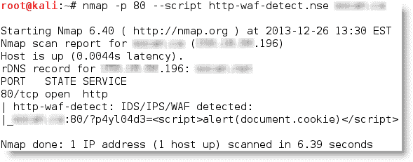
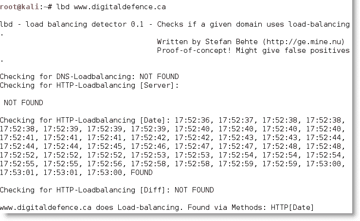
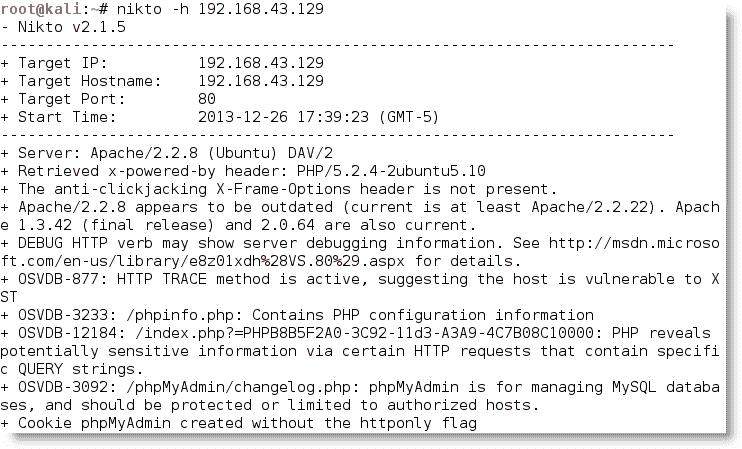
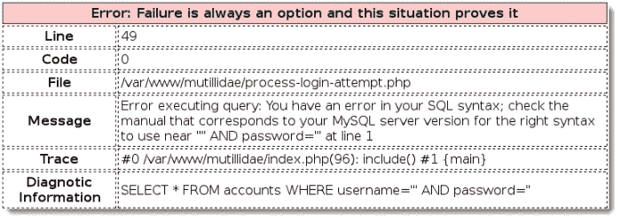
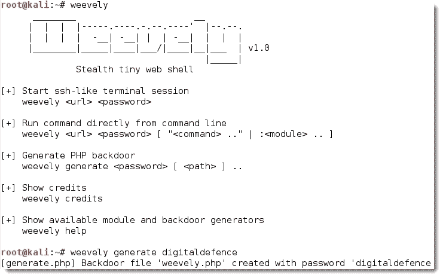
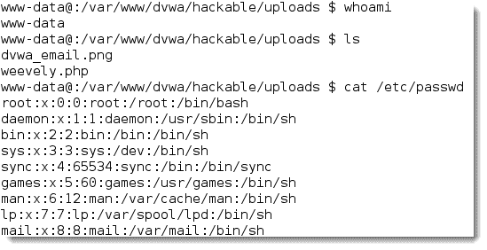

# 第 9 章基于 Web 的应用程序的侦察和开发

在前几章中，我们回顾了攻击者的杀人链—用于破坏网络和设备、泄露数据或阻止访问网络资源的特定方法。在[第 7 章](07.html "Chapter 7. Physical Attacks and Social Engineering")、*物理攻击和社会工程*中，我们从物理攻击和社会工程入手，考察了攻击路线。在[第 8 章](08.html "Chapter 8. Exploiting Wireless Communications")*利用无线通信*中，我们看到了无线网络是如何被破坏的。在本章中，我们将重点介绍最常见的攻击途径之一，即通过网站和基于 web 的应用程序。

提供内容和基于 web 的服务（例如，电子邮件和 FTP）的网站无处不在，大多数组织都允许远程访问这些服务，并且几乎保持不变的可用性。然而，对于渗透测试人员和攻击者来说，网站暴露了发生在网络上的后端服务、访问网站的用户的客户端活动以及用户与网站数据之间的连接经常受到攻击。本章将重点介绍攻击者对网站和 web 服务的看法，我们将回顾[第 10 章](10.html "Chapter 10. Exploiting Remote Access Communications")、*利用远程访问通信*中针对连接性的攻击以及[第 11 章](11.html "Chapter 11. Client-side Exploitation")、*客户端利用*中的客户端攻击。

在本章结束时，您将学习以下内容：

*   将侦察原理扩展到 web 服务
*   漏洞扫描
*   使用客户端代理
*   利用 web 服务中的漏洞
*   通过 web 后门维护对受损系统的访问

### 提示

对于许多练习，我们将使用 NOWASP 或 Mutillidae 作为目标网站，其中包含可被利用的已知漏洞；可从[www.owasp.org/index.php/Category:owasp_Mutillidae](http://www.owasp.org/index.php/Category:OWASP_Mutillidae)下载。此 web 应用程序可以使用 LAMP、WAMP 和 XAMPP 直接安装到 Linux 或 Windows 上。它还预安装在 SamauraiWTF 和 Metasploitable 测试环境中。有关创建元可编程测试环境的说明，请参阅[附录](12.html "Appendix A. Installing Kali Linux")*安装 Kali Linux*。

# 对网站进行侦察

网站，以及这些网站提供的服务，尤其复杂。通常，在与网络上的后端服务器和数据库通信的同时，使用多层体系结构将服务交付给最终用户，该体系结构具有可通过公共互联网访问的 web 服务器。

测试期间必须考虑的几个额外因素增加了复杂性，这些因素包括：

*   网络体系结构，包括安全控制（防火墙、IDS/IP 和蜜罐），以及负载平衡等配置
*   承载 web 服务的系统的平台体系结构（硬件、操作系统和其他应用程序）
*   应用程序、中间件和最终层数据库，它们可能采用不同的平台（Unix 或 Windows）、供应商、编程语言以及商业和专有软件的混合
*   身份验证和授权过程，包括在整个应用程序中维护会话状态的过程
*   控制应用程序使用方式的底层业务逻辑
*   客户端与 web 服务的交互和通信

考虑到 web 服务的复杂性，渗透测试人员必须适应每个站点的特定体系结构和服务参数。同时，必须始终如一地应用测试过程，并确保没有遗漏任何内容。已经提出了几种方法来实现这些目标。最被广泛接受的是**开放式 Web 应用程序安全项目**（**OWASP**）（[www.OWASP.org](http://www.owasp.org)及其前 10 个漏洞列表。

作为最低标准，OWASP 为测试人员提供了强有力的指导。然而，只关注前 10 个漏洞是短视的，并且该方法已经证明了一些漏洞，特别是在应用程序如何工作以支持业务实践的逻辑中查找漏洞时。

使用 kill-chain 方法，需要强调的特定于 web 服务侦察的一些活动包括：

*   确定目标站点，特别是关于其托管位置和方式。
*   列举目标网站的网站目录结构和文件，包括确定**内容管理系统**（**CMS**是否正在使用。这可能包括下载网站进行离线分析，包括文档元数据分析，以及使用网站创建自定义密码破解词表（使用 crunch 等程序）。它还确保所有支持文件都已标识。
*   识别身份验证和授权机制，并确定在与该 web 服务的事务期间如何维护会话状态。这通常涉及对 cookies 的分析以及它们的使用方式。
*   列举所有形式。由于这些是客户端输入数据和与 web 服务交互的主要手段，因此这些是一些可利用漏洞的特定位置，例如 SQL 注入攻击和跨站点脚本。
*   识别接受输入的其他区域，例如允许文件上载的页面以及对接受的上载类型的任何限制。
*   识别如何处理错误，以及用户收到的实际错误消息；通常，错误会提供有价值的内部信息，如所用软件的版本或内部文件名和进程。
*   确定哪些页面需要并维护安全套接字层或其他安全协议（参考[第 10 章](10.html "Chapter 10. Exploiting Remote Access Communications")、*利用远程访问通信*）。

第一步是进行前面描述的被动和主动侦察（参见[第 2 章](02.html "Chapter 2. Identifying the Target – Passive Reconnaissance")、*识别目标-被动侦察*和[第 3 章](03.html "Chapter 3. Active Reconnaissance and Vulnerability Scanning")、*主动侦察和漏洞扫描*；特别是，请确保已标识托管站点，然后使用 DNS 映射来标识由同一服务器交付的所有托管站点（最常见和最成功的攻击手段之一是攻击与目标网站位于同一物理服务器上的非目标网站，利用服务器中的弱点获得根访问权限，然后使用升级的权限攻击目标网站）。

下一步是确定是否存在基于网络的保护设备，如防火墙、IDS/IP 和蜜罐。越来越常见的保护设备是**Web 应用程序防火墙**（**WAF**）。

如果使用 WAF，测试人员必须确保攻击，特别是那些依赖精心编制的输入的攻击，被编码为绕过 WAF。

可以通过手动检查 Cookie（一些 WAF 标记或修改 web 服务器和客户端之间通信的 Cookie）或通过更改标头信息（当测试仪使用命令行工具（如 Telnet）连接到端口 80 时识别）来识别 WAF。

WAF 检测过程可以使用`nmap`脚本`http-waf-detect.nse`进行自动化，如下图所示：



nmap 脚本标识存在 WAF；然而，对脚本的测试表明，它的发现并不总是准确的，返回的数据可能过于笼统，无法指导绕过防火墙的有效策略。

wafw00f 脚本是一个自动工具，用于识别和识别基于 web 的防火墙；测试已经确定，它是用于此目的的最精确工具。该脚本很容易从 Kali 调用，下面的屏幕截图显示了大量的输出：


**负载平衡检测器**（**lbd**是一个 bash shell 脚本，用于确定给定域是否使用 DNS 和/或 HTTP 负载平衡。从测试人员的角度来看，这是重要的信息，因为它可以解释当一台服务器被测试，然后负载平衡器将请求切换到另一台服务器时出现的看似异常的结果。Lbd 使用各种检查来确定是否存在负载平衡；A.以下屏幕截图显示了一个示例输出：



应检查网站，以确定可用于构建和维护网站的 CMS。CMS 应用程序，如 Drupal、Joomla 和 WordPress 等，可能配置有允许访问提升权限的易受攻击的管理界面，或者可能包含可利用的漏洞。

Kali 包括一个自动扫描仪，**BlindElephant**，它对 CMS 进行指纹识别以确定版本信息。以下屏幕截图显示了一个示例输出：


BlindElephant 检查 CMS 组件的指纹，然后提供现有版本的最佳猜测。然而，像其他应用一样，我们发现它可能无法检测到存在的 CMS；因此，请始终对照其他扫描程序验证结果，这些扫描程序会在网站上搜索特定目录和文件，或者手动检查网站。

一个特殊的扫描工具，自动网络爬虫，可以用来验证已经收集的信息，以及确定特定站点的现有目录和文件结构。web 爬虫的典型发现包括管理门户、配置文件（当前和以前的版本），其中可能包含硬编码的访问凭据和内部结构信息、网站的备份副本、管理员说明、机密个人信息和源代码。

Kali 支持多种网络爬虫程序，包括 Burp 套件、DirBuster、OWASP-ZAP、Vega、WebScarab 和 WebLayer。最常用的工具是 DirBuster。

DirBuster 是一个 GUI 驱动的应用程序，它使用可能的目录和文件列表对网站结构进行暴力分析。可以以列表或树形格式查看响应，以更准确地反映站点的结构。针对目标网站执行此应用程序的输出显示在以下屏幕截图中：


也可以将网站直接复制到测试人员的位置。这种“网站克隆”允许测试人员查看目录结构及其内容，从本地文件中提取元数据，并使用网站内容作为程序的输入，如`crunch`，该程序将生成一个支持密码破解的个性化字表。

要将网站克隆到本地系统，请使用 HTTrack。如果 Kali 中没有，可以使用`apt-get`命令下载，然后在命令提示符中键入`httrack`执行。系统将提示您选择一个目录位置来存储下载的网站。一旦程序执行完毕，您将拥有目标网站的备份。

一旦您确定了正在交付的网站和/或 web 服务的基本结构，杀戮链的下一个阶段就是确定可以利用的漏洞。

# 漏洞扫描器

使用自动化工具扫描漏洞可能会有问题。Web 漏洞扫描器存在所有扫描器的共同缺点（扫描器只能检测已知漏洞的特征；无法确定该漏洞是否可以被实际利用；出现*假阳性*报告的几率很高）。此外，web 漏洞扫描器无法识别业务逻辑中的复杂错误，也无法准确模拟黑客使用的复杂链式攻击。

为了提高可靠性，大多数渗透测试人员使用多种工具扫描 web 服务；当多个工具报告可能存在特定漏洞时，这种共识将引导测试人员到可能需要手动验证结果的区域。

Kali 为 web 服务提供了大量漏洞扫描工具，并为安装新的扫描工具和扩展其功能提供了一个稳定的平台。这使得渗透测试人员能够通过选择以下扫描工具来提高测试的有效性：

*   最大限度地提高测试的完整性（已识别的漏洞总数）和准确性（真实而非假阳性结果的漏洞）。
*   尽可能减少获得可用结果所需的时间。
*   尽量减少对正在测试的 web 服务的负面影响。这可能包括由于流量吞吐量的增加而降低系统的速度。例如，最常见的负面影响之一是，测试表单时会将数据输入数据库，然后通过电子邮件发送给个人，向其提供更改的更新。对此类表单进行非受控测试可能会导致发送 30000 多封电子邮件！

选择最有效的工具非常复杂。除了已经列出的因素外，一些漏洞扫描程序还将启动适当的攻击并支持攻击后活动。为了我们的目的，我们将考虑扫描可利用弱点的所有工具是“漏洞扫描器”。KALI 提供对几种不同漏洞扫描器的访问，包括以下内容：

*   扩展传统漏洞扫描器功能以包括网站和相关服务的扫描器（Metasploit 框架和 Websploit）
*   扩展非传统应用程序（如 web 浏览器）功能以支持 web 服务漏洞扫描的扫描仪（OWASP 咒语）
*   专门为支持网站和 web 服务中的侦察和利用漏洞检测而开发的扫描仪（蜘蛛纲、Nikto、Skipfish、Vega、w3af 等）

## 扩展传统漏洞扫描器的功能

此类漏洞扫描器的最佳示例是使用 Rapid7 的 Metasploit 框架打包的`wmap`模块。要使用此模块，首先必须确保`postgresql`数据库服务已经启动；使用以下命令：

```
root@kali:~# service postgresql start 

```

接下来，在命令提示符下启动`msfconsole`并输入`load wmap`命令。与大多数框架应用程序一样，在命令提示符中键入`help`或`-h`将显示可供使用的命令。

要管理目标站点，请使用`wmap_sites`命令。`–a`选项将目标的 IP 地址添加到应用程序的数据库中。`–l`选项提供了测试目标可用站点的列表，如以下屏幕截图所示：


选择目标后，测试仪现在可以使用以下命令运行`wmap`模块：

```
msf> wmap_run –e

```

上一个命令的执行如以下屏幕截图所示：


执行此命令可能需要一些时间才能完成（这取决于网站中的页面数量、网站的结构复杂性以及所选模块如何操作以检测漏洞）。

Metasploit 框架不是为网站和 web 服务的复杂性而设计的；与使用专门为网站和 web 服务设计的漏洞扫描器相比，使用本产品的发现数量有限，这一点非常明显。然而，由于它总是在进行更新，因此值得监视其扫描能力的变化。

**Websploit**应用程序也使用`wmap`模块。

## 扩展 web 浏览器的功能

Web 浏览器旨在与 Web 服务交互。因此，选择它们作为漏洞评估和利用工具是很自然的。

这类工具集的最好例子是 OWASP 的 Mantra，它是在 Firefox web 浏览器上构建的第三方安全实用程序的集合。OWASP 的 Mantra 支持 Windows、Linux 和 Macintosh 测试系统，并提供对支持以下活动的实用程序的访问：

*   **信息收集**这些实用程序提供被动侦察、报告目标的物理位置、发现潜在的站点技术以及搜索和测试站点的超链接
*   **编辑器**：编辑、调试和监视 HTML、CSS 和 JavaScript 的实用程序集合
*   **代理**：提供代理管理工具的实用程序，包括 FoxyProxy，一种便于在代理之间来回切换的工具
*   **网络实用程序**：这些实用程序为 FTP 和 SSH 通信提供客户端，并简化 DNS 缓存管理
*   **应用程序审计**：这些程序在各种用户代理之间切换，访问 web 开发者工具，控制每个站点上作为 HTTP 引用发送的内容，查找 SQL 注入和 XSS 漏洞，允许测试人员篡改数据，并访问 web 安全工具
*   **其他**：生成脚本，管理会话和下载，访问加密、解密和标签功能

Mantra 框架可以用于促进网站的半自动侦察。

在以下屏幕截图所示的示例中，Mutillidae 登录页面已在 Mantra 浏览器中打开。使用下拉菜单（从右上角的蓝色徽标激活），可以从可用工具中选择 SQL Inject Me 应用程序，并显示在左侧面板中。


## 特定于 Web 服务的漏洞扫描器

漏洞扫描器是一种自动化工具，用于对应用程序进行爬网，以识别已知漏洞的特征。

Kali 附带了几个不同的预装漏洞扫描程序；可以通过导航到**Kali Linux****Web 应用程序****Web 漏洞扫描程序**来访问它们。渗透测试人员通常会对同一目标使用两个或三个综合扫描仪，以确保有效结果。请注意，某些漏洞扫描程序还包括攻击功能。

漏洞扫描程序非常“嘈杂”，通常由受害者检测到。然而，作为互联网上常规背景探测的一部分，扫描常常被忽略。事实上，已知一些攻击者会对目标进行大规模扫描，以掩盖真正的攻击，或诱使防御者禁用检测系统，以减少他们必须管理的报告流入。

对最重要的漏洞扫描程序的快速调查包括以下内容：

<colgroup><col style="text-align: left"> <col style="text-align: left"></colgroup> 
| 

应用

 | 

描述

 |
| --- | --- |
| 蜘蛛纲动物 | 一个开源 Ruby 框架，分析扫描过程中收到的 HTTP 响应，以验证响应并消除误报。 |
| 戈利斯梅罗 | 它映射 web 应用程序并检测常见漏洞。结果以 TXT、CVS、HTML 和原始格式保存。 |
| 尼克托人 | 基于 Perl 的开源扫描器，允许规避 ID 和用户更改扫描模块；然而，这种“原始”的网络扫描仪开始显示出它的时代，并且不如一些更现代的扫描仪准确。 |
| 雪橇鱼 | 此扫描器完成递归爬网和基于词典的爬网，以生成目标网站的交互式站点地图，并用其他漏洞扫描的输出进行注释。 |
| 织女星 | 它是一个基于 GUI 的开放源码漏洞扫描器。因为它是用 Java 编写的，所以它是一个跨平台（Linux、OS X 和 Windows），可以由用户自定义。 |
| w3af | 这个扫描器为全面的 Python 测试平台提供了图形和命令行界面。它映射目标网站并扫描漏洞。该项目由 Rapid7 收购，因此将来将与 Metasploit 框架进行更紧密的集成。 |
| 马鹿 | 它是一个基于 Python 的开源漏洞扫描器。 |
| 韦伯斯卡拉布 | 这是 OWASP 基于 Java 的分析 HTTP 和 HTTPS 协议的框架。它可以充当拦截代理、模糊器和简单的漏洞扫描器。 |
| 网虫 | 这个是一个基于 Python 的网站爬虫和扫描器，可以利用复杂的 ID 规避。 |
| Websploit | 此是有线和无线网络攻击的框架。 |

大多数测试人员通过使用 Nikto 开始测试网站，Nikto 是一种简单的扫描仪（特别是在报告方面），通常提供准确但有限的结果；此扫描的示例输出如以下屏幕截图所示：



下一步是使用更先进的扫描仪扫描更多的漏洞；反过来，它们可能需要更长的时间才能完成。复杂的漏洞扫描（取决于要扫描的页面数量以及网站的复杂性，其中可能包括允许用户输入的多个页面，如搜索功能或从用户处收集后端数据库数据的表单），需要几天才能完成，这一点并不少见。

根据所发现的已验证漏洞的数量，最有效的扫描器之一是 Subgraph 的 Vega。如下面的屏幕截图所示，它扫描目标并将漏洞分类为高、中、低或信息。测试人员可以单击已识别的结果“深入”到特定的结果。测试人员还可以修改用 Java 编写的搜索模块，以关注特定的漏洞或识别新的漏洞。


另一个值得使用的扫描器是**Web 应用程序攻击和审计框架**（**w3af**），一个基于 Python 的开源 Web 应用程序安全扫描器。它提供预配置的漏洞扫描，以支持 OWASP 等标准。扫描器的选择范围之广，其价格比其他扫描器审查目标所需的时间要长得多，而且在较长的测试周期内容易出现故障。配置用于对示例网站进行全面审核的 w3af 实例如以下屏幕截图所示：


Kali 还包括一些特定于应用程序的漏洞扫描程序。例如，WPScan 专门用于**WordPress CMS**应用程序。

# 使用客户端代理测试安全性

与自动漏洞扫描器不同，客户端代理需要广泛的人机交互才能有效。客户端代理拦截 HTTP 和 HTTPS 通信，允许渗透测试人员检查用户和应用程序之间的通信。它允许测试人员复制数据或与发送到应用程序的请求交互。

Kali 附带了几个客户端代理，包括 Burp Suite、OWASP ZAP、Paros、ProxyStrike、漏洞扫描程序 Vega 和 WebScarab。经过广泛的测试，我们已经开始依赖 Burp 代理，以 ZAP 作为备份工具。

Burp 主要用于拦截 HTTP（S）流量；但是，它是一个更大的工具套件的一部分，该套件具有多个附加功能，包括：

*   在站点上爬行的支持应用程序的爬行器
*   漏洞扫描器，包括一个测序器，用于测试会话令牌的随机性，以及一个中继器，用于在客户端和网站之间操纵和重新发送请求（漏洞扫描器不包括在 Kali 中打包的免费版本的 Burp proxy 中）
*   可用于发起定制攻击的入侵者工具（Kali 附带的免费版本的工具中有速度限制；如果您购买该软件的商业版本，这些限制将被删除）
*   编辑现有插件或编写新插件的能力，以扩展可使用的攻击数量和类型

要使用 Burp，请确保已将您的 web 浏览器配置为使用本地代理；通常，您必须调整网络设置，以指定 HTTP 和 HTTPS 流量必须使用端口 8080 处的本地主机（127.0.0.1）。

设置浏览器和代理协同工作后，手动映射应用程序。这是通过关闭代理拦截，然后浏览整个应用程序来实现的。遵循每个链接，提交表单，并登录到尽可能多的网站区域。将从各种回复中推断出其他内容。站点地图将填充**目标**选项卡下的一个区域（也可以通过右键单击站点并选择**蜘蛛此主机**来使用自动爬行；但是，手动技术使测试人员有机会深入了解目标，并且可以识别要避免的区域）。

一旦目标被映射，通过选择站点地图中的分支并使用**添加到范围**命令来定义目标范围。完成后，可以使用显示过滤器隐藏站点地图上不感兴趣的项目。目标网站创建的网站地图如以下屏幕截图所示：


一旦爬网完成，手动查看目录和文件列表中的任何结构，这些结构不似乎是公共网站的一部分，或者似乎是无意中披露的。例如，标题为 admin、backup、documentation 或 notes 的目录应该手动检查。

使用单引号作为输入手动测试登录页面时，会产生一个错误代码，表明该页面可能容易受到 SQL 注入攻击；下面的屏幕截图显示了返回错误代码的示例：



代理的真正优势在于其拦截和修改命令的能力。对于这个特定的示例，我们将使用 Mutillidae 网站—一个作为 Metasploitable 测试框架的一部分安装的“损坏”网站来执行绕过 SQL 注入身份验证的攻击。

要发起此攻击，请通过转到**代理**选项卡并选择**拦截**子选项卡，确保 Burp 代理配置为拦截通信。点击**截取在**按钮上，如下图所示。完成此操作后，打开浏览器窗口并通过输入`<IP address>/mutillidae/index.php?page=login.php`访问 Multillidae 登录页面。在名称和密码字段中输入变量，然后单击登录按钮。

如果返回 Burp 代理，您将看到用户在网页上输入表单的信息被截获。


点击的**动作**按钮，选择**发送入侵者**选项。打开主**入侵者**选项卡，将看到四个子选项卡——**目标**、**位置**、**有效载荷**和**选项**，如下图所示。如果您选择**位置**，您将看到从截获的信息中识别出五个有效负载位置。


此攻击将使用 Burp 代理的狙击模式，该模式从测试人员提供的列表中获取单个输入，并一次将该输入发送到单个有效载荷位置。对于本例，我们将针对 username 字段，根据返回的错误消息，我们怀疑该字段有漏洞。

为了定义有效载荷位置，我们选择子选项卡**有效载荷**。


要发起攻击，请从顶部菜单中选择**入侵者**，然后选择**开始攻击**。代理将以合法 HTTP 请求的形式对所选有效负载位置迭代单词列表，并返回服务器的状态代码。正如您在下面的屏幕截图中所看到的，大多数选项产生的状态代码为**200**（请求成功）；但是，一些数据返回状态代码**302**（请求已找到；表示请求的资源当前位于不同的 URI 下）。


**302**状态表示攻击成功，获取的数据可以成功登录到目标站点。

不幸的是，这对 Burp 代理及其功能的概述过于简短。Kali 附带的免费版本将足以满足许多测试任务；然而，严重的测试员（和攻击者）应该考虑购买商业版本。

# 服务器漏洞攻击

由于 web 服务具有广泛的“攻击面”（通信通道、客户端软件、服务器操作系统、应用程序、中间件和后端数据库），因此 web 服务容易受到多种攻击类型的攻击。可能的攻击范围需要他们自己的书；因此，我们将只展示几种类型，以突出 Kali 的功能。

对于本例，我们将演示如何使用 Kali 对网络服务器发起拒绝服务（**DoS**攻击。

通常，攻击提供 web 服务的主机系统的操作系统遵循前面描述的方法；然而，它们的体系结构特别容易受到拒绝服务攻击。

Kali 包括几个被称为压力测试应用程序的工具，因为它们模拟服务器的高活动负载，以评估服务器如何应对额外的压力。如果服务器或其应用程序出现故障，则它将遭受拒绝服务。

许多工具依赖于 IPv4 系统无法处理较新的 IPv6 协议（denail6、dos-new-ip6、flood_advertise6 等）。

然而，最成功的 DoS 攻击工具**低轨道离子炮**（**LOIC**）必须通过以下步骤手动添加到 Kali：

1.  使用`apt-get install`命令，安装以下软件包及其依赖项：`mono-gmcs`、`mono-mcs`、`monodevelop`和`liblog4net-cil-dev`。
2.  从 GitHub 下载 LOIC（[https://github.com/NewEraCracker/LOIC/downloads](https://github.com/NewEraCracker/LOIC/downloads) ）保存到单独的文件夹中。使用解压命令将压缩文件解压缩到文件夹中。
3.  导航到文件夹并使用以下命令编译应用程序：

    ```
    mdtool build

    ```

4.  应用程序的编译版本将位于`/<path> bin/Debug/LOIC.exe`目录中。

一旦输入攻击参数，就可以针对目标网站启动 LOIC。使用直观的 GUI 界面发起攻击，如以下屏幕截图所示：


# 特定于应用程序的攻击

特定于应用程序的攻击超过了针对特定操作系统的攻击；当考虑到可能影响每个在线应用程序的错误配置、漏洞和逻辑错误时，任何应用程序都可以被视为“安全”是令人惊讶的。我们将重点介绍一些针对 web 服务的更重要的攻击。

## 强制访问凭证

对网站或其服务最常见的初始攻击之一是对访问身份验证猜测用户名和密码的暴力攻击。此攻击的成功率很高，因为用户倾向于选择易于记忆的凭据或重用凭据，而且系统管理员通常不控制多次访问尝试。

Kali 附带了命令行工具 hydra 和具有 GUI 界面的 hydra gtk。这两种工具都允许测试人员对指定的服务强制或迭代可能的用户名和密码。支持多种通信协议，包括 FTP、FTPS、HTTP、HTTPS、ICQ、IRC、LDAP、MySQL、Oracle、POP3、pcAnywhere、SNMP、SSH、VNC 等。以下屏幕截图显示 hydra 使用蛮力攻击来确定 HTTP 页面上的访问凭据：


## 针对数据库的注入攻击

网站中最常见的和可利用的漏洞是注入漏洞，当受害者网站不监视用户输入时，就会发生注入漏洞，从而允许攻击者与后端系统进行交互。攻击者可以手工处理输入数据以修改或窃取数据库中的内容，将可执行文件放到服务器上，或向操作系统发出命令。

评估 SQL 注入漏洞最有用的工具之一是**sqlmap**，这是一种 Python 工具，可自动侦察和利用 Firebird、Microsoft SQL、MySQL、Oracle、PostgreSQL、Sybase 和 SAP MaxDB 数据库。

我们将演示针对 Mutillidae 数据库的 SQL 注入攻击。第一步是确定 web 服务器、后端数据库管理系统和可用数据库。

启动 Metasploitable 虚拟机，并访问 Mutillidae 网站。完成后，查看网页以确定接受用户输入的网页（例如，接受远程用户用户名和密码的用户登录表单）；这些页面可能容易受到 SQL 注入的攻击。然后，打开 Kali，在命令提示符下输入以下内容（使用适当的目标 IP 地址）：

```
root@kali:~# sqlmap -u 
  'http://192.168.75.129/mutillidae/index.php?page=user-
  info.php&username=admin&password=&user-info-php-submit-
  button=View+Account+Details' --dbs 

```

Sqlmap 将返回数据，如以下屏幕截图所示：


最有可能存储应用程序数据的数据库是`owasp10`数据库；因此，我们将使用以下命令检查该数据库的所有表：

```
root@kali:~# sqlmap -u 
  'http://192.168.75.129/mutillidae/index.php?page=user-
  info.php&username=admin&password=&user-info-php-submit-
  button=View+Account+Details' –D owasp10 --tables 

```

执行该命令返回的数据显示在以下屏幕截图中：


在列举的六个表格中，有一个标题为`accounts`。我们将尝试从表的这一部分转储数据。如果成功，如果进一步的 SQL 注入攻击失败，帐户凭据将允许我们返回数据库。要转储凭据，请使用以下命令：

```
root@kali:~# sqlmap -u 
  'http://192.168.75.129/mutillidae/index.php?page=user-
  info.php&username=admin&password=&user-info-php-submit-
  button=View+Account+Details' –D owasp10 – T accounts --dump 

```


类似的攻击可用于数据库提取信用卡号。

# 通过 web 后门维护访问

一旦 web 服务器及其服务遭到破坏，确保安全访问是很重要的。这通常是通过一个 web 外壳来完成的——一个提供秘密后门访问并允许使用系统命令来促进攻击后活动的小程序。

Kali 附带了几个 web 外壳；这里我们将使用一个流行的 PHP web shell，名为**Weevely**。

Weevely 模拟 Telnet 会话，允许测试人员或攻击者利用 30 多个模块执行攻击后任务，包括以下任务：

*   浏览目标文件系统
*   与受损系统之间的文件传输
*   对常见的服务器错误配置执行审核
*   通过目标系统强制使用 SQL 帐户
*   生成反向 TCP 外壳
*   在已被破坏的远程系统上执行命令，即使应用了 PHP 安全限制

最后，Weevely 试图在 HTTP cookies 中隐藏通信以避免被检测。要创建 Weevely，请在命令提示符下发出以下命令：

```
root@kali:~# weevely generate <password> <path>

```

这将在根目录中创建文件`weevely.php`。在受到危害的远程系统上执行命令，即使应用了 PHP 安全限制：



使用文件上传漏洞或任何其他危害，包括允许访问 MeterMeter 文件上传功能的漏洞，将`weevely.php`上传到受损网站。

要与 web shell 通信，请从命令提示符下发出以下命令，确保目标 IP 地址、目录和密码变量已更改，以反映受损系统的变量：

```
root@kali:~# weevely http://<target IP address> <directory> 
  <password> 

```

在下面的屏幕截图所示的示例中，我们已经验证了我们使用`whoami`命令（识别正确的目录）和`ls`命令连接到 web shell，以获得文件列表（再次确认连接的来源为`weevely.php`。`cat /etc/password`命令用于查看密码。



WebShell 还可用于建立反向 shell 连接，返回到测试仪，使用 Netcat 或 Metasploit 框架作为本地侦听器。

# 总结

在本章中，我们从攻击者的角度研究了网站及其向授权用户提供的服务。我们将 kill-chain 透视图应用于 web 服务，以了解侦察和漏洞扫描的正确应用。

介绍了几种不同的漏洞扫描器；我们专注于对现有扫描器进行修改和使用，以支持对网站和 web 服务的评估，使用基于浏览器的漏洞扫描器，以及专门设计用于评估网站及其服务的漏洞扫描器。我们只回顾了一些精选的漏洞利用，并在本章中对特定于 web 服务的 web shell 进行了检查。

在下一章中，我们将学习如何识别和攻击将用户连接到 web 服务的远程访问通信。