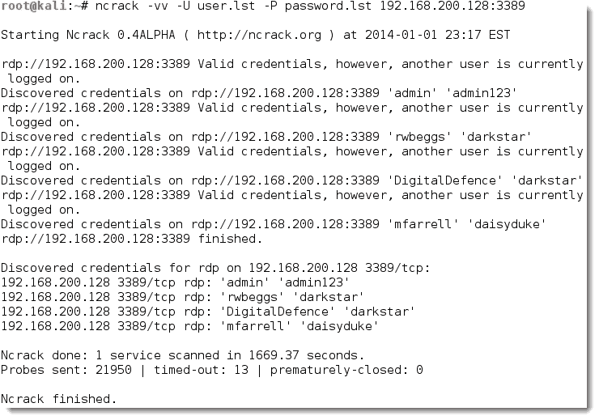
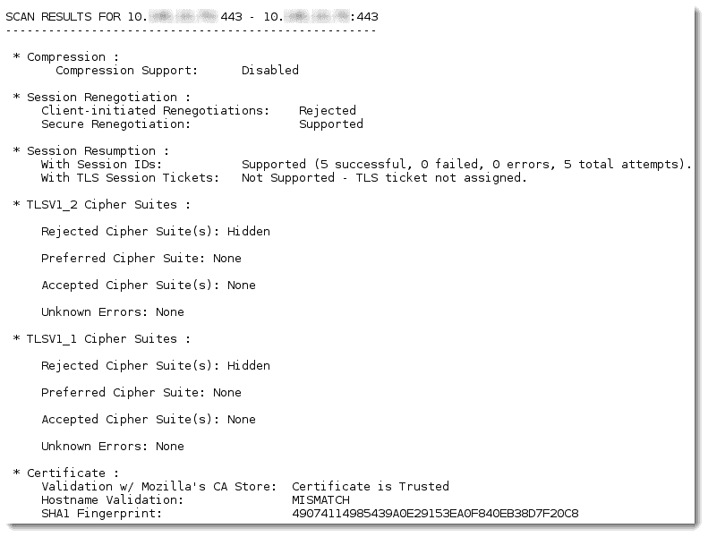

# 第 10 章：利用远程访问通信

在[第 9 章](09.html "Chapter 9. Reconnaissance and Exploitation of Web-based Applications")*对基于 Web 的应用程序的侦察和开发*中，我们对基于 Web 的应用程序应用了 kill-chain 方法。我们回顾了网站和其他应用程序特有的侦察、漏洞扫描和利用方法。我们还回顾了评估基于 web 的应用程序所需的独特工具，特别是客户端代理和开发后工具，如 web Shell。

在本章中，我们将重点介绍如何对通过互联网传播的设备和应用程序进行远程访问通信。

攻击者利用这些远程访问通信的普遍性来实现以下目标：

*   利用预先存在的通信通道直接远程访问目标系统
*   截获通讯
*   拒绝经过身份验证的用户访问常规通信，并强制他们使用可能容易受到其他攻击的不安全通道

由于大多数用户认为他们使用的是“安全”的通信工具（甚至银行也依赖 SSL 协议来保护网上银行），这些攻击会对受损的通信以及受害者对其他在线通信的信任产生重大影响。

本章将重点介绍与远程访问通信相关的杀伤链的侦察和利用阶段。它不会涵盖战争拨号、IP 语音和相关电话问题、高度专有的系统（如专用信息亭）以及值得自己编写的复杂应用程序等主题。

在本章结束时，您将学习以下内容：

*   利用操作系统通信协议（RDP 和 SSH）
*   利用远程访问应用程序（VNC）
*   为安全套接字层扫描配置 Kali
*   侦察和利用安全套接字层，包括中间人攻击和拒绝服务攻击
*   攻击虚拟专用网络

# 开发操作系统通信协议

某些协议以明文形式传输访问凭证（Telnet 和 FTP）。使用诸如 Wireshark 之类的数据包嗅探器将允许攻击者拦截并重用凭据。

然而，大多数远程访问协议，特别是嵌入操作系统中的协议，现在都受到访问控制和加密的保护。尽管这增加了一定程度的安全性，但它们仍然会受到由于错误配置或使用糟糕的加密密钥而可能发生的攻击。在本节中，我们将研究其他可能被利用来危害所谓安全通信通道的风险。

## 破坏远程桌面协议

**远程桌面协议**（**RDP**是专有的 Microsoft 通信协议，允许客户端使用图形界面与另一台计算机连接。尽管协议是加密的，但如果攻击者猜测用户名和密码，就可以访问服务器。

### 注

应该注意的是，RDP 最常见的折衷方案是使用社会工程。远程服务技术人员会联系用户，让用户确信他们需要远程访问来修复用户系统上的某些问题。针对 RDP 协议的恶意软件攻击也越来越普遍。

从测试人员（或攻击者）的角度来看，破坏目标的 RDP 服务的第一步是定位 RDP 服务器并描述正在使用的加密的强度。该侦察通常使用`nmap`等工具进行，该工具配置为扫描标准 RDP 端口 3389。

`nmap`工具现在包括专门的脚本，提供关于 RDP 的更多细节，包括加密的配置。如果时间允许，如果不存在隐身问题，则应在初始扫描阶段使用。调用枚举支持的加密协议的脚本的命令行如下所示：

```
root@kali:~# nmap – p 3389 –-script rdp-enum-encryption <IP>

```

上一个命令的执行如以下屏幕截图所示：


已经发现一些 RDP 漏洞（特别是 MS12-020），可以使用特制的数据包远程利用这些漏洞。

要确定当前版本的 RDP 是否易受攻击，请通过调用以下命令行使用适当的`nmap`脚本：

```
root@kali:~# nmap –sV -p 3389 --script rdp-vuln-ms12-020 
  < IP> 

```

上一个命令的执行如以下屏幕截图所示：


一旦使用`nmap`识别出有漏洞的系统，就可以使用 Metasploit 框架的`auxiliary/dos/windows/rdp/ms12_020_maxchannelids`模块对其进行攻击，从而导致拒绝服务。

破坏 RDP 的最常见方法是使用基于最常见用户名和密码字典的暴力攻击（也可以使用诸如**CeWL**和**crunch**等工具将特定于目标的字典构造为特定于目标的字典）；使用这些字典的暴力尝试比使用通用字典的尝试更快，而且更隐蔽，因为它们生成的网络流量更少）。

Kali 提供了多种暴力访问工具，包括**hydra**、**medusa**、**ncrack**、**patator**。通过测试，我们发现`ncrack`在速度和有效性方面是最可靠的。

### 提示

常见用户名和密码列表可从多个来源获得。大多数破解工具，尤其是`hydra`**、**`ncrack`和`john`（裂土器约翰）在应用程序的主目录中包含列表。测试人员还可以从在线资源下载各种类型的列表。从受损用户帐户派生的列表特别有用，因为它们反映了身份验证信息的实际使用情况。无论您使用什么列表，您都可能希望通过添加当前和前任员工的姓名（用户名）或使用 CeWL 等工具创建的单词列表对其进行个性化测试，CeWL 会对目标网站进行爬网，以创建定义长度的单词。

`ncrack`工具是一种高速身份验证破解工具，支持 FTP、HTTP、POP3、RDP、SMB、SSH、Telnet 和 VNC 协议。使用以下命令从终端窗口调用：

```
root@kali:~# ncrack -vv -U user.lst -P password.list
  <Taget IP>:<Target Port> 

```

上一个命令的执行如以下屏幕截图所示：



`ncrack`工具在大约 1700 秒内发现了所有用户的访问凭证。然而，所需的时间将取决于所用词典的总体大小，以及在我们获得成功之前必须进行多少猜测。

## 危及安全壳

**secure shell**（**SSH**协议）是一种网络协议，用于在服务器和客户端之间通过开放网络建立加密通道。通常，公钥-私钥对允许用户登录到系统而无需密码。公钥存在于所有需要安全连接的系统上，而用户对私钥保密。认证基于私钥；SSH 根据公钥验证私钥。在目标系统上，根据允许远程访问系统的授权密钥列表验证公钥。当公钥加密性不强且可以猜测时，这种假定安全的通信通道将失败。

与 RDP 一样，SSH 也容易受到猜测用户访问凭据的暴力攻击。对于这个特定的示例，我们将使用一个名为`hydra`的工具。`hydra`工具可能是最古老的暴力工具，也是功能最丰富的工具。它还支持针对最多目标协议的攻击。

导航到**Kali Linux****密码攻击****在线攻击**可以找到`hydra`工具，也可以直接从命令行调用。`hydra`有两个版本：命令行版本（`hydra`和 GUI 版本（hydra gtk）。对于本例，我们将使用以下命令从命令行调用`hydra`：

```
root@kali:~# hydra -s 22 -v -V -L <file path/name>
  -P <file path/name> -t 8 <Target IP><protocol> 

```

以下列表中描述了命令参数：

*   `-s`指定要使用的端口。虽然在打算使用默认端口时不需要输入它，但在这种情况下，它用于消除歧义，因为它加快了测试速度。
*   `-v`和`-V`选择报告的最大详细程度。
*   `-L`选择登录名或用户名文件。
*   `-P`选择密码文件。
*   `-t`选择并行任务或连接的数量。数字越大，测试的速度就越快。但是，如果数字太高，可能会引入错误，并且会丢失正确的密码。

以下屏幕截图显示了初始暴力攻击的详细输出：


当使用字典成功登录时，`hydra`报告端口、协议、主机和登录凭据。然后，它继续使用字典来识别其他可能的帐户。在下面屏幕截图的最上面一行中，Hydra 已正确识别了一个 SSH 帐户，其中`DigitalDefence`为`login`，而`darkstar`为`password`；屏幕截图还显示了 Hydra 在试图识别其他帐户时所做的其他尝试。


如果您知道密码配置，也可以使用`hydra`动态自动创建密码列表，使用以下命令：

```
root@kali:~# hydra –L user.lst –V –x 6:8:aA1 <IP address> SSH

```

下表介绍了上一个命令中使用的参数：

*   `-x`指示 Hydra 自动创建暴力攻击中使用的密码。密码将根据`-x`后面的参数创建。
*   `6:8`表示最小密码长度为 6 个字符，最大密码长度为 8 个字符。
*   `aA1`将使用字母和数字的组合自动创建密码。它将使用所有小写字母（由`a`表示）和所有大写字母（由`A`表示），以及数字 0 到 9（由`1`表示）。

您也可以向生成的列表中添加特殊字符，但是需要在`–x`选项周围添加单引号，如下命令所示：

```
root@kali:~# -L user.lst –V –x '6:8:aA1 !@#$' <IP address> SSH

```

# 开发第三方远程访问应用

绕过系统协议提供远程访问的应用程序一度相当流行。尽管它们目前正被在线服务所取代，如**GoToMyPC****或 LogMeIn**，但它们仍然相当普遍。此类程序的示例包括 pcAnywhere 和 VNC。

应该注意的是，由于系统管理员的合法行为，网络上可能存在这些工具的实例。但是，它们也可能存在，因为网络已被破坏，攻击者需要远程访问网络的方法。

在下面的示例中，我们将使用 Metasploit 框架的内置功能来折衷 VNC。

1.  Locate the remote access software on the target using `nmap`. As shown in the following screenshot, VNC is usually found on TCP port `5900`.

    

2.  Activate the Metasploit Framework using the `msfconsole` command from a terminal window. From the `msf` prompt, configure it to compromise VNC, as shown in the following screenshot:

    

3.  Initiate the `run` command, as shown in the following screenshot, and watch for a successful run:

    

4.  Finally, once Metasploit has determined the credentials, validate them by logging in to the VNC client using `vncviewer`. From the command prompt in a terminal window, enter the following:

    ```
    root@kali:~# vncviewer <Target IP>

    ```

    这将连接到远程主机并提示您输入适当的凭据。身份验证成功后，将打开一个新窗口，允许您远程访问目标系统。通过发出`whoami`查询确认您在目标系统上，如下图所示，并请求系统的 ID 或 IP 地址：

    

# 攻击安全套接字层

**安全套接字层****SSL**及其后续层**传输层安全****TLS**、是用于在互联网上提供安全通信的加密协议。这些协议已广泛应用于安全应用，如 Internet 消息和电子邮件、web 浏览和 IP 语音。

这些协议在互联网上无处不在，然而，它们起源于 20 世纪 90 年代中期，随着年龄的增长，越来越多地受到攻击。SSL 版本 2.0（版本 1.0 从未公开发布）包含大量可利用的缺陷，例如密钥控制差和中间人攻击的弱点。尽管大多数用户已经实现了该协议的 3.0 版或更新版本的 TLS，但配置错误的系统仍可能允许使用早期的不安全版本。

## 为 SSLv2 扫描配置 Kali

在开始侦察阶段之前，验证 Kali 已配置为扫描 SSL 版本 2 协议。在写这本书的时候，情况并非如此。

在终端窗口中，输入以下命令：

```
root@kali:~# openssl_s_client -connect 
  www.opensecurityresearch.com:443 -ssl2 

```

如果返回`unknown option -ssl2`错误（如下屏幕截图所示），则需要额外配置。


要应用修复程序，必须使用以下步骤重新修补 OpenSSL 应用程序（确保使用的路径反映使用的下载目录）：

1.  使用以下命令安装**Cutter**，这是一个程序，用于管理应用程序源代码的多个补丁：

    ```
    root@kali:~# apt-get install devscripts quilt

    ```

2.  下载`openssl`源代码，验证已应用的补丁程序，更新配置文件，然后重建应用程序。使用以下命令：

    ```
    root@kali:~# apt-get source openssl
    root@kali:~# cd openssl-1.0.1e
    root@kali:~/openssl-1.0.1e# quilt pop -a

    ```

3.  编辑该/`openssl-1.0.1e/debian/patches/series`文件，并从该文件中删除以下行：

    ```
    ssltest_no_sslv2.patch

    ```

4.  编辑/`openssl-1.0.1e/debian/rules`文件，删除`no-ssl2`参数。然后，在`openssl`上重新应用补丁。使用以下命令：

    ```
    root@kali:~/openssl-1.0.1e# quilt push -a
    root@kali:~/openssl-1.0.1e#  dch -n 'Allow SSLv2'

    ```

5.  完成后，重建`openssl`包，然后重新安装。此步骤可通过以下命令执行：

    ```
    root@kali:~/openssl-1.0.1e# dpkg-source  --commit
    root@kali:~/openssl-1.0.1e# debuild -uc -us
    root@kali:~/openssl-1.0.1e# cd /root
    root@kali:~# dpkg -i *ssl*.deb

    ```

6.  Confirm that patches have been successfully applied by reissuing the command to connect using SSLv2, as shown in the following screenshot:

    

依赖于`openssl`，特别是`sslscan`的 Kali 脚本需要重新编译。要重新编译，首先下载源代码，然后重新编译。完成后，使用以下命令重新安装：

```
root@kali:~# apt-get source sslscan
root@kali:~# cd sslscan-1.8.2
root@kali:~/sslscan-1.8.2# debuild -uc -us
root@kali:~/sslscan-1.8.2# cd /root
rootl@kali:~# dpkg -i *sslscan*.deb

```

Kali 在 SSLv2 方面的问题可能会在将来的版本中得到修复，因此，请在测试 SSL 连接之前对此进行验证。

## SSL 连接侦察

在评估 SSL 连接时，杀伤链的侦察阶段仍然很重要，尤其是在审查以下项目时：

*   **x.509**证书用于识别参与建立安全 SSL 连接的各方
*   正在使用的加密类型
*   配置信息，例如是否允许自动重新协商 SSL 会话

SSL 证书可以提供可用于促进社会工程的信息。

更常见的情况是，测试人员或攻击者想要确定证书是否有效。无效的证书可能是由于检查签名时出错、证书链断开、证书中指定的域与系统不匹配、证书已过期、已吊销或已知已被泄露而导致的。

如果用户以前接受过无效证书，那么他们很可能会接受新的无效证书，从而使攻击者的工作变得更加容易。

用于保护 SSL 连接的加密类型尤其重要。加密密码分为以下几类：

*   **空密码**：这些密码用于验证传输的真实性和/或完整性。因为没有应用加密，所以它们不提供任何安全性。
*   **弱密码**：该是一个术语，用于描述所有密钥长度不超过 128 位的密码。使用**Diffie-Hellman 算法**进行密钥交换的密码也可能被视为弱密码，因为它们容易受到中间人攻击。由于碰撞攻击，MD5 哈希的使用可能被认为是很弱的。最后，最近针对 RC4 的攻击也对其继续使用提出了质疑。
*   **强密码**：这些是超过 128 位的密码。目前，公认的、最安全的选项是使用 256 位密钥的 AES 加密。如果可能，这应该与 Galois/Counter 模式一起使用，Galois/Counter 模式是一种支持身份验证和加密的现代分组密码。

SSL 和 TLS 依赖密码套件（身份验证、加密和消息身份验证代码算法的特定组合）为每个连接建立安全设置。有 30 多个这样的套件，并且为每个安全需求选择最佳选项的复杂性经常导致用户默认选择不太安全的选项。因此，必须彻底测试每个 SSL 和 TLC 连接。

要对 SSL 连接进行侦察，请使用`nmap`的 NSE 模块或特定于 SSL 的应用程序。`nmap`NSE 模块如下表所示。

<colgroup><col style="text-align: left"> <col style="text-align: left"></colgroup> 
| 

Nmap NSE 模块

 | 

模函数

 |
| --- | --- |
| `ssl-cert` | 检索服务器的 SSL 证书。返回的信息量取决于详细程度（无、`-v`和`-vv`）。 |
| `ssl-date` | 从目标主机的 TLS ServerHello 响应中检索目标主机的日期和时间。 |
| `ssl-enum-ciphers` | 反复启动 SSL 和 TLS 连接，每次尝试新密码并记录主机是否接受或拒绝密码。密码以强度速率显示。这是一种高度侵入性扫描，可能会被目标阻止。 |
| `ssl-google-cert-catalog` | 查询谷歌的证书目录，以获取与从目标检索到的 SSL 证书相关的信息。它提供了谷歌知道该证书的时间和最近的信息。如果一个证书没有被谷歌识别，它可能是可疑的/虚假的。 |
| `ssl-known-key` | 检查主机使用的 SSL 证书是否具有与受损或错误密钥数据库匹配的指纹。目前，它使用 LittleBlackBox 数据库。但是，可以使用任何指纹数据库。 |
| `sslv2` | 确定服务器是否支持过时且不太安全的 SSL 版本 2，以及支持哪些密码。 |

要从命令行调用单个脚本，请使用以下命令：

```
root@kali:~# nmap --script <script name> -p 443 <Target IP>

```

在下面的示例中，`ssl-cert`脚本通过`-vv`选项调用，以获得最大的详细性。此脚本中的数据显示在以下屏幕截图中：


在侦察期间，测试人员可以选择使用以下命令启动所有 SLL 特定模块：

```
root@kali:~# nmap --script "ssl*" <IP address>

```

Kali 针对 SSL 和 TLS 的侦察和攻击工具可以从命令行调用，也可以通过导航到**Kali Linux****信息收集****SSL 分析**从菜单中选择。下表总结了这些工具：

<colgroup><col style="text-align: left"> <col style="text-align: left"></colgroup> 
| 

工具

 | 

作用

 |
| --- | --- |
| `sslcaudit` | 自动测试 SSL 和 TLS 客户端，以确定对中间人攻击的抵抗能力。 |
| `ssldump` | 对 SSLv3 和 TLS 通信进行网络协议分析。如果提供了适当的加密密钥，它将解密 SSL 通信并以明文形式显示。 |
| `sslscan` | 查询 SSL 服务以确定支持哪些密码。输出包括首选 SSL 密码，并以文本和 XML 格式显示。 |
| `sslsniff` | 在特定 LAN 上的所有 SSL 连接上启用中间人攻击条件，为正在动态访问的域动态生成证书。 |
| `sslsplit` | 对 SSL 和 TLS 网络执行中间人攻击。通过网络地址转换引擎透明地拦截连接并重定向到`sslsplit`，该引擎终止原始连接并启动到原始目的地的新连接，同时记录所有传输的数据。它支持纯 TCP、SSL、HTTP/HTTPs 以及 IPv4 和 IPv6。 |
| `sslstrip` | 设计以透明方式劫持网络上的 HTTP 流量，监视 HTTPS 链接，并重定向这些链接，然后将其映射到伪造的 HTTP 或 HTTPS 链接。它还支持提供类似锁图标的 favicon 的模式，以及选择性地记录截获的通信。 |
| `sslyze` | 分析服务器的 SSL 配置。 |
| `tlssled` | 统一其他几个特定于 SSL 的应用程序的使用和输出，检查加密强度、证书参数和重新协商功能。 |

最常用的程序是`sslscan`，它查询 SSL 服务以确定证书详细信息和支持的密码。输出为文本和 XML 格式。

在测试特定连接时，使用`--no-failed`选项，如以下屏幕截图所示，让`sslscan`仅显示接受的密码套件。


`sslyze`python 工具分析服务器的 SSL 配置并验证证书，测试弱密码套件，并识别可能支持其他攻击的配置信息。在下面的屏幕截图所示的示例输出中，它发现了可能支持某些攻击类型的证书不匹配。



另一个 SSL 侦察工具是`tlssled`，如下图所示。它是非常快速，操作简单，输出是用户友好的。


无论您使用什么方法进行 SSL 侦察，请确保通过运行至少两个不同的工具来交叉验证您的结果。此外，并非所有 SSL 配置的设备都将同时联机。因此，在大型网络上，请确保在测试过程中多次扫描 SSL 漏洞。

### 提示

目前正在开发中的一个新工具是 OWASP 的 O-Saft（[www.OWASP.org/index.php/O-Saft](http://www.owasp.org/index.php/O-Saft)，它提供了 SSL 配置、密码和证书数据的全面概述。

## 使用 sslstrip 进行中间人攻击

尽管 SSL 保护提供了安全性，但仍存在一些针对该协议的有效攻击。2009 年，Moxie Marlinspike 演示了`sslstrip`，一种透明地劫持网络上 HTTP 流量并将流量重定向为 HTTP 或 HTTPS 链接的工具。它会移除 SSL 保护，并将*安全*锁图标返回到受害者的浏览器，以便无法轻易检测到拦截。

简言之，`sslstrip`针对 SSL 发起了中间人攻击，允许拦截先前安全的数据。

要使用`sslstrip`，您必须首先使用以下命令将拦截系统配置为转发模式：

```
root@kali:~# echo "1" > /proc/sys/net/ipv4/ip_forward

```

接下来，使用以下命令设置`iptables`防火墙，将 HTTP 流量重定向到`sslstrip`：

```
root@kali:~# iptables –t nat –A PREROUTING –p tcp
  –destination-port 80 –j REDIRECT –to-port <listenport> 

```

在此示例中，侦听端口已设置为端口 5353。

配置完成后，使用以下命令运行`sslstrip`：

```
root@kali:~# sslstrip –l 5353

```

以下屏幕截图显示了先前命令的执行情况：


最小化正在执行`sslstrip`的活动终端窗口，并打开一个新的终端窗口。使用`ettercap`欺骗 ARP，并使用以下命令将来自网络或目标系统的流量直接重定向到拦截系统：

```
root@kali:~# ettercap –TqM arp:remote /192.168.75.128/ /192.168.75.2/

```

这里，`ettercap -T`开关选择纯文本界面，`-q`强制控制台进入安静模式，`–M`选项激活中间人攻击，劫持并重定向数据包。`arp:remote`开关实施 ARP 中毒攻击，使攻击者处于中间位置，能够查看和修改传输中的数据包。如果您想查看通过网关的远程 IP 地址和通信，则需要交换机的`remote`部分。

上一个命令的执行如以下屏幕截图所示：


如果目标系统访问 SSL 安全内容，则其查询将通过网关定向到拦截系统。

从用户的角度来看，他们将被引导到站点，并收到**站点的安全证书**安全警报有问题，提示他们决定继续。如果他们选择**是**，他们将被引导到所选页面。浏览器右下角的锁定图标仍将指示 SSL 已启用，表示其通信安全。

在后台，`sslstrip`工具删除 SSL，留下可以在`ettercap`日志中查看的原始内容，如以下屏幕截图所示：


此攻击仅对同一第二层网段有效。然而，它在有线和无线网络上都是成功的。尽管 ARP 重定向可以应用于网段，但此类攻击将影响网络带宽，这可能会被检测到。因此，将此攻击指向单个设备是最有效的。

### 提示

要禁用预路由规则，请将`–A`替换为`–D`。要清除防火墙规则，请使用`iptables –t nat –F`（刷新命令）和`iptables –t nat –L`（验证已清除表）。

## 针对 SSL 的拒绝服务攻击

建立 SSL 连接后，服务器必须完成一系列计算密集型计算，以启动握手并启动加密。这涉及到客户端的少量计算工作和服务器的大量计算工作。

如果客户端启动 SSL 连接但拒绝服务器的响应，则不会建立 SSL 连接。但是，如果将 SSL 服务器配置为自动重新协商连接，则计算工作负载将导致拒绝服务。

Kali Linux 有几个工具可以让您确定是否允许自动重新协商，包括`sslyze`和`tssled`。

如果允许自动重新协商，则输入以下命令将允许测试人员评估对 DoS 攻击的恢复能力：

```
root@kali:~# thc-ssl- dos <IP address> <port>

```

上一个命令的执行如以下屏幕截图所示：


# 攻击 IPSec 虚拟专用网络

**虚拟专用网络**（**VPN**）使用互联网在同一网络内的远程位置或用户之间提供安全（加密）通信。有两种类型的 VPN：**IPSec**和**SSL**。

IPSec 是最常用的协议，用于在网络之间建立安全连接，并连接虚拟专用网络中的主机。

在 IPSec 中，有几个执行特定功能的辅助协议，例如：

*   **认证头**（**AH**）：此为 IP 数据包提供来源证明，防止重放攻击。
*   **封装安全协议****ESP**：该协议提供传输数据的来源真实性、完整性和保密性。
*   **安全关联**：此是用于加密和验证传输数据的一组算法。由于 SA 与一个方向上的数据传输相关联，因此双向通信由一对安全关联进行保护。使用**互联网安全关联和密钥管理协议**（**ISAKMP**）、建立安全关联，可以通过多种方式实现。在测试 VPN 的安全性时，最易受攻击的配置之一依赖于预先共享的秘密，**互联网密钥交换**（**IKE**）。

为了评估 VPN 的安全性，测试人员遵循以下基本步骤：

1.  扫描是否存在 VPN 网关。
2.  对 VPN 网关进行指纹识别，以确定供应商和配置详细信息。
3.  查找与 VPN 供应商或相关产品相关的漏洞。
4.  捕获预共享密钥。
5.  执行离线 PSK 破解。
6.  检查默认用户帐户。

## VPN 网关扫描

要扫描是否存在 VPN 网关，请使用`nmap`或`ike-scan`。要使用`nmap`，请发出以下命令：

```
root@kali@:~# nmap -–sU -Pn –p 500 <IP Address>

```

在此示例中，`-sU`指示`nmap`使用 UDP 数据包（而不是 TCP）扫描主机范围内的可能目标，`-Pn`确保`nmap`不会发送 ping 扫描（这可以提醒目标扫描并识别测试仪），并且`–p 500`识别要扫描的特定端口。

`nmap`工具由于处理 IKE 数据包的方式，无法定位所有 VPN 网关；最有效的工具是向目标系统发送格式正确的 IKE 数据包并显示返回消息的工具。

定位 VPN 网关的最佳工具是`ike-scan`（导航至**卡利 Linux****信息采集****VPN 分析**即可找到）。`ike-scan`命令行工具使用 IKE 协议来发现和识别私有网络。它还支持 IKE 攻击模式下的预共享密钥破解。要使用`ike-scan`定位目标，请发出以下命令：

```
root@kali@:~# ike-scan -M <Target IP>

```

上一个命令的执行如以下屏幕截图所示：


`-M`开关返回一行中的每个有效负载，简化输出。

`ike-scan`工具针对目标设备测试各种转换。转换包含个属性：加密算法（DES 和 3DES）、哈希算法（MD5 和 SHA1）、身份验证方法（预共享密钥）、Diffie-Hellman 组（选项一为 768 位，选项二为 1024 位）和生存期（28800 秒）。它将确定哪些转换引发了成功的响应。

完成每个已识别设备的`ike-scan`后，程序将返回以下之一：

*   `0 returned handshake; 0 returned notify`：表示目标不是 IPSec 网关
*   `0 returned handshake; 1 returned notify`：这表示虽然存在 VPN 网关，但`ike-scan`提供给它的任何转换都是不可接受的
*   `1 returned handshake; 0 returned notify`：如前一屏幕截图所示，这表示目标配置了 IPSec，并将针对提供给它的一个或多个转换执行 IKE 协商

## 对 VPN 网关进行指纹识别

如果您能与 VPN 网关建立握手，可以对设备进行指纹识别，返回以下信息：

*   供应商和模型
*   软件版本

此信息用于识别特定于供应商的攻击或微调一般攻击。

### 注

如果 VPN 由防火墙托管，指纹识别也将识别正在使用的防火墙。

由于 IKE 不能保证传输数据包的可靠性，大多数 VPN 网关供应商使用专有协议来处理看似丢失的流量。`ike-scan`工具向 VPN 网关发送 IKE 探测数据包，但不回复收到的响应。服务器的响应就像数据包丢失一样，并实施其退避策略来重新发送数据包。通过分析数据包之间的时差和重试次数，`ike-scan`可以识别供应商。

在以下屏幕截图所示的示例中，`–M`选项使每个有效负载显示在单独的行上，从而使输出更易于读取。`ike-scan`的`-showbackoff`选项（如下截图所示）记录所有发送和接收的数据包的响应时间，然后记录 60 秒的延迟，然后显示结果。


在前面的屏幕截图中，**供应商 ID**（**VID**是特定于供应商的 MD5 哈希文本字符串，用于识别专有通信或特定通信细节。

`ike-scan`工具也可用于确定网关是否支持攻击模式。如果是这样，则很难与服务器建立握手，因为只有在提供有效 ID 作为标识有效负载的一部分之前，服务器才会响应。

## 捕获预共享密钥

`ike-scan`工具可将 VPN 网关推至攻击模式。这一点很重要，因为 IPSec 的攻击模式不保护预共享密钥。身份验证凭据以明文形式发送，可以使用脱机工具捕获并破解明文。

针对 Cisco VPN 集中器发出的以下示例使用以下命令：

```
root@kali@:~# ike-scan --pskcrack --aggressive
--id=peer <target>

```

上一个命令的执行如以下屏幕截图所示：


如果希望将结果通过管道传输到文本文件以进行其他分析和脱机密码破解，请使用以下命令：

```
root@kali@:~# ike-scan --pskcrack --aggressive
  --id=peer <target> > <path/psk.txt> 

```

## 进行离线 PSK 破解

在使用离线工具破解预共享密钥的捕获哈希之前，请编辑输出文件，使其仅包含哈希值（它应包含九个冒号分隔的值）。破解密钥最有效的工具是`psk-crack`，它支持字典、蛮力和混合模式破解。


与所有离线破解练习一样，成功是对所涉及工作和努力（时间、计算努力和电力系统能源投资）的衡量。一个强大的预共享密钥（如前一个屏幕截图所示）需要很长时间才能破解。

## 识别默认用户账户

与大多数其他硬件设备一样，VPN 网关通常在安装时包含默认用户帐户。管理员不能更改这些设置。使用指纹识别过程中收集的信息，测试人员可以进行网络搜索以识别标准用户帐户。

如果测试仪可以访问用户的计算机，则用户名凭据通常以明文形式存储在系统注册表中。此外，如果测试人员可以访问系统内存，则可以直接从客户端系统的内存转储获取密码。

### 提示

**VulnVPN**（[www.rebootuser.com](http://www.rebootuser.com)是一个虚拟操作系统和易受攻击的 VPN 服务器。它允许您应用本章中描述的工具来破坏应用程序并获得 root 访问权限，而不会损坏生产系统。

# 总结

在本章中，我们研究了如何利用常见的远程访问应用程序，包括已加密以提供额外安全性的应用程序。我们利用了操作系统通信协议（RDP 和 SSH）和 VNC 等应用程序。我们还学习了如何对安全套接字层连接和虚拟专用网络以及降低加密效率的攻击类型进行侦察。

在下一章中，我们将看到针对特定通信通道的联合攻击与针对人类的攻击的结果。在检查这些客户端攻击的有效性时，我们将回顾几种类型的攻击以及**浏览器攻击框架**（**牛肉**项目。