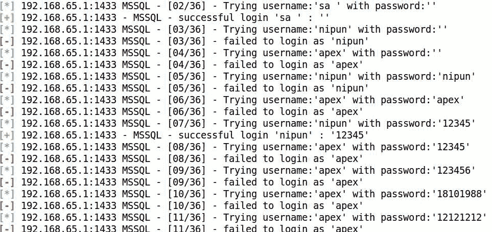
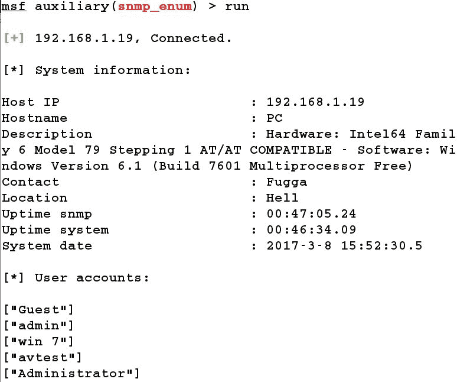
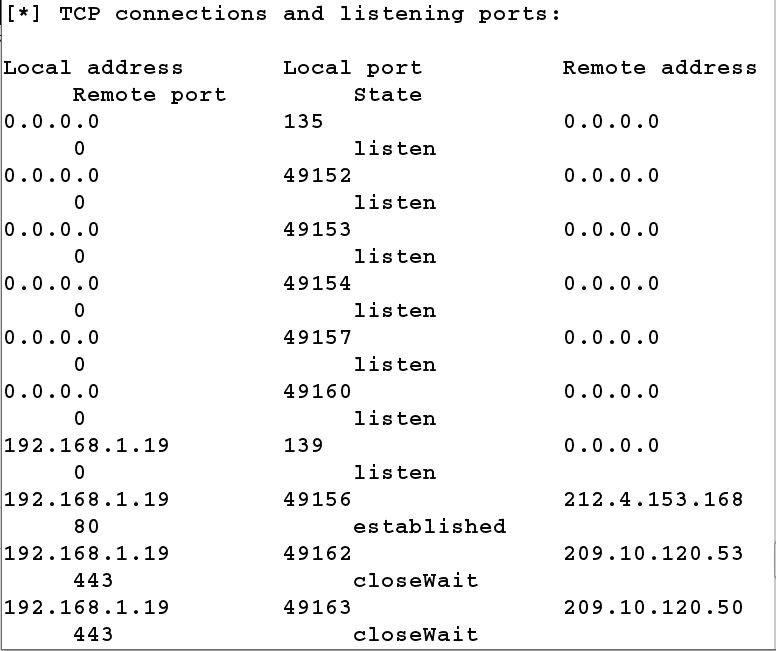
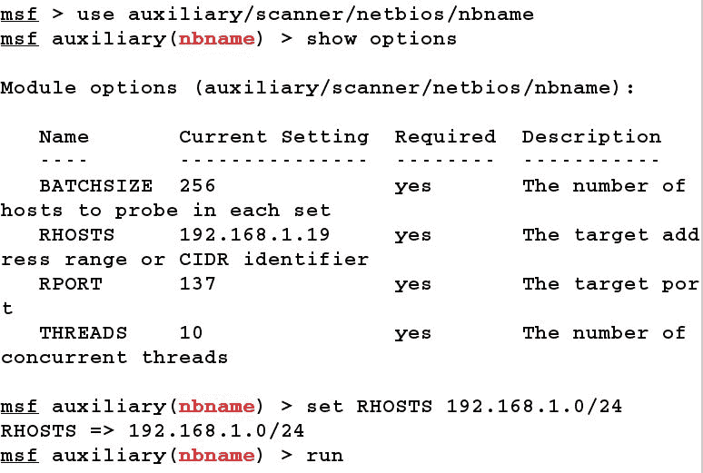
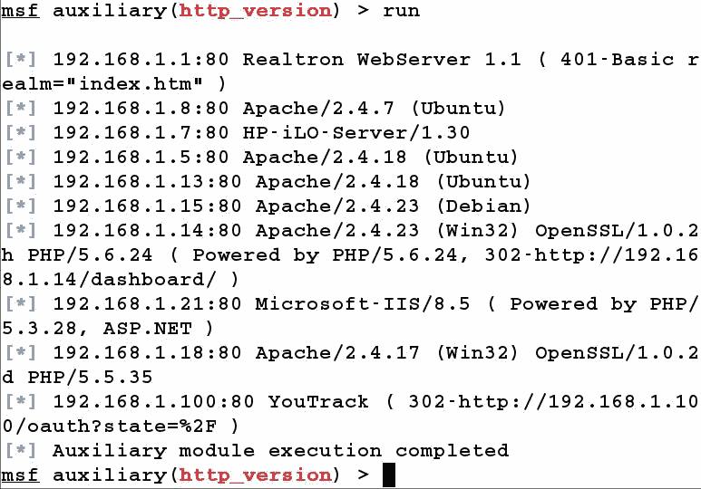
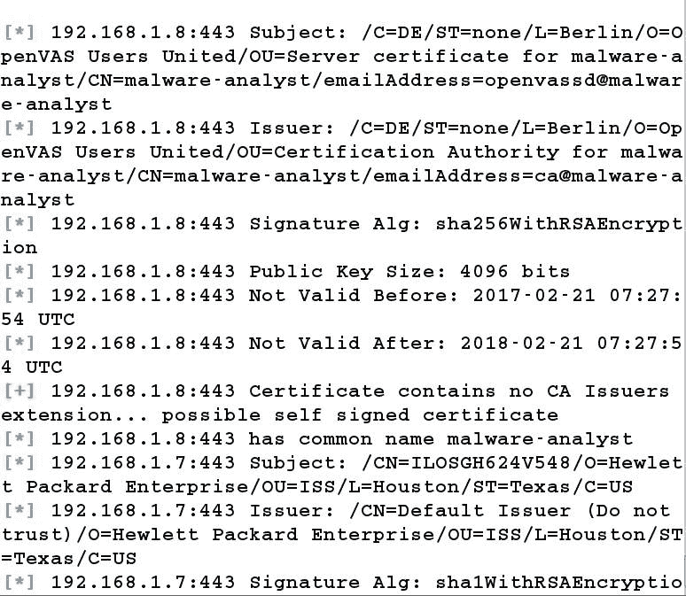
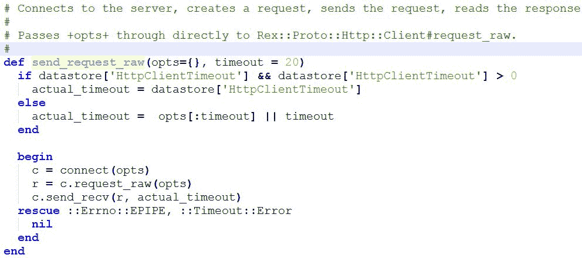

# 识别和扫描目标

我们在[第 1 章](1.html#J2B80-a731d733dba14ccabae643b74e2c8790)*学习了 Metasploit*的基础知识。现在让我们将重点转移到每个渗透测试的一个基本方面，即扫描阶段。渗透测试最关键的方面之一是扫描阶段，扫描阶段涉及识别目标上运行的各种软件和服务，因此，它是专业渗透测试中最耗时、最关键的方面。他们说，我引用，“*如果你了解敌人，了解你自己，你就不必担心一百场战斗的结果*。如果您想通过利用易受攻击的软件获得对目标的访问权，那么您要采取的第一步是确定目标上是否正在运行特定版本的软件。扫描和识别应彻底进行，以免最终对错误版本的软件执行 DOS 攻击。

在本章中，我们将尝试揭示 Metasploit 的扫描方面，并尝试获得各种扫描模块的实际知识。我们将介绍扫描的以下关键方面：

*   使用 FTP、MSSQL 等服务的扫描模块
*   扫描 SNMP 服务并利用它们
*   使用 Metasploit 辅助工具查找 SSL 和 HTTP 信息
*   开发用于扫描的定制模块所需的要素
*   利用现有模块创建自定义扫描仪

让我们针对目标网络运行一个基本的 FTP 扫描模块，并详细分析其功能。

# 使用 Metasploit 处理 FTP 服务器

我们将用于本演示的模块是辅助部分扫描仪的`ftp_version.rb`。

# 扫描 FTP 服务

让我们使用`use`命令选择模块，并检查模块需要哪些不同的选项才能工作：


我们可以看到，我们有许多模块可以使用。但是，现在让我们使用`ftp_version`模块，如下面的屏幕截图所示：


为了扫描整个网络，让我们设置`RHOSTS to 192.168.10.0/24`（0-255），并增加线程数，以实现快速操作：


让我们运行模块并分析输出：


我们可以看到，我们扫描了整个网络，发现两台主机运行 FTP 服务，它们是 TP-LINK FTP 服务器和 FTP 实用程序 FTP 服务器。因此，现在我们已经知道目标上正在运行哪些服务，如果这些 FTP 服务的版本易受攻击，我们将很容易找到任何匹配的漏洞。

我们还可以看到，一些行显示了扫描的进度，并生成了混乱的输出。我们可以通过将`ShowProgress`选项的值设置为 false 来关闭“显示进度”功能，如以下屏幕截图所示：


显然，我们有一个更好的输出，如前面的屏幕截图所示。但是，等等！我们从来没有`ShowProgress`在选项中，对吗？那么它神奇地来自哪里呢？如果你能在这一点上停下来，自己去想办法，那就太好了。如果您知道可以通过在 Metasploit 中传递 show advanced 来调用 advanced option 命令，那么我们可以继续。

在渗透测试期间，您可能需要测试的详细信息，并需要详细的输出。Metasploit 确实提供了详细特性，可以通过在 Metasploit 控制台中传递 set verbose true 来设置该特性。详细输出将生成与以下屏幕截图中的输出类似的数据：


模块现在正在打印连接状态等详细信息。

# 修改扫描仪模块以获得乐趣和利润

在大型测试环境中，分析数百种不同的服务并找到易受攻击的服务会有点困难。我在自定义扫描模块中保留了易受攻击服务的列表，以便在遇到特定服务时，如果它与特定横幅匹配，就会将其标记为易受攻击。识别易受攻击的服务是一种很好的做法。例如，如果您有一个由 10000 个系统组成的庞大网络，那么很难运行默认的 Metasploit 模块并期望得到格式良好的输出。在这种情况下，我们可以相应地定制模块并针对目标运行它。Metasploit 是一个非常好的工具，它提供了内联编辑。因此，您可以使用`edit`命令动态修改模块。但是，您必须已选择要编辑的模块。我们可以在下面的截图中看到，Metasploit 已经在 VI 编辑器中打开了`ftp_version`模块，该模块的逻辑也显示出来：


代码非常简单。如果设置了`banner`变量，则会在屏幕上打印状态消息，包括`rhost`、`rport`和`banner`本身等详细信息。假设我们希望向模块添加另一项功能，即检查横幅是否与通常易受攻击的 FTP 服务的特定横幅匹配，我们可以添加以下代码行：


我们在前面的模块中所做的只是添加了另一个 if-else 块，它将横幅与正则表达式`/FTP\sUtility\sFTP\sserver/`匹配。如果标题与正则表达式匹配，则表示成功匹配了易受攻击的服务，否则将打印 Not vulnerable。很简单吧？

但是，在提交更改并写入模块后，需要使用`reload`命令重新加载模块。现在让我们运行模块并分析输出：


是 啊我们做得很成功。由于 TP-LINK FTP 服务器的标题与我们的正则表达式不匹配，因此控制台上会打印 not Vulnerable，而其他服务的标题与我们的正则表达式匹配，因此会将 Vulnerable 消息打印到控制台。

有关编辑和构建新模块的更多信息，请参阅*Mastering Metasploit 第二版*的*第 2 章*。

# 使用 Metasploit 扫描 MSSQL 服务器

现在让我们跳到测试 MSSQL 服务器的特定于 Metasploit 的模块，看看使用它们可以获得什么样的信息。

# 使用 mssql_ping 模块

我们将使用的第一个辅助模块是`mssql_ping`。此模块将收集与 MSSQL 服务器相关的服务信息。

因此，让我们加载模块并按如下方式开始扫描过程：


我们可以清楚地看到，`mssql_ping`生成了指纹 MSSQL 服务的优秀输出。

# 强制 MSSQL 密码

Metasploit 还提供暴力模块。成功的暴力确实利用了低熵漏洞；如果在合理的时间内产生结果，则视为有效的发现。因此，我们将在渗透测试本身的这一阶段介绍暴力强迫。Metasploit 有一个名为`mssql_login`的内置模块，我们可以将其用作强制输入 MSSQL 服务器数据库的用户名和密码的身份验证测试程序。

让我们加载模块并分析结果：


我们一运行这个模块，它就在第一步测试默认凭据，即用户名 sa 和密码为空，并发现登录成功。因此，我们可以得出结论，默认凭据仍在使用。此外，如果没有立即找到 sa 帐户，我们必须尝试测试更多凭据。为了实现这一点，我们将设置用户 _ 文件并使用包含字典的文件名传递 _ 文件参数，以强制 DBMS 的用户名和密码：


让我们设置所需的参数；以下是成功运行本模块的`USER_FILE`列表、`PASS_FILE`列表和`RHOSTS`列表：


在目标数据库服务器上运行此模块，我们将获得类似于以下内容的输出：



从前面的结果可以看出，我们有两个条目对应于用户在数据库中成功登录。我们发现一个默认用户 sa 的密码为空，另一个用户 nipun 的密码为 12345。

参见[https://github.com/danielmiessler/SecLists/tree/master/Passwords](https://github.com/danielmiessler/SecLists/tree/master/Passwords) 一些优秀的字典，可以在密码暴力中使用。

有关测试数据库的更多信息，请参阅*Mastering Metasploit First/Second Edition*中的*第 5 章*。

在执行暴力时，最好将`USER_AS_PASS`和`BLANK_PASSWORDS`选项设置为`true`，因为许多管理员保留各种安装的默认凭据。

# 使用 Metasploit 扫描 SNMP 服务

让我们对不同的网络执行 TCP 端口扫描，如以下屏幕截图所示：


我们将使用`auxiliary/scanner/portscan`下列出的 tcp 扫描模块，如前一屏幕截图所示。让我们运行模块，并按如下方式分析结果：


我们可以看到，我们发现只有两项服务看起来不那么吸引人。让我们也对网络执行 UDP 扫描，并检查是否可以找到有趣的内容：


要执行 UDP 扫描，我们将使用前面屏幕截图中所示的`auxiliary/scanner/discovery/udp_sweep`模块。接下来，我们只需要通过设置`RHOSTS`选项来提供网络范围。此外，还可以增加线程数。让我们运行模块并分析结果：


太神了我们可以看到 UDP 扫描模块生成的大量结果。此外，在`192.168.1.19`上还发现了**简单网络管理协议**（**SNMP**服务。

SNMP 是一种常用的服务，提供网络管理和监视功能。SNMP 提供轮询网络设备和监视数据（如主机上各种系统的利用率和错误）的能力。SNMP 还能够更改主机上的配置，从而允许远程管理网络设备。SNMP 易受攻击，因为它通常自动安装在许多网络设备上，以`public`作为读取字符串，以`private`作为写入字符串。这意味着系统可能安装到网络上，而不知道 SNMP 正在运行并使用这些默认密钥。

SNMP 的默认安装为攻击者提供了在系统上执行侦察的手段，以及可用于创建拒绝服务的漏洞。SNMP MIB 提供诸如系统名称、位置、联系人、有时甚至电话号码等信息。让我们在目标上执行 SNMP 扫描，并分析我们遇到的有趣信息：


我们将使用`auxiliary/scanner/snmp`中的`snmp_enum`执行 SNMP 扫描。我们将`RHOSTS`的值设置为`192.168.1.19`，还可以另外提供线程数。让我们看看会弹出什么样的信息：



哇！我们可以看到，我们有大量的系统信息，如主机 IP、主机名、联系人、正常运行时间、系统描述，甚至用户帐户。找到的用户名可以方便地尝试暴力攻击，就像我们在前面的部分中所做的那样。让我们看看我们还得到了什么：



我们还有侦听端口列表（TCP 和 UDP）、连接信息、网络服务列表、进程列表，甚至是已安装应用程序列表，如以下屏幕截图所示：


因此，SNMP 扫描为我们提供了大量针对目标系统的侦察功能，这可能有助于我们执行攻击，如社会工程，并了解目标上可能运行的各种应用程序，以便我们可以准备要利用的服务列表，并特别关注这些服务。

有关 SNMP 扫描的更多信息，请访问[https://www.offensive-security.com/metasploit-unleashed/snmp-scan/](https://www.offensive-security.com/metasploit-unleashed/snmp-scan/) 。

# 使用 Metasploit 扫描 NetBIOS 服务

Netbios 服务还提供有关目标的重要信息，并帮助我们发现目标体系结构、操作系统版本和许多其他信息。要扫描网络上的 NetBIOS 服务，我们可以使用`auxiliary/scanner/netbios`中的`nbname`模块，如下图所示：



与前面一样，我们通过提供 CIDR 标识符将`RHOSTS`设置为整个网络。让我们运行模块，并按如下方式分析结果：


我们可以看到，在前面的屏幕截图中列出的网络上，几乎所有系统都在运行 NetBIOS 服务。这些信息为我们提供了有关操作系统类型、名称、域和系统相关 IP 地址的有用证据。

# 使用 Metasploit 扫描 HTTP 服务

Metasploit 允许我们对各种 HTTP 服务执行指纹识别。此外，Metasploit 包含大量针对不同类型 web 服务器的漏洞利用模块。因此，扫描 HTTP 服务不仅允许对 web 服务器进行指纹识别，而且还构建了 Metasploit 稍后可以攻击的 web 服务器漏洞库。让我们使用`http_version`模块并在网络上运行它，如下所示：


在设置了所有必要的选项后，如`RHOSTS`和`Threads`之后，让我们执行该模块，如下所示：



Metasploit 的`http_version`模块已成功对网络中的各种 web 服务器软件和应用程序进行指纹识别。我们将在[第 3 章](3.html#1ENBI0-a731d733dba14ccabae643b74e2c8790)、*开发和获取访问*中对其中一些服务进行开发。我们看到了如何对 HTTP 服务进行指纹识别，所以让我们试试看是否可以用 Metasploit 扫描它的老兄弟 HTTPS。

# 使用 Metasploit 扫描 HTTPS/SSL

Metasploit 包含 SSL 扫描模块，该模块可以发现与目标上的 SSL 服务相关的各种信息。让我们按照以下步骤快速设置并运行模块：


我们有来自`auxiliary/scanner/http`的 SSL 模块，如前面的屏幕截图所示。我们现在可以设置`RHOSTS`，运行多个线程，如果不是`443`，则设置`RPORT`，并按如下方式执行模块：



通过分析前面的输出，我们可以看到我们在 IP 地址`192.168.1.8`和其他详细信息（如 CA 授权、电子邮件地址等）上有一个自签名证书。这些信息对于执法机构和欺诈调查至关重要。在许多情况下，CA 意外地对 SSL 服务的恶意软件传播站点进行了签名。

我们学习了各种 Metasploit 模块。现在让我们更深入地研究一下模块是如何构建的。

# 模块构建要素

开始学习模块开发的最佳方法是深入研究现有的 Metasploit 模块，看看它们是如何工作的。让我们看看一些模块，看看运行这些模块时会发生什么。

# Metasploit 模块的格式

Metasploit 模块的框架相对简单。我们可以在以下代码中看到 universal header 部分：

```
require 'msf/core' 
class MetasploitModule < Msf::Auxiliary 
  def initialize(info = {}) 
    super(update_info(info, 
      'Name'           => 'Module name', 
      'Description'    => %q{ 
       Say something that the user might want to know. 
      }, 
      'Author'         => [ 'Name' ], 
      'License'        => MSF_LICENSE 
    )) 
  end 
def run 
    # Main function 
  end 
end 

```

一个模块首先使用 required 关键字包含必要的库，在前面的代码中后面跟着`msf/core`库。因此，它包括来自`msf`目录的`core`库。

下一个主要问题是根据 Metasploit 的预期版本，定义类类型来代替`MetasploitModule`，即`Metasploit3`或`Metasploit4`。在定义类类型的同一行中，我们需要设置要创建的模块的类型。我们可以看到，我们为同样的目的定义了`MSF::Auxiliary`。

初始化方法是 Ruby 中的默认构造函数，我们定义了`Name`、`Description`、`Author`、`Licensing`、`CVE details`等；此方法涵盖特定模块的所有相关信息。名称包含目标软件的名称；`Description`包含漏洞解释的摘录，`Author`是开发模块的人员的姓名，`License`是`MSF_LICENSE`，如前面的代码示例所述。`Auxiliary`模块的主要方法是 run 方法。因此，除非您有很多其他方法，否则所有操作都应该在它上执行。但是，执行仍将从 run 方法开始。

有关开发模块的更多信息，请参阅*Mastering Metasploit First/Second Edition*中的*第 2、3、*和*4*章。

参见[https://www.offensive-security.com/metasploit-unleashed/skeleton-creation/](https://www.offensive-security.com/metasploit-unleashed/skeleton-creation/) 了解更多关于模块结构的信息。

# 正在分解现有 HTTP 服务器扫描程序模块

让我们使用前面使用的一个简单模块，即 HTTP 版本扫描程序，并了解它是如何工作的。此 Metasploit 模块的路径为`/modules/auxiliary/scanner/http/http_version.rb`。

让我们系统地检查本模块：

```
# This file is part of the Metasploit Framework and may be subject to 
# redistribution and commercial restrictions. Please see the Metasploit 
# website for more information on licensing and terms of use. 
# http://metasploit.com/ 
require 'rex/proto/http' 
require 'msf/core' 
class Metasploit3 < Msf::Auxiliary 

```

让我们讨论一下这里的事情是如何安排的。以`#`符号开头的版权行是注释，它们包含在所有 Metasploit 模块中。所需的`'rex/proto/http'`语句要求解释器包含指向`rex`库中所有 HTTP 协议方法的路径。因此，模块现在可以使用`/lib/rex/proto/http`目录中所有文件的路径，如以下屏幕截图所示：


所有这些文件都包含各种 HTTP 方法，包括建立连接的函数、`GET`和`POST`请求、响应处理等。

在下一步中，如前所述，所需的`'msf/core'`语句用于包括所有必要的`core`库的路径。`Metasploit3`类语句定义了适用于 Metasploit 版本 3 及更高版本的给定代码。然而，`Msf::Auxiliary`将代码描述为辅助型模块。现在，让我们继续代码，如下所示：

```
# Exploit mixins should be called first
include Msf::Exploit::Remote::HttpClient
include Msf::Auxiliary::WmapScanServer
# Scanner mixin should be near last
include Msf::Auxiliary::Scanner

```

上一节包括包含模块中使用的方法的所有必要库文件。下面列出这些包含的库的路径：

| 包含语句 | 路径 | 用法 |
| `Msf::Exploit::Remote::HttpClient` | `/lib/msf/core/exploit/http/client.rb` | 此库文件将提供各种方法，如连接到目标、发送请求、断开客户端连接等。 |
| `Msf::Auxiliary::WmapScanServer` | `/lib/msf/core/auxiliary/wmapmodule.rb` | 你可能会想，什么是 WMAP？WMAP 是 Metasploit 框架的一个基于 web 应用程序的漏洞扫描插件，它有助于使用 Metasploit 进行 web 测试。 |
| `Msf::Auxiliary::Scanner` | `/lib/msf/core/auxiliary/scanner.rb` | 此文件包含基于扫描仪的模块的所有各种功能。此文件支持不同的方法，例如运行模块、初始化和扫描进度等。 |

需要注意的重要信息是，我们之所以可以包含这些库，是因为我们在上一节中定义了所需的`'msf/core'`语句。

让我们看下一段代码：

```
def initialize 
  super( 
    'Name'        => 'HTTP Version Detection', 
    'Description' => 'Display version information about each system', 
    'Author'      => 'hdm', 
    'License'     => MSF_LICENSE 
  ) 

  register_wmap_options({ 
    'OrderID' => 0, 
    'Require' => {}, 
  }) 
end 

```

本部分模块定义了初始化方法，对本模块的`Name`、`Author`、`Description`、`License`等基本参数进行初始化，并对 WMAP 参数进行初始化。现在让我们看一下代码的最后一部分：

```
  def run_host(ip) 
    begin 
      connect 
      res = send_request_raw({'uri' => '/', 'method' => 'GET' }) 
      return if not res 
      fp = http_fingerprint(:response => res) 
      print_status("#{ip}:#{rport} #{fp}") if fp 
      rescue ::Timeout::Error, ::Errno::EPIPE 
    end 
  end 
end 

```

前面的函数是扫描仪的核心。

# 图书馆及其职能

让我们看看本模块中使用的库中的一些重要函数，如下所示：

| 功能 | 库文件 | 用法 |
| `run_host` | `/lib/msf/core/auxiliary/scanner.rb` | 将为每个主机运行一次的主方法。 |
| `connect` | `/lib/msf/core/auxiliary/scanner.rb` | 用于与目标主机建立连接。 |
| `send_raw_request` | `/core/exploit/http/client.rb` | 此函数用于向目标发出原始 HTTP 请求。 |
| `request_raw` | `/rex/proto/http/client.rb` | `send_raw_request`向其传递数据的库。 |
| `http_fingerprint` | `/lib/msf/core/exploit/http/client.rb` | 将 HTTP 响应解析为可用变量。 |

现在让我们了解模块。这里，我们有一个名为`run_host`的方法，该方法使用 IP 作为参数来建立到所需主机的连接。`run_host`方法来自`/lib/msf/core/auxiliary/scanner.rb`库文件。此方法将为每个主机运行一次，如以下屏幕截图所示：


接下来，我们有 begin 关键字，它表示代码块的开始。在下一条语句中，我们有 connect 方法，它建立到服务器的 HTTP 连接，如前表所述。

接下来，我们定义一个名为`res`的变量，它将存储响应。我们将使用参数 URI 为/的`/core/exploit/http/client.rb`文件中的`send_raw_request`方法，请求的方法为`GET`：



前面的方法将帮助您连接到服务器、创建请求、发送请求和读取响应。我们将响应保存在`res`变量中。

此方法将所有参数从`/rex/proto/http/client.rb`文件传递到`request_raw`方法，并在其中检查所有这些参数。我们有很多参数可以在参数列表中设置。让我们看看它们是什么：


接下来，`res`是一个存储结果的变量。下一条指令返回 if not`res`语句的结果。但是，当请求成功时，执行下一个命令，该命令将从`/lib/msf/core/exploit/http/client.rb`文件运行`http_fingerprint`方法，并将结果存储在名为`fp`的变量中。此方法将记录并过滤掉诸如 set cookie、powered by 和其他此类标头等信息。此方法需要 HTTP 响应数据包来进行计算。因此，我们将提供`:response => res`作为一个参数，它表示从先前使用`res`生成的请求中接收到的数据应该进行指纹识别。但是，如果未给出此参数，它将重做所有操作并再次从源获取数据。在下一行中，我们只需打印出响应。如果模块超时，最后一行`rescue:: Timeout::Error``:: Errno::EPIPE`将处理异常。

现在，让我们运行这个模块，看看输出是什么：


现在我们已经了解了模块的工作原理。所有其他模块的概念都是相似的，您可以轻松导航到库函数并构建模块。

# 总结和练习

在本章中，我们详细介绍了各种类型的服务，如数据库、FTP、HTTP、SNMP、NetBIOS、SSL 等。我们研究了这些东西如何用于开发定制模块，并拆除了一些库函数和模块。本章将帮助您回答以下问题：

*   如何使用 Metasploit 扫描 FTP、SNMP、SSL、MSSQL、NetBIOS 和各种其他服务？
*   为什么需要同时扫描 TCP 和 UDP 端口？
*   如何内联编辑 Metasploit 模块以获得乐趣和利润？
*   如何将各种库添加到 Metasploit 模块？
*   在哪里可以找到 Metasploit 模块中用于构建新模块的函数？
*   Metasploit 模块的格式是什么？
*   如何在 Metasploit 模块中打印状态、信息和错误消息？

您可以尝试以下自定步调练习，以了解有关扫描仪的更多信息：

*   尝试使用测试中找到的凭据通过 MSSQL 执行系统命令
*   尝试在您的网络上查找易受攻击的 web 服务器，并找到匹配的漏洞；您可以在本练习中使用 Metasploitable 2 和 Metasploitable 3
*   尝试编写一个简单的自定义 HTTP 扫描模块，检查特别易受攻击的 web 服务器（就像我们对 FTP 所做的那样）

现在是时候切换到本书中动作最多的一章——开发阶段了。我们将根据从本章学到的知识，利用大量漏洞，我们将研究各种缓解漏洞利用的场景和瓶颈。