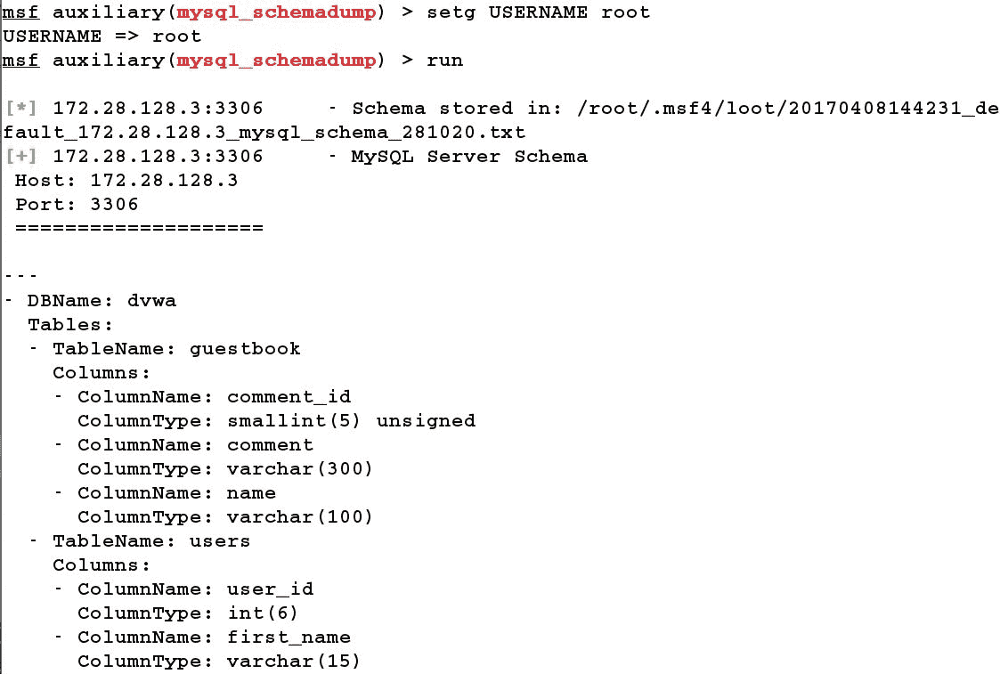
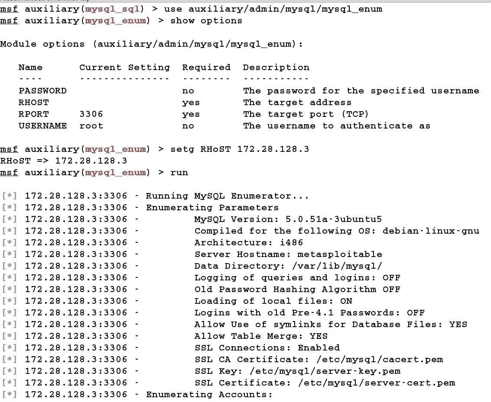
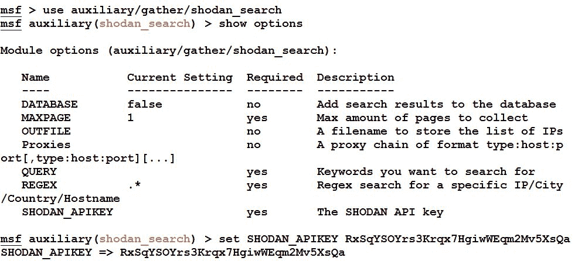
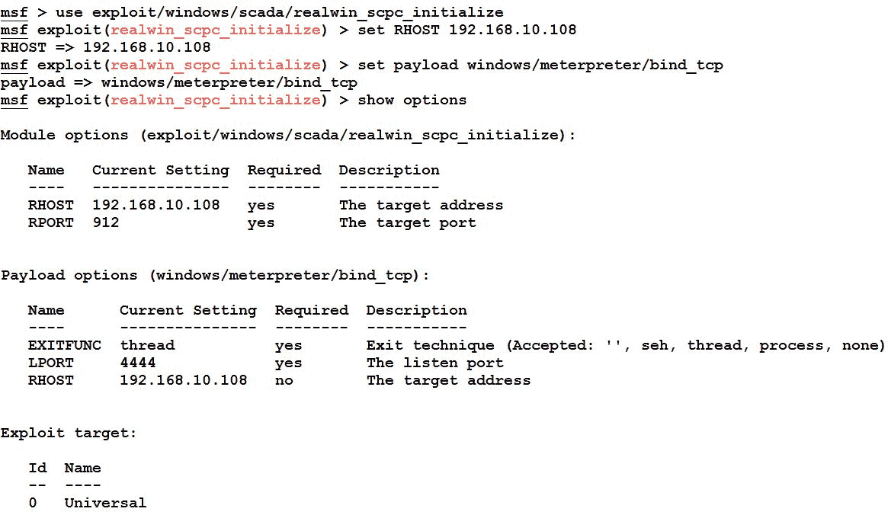
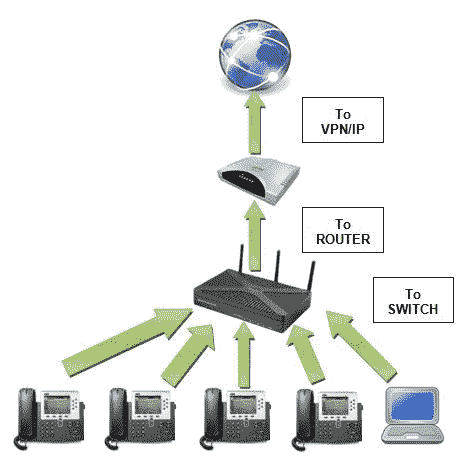
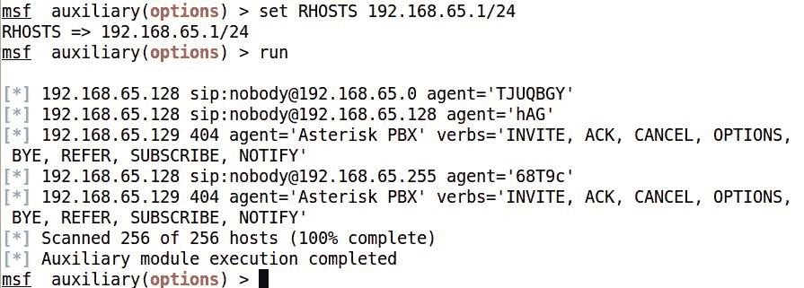
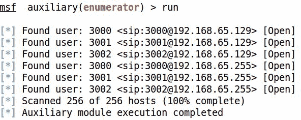

# 使用 Metasploit 测试服务

现在让我们谈谈测试各种专门服务。在我们作为渗透测试人员的职业生涯中，我们可能会遇到一家公司或一个可测试的环境，该环境只需要在特定服务器上执行测试，并且该服务器可能运行数据库、VoIP 或 SCADA 控制系统等服务。在本章中，我们将介绍在对这些服务进行渗透测试时要使用的各种开发策略。在本节中，我们将介绍以下几点：

*   执行数据库渗透测试
*   ICS 的基本原理及其批判性
*   了解 SCADA 开发
*   测试互联网协议语音服务

基于服务的渗透测试要求我们具备卓越的技能和对我们能够成功利用的服务的充分了解。因此，在本章中，我们将研究执行有效的基于服务的测试的理论和实践挑战。

# 使用 Metasploit 测试 MySQL

众所周知，Metasploit 支持 Microsoft SQL server 的广泛模块。但是，它还支持其他数据库的许多功能。我们在 Metasploit 中为其他支持流行数据库（如 MySQL、PostgreSQL 和 Oracle）的数据库提供了大量模块。在本章中，我们将介绍用于测试 MySQL 数据库的 Metasploit 模块。

如果你是一个经常接触 MSSQL 的人，我已经在我的*精通 Metasploit*系列丛书中介绍了使用 Metasploit 进行 MSSQL 测试。

请参阅*精通 Metasploit*系列丛书中的 MSSQL 测试，网址为：
[https://www.packtpub.com/networking-and-servers/mastering-metasploit-second-edition](https://www.packtpub.com/networking-and-servers/mastering-metasploit-second-edition)

因此，让我们进行一次端口扫描，以查看数据库是否有目标机器在 IP 地址`172.28.128.3`上运行，如下所示：

我们可以清楚地看到端口 3306 是打开的，这是 MySQL 数据库的标准端口。

# 使用 Metasploit 的 mysql\u 版本模块

让我们使用`auxiliary/scanner/mysql`中的`mysql_version`模块对 MySQL 实例的版本进行指纹识别，如下图所示：

我们可以看到 MYSQL 5.0.51a-3ubuntu5 在目标上运行。

# 使用 Metasploit 强制 MySQL

Metasploit 为 MySQL 数据库提供了强大的暴力模块。让我们使用`mysql_login`模块开始测试凭证，如以下屏幕截图所示：

我们可以将所需选项`RHOSTS`设置为目标的 IP 地址，然后将`BLANK_PASSWORDS`设置为 true，并简单地将模块设置为`run`，如下所示：

我们可以看到数据库以 root 用户身份运行，密码为空。在执行现场 VAPT 时，您经常会遇到许多使用默认凭据运行的数据库服务器。在接下来的几节中，我们将使用这些凭据获取有关目标的更多详细信息。

# 使用 Metasploit 查找 MySQL 用户

Metasploit 提供了一个`mysql_hashdump`模块，用于收集 MySQL 数据库其他用户的用户名和密码哈希等详细信息。让我们看看如何使用此模块：

我们只需要设置`RHOSTS`；我们可以跳过设置密码，因为它是空的。让我们`run`模块：

我们可以看到，我们还有四个用户，其中只有用户 admin 受密码保护。此外，我们可以复制散列并对密码破解工具运行它，以获得明文密码。

# 使用 Metasploit 转储 MySQL 模式

我们还可以使用`mysql_schemadump`模块转储整个 MySQL 架构，如下图所示：

我们将`USERNAME`和`RHOSTS`选项分别设置为`root`和`172.28.128.3`，并按如下方式运行模块：

我们可以看到，我们已经成功地将整个模式转储到`/root/msf/loot`目录，如前面的屏幕截图所示。转储模式将使我们更好地查看目标上运行的表和数据库类型，还将有助于构建精心编制的 SQL 查询，稍后我们将看到这一点。

# 使用 Metasploit 在 MySQL 中使用文件枚举

Metasploit 提供了`mysql_file_enum`模块来查找目标上存在的目录和文件。这个模块帮助我们了解目录结构和在目标端运行的应用程序类型。让我们看看如何运行此模块：

首先，我们需要设置 USERNAME、RHOSTS 和 FILE_LIST 参数，以使该模块在目标上工作。

`FILE_LIST`选项将包含我们要检查的目录列表的路径。我们在`/root/desktop/`创建了一个名为 file 的简单文件，并在其中放入了三个条目，即/var、/var/www 和/etc/passwd。让我们运行模块，并按如下方式分析结果：

我们可以看到，我们检查的所有目录都存在于目标系统上，因此可以更好地查看目标端的目录结构和关键文件。

# 检查可写目录

Metasploit 还提供了一个`mysql_writable_dirs`模块，帮助确定目标上的可写目录。通过将 DIR_LIST 选项设置为包含目录列表的文件，以及 RHOSTS 和 USERNAME 选项，我们可以以与前面模块类似的方式运行此模块，如下屏幕所示：

设置所有选项，让我们在目标上运行模块，并按如下方式分析结果：

我们可以在/var/www/html 中看到/tmp/目录是可写的。我们将看看如何在短时间内利用可写目录。

# 使用 Metasploit 枚举 MySQL

Metasploit 中还存在用于详细枚举 MySQL 数据库的特定模块。模块`auxiliary/admin/mysql/mysql_enum`单独为许多模块提供大量信息。让我们使用此模块获取有关目标的信息，如下所示：

设置`RHOSTS`、`USERNAME`和`PASSWORD`（如果不为空）选项，我们可以按照前面的屏幕截图运行模块。我们可以看到，模块收集了各种信息，如服务器主机名、数据目录、日志状态、SSL 信息和权限，如以下屏幕所示：

在收集了足够的数据库信息之后，让我们在下一节中对目标执行一些有趣的 SQL 查询。

# 通过 Metasploit 运行 MySQL 命令

现在我们有了关于数据库模式的信息，我们可以使用`auxiliary/admin/mysql/mysql_sql`模块运行任何 SQL 命令，如以下屏幕截图所示：

通过使用 SQL 选项提供 SQL 命令，我们可以在目标上运行任何 MySQL 命令。但是，我们显然也需要设置`RHOST`、`USERNAME`和`PASSWORD`选项。

# 通过 MySQL 获得系统访问权限

我们刚刚看到了如何通过 MySQL 运行 SQL 查询。让我们运行一些有趣且危险的查询，以获得对机器的完全访问权限，如以下屏幕截图所示：

在前面的屏幕截图中，我们将 SQL 选项设置为 select“”INTO OUTFILE“/var/www/html/a.php”命令，并针对目标运行模块。此命令将文本写入路径/var/www/html/a.php 处名为 a.php 的文件。我们可以通过浏览器浏览文件来确认模块的成功执行，如下图所示：

答对 了我们已成功地在目标上写入文件。让我们通过在一个目录中写入一个名为 AuthT1 的另一个文件来增强这个攻击向量。一旦写入，该文件将使用`cm`参数接收系统命令，并使用 PHP 中的系统函数执行这些命令。让我们按如下方式发送此命令：

为了转义双引号，我们将在 SQL 命令中使用反斜杠。

运行模块，我们现在可以通过浏览器验证`b.php`文件的存在，如下所示：

我们可以看到，向`b.php`文件提供一个系统命令，如`cat/etc/password`作为参数，会在屏幕上输出`/etc/passwd`文件的内容，表示远程代码执行成功。

为了获得系统访问权限，我们可以快速生成一个 Linux MeterMeter 负载，并将其托管在我们的机器上，就像我们在前面章节中的示例所做的那样。让我们通过提供`wget`命令，然后在`cm`参数中提供有效载荷的路径，将 MeterMeter 有效载荷下载到目标，如下所示：

我们可以通过发出如下的`ls`命令来验证文件是否成功下载到目标：

是的，我们的文件下载成功了。让我们提供必要的权限，如下所示：

我们对`29.elf`文件执行了`chmod 777`，如前一屏幕截图所示。我们需要为 Linux MeterMeter 设置一个处理程序，就像我们在前面的示例中所做的那样。但是，在发出执行二进制文件的命令之前，请确保处理程序正在运行。让我们通过浏览器执行二进制文件，如下所示：

是 啊我们获得了对目标的 MeterMeter 访问权，现在可以执行我们选择的任何后期开发功能。

如果是 root 以外的特权用户，我们可以在使用`chmod`命令时提供`+x`而不是`777`。
有关测试 MSSQL 数据库的更多信息，请参阅*精通 Metasploit*一书中的*第 5 章*。
在整个渗透测试过程中，始终记下留在服务器上的所有后门，以便在接合结束时进行适当的清理。

# SCADA 的基本原理

大坝、电网站、炼油厂、大型服务器控制服务等的控制活动需要**监控和数据采集**（**SCADA**）。

SCADA 系统是为高度特定的任务而构建的，如控制调度水位、管理输气管线、控制电网以监控特定城市的电力以及各种其他操作。

# SCADA 系统的安全性分析

在本节中，我们将讨论如何破坏 SCADA 系统的安全性。我们有很多可以测试 SCADA 系统的框架，但讨论它们将使我们超出本书的范围。因此，为了简单起见，我们将仅讨论使用 Metasploit 进行的 SCADA 开发。

# SCADA 测试的基本原理

让我们了解利用 SCADA 系统的基础知识。SCADA 系统可能会因 Metasploit 中最近添加到框架中的各种漏洞而受损。此外，位于的一些 SCADA 服务器可能具有默认用户名和密码；现在很少出现这种情况，但目标服务器中的用户名和密码仍有可能保持不变。

让我们尝试寻找一些 SCADA 服务器。我们可以通过使用优秀的资源[来实现这一点 http://www.shodanhq.com](http://www.shodanhq.com) ：

1.  首先，我们需要为 Shodan 网站创建一个帐户。
2.  注册后，我们只需在帐户中找到 Shodan 服务的 API 密钥即可。通过获取 API 密钥，我们可以通过 Metasploit 搜索各种服务。
3.  让我们试着使用`auxiliary/gather/shodan_search`模块从罗克韦尔自动化公司找到配置了技术的 SCADA 系统。
4.  在`QUERY`选项中，我们只需输入`Rockwell`，如下图所示：

5.  我们将`SHODAN_APIKEY`选项设置为在 Shodan 帐户中找到的 API 密钥。我们将`QUERY`选项设为`Rockwell`，并对结果进行如下分析：

我们可以清楚地看到，我们在互联网上发现了大量系统，通过使用 Metasploit 模块，使用罗克韦尔自动化运行 SCADA 服务。

# 基于 SCADA 的漏洞利用

在过去几年中，SCADA 系统的开发速度远远高于前几年。SCADA 系统可能存在各种漏洞，如基于堆栈的溢出、整数溢出、跨站点脚本和 SQL 注入。

此外，正如我们之前所讨论的，这些脆弱性的影响可能会对生命和财产造成危险。之所以可能对 SCADA 设备进行黑客攻击，主要是因为 SCADA 开发商和运营商对系统编程时没有关注安全性，以及所使用的操作程序不充分。

让我们看一个 SCADA 服务的示例，并尝试使用 Metasploit 对其进行开发。但是，请不要从 Shodan 中随机选择主机并尝试利用它。SCADA 系统非常关键，可能导致一些严重的牢狱之灾。无论如何，在下面的示例中，我们将使用 Metasploit 开发基于 Windows XP 系统的 DATAC RealWin SCADA Server 2.0 系统。

该服务在端口 912 上运行，该端口在 sprintf C 函数中容易发生缓冲区溢出。sprintf 函数用于 DATAC RealWin SCADA 服务器的源代码中，以显示由用户输入构造的特定字符串。当攻击者滥用此易受攻击的功能时，可能会导致目标系统完全受损。

让我们通过使用以下`exploit/windows/scada/realwin_scpc_initialize`漏洞，尝试使用 Metasploit 开发 DATAC RealWin SCADA Server 2.0 系统：

我们将`RHOST`设置为`192.168.10.108`，将`payload`设置为`windows/meterpreter/bind_tcp`。DATAC RealWin SCADA 的默认端口为`912`。让我们利用目标并检查我们是否可以`exploit`该漏洞：

答对 了我们成功地攻击了目标。让我们使用`load`命令加载`mimikatz`扩展，以明文形式查找系统密码，如下所示：

我们可以看到，通过发出`kerberos`命令，我们可以以明文形式找到密码。

我们在 Metasploit 中有很多漏洞专门针对 SCADA 系统中的漏洞。要了解有关这些漏洞的更多信息，您可以在[上查阅网络上有关 SCADA 黑客攻击和安全的最大资源 http://www.scadahacker.com](http://www.scadahacker.com) 。您应该能够在[的*msf scada*部分中看到许多漏洞利用 http://scadahacker.com/resources/msf-scada.html](http://scadahacker.com/resources/msf-scada.html) 。

网站[http://www.scadahacker.com](http://www.scadahacker.com) 保存了过去几年在各种 SCADA 系统中发现的漏洞列表。该列表的优点在于，它提供了有关 SCADA 产品、产品供应商、系统组件、Metasploit 参考模块、披露细节以及第一个 Metasploit 模块披露日期的准确信息。

# 实现安全的 SCADA

当 SCADA 必须实际应用时，确保其安全是一项艰巨的工作；但是，在保护 SCADA 系统时，我们可以寻找以下一些关键点：

*   密切关注与 SCADA 网络的每个连接，并查明是否有未经授权的尝试访问系统
*   确保在不需要时断开所有网络连接，如果 SCADA 系统有气隙，则确保最终连接到该系统的任何其他端点以相同的方式得到保护和检查
*   实施系统供应商提供的所有安全功能
*   为内部和外部系统实施 IDPS 技术，并实施 24 小时事件监控
*   记录所有网络基础设施，并为管理员和编辑提供个人角色
*   建立 IR 团队和蓝色团队，定期识别攻击向量

# 限制网络

如果发生与未经授权的访问、不必要的开放服务等相关的攻击，网络连接可能会受到限制。通过删除或卸载服务来实现此解决方案是抵御各种 SCADA 攻击的最佳防御措施。

SCADA 系统在 Windows XP 机箱上实现，这大大增加了攻击面。如果您正在应用 SCADA 系统，请确保您的 Windows 机箱是最新的，以防止更常见的攻击。

# 测试互联网协议语音服务

现在，让我们重点测试支持**互联网语音协议**（**VoIP**）的服务，看看如何检查可能影响 VoIP 服务的各种缺陷。

# VoIP 基础知识

与传统电话服务相比，VoIP 是一种成本更低的技术。VoIP 在电信方面提供了比传统电话更大的灵活性，并提供了各种功能，如多个分机、来电显示服务、日志记录、每次通话的记录等。如今，一些公司在支持 IP 的手机上安装了**专用交换机**（**PBX**）。

传统的和仍然存在的电话系统仍然容易通过物理访问被拦截，因此，如果攻击者改变电话线的连接并连接其发射机，他们将能够拨打和接听设备的电话，并可以享受互联网和传真服务。

然而，在 VoIP 服务的情况下，我们可以在不接触电线的情况下破坏安全性。然而，如果您不了解 VoIP 服务的基本工作原理，那么攻击 VoIP 服务是一项乏味的任务。本节介绍了如何在不拦截线路的情况下在网络中破坏 VoIP。

此外，在托管服务类型的 VoIP 技术中，客户端没有 PBX。然而，客户端的所有设备通过互联网连接到服务提供商的 PBX，即通过使用 IP/VPN 技术的**会话发起协议**（**SIP**线路。

让我们通过下图来了解这项技术的工作原理：

互联网上的许多 SIP 服务提供商为软电话提供连接，可直接使用软电话享受 VoIP 服务。此外，我们可以使用任何客户端软电话访问 VoIP 服务，如 Xlite，如以下屏幕截图所示：

# 指纹 VoIP 服务

我们可以使用 Metasploit 内置的 SIP 扫描模块在网络上对 VoIP 设备进行指纹识别。一种常见的 SIP 扫描器是内置在 Metasploit 中的**SIP 端点扫描器**。我们可以使用此扫描仪通过从各种 SIP 服务发出选项请求来识别网络上启用 SIP 的设备。

让我们使用
`/auxiliary/scanner/sip`下的选项辅助模块对 VoIP 服务进行扫描，并分析结果。这里的目标是运行星号 PBX VoIP 客户端的 Windows XP 系统。我们首先加载用于通过网络扫描 SIP 服务的辅助模块，如以下屏幕截图所示：

我们可以看到，我们有很多选项可以与`auxiliary/scanner/sip/options`辅助模块一起使用。我们只需要配置`RHOSTS`选项。然而，对于一个庞大的网络，我们可以使用**无类域间路由**（**CIDR**标识符定义 IP 范围。一旦运行，模块将开始扫描可能正在使用 SIP 服务的 IP。让我们按如下方式运行此模块：

我们可以清楚地看到，当这个模块运行时，它返回许多与使用 SIP 服务的 IP 相关的信息。此信息包含表示 PBX 名称和版本的代理，以及定义 PBX 支持的请求类型的谓词。因此，我们可以使用此模块收集有关网络上 SIP 服务的大量知识。

# 扫描 VoIP 服务

在找到目标支持的各种选项请求的相关信息后，现在让我们使用另一个 Metasploit 模块即`auxiliary/scanner/sip/enumerator`扫描并枚举 VoIP 服务的用户。此模块将搜索目标范围内的 VoIP 服务，并尝试枚举其用户。让我们看看如何实现这一目标：

我们现在列出了可用于此模块的选项。现在，我们将设置以下一些选项以成功运行此模块：

我们可以看到，我们已经设置了`MAXEXT`、`MINEXT`、`PADLEN`和`RHOSTS`选项。

在前面截图中使用的枚举器模块中，我们将`MINEXT`和`MAXEXT`分别定义为`3000`和`3005`。`MINEXT`是开始搜索的分机号码，`MAXEXT`是完成搜索的最后一个分机号码。这些选项可以设置为巨大的范围，如`MINEXT`到`0`和`MAXEXT`到`9999`——以了解在分机号码`0`到`9999`上使用 VoIP 服务的各种用户。

让我们通过将`RHOSTS`变量设置为 CIDR 值，在目标范围内运行此模块，如下所示：

将`RHOSTS`设置为`192.168.65.0/24`将扫描整个子网。现在，让我们运行这个模块，看看它显示了什么输出：

此搜索返回了许多使用 SIP 服务的用户。另外，`MAXEXT`和`MINEXT`的效果是，只扫描从`3000`扩展到`3005`的用户。扩展可以看作是特定网络中用户的标准地址。

# 欺骗 VoIP 呼叫

在获得了关于使用 SIP 服务的各种用户的足够知识之后，让我们尝试使用 Metasploit 对用户进行假调用。假设目标用户在 Windows XP 平台上运行 SipXphone 2.0.6.27，让我们使用`auxiliary/VoIP/sip_invite_spoof`模块向用户发送一个假邀请请求，如下所示：

我们将使用目标的 IP 地址和目标的扩展名 4444 设置 RHOSTS 选项。让我们将 srcadr 保持在 192.168.1.1，这将欺骗进行调用的地址源。

现在让我们`run`对模块进行如下操作：

让我们看看受害者那边发生了什么：

我们可以清楚地看到，软电话正在鸣响，并将呼叫者显示为 192.168.1.1，同时还显示来自 Metasploit 的预定义消息。

# 利用 VoIP

为了完全访问该系统，我们还可以尝试开发软电话软件。我们从前面的场景中获得了目标的 IP 地址。让我们用 Metasploit 扫描并利用它。但是，Kali 操作系统中有专门的 VoIP 扫描工具，专门用于测试 VoIP 服务。以下是可用于利用 VoIP 服务的应用程序列表：

*   Smap
*   Sipscan
*   西普萨克
*   沃邦
*   Svmap

回到本练习的利用部分，我们在 Metasploit 中有一些可以在软电话上使用的利用。让我们看一个例子。

我们将在这里开发的应用程序是 SipXphone 版本 2.0.6.27。此应用程序的界面可能类似于以下屏幕截图：

# 关于脆弱性

该漏洞存在于应用程序处理 Cseq 值的过程中。发送过长的字符串会导致应用程序崩溃，并且在大多数情况下，它会允许攻击者运行恶意代码并访问系统。

# 开发应用程序

现在让我们使用 Metasploit 开发 SipXphone 2.0.6.27 版应用程序。我们将在这里使用的漏洞是`exploit/windows/sip/sipxphone_cseq`。让我们将此模块加载到 Metasploit 中，并设置所需的选项：

我们需要设置`RHOST`、`LHOST`和`payload`的值。现在一切就绪，让我们`exploit`将目标应用程序如下所示：

瞧！我们很快就拿到了仪表。因此，在基于软件的 bug 情况下，使用 Metasploit 开发 VoIP 是很容易的。但是，在测试 VoIP 设备和其他与服务相关的 bug 时，我们可以使用第三方工具进行充分的测试。

测试 VoIP 的优秀资源可在[找到 http://www.viproy.com](http://www.viproy.com) 。

# 总结和练习

在本章中，我们了解了如何测试 MySQL 数据库、VoIP 服务和 SCADA 系统的一些漏洞。我们看到了攻击者仅获得对数据库的访问权限，最终可能获得系统级访问权限。我们还看到了 ICS 和 SCADA 中的漏洞如何导致攻击者危害整个服务器，这可能会造成巨大的破坏，我们还看到了部署在不同公司的 PBX 如何不仅可以用于欺骗呼叫，还可以危害整个客户端系统。为了练习您的技能，您可以按照自己的节奏进行以下进一步的练习：

*   尝试测试 MSSQL 和 PostgreSQL 数据库，并记下模块。
*   下载其他基于软件的 SCADA 系统，并尝试在本地利用它们。
*   尝试运行 MSSQL 的系统命令。
*   解决 MySQL 上将文件写入服务器的错误 13。
*   本章介绍的数据库测试是在 Metasploi 表 2 上执行的。尝试在本地设置相同的环境，然后重复此练习。

在最后五章中，我们讨论了各种模块、漏洞利用和服务，这些都花费了大量的时间。让我们看看如何在[第 6 章](6.html#3CN040-a731d733dba14ccabae643b74e2c8790)*中加快使用 Metasploit*的测试过程。