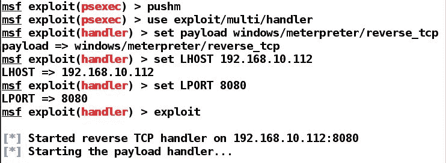
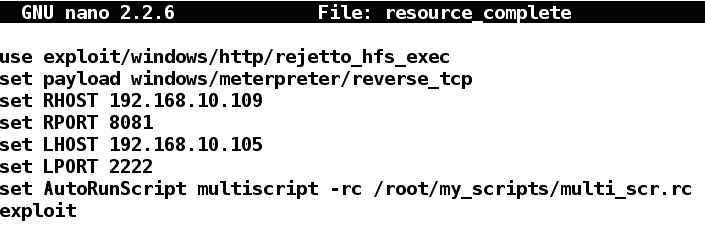
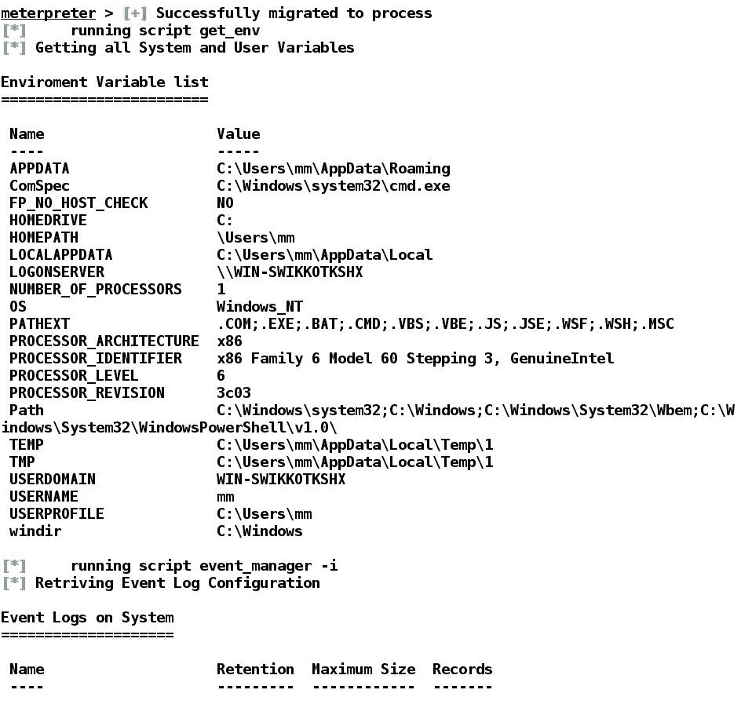

# 六、将 Metasploit 用于快节奏的利用

在进行渗透测试时，监控时间限制至关重要。花费比预期更多时间的渗透测试可能会导致信心丧失、成本超出预算以及其他许多事情。长时间的渗透测试也可能导致组织在未来从客户那里失去所有业务。

在本章中，我们将利用使用 Metasploit 中的自动化工具和方法进行快节奏渗透测试的方法。我们将了解以下内容：

*   动态切换模块
*   自动化后期利用
*   自动化利用

这种自动化测试策略不仅可以减少测试时间，还可以降低每人每小时的成本。

# 使用 pushm 和 popm 命令

Metasploit 提供了两个伟大的命令，即`pushm`和`popm`。`pushm`命令将当前模块推送到模块堆栈上，而`popm`将推送到的模块从模块堆栈顶部弹出。但是，这不是进程可用的标准堆栈。相反，它是 Metasploit 对相同概念的利用；这在其他方面是无关的。使用这些命令可以使我们快速操作，从而节省大量时间和精力。

考虑一个场景，我们正在测试一个具有多个漏洞的内部服务器。我们在内部网络的每个系统上运行两个可利用的服务。为了利用每台机器上的这两个服务，我们需要在两个漏洞的模块之间建立快速切换机制。在这种情况下，我们可以使用`pushm`和`popm`命令。我们可以使用一个模块测试服务器的单个漏洞，然后将该模块推送到堆栈上并加载另一个模块。使用第二个模块完成任务后，我们可以使用`popm`命令从堆栈中弹出第一个模块，并且所有选项保持不变。

让我们通过以下屏幕截图了解更多有关该概念的信息：

从前面的屏幕截图中，我们可以看到我们使用`pushm`命令将`psexec`模块推到堆栈上，然后加载`exploit/multi/handler`模块。一旦我们完成了对`multi/handler`模块的操作，我们就可以使用`popm`命令从堆栈中重新加载`psexec`模块，如下面的屏幕截图所示：

我们可以清楚地看到，`psexec`模块的所有选项都与堆栈上的模块一起保存。因此，我们不需要再次设置选项。

# 利用资源脚本

Metasploit 通过资源脚本提供自动化。资源脚本消除了手动设置选项的需要，自动设置所有内容，从而节省了设置有效负载和模块选项所需的大量时间。

创建资源脚本有两种方法，即手动创建脚本或使用`makerc`命令。我建议使用`makerc`命令而不是手动脚本，因为它可以消除键入错误。`makerc`命令将以前发出的所有命令保存在一个文件中，该文件可与 resource 命令一起使用。让我们看一个例子：

我们可以在前面的屏幕截图中看到，我们通过设置相关的负载和选项（如`LHOST`和`LPORT`，启动了一个漏洞处理程序模块。发出`makerc`命令将以系统的方式将所有这些命令保存到我们选择的文件中，在本例中为`multi_hand`。我们可以看到`makerc`成功地将最后六条命令保存到`multi_hand`资源文件中。

下面让我们使用`resource`脚本：

我们可以清楚地看到，只要在脚本后面发出`resource`命令，它就会自动复制我们保存的所有命令，从而消除了重复设置选项的任务。

# 在 Metasploit 中使用 AutoRunScript

Metasploit 提供了使用 AutoRunScript 的另一个强大功能。可以通过发出 show advanced 命令来填充 AutoRunScript 选项。AutoRunScript 会自动进行后期利用，并在访问目标后执行。我们可以通过发出`set AutoRunScript [script-name]`手动设置 AutoRunScript 选项，也可以通过使用`resource`脚本本身来设置 AutoRunScript 选项，该脚本可以同时自动化利用和后期利用。AutoRunScript 还可以通过使用`multi_script`和`multi_console_command`模块运行多个利用后脚本。让我们举一个例子，我们有两个脚本，一个用于自动利用，另一个用于自动利用后，如以下屏幕截图所示：

这是一个小型的攻击后脚本，用于自动化`checkvm`（用于检查目标是否在虚拟环境中运行的模块）和`migrate`（用于帮助从被攻击的流程迁移到更安全的流程的模块）模块。让我们看一下以下利用脚本：

前面的`resource`脚本通过设置所有必需的参数来自动利用 HFS 文件服务器。我们还使用`multi_console_command`选项设置 AutoRunScript 选项，该选项允许执行多个利用后脚本。我们使用`-rc`开关将利用后脚本定义为`multi_console_command`，如前面的屏幕截图所示。

让我们在以下屏幕中运行利用脚本并分析其结果：

在前面的屏幕截图中，我们可以清楚地看到，在攻击完成后不久，`checkvm`和 migrate 模块被执行，这表明目标是 Sun VirtualBox 虚拟机，并且进程被迁移到 notepad.exe 进程。脚本的成功执行可以在输出的以下剩余部分中看到：

我们成功迁移到 notepad.exe 进程。但是，如果存在多个`notepad.exe`实例，则流程迁移也可能跳过其他流程。

# 使用 AutoRunScript 选项中的 multiscript 模块

我们也可以使用`multiscript`模块代替`multi_console_command`模块。让我们创建一个新的利用后脚本，如下所示：

正如我们在前面的屏幕截图中清楚地看到的，我们创建了一个名为`multi_scr.rc`的新的攻击后脚本。我们需要对利用脚本进行以下更改以适应此更改：

我们只是用`multiscript`替换了`multi_console_command`并更新了我们的后利用脚本的路径，如前面的屏幕截图所示。让我们看看运行`exploit`脚本时会发生什么：

我们可以清楚地看到，访问目标后，`checkvm`模块执行，`migrate`、`get_env`和`event_manager`命令，如下图所示：

`event_manager`模块显示来自目标系统的所有日志，因为我们提供了`-i`开关以及资源脚本中的命令。`event_manager`命令的结果如下：

# Metasploit 中的全局变量

在特定范围或特定主机上工作时，我们始终可以使用`setg`命令指定`LHOST`和`RHOST`选项。使用`setg`命令设置选项将为每个加载的模块全局设置`RHOST`或`LHOST`选项。因此，`setg`命令消除了重复设置这些特定选项的使用。我们还可以在其他选项上使用`setg`命令，例如`LPORT`、`RPORT`和`payload`。但是，不同的服务在不同的端口上运行，我们可能还需要更改有效负载。因此，设置不会从一个模块更改为另一个模块的选项是更好的方法。让我们看看下面的例子：

我们在前面的屏幕截图中为`RHOST`分配了`setg`命令。我们可以看到，无论我们更改模块多少次，`RHOST`的值对于所有模块都保持不变，我们不需要在每个模块中手动输入。get 命令从当前上下文获取变量的值，`getg`命令获取全局变量的值，如前一屏幕截图所示。

# 包装和生成手动报告

现在，让我们讨论如何创建渗透测试报告，并查看要包含的内容、应包含的位置、应添加或删除的内容、报告的格式、图形的使用等。许多人，如经理、管理员和高管，都会阅读渗透测试报告。因此，有必要对调查结果进行良好的组织，以便向相关人员传达正确的信息，并让目标受众理解。

# 报告的格式

良好的渗透测试报告可分为以下几个要素：

*   页面设计
*   文件控制
*   封面
*   文档属性
*   报告内容清单
*   目录
*   插图清单
*   执行/高级别摘要
*   渗透测试的范围
*   严重性信息
*   目标
*   假设
*   漏洞概述
*   脆弱性分布图
*   建议摘要
*   方法/技术报告
*   测试细节
*   漏洞列表
*   可能
*   建议
*   工具书类
*   术语汇编
*   附录

以下是一些相关章节的简要说明：

*   **页面设计**：选择报表中使用的字体、页眉页脚、颜色等设计元素。
*   **文控**：这里介绍了报表的一般属性。
*   **封面**：包括报告名称、版本、时间、日期、目标组织、序列号等。
*   **文件属性**：本节包含报告标题、测试人员姓名以及审查本报告的人员姓名。
*   **报告内容清单**：本节包括报告内容。它们在报告中的位置使用明确定义的页码显示。
*   **目录**：本节包括所有内容的列表，从报告开始到结束进行组织。
*   **插图清单**：报告中使用的所有图表均应在本节中列出相应的页码。

# 执行摘要

执行摘要以标准和非技术性文本形式包含报告的完整摘要，重点是向公司高级员工提供知识。它包含以下信息：

*   **渗透测试的范围**：本节包括执行的测试类型和测试的系统。本节还列出了测试的所有 IP 范围。此外，本节还包含有关测试的严重性信息。
*   **目标**：本节将定义测试将如何帮助目标组织、测试的好处等。
*   **做出的假设**：如果测试范围需要进行内部评估，则假设攻击者已经通过范围外的方法（如钓鱼或 SE）获得了内部访问权限。因此，本节应列出任何此类假设。
*   **漏洞概述**：本节以表格形式提供信息，并根据高、中、低风险等级描述发现的漏洞数量。漏洞从对资产影响最大的漏洞到影响最小的漏洞。此外，此阶段包含针对多个系统的多个问题的漏洞分布图。下表给出了一个示例：

| **冲击** | **漏洞数量** |
| 高的 | 19 |
| 中等的 | 15 |
| 低的 | 10 |

*   **建议摘要**：本节中提出的建议仅针对影响因子最高的漏洞，并相应列出。

# 方法/网络管理员级报告

报告的这一部分包括渗透测试期间要执行的步骤、关于漏洞的深入细节以及建议。以下信息是管理员感兴趣的部分：

*   **测试详情**：本部分报告以图形、图表和表格的形式包含测试总结的相关信息，包括漏洞、风险因素以及感染这些漏洞的系统。
*   **漏洞清单**：本节报告包括漏洞的详细信息、位置和主要原因。
*   **可能性**：本节说明这些漏洞被攻击者攻击的可能性。为了获得这种可能性的值，我们分析了触发特定漏洞的易访问性，并找出针对可攻击漏洞的最简单和最困难的测试。
*   **建议**：本节将列出修补漏洞的建议。如果渗透测试不推荐修补，则认为仅完成了一半。

# 附加部分

以下部分为可选部分，各报告可能有所不同：

*   **参考文献**：本报告编制过程中引用的所有参考文献均列在此处。参考文献，如书籍、网站、文章等，应明确定义作者、出版物名称、出版年份或发表文章的日期等。
*   **术语表**：本报告中使用的所有技术术语及其含义将在此列出。
*   **附录：**本节是添加各种脚本、代码和图像的绝佳场所。

# 对真实场景的总结和准备

本章允许我们通过使用多种类型的资源脚本自动化利用和后期利用来加速渗透测试的过程。我们还看到了`pushm`、`popm`和可变全球化的用法和好处。最后，我们看到了如何设计专业报告以及如何呈现报告的各个部分。

在我们开始[第 7 章](7.html#3O56S0-a731d733dba14ccabae643b74e2c8790)*利用 Metasploit*解决现实世界的挑战之前，建议您通读本书迄今为止涵盖的所有示例，并详细学习每一种方法。然而，没有一本书能帮助你磨练你的技能，除非你在提高研究能力的同时练习每一件事。

在学习一些新技术的同时，我们将利用前几章中学习的每一项技术来解决下一章中的挑战。在阅读[第 7 章](7.html#3O56S0-a731d733dba14ccabae643b74e2c8790)*使用 Metasploit*利用现实世界的挑战之前，您可以练习以下练习：

*   为 Linux 和 Windows 操作系统的 MeterMeter 处理程序创建攻击后脚本
*   假设你是一个执法组织的一员，写下最著名的剥削和剥削后模块
*   假设您是一名专业的渗透测试人员，重复前面的练习
*   尝试通过代理运行 MeterMeter，并分析在不同模块中观察到的更改
*   尝试将 OpenVAS 等开源漏洞扫描工具与 Metasploit 结合起来，同时节省测试时间
*   尝试升级 Windows 2003、Windows 2008 和 Windows 2012 服务器上的权限，并记录模块差异

[第 7 章](7.html#3O56S0-a731d733dba14ccabae643b74e2c8790)*使用 Metasploit 利用现实世界的挑战*非常复杂，包含多种方法和利用场景。在继续之前要做好准备。祝你一切顺利！