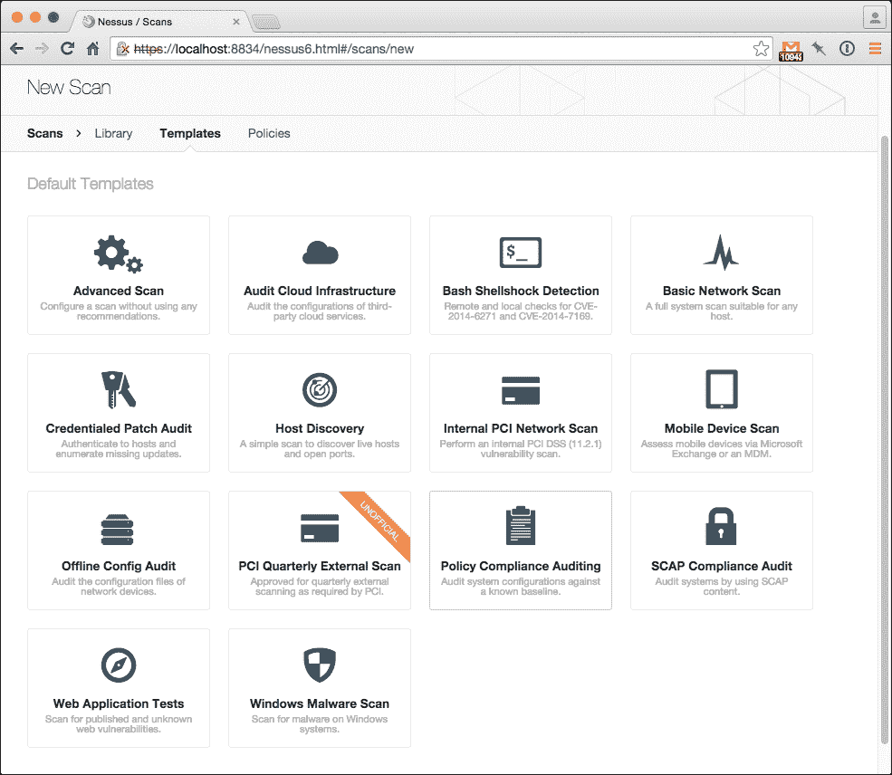
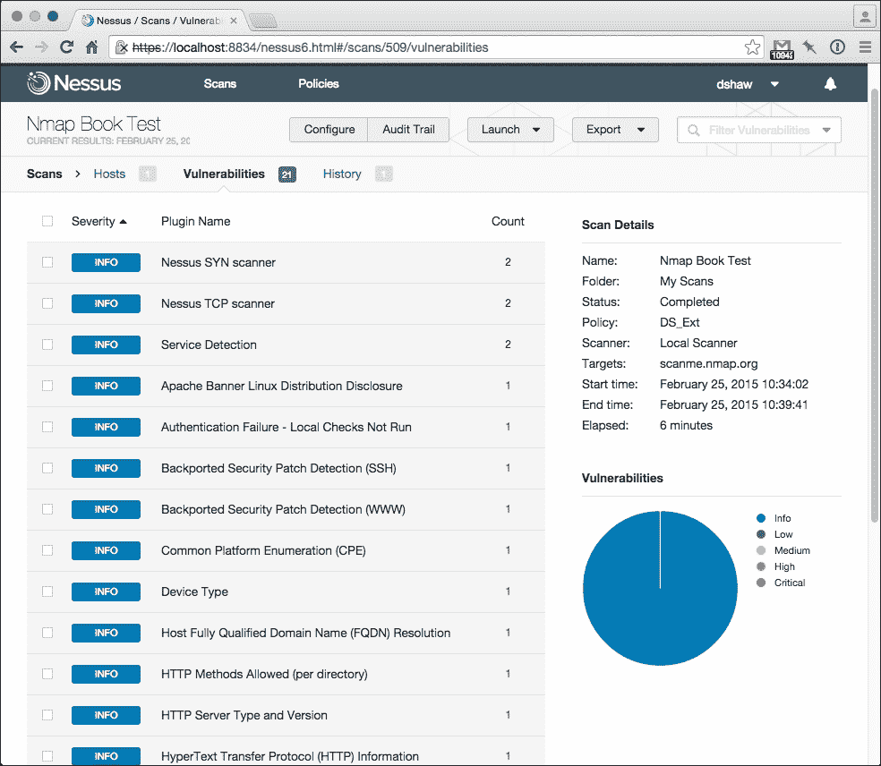
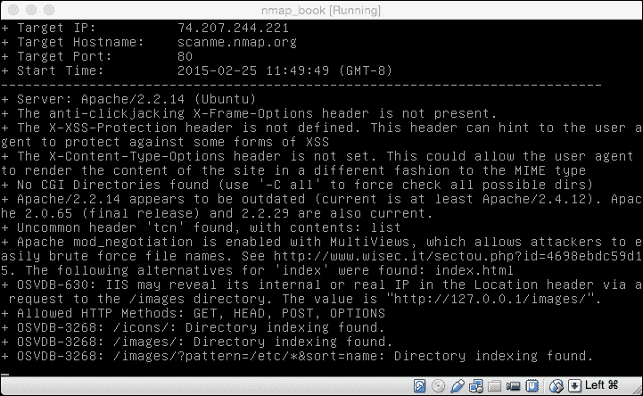

# 第 9 章脆弱性评估和工具

在学习了 Nmap 套件附带的所有其他工具之后，我们最好看看一些第三方工具，它们可以帮助进行漏洞评估。漏洞评估，不仅仅是一个简单的端口扫描，是一个全面的报告，详细说明了给定目标范围内可能存在的所有漏洞。

我们将在本章中学习的一些工具与 Nmap 交互非常好，而其他工具只是在初始 Nmap 扫描后使用的后续工具。

在本章中，我们将介绍以下主题：

*   使用 Nessus 进行漏洞扫描
*   使用 Nikto 评估 web 服务器问题
*   使用 DirBuster 识别敏感 web 目录
*   开始拦截代理

# 与 Nessus 进行漏洞扫描

与端口扫描器结合使用的最常见的软件之一是漏洞扫描器。该扫描仪的作用是端口扫描更高一级；它没有识别开放端口和服务，而是将这些版本与漏洞（通常是专有的）数据库交叉引用，以显示给定服务是否容易受到攻击。

这些扫描仪是脆弱性评估的关键要素，因为它们减轻了安全工程师的负担；扫描器（经常更新）可以完成大部分工作，而不必手动识别弱点。

虽然 Nessus 最初是（1998 年）作为一个免费的安全扫描程序启动的，但由于 Tenable（Nessus 的创建者创建的公司）转而出售许可证，Nessus 自那以后一直对公众关闭。虽然许多安全公司为这些许可证付费，但您可以免费试用 Nessus 项目的分支（OpenVAS）。

使用 Nessus 相当简单。尽管许多安全工具在命令行上运行（包括一些我们将在本章后面回顾的工具），Nessus 使用基于 web 的用户界面，使用起来非常直观。基本用法包括项：

*   选择目标列表（Nmap 可以提供帮助）
*   选择扫描类型
*   运行扫描
*   解释结果

以下屏幕截图显示 Nessus“模板”页面：

正如我们在前面的屏幕截图中所看到的，将登录 Nessus 并选择**新扫描**允许我们从各种预制扫描类型中进行选择，同时也允许我们为自定义扫描类型选择**策略**。为了这次扫描，我创建了一种特殊的扫描类型，它将扫描所有端口（就像 Nmap！），然后交叉引用它检测到的任何漏洞。

为了启动扫描，我们必须选择要扫描的目标。就像在我们的 Nmap 测试扫描中一样，我们将扫描`scanme.nmap.org`。请注意，在不情愿的目标上进行漏洞扫描可能会让系统管理员非常不安，在世界许多地方都是非法的：

Nessus 图形用户界面使用非常简单；只需将主机添加到“目标”，并为扫描命名。在大型渗透测试中，许多安全评估人员会专门从 Nmap 结果中解析出在线主机（或具有服务侦听的主机），以避免在离线或没有任何服务侦听的主机上浪费 Nessus 时间。以下屏幕截图显示 Nessus 中的漏洞扫描：

完成扫描后，点击**漏洞**显示目标范围内检测到的当前漏洞列表。正如所料，`scanme.nmap.org`几乎没有漏洞（Nmap 团队对安全性非常了解！），但仍有一些“信息性”发现突然出现，以便向评估人员提供尽可能多的信息。在本例中，某些配置（如 ApacheWeb 服务器信息）似乎允许信息公开。

Nessus 是一个强大的工具，但 NSE 通过能够编写 Nessus 内置的所有相同检查，正在迅速成为一个强大的竞争对手。然而，Nessus 的优势在于 Tenable 拥有一个完整的安全工程师团队，他们几乎一直在编写新的插件；有了 Nmap 脚本，人们需要创建一个脚本，将其上传到 web，并将其分发给许多用户，然后才能在实践中使用它。

定制检查是 Nessus 可以支持的另一项功能。与 NSE 非常相似，Nessus 用户可以使用一种功能强大的脚本工具，称为**Nessus 攻击脚本语言**（**NASL**。NASL 脚本可以由任何人编写，并提供 Nessus 引擎的完整功能，而无需对给定主机运行完整的 Nessus 扫描。完整的 NASL 文档可在 Tenable 网站上访问。

# 与 Nikto 评估 web 服务器问题

Nikto 是一个开源工具，允许安全评估人员评估 web 服务器的配置。与 Nmap 或 Nessus 不同，Nikto 专为基于网络的配置评估而设计。一般来说，最好在作为渗透测试或漏洞评估一部分的 web 服务上运行 Nikto（或类似的 web 扫描仪）。Nikto 可从其网页[访问 https://cirt.net/Nikto2](https://cirt.net/Nikto2) 。

Nikto 的安装是一个相当简单的过程，类似于我们在本书中使用的其他工具：

1.  `wget https://github.com/sullo/nikto/archive/master.zip`
2.  `unzip master.zip`
3.  `cd nikto-master/program`
4.  `Nikto is now ready to use!`

Nikto 和许多早期的安全工具一样，是一个 Perl 脚本，这意味着只要系统上有 Perl 可用，Nikto 就可以使用了！为了演示 Nikto 的工作原理，我们将对我们最喜欢的主机`scanme.nmap.org`运行一个简单的扫描。要运行此扫描，我们使用`-h`（主机）标志`nikto -h scanme.nmap.org`调用 Nikto。

您可以在前面的屏幕截图中看到，当 Nikto 运行时，它识别了许多问题（包括我们使用 Nmap 和 Nessus 识别的一些问题），以及一些不同的配置选项，例如缺少某些安全标头、存在某些 web 目录等。

在出现实际 web 服务器漏洞的情况下，Nikto 对于检测可利用的攻击向量是非常宝贵的。随着时间的推移，NSE 正在从 Nikto 接受越来越多的检查，并将其直接集成到 Nmap 中，但在其核心，Nmap 仍然是一个端口扫描仪；检测漏洞是一种奖励，而不是主要目的。

# 使用 DirBuster 识别敏感 web 目录

尽管 Nikto 可以识别潜在的敏感目录和 web 服务器错误配置，但其主要目的不是查找隐藏文件。然而，DirBuster 的存在完全是为了在 web 服务器上查找隐藏的文件和目录。使用 Java（因此必须安装 Java 运行时环境），DirBuster 可以向 web 服务器发送许多请求，以便完全枚举任何类型的评估员可能感兴趣的任何目录。从自我测试的角度来看，运行 DirBuster 对于验证您自己的 web 服务器上是否没有任何敏感文件非常有用！

从技术上讲，DirBuster 作为一个独立的产品，被运营该项目的组织 OWASP 视为生命的终结。代码库已经移植到 OWASP**Zed 攻击代理**（**ZAP**）项目（我们将在下一节中讨论），但 DirBuster 仍然可以在独立模式下运行，这在信息安全咨询行业非常常见。您可以通过以下 URL 下载 DirBuster:[http://sourceforge.net/projects/dirbuster/](http://sourceforge.net/projects/dirbuster/) 。

在正常使用情况下，DirBuster 是基于**图形用户界面**（**GUI**）的软件，但在安全行业最常见的用法是使用`-H`标志，该标志以无头模式运行 DirBuster。此模式意味着软件在命令行上运行，从而可以更轻松地编写脚本来运行软件，还可以从“暂存”服务器运行 DirBuster，这些服务器通常只能通过 SSH 访问。幸运的是，在学习 Nmap 的同时，我们已经非常熟悉命令行了，所以这应该不是一个问题！

对于新手来说，运行 DirBuster 可能有点让人望而生畏，但实际上非常简单：运行`java -jar [Dirbuster file].jar -H -u http://scanme.nmap.org`将针对`scanme.nmap.org`运行软件。我们使用`java -jar`调用它，因为我们正在运行一个 JAR 文件（一个打包的 Java 程序），`-H`用于 headless 模式（如上所述），并且`-u`位于我们要扫描的基本站点的 URL 之前。尽管我们可以在有权限的情况下扫描站点，但 DirBuster 通常需要一段时间才能运行，因为它必须检查许多可能的目录才能给出一个全面的列表。一旦 DirBuster 完成运行或使用“control-C”停止机制停止运行，报告将写入 DirBuster ran 目录中的文本文件。这种自动日志生成非常有用，因为 DirBuster 通常可以找到大量敏感目录。

有趣的是，您可以指定 DirBuster 用于检查目录的列表，最好确保此列表始终是最新的。在互联网上查看更新的列表是一个好主意，尤其是因为 DirBuster 本身在技术上不再积极维护。

# 开始拦截代理

我们已经学习了如何使用 Nessus 进行完整漏洞扫描，使用 Nikto 查找 web 服务器错误配置，以及使用 DirBuster 识别敏感文件和目录。但是，这些工具都没有向我们展示 web 应用程序实际上是如何与潜在的客户端浏览器进行通信的。为了查看这种级别的通信，我们需要使用所谓的拦截代理。

在您可以将 web 流量反弹出去之前，您可能已经听说过代理，以获得不同的源 IP 地址或避免某些类型的防火墙，但拦截代理是完全不同的。当您仍在其他地方跳转流量时，在拦截代理的情况下，您正在代理自己，然后使用一个软件来潜在地修改该请求。

安全行业中最常见的拦截代理之一是 Burp Suite，它有一个“社区”版（免费）和一个“专业”版（付费）。Burp 套件的一个流行替代品是 OWASP ZAP，但为了演示拦截代理，Burp 套件做得很好。您可以通过以下 URL 下载 Burp Suite 的免费版本：

[http://portswigger.net/burp/download.html](http://portswigger.net/burp/download.html)

设置拦截代理的第一步是将 web 浏览器配置为指向该代理。每个代理都不同，但 Burp 套件使用端口 8080 作为默认端口。这通常在 web 浏览器的设置中，通常在**网络**选项卡下。设置代理后，只需浏览任何页面即可拦截请求。

例如，我们设置了 Burp Suite 来拦截请求，并尝试使用 Firefox 浏览到`scanme.nmap.org`：

因为我们已经配置了代理 Burp Suite，所以我们可以立即看到我们的请求（“GET/”）被 Burp Suite 截获。这本身就很有用，因为它允许我们确切地看到我们的 web 浏览器对请求做了什么，但是拦截代理还有更多的功能。不仅仅是查看请求，我们还可以在线修改它们！以下屏幕截图显示 Burp Suite 拦截请求：

在前面的屏幕截图中，您可以看到我们将请求从`GET /`更改为`GET /TEST`，这将在服务器收到请求之前将请求更改为 web 服务器。虽然此更改只是一个简单的`GET`参数更改，但在评估 web 应用程序时，此功能非常有用。例如，有时可以通过更改变量来发送对其他用户数据的`POST`请求，在这种情况下，仅使用 web 浏览器浏览不同的 URL 不会产生预期效果。在评估 web 应用程序方面，拦截代理是最前沿的工具。以下屏幕截图显示了解释请求结果的 web 浏览器：

您可以看到，一旦我们单击 Burp Suite 中的**Forward**按钮，允许修改的请求继续发送到服务器，我们的浏览器就会得到一个响应，即在服务器上找不到`/TEST`。产生 404 错误的原因是请求已在线路上更改，而新文件不存在。

Burp Suite 是一个功能强大的工具，具有许多功能，值得一本完整的书，也可以使用。如果您对 web 应用程序安全感兴趣，我强烈建议您使用并学习更多关于 Burp Suite 的知识。

# 总结

本章让我们从了解如何运行端口扫描，到了解其他安全工具如何适应安全专业人员的日常生活。我们已经学习了如何使用 Nessus 进行漏洞扫描和评估，使用 Nikto 评估 web 服务器配置，使用 DirBuster 查找隐藏的文件和目录，以及使用 Burp Suite 拦截和修改对 web 应用程序的请求。

尽管关于安全世界还有很多需要了解的地方，但我们现在已经到了可以进行漏洞评估的地步！

在下一章中，我们将学习使用 Metasploit 进行渗透测试的基础知识，以及如何结合使用 Nmap 和 Metasploit 来生成优秀的攻击平台。