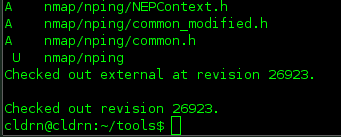
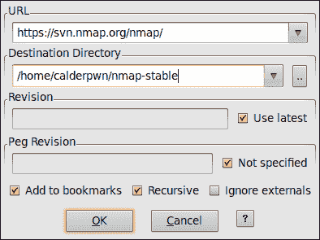
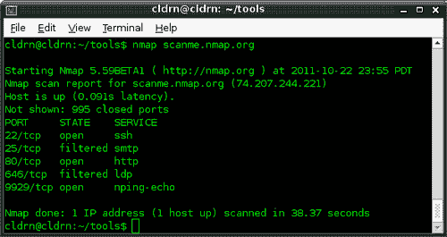
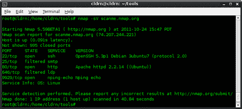
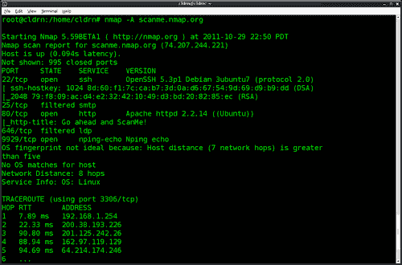
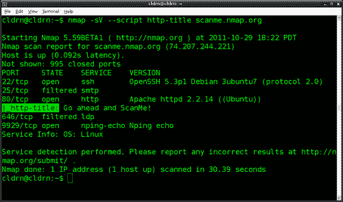

# 一、Nmap 基础

### 注

本章向您展示了如何做一些在许多情况下可能是非法的、不道德的、违反服务条款的或不是好主意的事情。这里提供的信息可用于保护您免受威胁，并使您自己的系统更安全。在遵循这些说明之前，请确保您站在法律和道德的正确一边。。。善用你的力量！

在本章中，我们将介绍：

*   从官方源代码存储库下载 Nmap
*   从源代码编译 Nmap
*   列出远程主机上打开的端口
*   远程主机的指纹识别服务
*   在网络中查找活动主机
*   使用特定端口范围扫描
*   运行 NSE 脚本
*   使用指定的网络接口进行扫描
*   将扫描结果与 Ndiff 进行比较
*   使用 Zenmap 管理多个扫描配置文件
*   用 Nping 检测 NAT
*   使用 Nmap 和 Ndiff 远程监视服务器

# 导言

**Nmap**（网络映射器）是一款专门从事网络探索和安全审计的开源工具，最初由 Gordon“Fyodor”Lyon 发布。官方网站（[http://nmap.org](http://nmap.org) 描述如下：

> Nmap（网络映射器）是用于网络发现和安全审计的免费开源（许可证）实用程序。许多系统和网络管理员还发现它对于网络资源清册、管理服务升级计划以及监视主机或服务正常运行时间等任务非常有用。Nmap 以新颖的方式使用原始 IP 数据包来确定网络上可用的主机、这些主机提供的服务（应用程序名称和版本）、它们正在运行的操作系统（和操作系统版本）、正在使用的数据包过滤器/防火墙的类型以及数十个其他特性。它被设计用于快速扫描大型网络，但在单台主机上运行良好。Nmap 运行在所有主要的计算机操作系统上，Linux、Windows 和 Mac OS X 都有官方的二进制软件包。

还有很多其他的端口扫描仪，但是没有一个能够提供 Nmap 的灵活性和高级选项。

**Nmap 脚本引擎（NSE）**通过允许用户使用 Nmap 收集的主机信息编写执行自定义任务的脚本，彻底改变了端口扫描程序的可能性。

此外，Nmap 项目还包括其他出色的工具：

*   **Zenmap**：Nmap 的图形界面
*   **Ndiff**：扫描结果比较工具
*   **Nping**：一款优秀的包生成和流量分析工具
*   **Ncrack**：一个与 Nmap 兼容的工具，用于强制网络登录
*   **Ncat**：跨网络读写数据的调试工具

不用说，每个安全专业人员和网络管理员都必须掌握此工具，以便高效地进行安全评估、监视和管理网络。

Nmap 的社区非常活跃，每周都会添加新功能。如果你还没有做到这一点，我鼓励你在你的武器库中保存一份最新的副本；更好的是，在[订阅开发邮件列表 http://cgi.insecure.org/mailman/listinfo/nmap-dev](http://cgi.insecure.org/mailman/listinfo/nmap-dev) 。

本章介绍如何使用 Nmap 执行一些最常见的任务，包括端口扫描和目标枚举。它还包括一些说明 Zenmap 的配置文件如何方便的方法，如何使用 Nping 进行 NAT 检测，以及 Ndiff 的不同应用程序，包括如何借助 bash 脚本和 cron 建立远程监控系统。我已经添加了尽可能多的参考链接和附加材料；我建议您访问他们，了解更多有关 Nmap 执行的高级扫描技术的内部工作原理。

我还创建了网站[http://nmap-cookbook.com](http://nmap-cookbook.com) 发布新的、相关的材料和额外的食谱，所以一定要不时来看看。

# 从官方源代码库下载 Nmap

本节介绍如何从官方 subversion 存储库下载 Nmap 的源代码。通过这样做，用户可以编译最新版本的 Nmap，并跟上提交到 subversion 存储库的每日更新。

## 准备好了吗

在继续之前，您需要有一个工作的 Internet 连接并访问 subversion 客户端。基于 Unix 的平台附带一个名为**subversion**（**svn**的命令行客户端。要检查您的系统中是否已经安装了它，只需打开一个终端并键入：

```
$ svn

```

如果它告诉您找不到该命令，请使用您喜爱的软件包管理器安装`svn`或从源代码构建它。从源代码构建 svn 的说明不在本书的范围内，但它们在网上被广泛记录。使用您喜爱的搜索引擎查找系统的特定说明。

如果您更愿意使用图形用户界面，RapidSVN 是一种非常流行的跨平台替代方案。您可以从[下载并安装 RapidSVNhttp://rapidsvn.tigris.org/](http://rapidsvn.tigris.org/) 。

## 怎么做。。。

打开终端并输入以下命令：

```
$ svn co --username guest https://svn.nmap.org/nmap/

```

### 提示

**下载示例代码**

您可以下载您在[账户购买的所有 Packt 书籍的示例代码文件 http://www.packtpub.com](http://www.packtpub.com) 。如果您在其他地方购买了本书，您可以访问[http://www.packtpub.com/support](http://www.packtpub.com/support) 并注册，将文件直接通过电子邮件发送给您。

等待 svn 下载存储在存储库中的所有文件。完成后，您将看到添加文件的列表，如以下屏幕截图所示：



当程序返回/退出时，当前目录中将有 Nmap 的源代码。

## 它是如何工作的。。。

```
$ svn checkout https://svn.nmap.org/nmap/ 

```

此命令下载位于[的远程存储库的副本 https://svn.nmap.org/nmap/](https://svn.nmap.org/nmap/) 。此存储库具有对最新稳定版本的全球读取权限，允许 svn 下载您的本地工作副本。

## 还有更多。。。

如果您使用的是 RapidSVN，请按照以下步骤操作：

1.  右键点击**书签**。
2.  点击**签出新工作副本**。
3.  在 URL 字段中键入`https://svn.nmap.org/nmap/`。
4.  选择您的本地工作目录。
5.  Click on **OK** to start downloading your new working copy.

    

### 尝试开发分支

如果您想尝试开发团队的最新作品，有一个名为`nmap-exp`的文件夹，其中包含项目的不同实验分支。存储在那里的代码不能保证一直工作，因为开发人员将其用作沙箱，直到它准备好合并到稳定分支中。此文件夹的完整 subversion URL 为[https://svn.nmap.org/nmap-exp/](https://svn.nmap.org/nmap-exp/) 。

### 使源代码保持最新

要更新以前下载的 Nmap 副本，请在工作目录中使用以下命令：

```
$ svn update

```

您应该看到已更新的文件列表，以及一些修订信息。

## 另见

*   *编译 Nmap f**rom 源代码*配方
*   *列出远程主机上打开的端口*配方
*   远程主机的*指纹服务*配方
*   *运行 NSE 脚本*配方
*   *将扫描结果与 Ndiff*配方进行比较
*   *使用 Zenmap*配方管理多个扫描配置文件
*   [第 8 章](08.html "Chapter 8. Generating Scan Reports")中*使用 Zenmap*配方生成网络拓扑图，生成*扫描报告*
*   在[第 8 章](08.html "Chapter 8. Generating Scan Reports")中*以正常格式*配方保存扫描结果，生成*扫描报告*

# 从源代码编译 Nmap

预编译的包总是需要时间来准备和测试，从而导致发布之间的延迟。如果您想了解最新添加的内容，强烈建议您编译 Nmap 的源代码。

此配方描述了如何在 Unix 环境中编译 Nmap 的源代码。

## 准备好了吗

确保系统中安装了以下软件包：

*   `gcc`
*   `openssl`
*   `make`

使用您最喜欢的软件包管理器安装缺少的软件，或从源代码构建它。从源代码构建这些包的说明不在本书的范围内，但可以在线获得。

## 怎么做。。。

1.  打开终端，进入存储 Nmap 源代码的目录。
2.  Configure it according to your system:

    ```
    $ ./configure

    ```

    如果成功，将显示有关 Nmap 功能的 ASCII 龙警告（如以下屏幕截图所示），否则将显示指定错误的行。

    

3.  Build Nmap using the following command:

    ```
    $ make 

    ```

    如果没有看到任何错误，则表示您已成功构建了最新版本的 Nmap。您可以通过在当前目录中查找已编译的二进制文件`Nmap`来检查这一点。

    如果要使 Nmap 对系统中的所有用户可用，请输入以下命令：

    ```
    # make install 

    ```

## 它是如何工作的。。。

我们使用脚本`configure`设置影响系统和所需配置的不同参数和环境变量。之后，GNUs`make`通过编译源代码生成二进制文件。

## 还有更多。。。

如果只需要 Nmap 二进制文件，可以使用以下配置指令来避免安装 Ndiff、Nping 和 Zenmap：

*   使用`--without-ndiff`跳过 Ndiff 的安装
*   使用`--without-zenmap`跳过 Zenmap 的安装
*   使用`--without-nping`跳过 Nping 的安装

### OpenSSL 开发库

在构建 Nmap 时，OpenSSL 是可选的。启用它允许 Nmap 访问此库中与多精度整数、散列、服务检测和 Nmap NSE 脚本的编码/解码相关的函数。

Debian systems 中 OpenSSL 开发包的名称为`libssl-dev`。

### 配置指令

在构建 Nmap 时，可以使用几个 configure 指令。有关指令的完整列表，请使用以下命令：

```
$ ./configure --help

```

### 预编译包

在线提供了几个预编译包（[http://nmap.org/download.html](http://nmap.org/download.html) ）对于那些无法访问编译器的用户，但不幸的是，除非是最新版本，否则很可能会丢失一些功能。Nmap 在不断发展。如果您真的想利用 Nmap 的强大功能，请在官方存储库中保持本地副本的最新状态。

### 另见

*   从官方源代码库下载 Nmap 的*配方*
*   *列出远程主机上打开的端口*配方
*   远程主机的*指纹服务*配方
*   *将扫描结果与 Ndiff*配方进行比较
*   *使用 Zenmap*配方管理多个扫描配置文件
*   *运行 NSE 脚本*配方
*   使用指定的网络接口进行*扫描*
*   在[第 8 章](08.html "Chapter 8. Generating Scan Reports")中*以正常格式*配方保存扫描结果，生成*扫描报告*
*   [第 8 章](08.html "Chapter 8. Generating Scan Reports")中*使用 Zenmap*配方生成网络拓扑图，生成*扫描报告*

# 列出远程主机上打开的端口

此配方描述了使用 Nmap 确定远程主机上的端口状态的最简单方法，该过程用于识别正在运行的服务，通常称为**端口扫描**。

## 怎么做。。。

1.  打开一个终端。
2.  键入以下命令：

    ```
    $ nmap scanme.nmap.org

    ```

扫描结果应显示在屏幕上，显示感兴趣的端口及其状态。标记为 open 的端口特别重要，因为它们表示在目标主机上运行的服务。



## 它是如何工作的。。。

以下命令通过启动 TCP 端口扫描来检查主机`scanme.nmap.org`上最常用端口的状态：

```
$ nmap scanme.nmap.org

```

结果包含主机信息，如 IPv4 地址和 PTR 记录，以及端口信息，如服务名称和端口状态。

## 还有更多。。。

即使对于这个最简单的端口扫描，Nmap 也会在后台执行许多操作，并且这些操作也可以配置。

Nmap 首先使用 DNS 将主机名转换为 IPv4 地址。如果您希望使用其他 DNS 服务器，请使用`--dns-servers <serv1[,serv2],...>`，如果您希望跳过此步骤，请使用`-n`，如下所示：

```
$ nmap --dns-servers 8.8.8.8,8.8.4.4 scanme.nmap.org

```

然后，它 ping 目标地址以检查主机是否处于活动状态。要跳过此步骤，请使用`–PN`，如下所示：

```
$ nmap -PN scanme.nmap.org

```

然后，Nmap 使用反向 DNS 调用将 IPv4 地址转换回主机名。使用`-n`跳过此步骤，如下所示：

```
$ nmap -n scanme.nmap.org

```

最后，它启动 TCP 端口扫描。要指定不同的端口范围，请对所有可能的 TCP 端口使用`-p[1-65535]`或`-p-`，如以下命令所示：

```
$ nmap -p1-30 scanme.nmap.org

```

### 特权与非特权

以特权用户身份运行`nmap <TARGET>`启动**SYN 隐形扫描**。对于无法创建原始数据包的非特权帐户，使用**TCP 连接扫描**。

这两者之间的区别在于 TCP 连接扫描使用高级系统调用**Connect**来获取端口状态的信息。这意味着每个 TCP 连接都已完全完成，因此速度较慢，更有可能被检测到并记录在系统日志中。SYN 隐形扫描使用原始数据包发送巧尽心思构建的 TCP 数据包，以更可靠地检测端口状态。

### 港口国

Nmap 将端口分类为以下状态：

### 注

发送的数据包类型取决于所使用的扫描技术。

*   **打开**：表示应用程序正在监听此端口上的连接。
*   **关闭**：表示已接收探头，但此端口上没有应用程序监听。
*   **过滤**：表示未接收探头，无法建立状态。这也表明探针被某种过滤掉了。
*   **未过滤**：表示已接收探头，但无法建立状态。
*   **打开/过滤**：表示端口已过滤或打开，但 Nmap 无法建立状态。
*   **关闭/过滤**：表示端口已过滤或关闭，但 Nmap 无法建立状态。

### Nmap 支持的端口扫描技术

我们展示了执行端口扫描的最简单方法，但 Nmap 有大量可用的高级扫描技术。使用`nmap -h`或访问[http://nmap.org/book/man-port-scanning-techniques.html](http://nmap.org/book/man-port-scanning-techniques.html) 了解更多关于他们的信息。

## 另见

*   远程主机的*指纹服务*配方
*   *在您的网络中查找活动主机*秘诀
*   使用特定端口范围的*扫描*配方
*   使用指定的网络接口进行*扫描*
*   *使用 Zenmap*配方管理不同的扫描配置文件
*   *使用 Nmap 和 Ndiff*配方远程监控服务器
*   [第 2 章](02.html "Chapter 2. Network Exploration")*网络探索*中的*排除扫描主机*配方
*   [第 2 章](02.html "Chapter 2. Network Exploration")*网络探索*中的*扫描 IPv6 地址*配方
*   [第 3 章](03.html "Chapter 3. Gathering Additional Host Information")中*对主机*配方的操作系统进行指纹识别*收集其他主机信息*
*   [第 3 章](03.html "Chapter 3. Gathering Additional Host Information")中的*发现 UDP 服务*配方*收集额外主机信息*
*   [第 3 章](03.html "Chapter 3. Gathering Additional Host Information")*中的*列出了远程主机*配方支持的协议*收集其他主机信息**

# 远程主机的指纹识别服务

**版本检测**是 Nmap 最流行的功能之一。了解服务的确切版本对于使用该服务查找安全漏洞的渗透测试人员以及希望监控其网络中任何未经授权的更改的系统管理员来说非常有价值。对服务进行指纹识别还可以揭示关于目标的附加信息，例如可用模块和特定协议信息。

此配方描述了如何使用 Nmap 对远程主机的服务进行指纹识别。

## 怎么做。。。

打开终端并键入以下命令：

```
$ nmap -sV scanme.nmap.org

```

此命令的结果是一个表，其中包含一个名为**VERSION**的附加列，显示特定的服务版本（如果已识别）。附加信息将附在括号中。请参阅以下屏幕截图：



## 它是如何工作的。。。

标志`-sV`启用服务检测，返回额外的服务和版本信息。

**服务检测**是 Nmap 最受欢迎的功能之一，因为它在许多情况下非常有用，例如识别安全漏洞或确保服务在给定端口上运行。

此功能的基本工作原理是将不同的探针从`nmap-service-probes`发送到可疑开放端口列表。根据探针用于识别服务的可能性选择探针。

在[中有关于服务检测模式如何工作以及使用的文件格式的非常详细的文档 http://nmap.org/book/vscan.html](http://nmap.org/book/vscan.html) 。

## 还有更多。。。

您可以通过使用参数`–-version-intensity [0-9]`更改扫描的强度级别来设置要使用的探头数量，如下所示：

```
# nmap -sV –-version-intensity 9 

```

### 攻击性检测

Nmap 有一个激活攻击性检测的特殊标志，即`-A`。**攻击模式**启用操作系统检测（`-O`）、版本检测（`-sV`）、脚本扫描（`-sC`）和跟踪路由（`--traceroute`）。不用说，这种模式会发送更多的探测，而且更有可能被检测到，但会提供很多有价值的主机信息。您可以通过使用以下命令之一看到这一点：

```
# nmap -A <target>

```

或

```
# nmap -sC -sV -O <target>

```



### 提交服务指纹

Nmap 的准确性来自多年来通过用户提交收集的数据库。我们帮助保持此数据库的最新状态非常重要。如果 Nmap 没有正确识别服务，请将您的新服务指纹或更正提交给[http://insecure.org/cgi-bin/submit.cgi?](http://insecure.org/cgi-bin/submit.cgi?) 。

## 另见

*   *列出远程主机上打开的端口*配方
*   *在您的网络中查找活动主机*秘诀
*   使用特定端口范围的*扫描*配方
*   使用指定的网络接口进行*扫描*
*   *使用 Zenmap*配方管理多个扫描配置文件
*   *使用 Nmap 和 Ndiff*配方远程监控服务器
*   [第 2 章](02.html "Chapter 2. Network Exploration")*网络探索*中的*用额外随机数据*秘方隐藏我们的流量
*   [第 2 章](02.html "Chapter 2. Network Exploration")*网络探索*中的*扫描 IPv6 地址*配方
*   *从 WHOIS 获取信息记录[第三章](03.html "Chapter 3. Gathering Additional Host Information")中的*配方*收集额外主机信息*
*   *暴力强制 DNS 记录[第 3 章](03.html "Chapter 3. Gathering Additional Host Information")中的*配方*收集额外主机信息*
*   [第三章](03.html "Chapter 3. Gathering Additional Host Information")中*对主机*配方的操作系统进行指纹识别*收集额外主机信息*

# 在您的网络中查找活动主机

渗透测试人员经常使用在网络中查找活动主机来枚举活动目标，系统管理员也经常使用查找活动主机来计数或监视活动主机的数量。

此食谱描述了如何执行 ping 扫描，以使用 Nmap 在网络中查找活动主机。

## 怎么做。。。

打开终端并输入以下命令：

```
$ nmap -sP 192.168.1.1/24

```

结果显示了联机并响应 ping 扫描的主机。

```
Nmap scan report for 192.168.1.102 
Host is up. 
Nmap scan report for 192.168.1.254 
Host is up (0.0027s latency). 
MAC Address: 5C:4C:A9:F2:DC:7C (Huawei Device Co.) 
Nmap done: 256 IP addresses (2 hosts up) scanned in 10.18 seconds 

```

在本例中，我们在网络中找到了两个活动主机。Nmap 还找到了 MAC 地址，并确定了家庭路由器的供应商。

## 它是如何工作的。。。

Nmap 使用`-sP`标志进行 ping 扫描。这种类型的扫描对于枚举网络中的主机非常有用。如果作为特权用户执行，则使用 TCP ACK 数据包和 ICMP 回显请求；如果由无法发送原始数据包的用户运行，则使用通过`connect()``syscall`发送的 SYN 数据包。

`192.168.1.1/24`中的 CIDR`/24`用于表示我们要扫描网络中的所有 256 个 IP。

## 还有更多。。。

作为特权用户扫描本地以太网网络时使用 ARP 请求，但您可以通过包含标志`--send-ip`来覆盖此行为。

```
# nmap -sP --send-ip 192.168.1.1/24

```

### 示踪路由

使用`--traceroute`在您的计算机和找到的每个主机之间包含一条路径。

```
Nmap scan report for 192.168.1.101 
Host is up (0.062s latency). 
MAC Address: 00:23:76:CD:C5:BE (HTC) 

TRACEROUTE 
HOP RTT      ADDRESS 
1   61.70 ms 192.168.1.101 

Nmap scan report for 192.168.1.102 
Host is up. 

Nmap scan report for 192.168.1.254 
Host is up (0.0044s latency). 
MAC Address: 5C:4C:A9:F2:DC:7C (Huawei Device Co.) 

TRACEROUTE 
HOP RTT     ADDRESS 
1   4.40 ms 192.168.1.254 

Nmap done: 256 IP addresses (3 hosts up) scanned in 10.03 seconds 

```

### NSE 脚本

Ping 扫描不执行端口扫描或服务检测，但可以根据主机规则为脚本启用 Nmap 脚本引擎，例如`sniffer-detect`和`dns-brute`的情况。

```
# nmap -sP --script discovery 192.168.1.1/24 

Pre-scan script results: 
| broadcast-ping: 
|_  Use the newtargets script-arg to add the results as targets 
Nmap scan report for 192.168.1.102 
Host is up. 

Host script results: 
|_dns-brute: Can't guess domain of "192.168.1.102"; use dns-brute.domain script argument. 

Nmap scan report for 192.168.1.254 
Host is up (0.0023s latency). 
MAC Address: 5C:4C:A9:F2:DC:7C (Huawei Device Co.) 

Host script results: 
|_dns-brute: Can't guess domain of "192.168.1.254"; use dns-brute.domain script argument. 
|_sniffer-detect: Likely in promiscuous mode (tests: "11111111") 

Nmap done: 256 IP addresses (2 hosts up) scanned in 14.11 seconds 

```

## 另见

*   *运行 NSE 脚本*配方
*   [第 2 章](02.html "Chapter 2. Network Exploration")*网络探索*中的*使用广播 ping*配方发现主机
*   *使用 TCP SYN ping 发现主机扫描[第 2 章](02.html "Chapter 2. Network Exploration")*网络探索*中的*配方
*   [第 2 章](02.html "Chapter 2. Network Exploration")*网络探索*中的*使用 TCP 确认 ping 扫描主机*配方
*   [第 2 章](02.html "Chapter 2. Network Exploration")*网络探索*中的*通过 ICMP ping 扫描发现主机*配方
*   [第二章](02.html "Chapter 2. Network Exploration")*网络探索*中*用广播脚本*配方收集网络信息
*   在[第三章](03.html "Chapter 3. Gathering Additional Host Information")中*发现指向相同 IP*配方的主机名*收集额外主机信息*
*   *暴力强制 DNS 记录[第 3 章](03.html "Chapter 3. Gathering Additional Host Information")中的*配方*收集额外主机信息*
*   [第三章](03.html "Chapter 3. Gathering Additional Host Information")中*欺骗端口扫描*配方的源 IP*收集额外主机信息*

# 使用特定端口范围进行扫描

有些情况下，系统管理员正在查找使用特定端口进行通信的受感染计算机，或者用户只查找特定的服务或开放端口，而并不真正关心其他端口。缩小使用的端口范围还可以优化性能，这在扫描多个目标时非常重要。

此配方描述了在执行 Nmap 扫描时如何使用端口范围。

## 怎么做。。。

打开终端并输入以下命令：

```
# nmap -p80 192.168.1.1/24 

```

结果中将显示状态为端口`80`的主机列表。

```
Nmap scan report for 192.168.1.102 
Host is up (0.000079s latency). 
PORT   STATE SERVICE 
80/tcp closed  http 

Nmap scan report for 192.168.1.103 
Host is up (0.016s latency). 
PORT   STATE SERVICE 
80/tcp open  http 
MAC Address: 00:16:6F:7E:E0:B6 (Intel) 

Nmap scan report for 192.168.1.254 
Host is up (0.0065s latency). 
PORT   STATE SERVICE 
80/tcp open  http 
MAC Address: 5C:4C:A9:F2:DC:7C (Huawei Device Co.) 

Nmap done: 256 IP addresses (3 hosts up) scanned in 8.93 seconds 

```

## 它是如何工作的。。。

Nmap 使用标志`-p`设置要扫描的端口范围。此标志可以与任何扫描方法结合使用。在上一个示例中，我们使用参数`-p80`向 Nmap 表明我们只对端口 80 感兴趣。

`192.168.1.1/24`中的 CIDR`/24`用于表示我们希望扫描网络中的所有 256 个 IP。

## 还有更多。。。

参数`-p`有几种可接受的格式：

*   端口列表：

    ```
    # nmap -p80,443 localhost

    ```

*   端口范围：

    ```
    # nmap -p1-100 localhost

    ```

*   所有端口：

    ```
    # nmap -p- localhost

    ```

*   协议指定端口：

    ```
    # nmap -pT:25,U:53 <target>

    ```

*   服务名称：

    ```
    # nmap -p smtp <target>

    ```

*   服务名称通配符：

    ```
    # nmap -p smtp* <target>

    ```

*   仅在 Nmap 服务中注册的端口：

    ```
    # nmap -p[1-65535] <target>

    ```

## 另见

*   *在您的网络中查找活动主机*秘诀
*   *列出远程主机上打开的端口*配方
*   使用指定的网络接口进行*扫描*
*   *运行 NSE 脚本*配方
*   [第 2 章](02.html "Chapter 2. Network Exploration")*网络探索*中的*用额外随机数据*秘方隐藏我们的流量
*   [第 2 章](02.html "Chapter 2. Network Exploration")*网络探索*中的*强制 DNS 解析*配方
*   [第 2 章](02.html "Chapter 2. Network Exploration")*网络探索*中的*排除扫描主机*配方
*   [第 2 章](02.html "Chapter 2. Network Exploration")*网络探索*中的*扫描 IPv6 地址*配方
*   [第三章](03.html "Chapter 3. Gathering Additional Host Information")*中*列出远程主机*配方支持的协议*收集额外主机信息**

# 运行 NSE 脚本

NSE 脚本非常强大，已成为 Nmap 的主要优势之一，执行从高级版本检测到漏洞攻击的任务。

以下配方描述了如何运行 NSE 脚本，以及此引擎可用的不同选项。

## 怎么做。。。

要在扫描结果中包含 web 服务器的索引文档的标题，请打开终端并键入以下命令：

```
$ nmap -sV --script http-title scanme.nmap.org 

```



## 它是如何工作的。。。

参数**--script**设置扫描时应该运行哪些 NSE 脚本。在这种情况下，当服务扫描检测到 web 服务器时，将为所选 NSE 脚本初始化并行线程。

有 230 多个可用脚本，它们执行各种各样的任务。如果检测到 web 服务器，NSE 脚本**http title**将返回根文档的标题。

## 还有更多。。。

您可以一次运行多个脚本：

```
$ nmap --script http-headers,http-title scanme.nmap.org
Nmap scan report for scanme.nmap.org (74.207.244.221) 
Host is up (0.096s latency). 
Not shown: 995 closed ports 
PORT     STATE    SERVICE 
22/tcp   open     ssh 
25/tcp   filtered smtp 
80/tcp   open     http 
| http-headers: 
|   Date: Mon, 24 Oct 2011 07:12:09 GMT 
|   Server: Apache/2.2.14 (Ubuntu) 
|   Accept-Ranges: bytes 
|   Vary: Accept-Encoding 
|   Connection: close 
|   Content-Type: text/html 
| 
|_  (Request type: HEAD) 
|_http-title: Go ahead and ScanMe! 
646/tcp  filtered ldp 
9929/tcp open     nping-echo 

```

此外，NSE 脚本可以按类别、表达式或文件夹进行选择：

*   运行`vuln`类别中的所有脚本：

    ```
    $ nmap -sV --script vuln <target>

    ```

*   运行类别`version`或`discovery`：

    ```
    $ nmap -sV --script="version,discovery" <target>

    ```

    中的脚本
*   运行除`exploit`类别中的脚本以外的所有脚本：

    ```
    $ nmap -sV --script "not exploit" <target>

    ```

*   运行除`http-brute`和`http-slowloris`：

    ```
    $ nmap -sV --script "(http-*) and not(http-slowloris or http-brute)" <target>

    ```

    之外的所有 HTTP 脚本

要调试脚本，请使用`--script-trace`。这将启用已执行脚本的堆栈跟踪，以帮助您调试会话。请记住，有时您可能需要使用标记`-d[1-9]`来提高调试级别，以找出问题的根源：

```
$ nmap -sV –-script exploit -d3 --script-trace 192.168.1.1 

```

### NSE 脚本参数

标志`--script-args`用于设置 NSE 脚本的参数。例如，如果要设置 HTTP 库参数`useragent`、`you would use`：

```
$ nmap -sV --script http-title --script-args http.useragent="Mozilla 999" <target>

```

在设置 NSE 脚本的参数时，也可以使用别名。例如，您可以使用

```
$ nmap -p80 --script http-trace --script-args path <target>

```

而不是：

```
$ nmap -p80 --script http-trace --script-args http-trace.path <target> 

```

### 添加新脚本

要测试新脚本，只需将它们复制到`/scripts`目录，然后运行以下命令来更新脚本数据库：

```
# nmap --script-update-db

```

### NSE 脚本类别

*   `auth`：此类别用于与用户认证相关的脚本。
*   `broadcast`：这是一个非常有趣的脚本类别，它使用广播请愿来收集信息。
*   `brute`：该类别用于帮助执行暴力密码审计的脚本。
*   `default`：该类别用于在执行脚本扫描时执行的脚本（`-sC`）。
*   `discovery`：此类别用于与主机和服务发现相关的脚本。
*   `dos`：该类别用于与拒绝服务攻击相关的脚本。
*   `exploit`：该类别适用于利用安全漏洞进行攻击的脚本。
*   `external`：该类别适用于依赖第三方服务的脚本。
*   `fuzzer`：这一类别适用于专注于模糊化的 NSE 脚本。
*   `intrusive`：此类别适用于可能导致某些内容崩溃或产生大量网络噪音的脚本。系统管理员可以考虑入侵的脚本属于这一类。
*   `malware`：此类别用于与恶意软件检测相关的脚本。
*   `safe`：该类别适用于在所有情况下都被认为是安全的脚本。
*   `version`：该类别适用于用于高级版本控制的脚本。
*   `vuln`：该类别用于与安全漏洞相关的脚本。

## 另见

*   *使用 Zenmap*配方管理不同的扫描配置文件
*   *使用 Nmap 和 Ndiff*配方远程监控服务器
*   远程主机的*指纹服务*配方
*   *在您的网络中查找活动主机*秘诀
*   [第二章](02.html "Chapter 2. Network Exploration")*网络探索*中*用广播脚本*配方收集网络信息
*   [第三章](03.html "Chapter 3. Gathering Additional Host Information")中的*收集有效电子邮件账户*配方*收集额外主机信息*
*   在[第三章](03.html "Chapter 3. Gathering Additional Host Information")中*发现指向相同 IP*配方的主机名*收集额外主机信息*
*   *暴力强制 DNS 记录[第 3 章](03.html "Chapter 3. Gathering Additional Host Information")中的*配方*收集额外主机信息*

# 使用指定的网络接口进行扫描

Nmap 以其灵活性著称，允许用户指定扫描时使用的网络接口。当运行一些嗅探器 NSE 脚本、发现您的接口是否支持混杂模式，或者测试存在路由问题的网络连接时，这非常方便。

下面的方法描述了如何强制 Nmap 使用指定的网络接口进行扫描。

## 怎么做。。。

打开终端并输入以下命令：

```
$ nmap -e <INTERFACE> scanme.nmap.org

```

这将迫使 Nmap 使用接口`<INTERFACE>`执行`scanme.nmap.org`的 TCP 扫描。


## 它是如何工作的。。。

当 Nmap 无法自动选择某个网络接口时，使用标志**-e**来设置特定的网络接口。此标志的存在允许 Nmap 通过备用接口发送和接收数据包。

## 还有更多。。。

如果需要手动选择界面，您将看到以下消息：

```
WARNING: Unable to find appropriate interface for system route to ...

```

### 正在检查 TCP 连接

要检查网络接口是否可以与您的网络通信，您可以尝试 ping 扫描，强制 Nmap 使用指定接口：

```
$ nmap -sP -e INTERFACE 192.168.1.254 
--------------- Timing report --------------- 
 hostgroups: min 1, max 100000 
 rtt-timeouts: init 1000, min 100, max 10000 
 max-scan-delay: TCP 1000, UDP 1000, SCTP 1000 
 parallelism: min 0, max 0 
 max-retries: 10, host-timeout: 0 
 min-rate: 0, max-rate: 0 
--------------------------------------------- 
Initiating ARP Ping Scan at 02:46 
Scanning 192.168.1.254 [1 port] 
Packet capture filter (device wlan2): arp and arp[18:4] = 0x00C0CA50 and arp[22:2] = 0xE567 
Completed ARP Ping Scan at 02:46, 0.06s elapsed (1 total hosts) 
Overall sending rates: 16.76 packets / s, 704.05 bytes / s. 
mass_rdns: Using DNS server 192.168.1.254 
Initiating Parallel DNS resolution of 1 host. at 02:46 
mass_rdns: 0.03s 0/1 [#: 1, OK: 0, NX: 0, DR: 0, SF: 0, TR: 1] 
Completed Parallel DNS resolution of 1 host. at 02:46, 0.03s elapsed 
DNS resolution of 1 IPs took 0.03s. Mode: Async [#: 1, OK: 0, NX: 1, DR: 0, SF: 0, TR: 1, CN: 0] 
Nmap scan report for 192.168.1.254 
Host is up, received arp-response (0.0017s latency). 
MAC Address: 5C:4C:A9:F2:DC:7C (Huawei Device Co.) 
Final times for host: srtt: 1731 rttvar: 5000  to: 100000 
Read from /usr/local/bin/../share/nmap: nmap-mac-prefixes nmap-payloads. 
Nmap done: 1 IP address (1 host up) scanned in 0.17 seconds 
 Raw packets sent: 1 (28B) | Rcvd: 1 (28B) 

```

## 另见

*   *运行 NSE 脚本*配方
*   使用特定端口范围的*扫描*配方
*   [第 2 章](02.html "Chapter 2. Network Exploration")*网络探索*中的*用额外随机数据*秘方隐藏我们的流量
*   [第 2 章](02.html "Chapter 2. Network Exploration")*网络探索*中的*强制 DNS 解析*配方
*   [第 2 章](02.html "Chapter 2. Network Exploration")*网络探索*中的*排除扫描主机*配方
*   *暴力强制 DNS 记录[第 3 章](03.html "Chapter 3. Gathering Additional Host Information")中的*配方*收集额外主机信息*
*   [第 3 章](03.html "Chapter 3. Gathering Additional Host Information")中*对主机*配方的操作系统进行指纹识别*收集其他主机信息*
*   [第 3 章](03.html "Chapter 3. Gathering Additional Host Information")中的*发现 UDP 服务*配方*收集额外主机信息*
*   *在[第 3 章](03.html "Chapter 3. Gathering Additional Host Information")中列出远程主机*配方支持的协议，*收集其他主机信息*

# 将扫描结果与 Ndiff 进行比较

Ndiff 被设计为以解决使用带有两个 XML 扫描结果的 diff 的问题。它通过消除误报和生成更可读的输出来比较文件，这非常适合需要跟踪扫描结果的任何人。

此配方描述如何比较两个 Nmap 扫描以检测主机中的更改。

## 准备好了吗

Ndiff 需要两个 Nmap XML 文件才能工作，因此请确保之前已保存同一主机的扫描结果。如果没有，您可以扫描自己的网络，停用服务，然后再次扫描以获取这两个测试文件。要将 Nmap 扫描结果保存到 XML 文件中，请使用`-oX <filename>`。

## 怎么做。。。

1.  打开你的终端。
2.  输入以下命令：

    ```
    $ ndiff FILE1 FILE2

    ```

3.  The output returns all the differences between `FILE1` and `FILE2`. New lines are shown after a plus sign. The lines that were removed on `FILE2` are displayed after a negative sign.

    

## 它是如何工作的。。。

Ndiff 使用第一个文件作为基础，与第二个文件进行比较。它显示主机、端口、服务和操作系统检测的状态差异。

## 还有更多。。。

如果您更喜欢 Zenmap，可以使用以下步骤：

1.  启动 Zenmap。
2.  点击主工具栏上的**工具**。
3.  点击**比较结果**（*Ctrl*+*D*）。
4.  点击**A 扫描**部分中的**打开**选择第一个文件。
5.  Select the second file by clicking on **Open** in the section named **B scan**.

    

### 输出格式

默认情况下，将返回人类可读的格式。但是，如果愿意，Ndiff 可以使用标记`--xml`返回 XML 格式的差异。

### 详细模式

**详细模式**包括所有信息，包括未更改的主机和端口。要使用它，请输入以下命令：

```
$ ndiff -v FILE1 FILE2
$ ndiff –verbose FILE1 FILE2 

```

## 另见

*   *使用 Nmap 和 Ndiff*配方远程监控服务器
*   *使用 Zenmap*配方管理多个扫描配置文件
*   [第 3 章](03.html "Chapter 3. Gathering Additional Host Information")*中的*地理定位 IP*地址配方*收集额外主机信息
*   *从 WHOIS 获取信息记录[第三章](03.html "Chapter 3. Gathering Additional Host Information")中的*配方*收集额外主机信息*
*   [第 3 章](03.html "Chapter 3. Gathering Additional Host Information")中*对主机*配方的操作系统进行指纹识别*收集其他主机信息*
*   [第 3 章](03.html "Chapter 3. Gathering Additional Host Information")中的*发现 UDP 服务*配方*收集额外主机信息*
*   [第 4 章](04.html "Chapter 4. Auditing Web Servers")*审计 Web 服务器*中的*检测可能的 XST 漏洞*配方

# 使用 Zenmap 管理多个扫描配置文件

扫描配置文件是 Nmap 参数的组合，可用于节省时间，并且在启动 Nmap 扫描时需要记住参数名称。

此配方是关于在 Zenmap 中添加、编辑和删除扫描配置文件。

## 怎么做。。。

让我们添加一个用于扫描 web 服务器的新配置文件：

1.  启动 Zenmap。
2.  点击主工具栏上的**档案**。
3.  点击**新建档案**或**命令**（*Ctrl*+*P*）。**档案编辑器**即将上线。
4.  在**配置文件**选项卡上输入配置文件名称和说明。
5.  在**扫描**选项卡上启用**版本检测**并禁用**反向 DNS 解析**。
6.  在**脚本**选项卡上启用以下脚本：
    *   **主机图**
    *   **http 默认账户**
    *   **http 枚举**
    *   **http favicon**
    *   **http 头**
    *   **http 方法**
    *   **http 跟踪**
    *   **http php 版本**
    *   **http-robots.txt**
    *   **http 标题**
7.  接下来，进入**目标**页签，点击**端口**进行扫描，输入`80`、`443`。
8.  Save your changes by clicking on **Save Changes**.

    

## 它是如何工作的。。。

使用编辑器创建概要文件后，我们只剩下以下 Nmap 命令：

```
$ nmap -sV -p 80,443 -T4 -n --script http-default-accounts,http-methods,http-php-version,http-robots.txt,http-title,http-trace,http-userdir-enum <target>

```

使用**配置文件**向导，我们启用了服务扫描（`-sV`，将扫描端口设置为`80`和`443`，将**定时**模板设置为`4`，并选择了一组与 HTTP 相关的脚本，从该 web 服务器收集尽可能多的信息。我们现在保存了这个配置文件，以便进行快速扫描，而无需再次键入所有这些标志和选项。

## 还有更多。。。

Zenmap 包括 10 个预定义的扫描配置文件，以帮助新手熟悉 Nmap。我建议您对其进行分析，以了解 Nmap 可用的其他扫描技术，以及一些更有用的选项组合。

*   强化扫描：`nmap -T4 -A -v`
*   密集扫描加 UDP:`nmap -sS -sU -T4 -A -v`
*   密集扫描，所有 TCP 端口：`nmap -p 1-65535 -T4 -A -v`
*   高强度扫描，无平：`nmap -T4 -A -v -Pn`
*   平扫：`nmap -sn`
*   快速扫描：`nmap -T4 -F`
*   快速扫描增强版：`nmap -sV -T4 -O -F –version-light`
*   快速跟踪路由：`nmap -sn –traceroute`
*   常规扫描：`nmap`
*   慢速综合扫描：`nmap -sS -sU -T4 -A -v -PE -PP -PS80,443 -PA3389 -PU40125 -PY -g 53 --script`默认或发现且安全

### 编辑和删除扫描配置文件

要编辑或删除扫描配置文件，您需要从**配置文件**下拉菜单中选择要修改的条目。单击主工具栏上的**配置文件**并选择**编辑所选配置文件**（*Ctrl*+*E*）。

编辑器将启动，允许您编辑或删除选定的配置文件。

## 另见

*   *列出远程主机上打开的端口*配方
*   远程主机配方的*指纹服务器*
*   *在您的网络中查找活动主机*秘诀
*   使用特定端口范围的*扫描*配方
*   *运行 NSE 脚本*配方
*   [第 2 章](02.html "Chapter 2. Network Exploration")*网络探索*中的*扫描 IPv6 地址*配方
*   [第二章](02.html "Chapter 2. Network Exploration")*网络探索*中*用广播脚本*配方收集网络信息
*   [第 3 章](03.html "Chapter 3. Gathering Additional Host Information")中的*发现 UDP 服务*配方*收集额外主机信息*

# Nping 检测 NAT

Nping 被设计为用于数据包制作和流量分析，非常适合各种网络任务。

下面的方法将介绍 Nping，展示如何在 Nping Echo 协议的帮助下执行 NAT 检测。

## 怎么做。。。

打开终端并输入以下命令：

```
# nping --ec "public" -c 1 echo.nmap.org

```

这将产生类似以下示例的输出流：

Nping 将返回客户端与 Nping echo 服务器之间的数据包流量`echo.nmap.org`：

```
Starting Nping 0.5.59BETA1 ( http://nmap.org/nping ) at 2011-10-27 16:59 PDT 
SENT (1.1453s) ICMP 192.168.1.102 > 74.207.244.221 Echo request (type=8/code=0) ttl=64 id=47754 iplen=28 
CAPT (1.1929s) ICMP 187.136.56.27 > 74.207.244.221 Echo request (type=8/code=0) ttl=57 id=47754 iplen=28 
RCVD (1.2361s) ICMP 74.207.244.221 > 192.168.1.102 Echo reply (type=0/code=0) ttl=53 id=37482 iplen=28 

Max rtt: 90.751ms | Min rtt: 90.751ms | Avg rtt: 90.751ms 
Raw packets sent: 1 (28B) | Rcvd: 1 (46B) | Lost: 0 (0.00%)| Echoed: 1 (28B) 
Tx time: 0.00120s | Tx bytes/s: 23236.51 | Tx pkts/s: 829.88 
Rx time: 1.00130s | Rx bytes/s: 45.94 | Rx pkts/s: 1.00 
Nping done: 1 IP address pinged in 2.23 seconds 

```

注意标记为`SENT`的第一个数据包中的源地址`192.168.1.102`。

```
 SENT (1.1453s) ICMP 192.168.1.102 > 74.207.244.221 Echo request (type=8/code=0) ttl=64 id=47754 iplen=28 

```

将此地址与标记为`CAPT`的第二个数据包中的源地址进行比较。

```
CAPT (1.1929s) ICMP 187.136.56.27 > 74.207.244.221 Echo request (type=8/code=0) ttl=57 id=47754 iplen=28 

```

地址不同，表示存在 NAT。

## 它是如何工作的。。。

Nping 的**回波模式**旨在帮助解决防火墙和路由问题。基本上，它将接收到的数据包的副本返回给客户端。

命令是：

```
# nping --ec "public" -c 1 echo.nmap.org

```

它使用 Nping 的 echo 模式（`--ec`或`--echo-client`帮助我们分析 Nmap 的 Nping echo 服务器之间的流量，以确定网络上是否有 NAT 设备。`–ec`之后的参数对应于服务器已知的加密和验证会话的秘密密码短语。

标志`-c`用于指定必须发送的数据包迭代次数。

## 还有更多。。。

使用 Nping，生成自定义 TCP 数据包非常简单。例如，要向端口 80 发送 TCP SYN 数据包，请使用以下命令：

```
# nping --tcp -flags syn -p80 -c 1 192.168.1.254

```

这将产生以下输出：

```
SENT (0.0615s) TCP 192.168.1.102:33599 > 192.168.1.254:80 S ttl=64 id=21546 iplen=40  seq=2463610684 win=1480 
RCVD (0.0638s) TCP 192.168.1.254:80 > 192.168.1.102:33599 SA ttl=254 id=30048 iplen=44  seq=457728000 win=1536 <mss 768> 

Max rtt: 2.342ms | Min rtt: 2.342ms | Avg rtt: 2.342ms 
Raw packets sent: 1 (40B) | Rcvd: 1 (46B) | Lost: 0 (0.00%) 
Tx time: 0.00122s | Tx bytes/s: 32894.74 | Tx pkts/s: 822.37 
Rx time: 1.00169s | Rx bytes/s: 45.92 | Rx pkts/s: 1.00 
Nping done: 1 IP address pinged in 1.14 seconds 

```

Nping 是一个非常强大的流量分析和数据包制作工具。使用以下命令花一点时间浏览其所有选项：

```
$ nping -h 

```

### Nping 回波协议

欲了解更多关于 Nping Echo 协议的信息，请访问[http://nmap.org/svn/nping/docs/EchoProtoRFC.txt](http://nmap.org/svn/nping/docs/EchoProtoRFC.txt) 。

## 另见

*   *在您的网络中查找活动主机*秘诀
*   *将扫描结果与 Ndiff*配方进行比较
*   *使用 Zenmap*配方管理多个扫描配置文件
*   *使用 Nmap 和 Ndiff*配方远程监控服务器
*   *用广播脚本采集网络信息*配方[第二章](02.html "Chapter 2. Network Exploration")*网络探索*
*   *暴力强制 DNS 记录*配方[第三章](03.html "Chapter 3. Gathering Additional Host Information")，*收集额外主机信息*
*   *欺骗端口扫描*配方[第三章](03.html "Chapter 3. Gathering Additional Host Information")*收集额外主机信息*的源 IP
*   *使用 Zenmap*配方[第 8 章](08.html "Chapter 8. Generating Scan Reports")生成网络拓扑图，生成*扫描报告*

# 使用 Nmap 和 Ndiff 远程监控服务器

结合 Nmap 项目中的工具，我们可以建立一个简单但功能强大的监控系统。然后，监视 web 服务器的系统管理员或想要监视远程系统的渗透测试人员就可以使用它。

本食谱描述了如何使用 bash 脚本、cron、Nmap 和 Ndiff 来设置监控系统，如果在网络中检测到更改，则通过电子邮件向用户发出警报。

## 怎么做。。。

创建目录`/usr/local/share/nmap-mon/`以存储所有必要的文件。

扫描目标主机并将结果保存在刚创建的目录中。

```
# nmap -oX base_results.xml -sV -PN <target>

```

生成的文件`base_results.xml`将用作基础文件，这意味着它应该反映已知的“良好”版本和端口。

将文件`nmap-mon.sh`复制到您的工作目录中。

扫描的输出如下所示。

```
#!/bin/bash 
#Bash script to email admin when changes are detected in a network using Nmap and Ndiff. 
# 
#Don't forget to adjust the CONFIGURATION variables. 
#Paulino Calderon <calderon@websec.mx> 

# 
#CONFIGURATION 
# 
NETWORK="YOURDOMAIN.COM" 
ADMIN=YOUR@EMAIL.COM 
NMAP_FLAGS="-sV -Pn -p- -T4" 
BASE_PATH=/usr/local/share/nmap-mon/ 
BIN_PATH=/usr/local/bin/ 
BASE_FILE=base.xml 
NDIFF_FILE=ndiff.log 
NEW_RESULTS_FILE=newscanresults.xml 

BASE_RESULTS="$BASE_PATH$BASE_FILE" 
NEW_RESULTS="$BASE_PATH$NEW_RESULTS_FILE" 
NDIFF_RESULTS="$BASE_PATH$NDIFF_FILE" 

if [ -f $BASE_RESULTS ] 
then 
 echo "Checking host $NETWORK" 
 ${BIN_PATH}nmap -oX $NEW_RESULTS $NMAP_FLAGS $NETWORK 
 ${BIN_PATH}ndiff $BASE_RESULTS $NEW_RESULTS > $NDIFF_RESULTS 
 if [ $(cat $NDIFF_RESULTS | wc -l) -gt 0 ] 
 then 
 echo "Network changes detected in $NETWORK" 
 cat $NDIFF_RESULTS 
 echo "Alerting admin $ADMIN" 
 mail -s "Network changes detected in $NETWORK" $ADMIN < $NDIFF_RESULTS 
 fi 
fi 

```

根据您的系统更新配置值。

```
NETWORK="YOURDOMAIN.COM" 
ADMIN=YOUR@EMAIL.COM 
NMAP_FLAGS="-sV -Pn -p- -T4" 
BASE_PATH=/usr/local/share/nmap-mon/ 
BIN_PATH=/usr/local/bin/ 
BASE_FILE=base.xml 
NDIFF_FILE=ndiff.log 
NEW_RESULTS_FILE=newscanresults.xml 

```

通过输入以下命令使`nmap-mon.sh`可执行：

```
# chmod +x /usr/local/share/nmap-mon/nmap-mon.sh 

```

您现在可以运行脚本`nmap-mon.sh`以确保其正常工作。

```
# /usr/local/share/nmap-mon/nmap-mon.sh

```

启动您的`crontab`编辑器：

```
# crontab -e 

```

添加以下命令：

```
0 * * * * /usr/local/share/nmap-mon/nmap-mon.sh

```

当 Ndiff 检测到您的网络发生变化时，您现在应该会收到电子邮件警报。

## 它是如何工作的。。。

Ndiff 是一种用于比较两个 Nmap 扫描的工具。在 bash 和 cron 的帮助下，我们设置了一个定期执行的任务来扫描我们的网络，并将当前状态与旧状态进行比较，以确定它们之间的差异。

## 还有更多。。。

您可以通过修改 cron 行来调整扫描间隔：

```
0 * * * * /usr/local/share/nmap-mon/nmap-mon.sh

```

要更新基本文件，只需覆盖位于`/usr/local/share/nmap-mon/`的基本文件。请记住，当我们更改扫描参数以创建基础文件时，我们也需要在`nmap-mon.sh`中更新它们。

### 监控特定服务

要监视某些特定的服务，您需要更新`nmap-mon.sh`中的扫描参数。

```
NMAP_FLAGS="-sV -Pn"

```

例如，如果要监视 web 服务器，可以使用以下参数：

```
NMAP_FLAGS="-sV --script http-google-safe -Pn -p80,443" 

```

这些参数仅将端口扫描设置为端口`80`和`443`，此外，这些参数还包括脚本`http-google-safe`，用于检查您的 web 服务器是否已被 Google 安全浏览服务标记为恶意。

## 另见

*   *列出远程主机上打开的端口*配方
*   远程主机的*指纹服务*配方
*   *在您的网络中查找活动主机*秘诀
*   *运行 NSE 脚本*配方
*   *将扫描结果与 Ndiff*配方进行比较
*   [第 2 章](02.html "Chapter 2. Network Exploration")*网络探索*中的*通过 ICMP ping 扫描发现主机*配方
*   [第 2 章](02.html "Chapter 2. Network Exploration")*网络探索*中的*扫描 IPv6 地址*配方
*   [第二章](02.html "Chapter 2. Network Exploration")*网络探索*中*用广播脚本*配方收集网络信息
*   [第 3 章](03.html "Chapter 3. Gathering Additional Host Information")*中的*检查主机是否存在已知的恶意活动*配方*收集其他主机信息
*   [第 3 章](03.html "Chapter 3. Gathering Additional Host Information")中的*发现 UDP 服务*配方*收集额外主机信息*