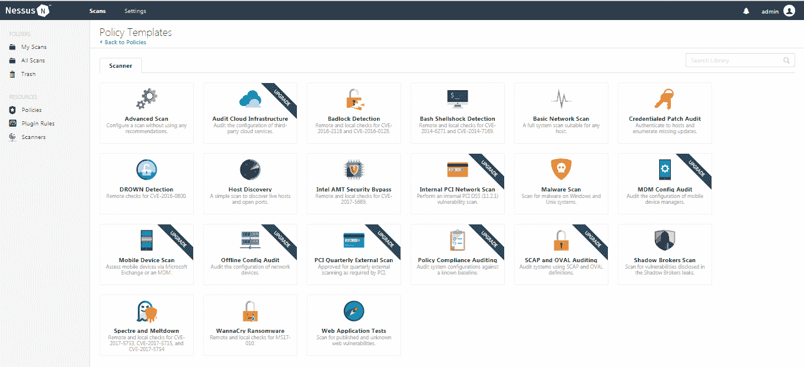
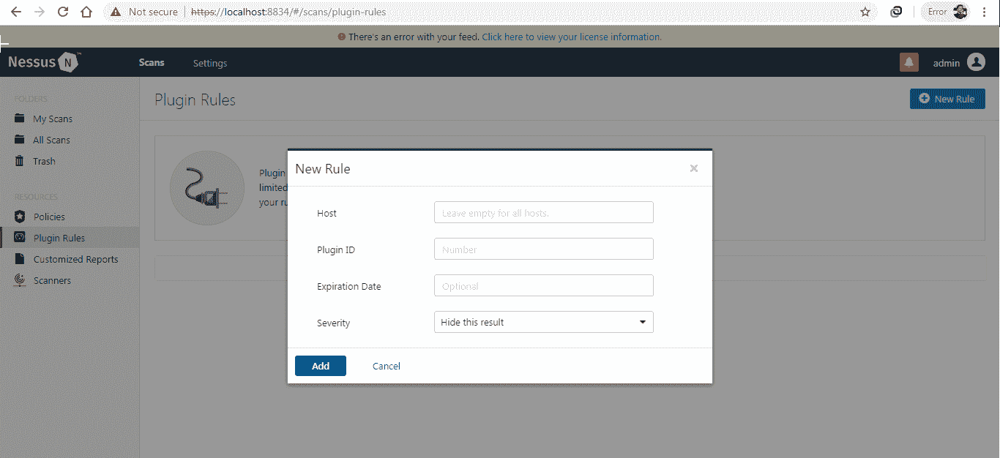
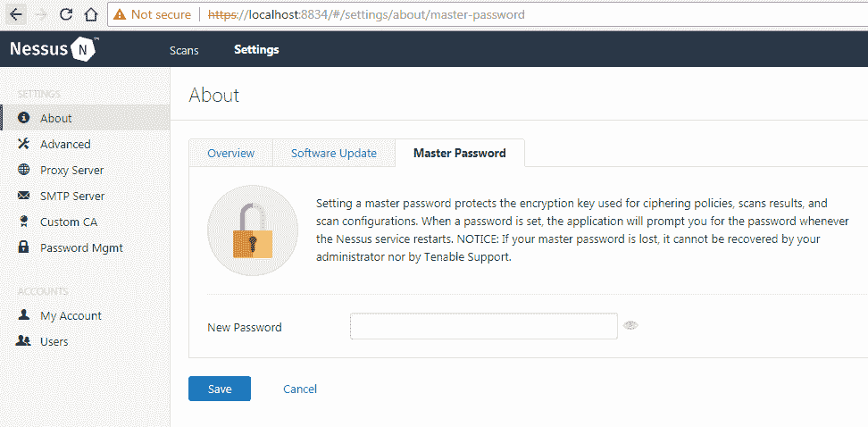
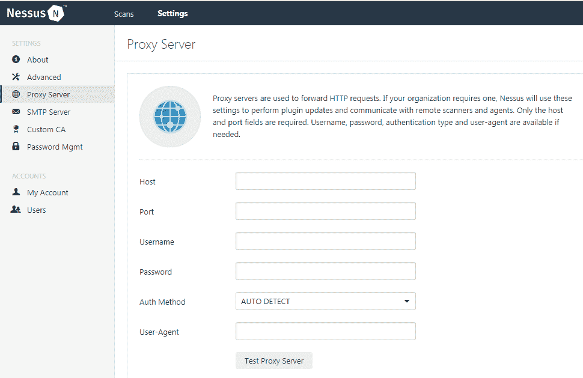
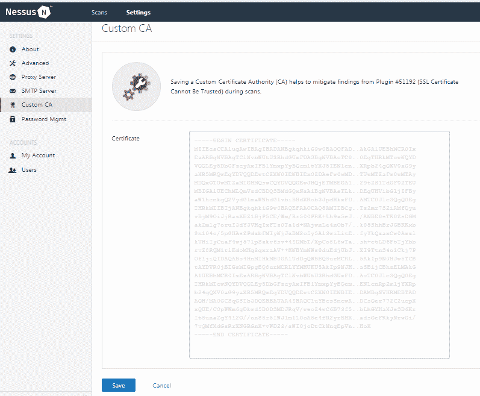
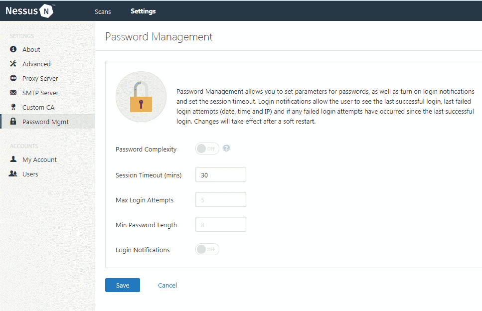
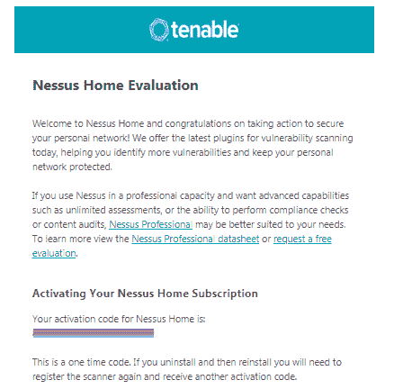
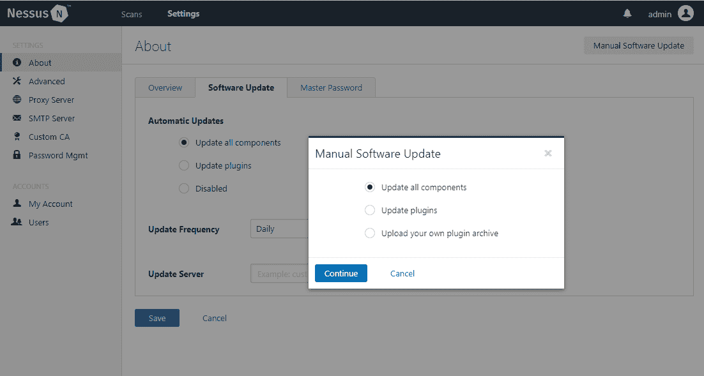
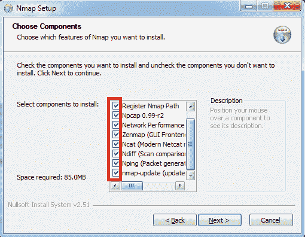

# 二、了解网络扫描工具

在本章中，我们将介绍以下内容：

*   介绍 Nessus 和 Nmap
*   安装和激活 Nessus
*   下载和安装 Nmap
*   尼索斯酒店
*   更新 Nmap
*   去除内翻
*   删除 Nmap

# 介绍 Nessus 和 Nmap

在本节中，我们将了解 Nmap 和 Nessus 中提供的各种功能。这有助于用户在使用工具之前充分了解工具及其功能。

# Nessus 的有用特性

Nessus web 界面上的默认屏幕扫描显示在以下屏幕截图中；您可以在此处查看已计划/执行的所有扫描。在右上角，您可以在扫描和设置页面之间切换。接下来，我们将研究扫描界面：


Nessus 默认屏幕的左窗格显示分类为文件夹和资源的多个选项卡。文件夹基本上是服务器上存在的扫描的不同视图。例如，选择垃圾箱显示用户已删除的扫描。通过选择`Trash`文件夹右上角的清除垃圾选项，可以进一步清除垃圾。

资源是最重要的选项之一，Nessus 在其基础上运行扫描。“资源”窗格中有三个可见选项：

*   政策
*   插件规则
*   扫描器

# 政策

要执行 Nessus 扫描，必须创建策略。策略是正在执行的各种配置、方法和扫描类型的集合。多个扫描可以使用一个策略，但每次扫描只能应用一个策略。用户可以导入以前创建的策略，该策略以`.nessus`格式存储，或者单击“创建新策略”。一旦用户选择创建策略，就会根据要在主机上执行的测试用例向他们显示 Nessus 中存在的各种策略模板。以下是 Nessus 提供的各种策略模板列表：



这些模板由执行扫描所需的一系列配置组成，扫描范围从通用到特定攻击。在屏幕截图中显示的 21 个模板中，我们将查看一些模板，以了解策略的组成和工作方式。

我们将在[第 4 章](04.html)、*漏洞扫描中查看策略模板的内容。*

# 插件规则

插件规则允许用户隐藏或更改 Nessus 提供的风险评级；这将允许分析员在大量主机上执行扫描，以将插件配置为较低的风险评级，他们已经应用了解决方法。这将减少大量手动操作。



# 自定义报告

此选项允许用户通过上传并向报告中添加徽标，为特定组织或客户自定义或个性化报告：


# 扫描器

“扫描仪”选项卡显示可用于扫描的扫描仪数量及其详细信息。添加扫描仪不是 Nessus Home 和 Professional 版本中的选项，但可以在 Nessus Security Center 中添加：


单击设置以显示设置菜单。接下来，我们将讨论设置菜单中可用的各种选项的详细信息。

在上一节中，overview 选项卡提供了一个工具概述，如许可证信息、插件信息等；我们来看看*更新 Nessus*配方中软件更新选项卡的使用：

*   **主密码**：Nessus 提供了一个选项，使用主密码作为文件级别的额外保护层，对策略中使用的所有扫描策略和凭据进行加密。您可以在 web 控制台的**设置**菜单中找到：



*   **代理服务器**：需要一台代理服务器在不做任何更改的情况下，通过转发请求和响应来连接多个网络。如果需要在网络中添加代理服务器，您可以在 Nessus 中添加代理服务器，以便 Nessus 到达要扫描的主机。您可以在设置菜单中找到代理服务器选项，如下所示：



*   **SMTP 服务器**：发送邮件需要**简单邮件传输协议**（**SMTP**服务器）。Nessus 提供扫描完成后发送电子邮件通知的选项。您可以配置 SMTP 服务器，以便 Nessus 能够使用此邮件服务器发送通知电子邮件。SMTP 配置选项可作为设置菜单的一部分找到，如下所示：


*   **自定义 CA**：默认情况下，Nessus 使用安装时签名的证书进行基于 web 的访问，以便浏览器信任证书并否定所有证书错误。Nessus 提供了保存自定义 CA 的选项。自定义 CA 选项可作为设置菜单的一部分找到，如下所示：



*   **密码管理**：默认密码和弱密码是系统中最常见的漏洞之一，因此为了保护 Nessus 控制台免受未经授权的访问，我们需要配置强密码。对于管理员，Nessus 提供了一个密码管理选项，管理员可以使用该选项配置密码复杂性、会话超时、最大登录尝试次数和最小密码长度等参数，以确保密码的有效使用。这些可用于保护 Nessus 控制台免受密码和会话相关攻击。密码管理选项可在设置菜单中找到，如下所示：



# Nmap 的各种特性

使用 Nmap 执行网络扫描涉及多个阶段。这些步骤可以由 Nmap 实用程序提供的各种选项定义。用户可以根据自己的要求选择这些选项中的任何一个，以获得特定的网络扫描结果。以下是 Nmap 实用程序提供的选项：

*   主机发现
*   扫描技术
*   端口规格和扫描顺序
*   服务或版本检测
*   脚本扫描
*   操作系统检测
*   时间和性能
*   规避和欺骗
*   输出
*   目标规范

# 主机发现

根据提供的子网，网络由许多主机组成。例如，掩码值为 27 的子网将有 32 台主机，而掩码值为 24 的子网将有 256 台主机。在 256 台主机上进行完整端口扫描，而不知道其中哪些主机处于活动状态，可能需要一生的时间。为了减少 Nmap 生成和处理的流量，我们可以基于活动和非活动主机过滤网络主机。这将允许 Nmap 减少不必要的分析并更快地获得结果。

# 扫描技术

Nmap 根据要生成的数据包类型提供各种扫描技术选项，这取决于其不同的性质和网络中使用的保护机制。这些技术使用不同的报头值构造数据包以获得 ACK 或 RST 数据包，根据这些数据包确定并显示端口的性质。如前所述，其中一些扫描类型用于逃避检测并确保网络中用户的匿名性。

# 端口规格和扫描顺序

默认情况下，如果未规定要扫描的端口范围，Nmap 将扫描前 1000 个最常用的端口，即在网络中最常打开的端口。这些扫描选项允许用户指定要扫描的端口及其扫描顺序。

# 服务或版本检测

Nmap 拥有大约 2200 个著名服务的数据库。一旦检测到端口处于打开状态，这些选项可用于确定正在运行的服务的确切类型和版本。Nmap 通过使用特定请求查询这些端口并分析收到的响应来实现这一点。

# 脚本扫描

Nmap 有一个脚本引擎，这是程序的一个特别强大的功能，它允许用户编写或使用已经可用的脚本，通过向这些脚本传递参数，在打开的端口上执行特定任务。

# 操作系统检测

Nmap 的操作系统检测选项帮助用户识别远程主机使用的操作系统。这将帮助用户进一步创建特定于目标的操作，并解决未来的兼容性问题。Nmap 使用 TCP/UDP 堆栈指纹机制识别操作系统。

# 时间和性能

Nmap 提供了多个选项，用户可以使用这些选项定义与时间有关的多个扫描参数，例如速率、超时和并行度。这将允许用户配置扫描以更快地获得结果，从而在扫描多个主机和网络时提高扫描性能。

# 规避和欺骗

现在有许多网络安全解决方案，例如防火墙和 IDS/IPS，它们可以阻止 Nmap 生成的网络流量。Nmap 提供诸如碎片、诱饵扫描、欺骗和代理等选项，以规避这些网络安全解决方案，并成功完成扫描并获得结果。

# 输出

Nmap 不仅是一个强大的扫描工具，而且具有强大的报告机制。它提供多种格式的综合报告，以 XML 和文本格式显示输出。

# 目标规范

Nmap 提供了多个目标规范选项，用户可以使用这些选项提及要扫描的子网、单个 IP、IP 范围和 IP 列表。这将允许用户扫描主机发现中标识的特定主机。

Nmap 的完整语法示例如下：

```
Nmap -sS -sV -PN -T4 -oA testsmtp -p T:25 -v -r 192.168.1.*
```

根据用户需求，一旦提供了所需的选项和参数，用户就可以执行扫描并获得输出。在下一章中，我们将介绍如何使用 Nmap 执行网络扫描的方法。

作为本章的一部分，我们将介绍如何为 Nmap 和 Nessus 选择正确的软件版本，以及它们的安装和删除。这些食谱旨在帮助新受众了解需求，以及需求在不同平台之间的变化

# 安装和激活 Nessus

Nessus 是由 Tenable Network Security 开发的漏洞扫描器。它扫描主机和子网，查找网络级和服务级漏洞。Nessus 为非商业用户免费提供受限功能。它由两个主要组件组成：NessusD（Nessus 守护进程）和一个可以托管在同一台机器上的客户端应用。Nessus 守护进程负责执行扫描并将结果交付给客户端应用，以各种格式提供这些结果。Tenable 还开发了增量更新和检测机制，称为插件，可以定期下载和更新。它还提供已知漏洞的额外探测功能；例如，如果发现 FTP 端口打开，Nessus 将自动尝试使用`anonymous`用户登录。Nessus 既有命令行又有 web 界面，但由于其易用性，我们将主要研究基于 GUI 的 web 界面。

# 准备

Nessus 的要求因其中存在的不同组件、可用许可证的类型及其使用而有所不同。

下表描述了 Nessus 硬件要求：

| **场景** | **最低推荐硬件** |
| Nessus 扫描多达 50000 台主机 | **CPU**：4x2GHz 内核**内存**：4GB 内存（推荐 8GB 内存）**磁盘空间**：30GB |
| Nessus 扫描 50000 多台主机 | **CPU**：8 x 2 GHz 内核**内存**：8GB 内存（推荐 16GB 内存）**磁盘空间**：30GB（可能需要额外空间进行报告） |
| Nessus 经理，拥有多达 10000 名代理 | **CPU**：4x2GHz 内核**存储器**：16GB RAM**磁盘空间**：30GB（可能需要额外空间进行报告） |
| Nessus Manager 拥有多达 20000 名代理商 | **CPU**：8 x 2 GHz 内核**内存**：64 GB RAM**磁盘空间**：30GB（可能需要额外空间进行报告） |

*   Nessus 代理：这是为了消耗更少的内存而设计的，因为进程的优先级较低，并且在需要时都会让 CPU 处理。Nessus Agent 可以安装在满足下表中指定要求的虚拟机上：

| **硬件** | **最低要求** |
| 加工机 | 1 个双核 CPU |
| 处理器速度 | <1 千兆赫 |
| 内存 | <1 GB |
| 磁盘空间 | <1 GB |
| 磁盘速度 | 15-50 IOPS |

*   虚拟机：Nessus Agent 支持以下版本的 macOS、Linux 和 Windows 操作系统：

| **操作系统** | **支持的版本（Nessus 代理）** |
| Linux | Debian 7、8 和 9-i386Debian 7、8 和 9-AMD64Red Hat ES 6/CentOS 6/Oracle Linux 6（包括牢不可破的企业内核）-i386Red Hat ES 6/CentOS 6/Oracle Linux 6（包括牢不可破的企业内核）-x86_64Red Hat ES 7/CentOS 7/Oracle Linux 7-x86_64Fedora 24 和 25-x86_64Ubuntu 12.04、12.10、13.04、13.10、14.04 和 16.04-i386Ubuntu 12.04、12.10、13.04、13.10、14.04 和 16.04-AMD64 |
| 窗户 | Windows 7、8 和 10-i386Windows Server 2008、Server 2008 R2、Server 2012、Server 2012 R2、Server 2016、7、8 和 10-x86-64 |
| 马科斯 X | macOS X 10.8-10.13 |

Nessus Manager 支持以下版本的 macOS、Linux 和 Windows 操作系统：

| **操作系统** | **支持的版本（Nessus Manager）** |
| Linux | Debian 7、8 和 9/Kali Linux 12017.1 和 Rolling-i386Debian 7、8 和 9/Kali Linux 12017.1 和 Rolling-AMD64Red Hat ES 6/CentOS 6/Oracle Linux 6（包括牢不可破的企业内核）-i386Red Hat ES 6/CentOS 6/Oracle Linux 6（包括牢不可破的企业内核）-x86_64Red Hat ES 7/CentOS 7/Oracle Linux 7（包括牢不可破的企业内核）-x86_64FreeBSD 10 和 11-AMD64Fedora 24 和 25-x86_64SUSE 11 和 12 企业版-i586SUSE 11 和 12 企业版-x86_64Ubuntu 12.04、12.10、13.04、13.10、14.04 和 16.04-i386Ubuntu 12.04、12.10、13.04、13.10、14.04 和 16.04-AMD64 |
| 窗户 | Windows 7、8 和 10-i386Windows Server 2008、Server 2008 R2、Server 2012、Server 2012 R2、Server 2016、7、8 和 10-x86-64 |
| 马科斯 X | macOS X 10.8-10.13 |

*   浏览器：Nessus 支持以下浏览器：
    *   谷歌浏览器（50 及以上）
    *   苹果 Safari（10 岁及以上）
    *   Mozilla Firefox（50 及以上）
    *   Internet Explorer（11 及以上）
*   PDF 报告：Nessus`.pdf`报告生成功能需要最新版本的 Oracle Java 或 OpenJDK。在安装 Nessus 之前安装 Oracle Java 或 OpenJDK。

# 怎么做…

执行以下步骤：

1.  从[下载适用的 Nessus 安装文件 https://www.tenable.com/downloads/nessus](https://www.tenable.com/downloads/nessus) ，确保为正在使用的操作系统选择正确的文件。

对于 64 位 Windows 操作系统，请下载 Nessus-7.1.3-x64.msi。

2.  从[注册并获取激活码 https://www.tenable.com/downloads/nessus](https://www.tenable.com/downloads/nessus) 。带有 Nessus 激活码的电子邮件示例显示在以下屏幕截图中：



3.  按照说明安装下载的`.msi`文件。

4.  Nessus 要求您在安装过程中创建管理员用户，如下所示：


5.  插入从 Tenable 收到的电子邮件中的激活码，如下所示：


6.  确保系统已连接到 internet，以便 Nessus 可以从其服务器自动下载插件。

# 它是如何工作的…

一旦用户在 Windows 操作系统上下载并安装可执行文件，就可以在端口`8834`的 localhost 上的 web 界面上访问 Nessus 软件。为了完成安装，Nessus 需要一个激活码，该激活码可以通过在 Tenable 网站上注册并提供您的一些详细信息获得。一旦通过电子邮件获得密钥，您需要根据使用情况输入激活码，然后单击“继续”以通过下载插件完成安装。无论何时发现新的漏洞，Tenable 都会创建程序和脚本来识别这些漏洞。这些脚本和程序称为插件，使用**Nessus 攻击脚本语言**（**NASL**编写）。这些插件将定期更新，以确保 Nessus 扫描没有遗漏任何最近发现的漏洞。典型的插件包括与漏洞相关的信息，如描述、影响、修复，以及一些漏洞度量，如 CVSS 和 CVE。

当机器连接到 internet 时，如果您使用 Nessus 浏览器界面进行安装，则插件的下载是一个自动过程。在 Nessus 注册许可证后，您应该会看到插件下载屏幕。如果离线安装 Nessus，则在向 Nessus 注册许可证后，您必须从自定义生成的链接手动下载插件。根据您使用的操作系统，下载插件并将 ZIP 或 TAR 文件夹解压缩到以下目录中：

*   在 Linux 中，安装到以下目录：

```
# /opt/nessus/sbin/
```

*   在 FreeBSD 中，安装到以下目录：

```
# /usr/local/nessus/sbin/
```

*   在 macOS X 中，安装到以下目录：

```
# /Library/Nessus/run/sbin/
```

*   在 Windows 中，安装到以下目录：`C:\Program Files\Tenable\Nessus`

解压缩软件包后，可以使用以下命令根据使用的操作系统安装这些插件：

*   在 Linux 中，使用以下命令：

```
# /opt/nessus/sbin/nessuscli update <tar.gz filename>
```

*   在 FreeBSD 中，使用以下命令：

```
# /usr/local/nessus/sbin/nessuscli update <tar.gz filename>
```

*   在 macOS X 中，使用以下命令：

```
# /Library/Nessus/run/sbin/nessuscli update <tar.gz filename>
```

*   在 Windows 中，使用以下命令：`C:\Program Files\Tenable\Nessus>nessuscli.exe update <tar.gz filename>`

# 还有更多…

如果您在连接到 internet 时遇到任何问题，可以选择脱机激活，如以下屏幕截图所示：


为了使 Nessus 离线激活，Nessus 实例正在运行的本地浏览器上会显示质询代码，或者可以使用以下命令手动显示质询代码：

*   在 Linux 上，使用以下命令：

```
# /opt/nessus/sbin/nessuscli fetch --challenge
```

*   在 FreeBSD 上，使用以下命令：

```
# /usr/local/nessus/sbin/nessuscli fetch --challenge
```

*   在 macOS X 上，使用以下命令：

```
# /Library/Nessus/run/sbin/nessuscli fetch --challenge
```

*   在 Windows 上，使用以下命令：

```
C:\Program Files\Tenable\Nessus>nessuscli.exe fetch --challenge
```

前面的命令配置为默认安装目录。将目录更改为您的计算机上安装 Nessus 的位置。

您可以将此质询代码复制到有互联网的机器上，并使用 Nessus 网站上的离线模块生成许可证，网址为[https://plugins.nessus.org/v2/offline.php](https://plugins.nessus.org/v2/offline.php) ，并生成一个许可证字符串。此许可证字符串可以在计算机上使用，可以在浏览器模式或脱机模式下使用，方法是使用以下命令：

*   在 Linux 上，使用以下命令：

```
# /opt/nessus/sbin/nessuscli fetch --register-offline /opt/nessus/etc/nessus/nessus.license
```

*   在 FreeBSD 上，使用以下命令：

```
# /usr/local/nessus/sbin/nessuscli fetch --register-offline /usr/local/nessus/etc/nessus/nessus.license
```

*   在 macOS X 上，使用以下命令：

```
# /Library/Nessus/run/sbin/nessuscli fetch --register-offline /Library/Nessus/run/etc/nessus/nessus.license
```

*   在 Windows 上，使用以下命令：

```
C:\Program Files\Tenable\Nessus>nessuscli.exe fetch --register-offline "C:\ProgramData\Tenable\Nessus\conf\nessus.license"
```

# 下载和安装 Nmap

Nmap 是一个免费的开源网络扫描和审计工具，可在[上获得 https://Nmap.org/](https://nmap.org/) 。此工具是网络级安全审计的最重要组件之一，因为它允许用户通过提供有关开放端口和这些端口上运行的服务的数据来监视或观察主机的网络级状态。Nmap 工具还允许与这些服务交互，以及使用 Nmap 脚本引擎（NSE）运行各种脚本。以下命令是在主机`127.0.0.1`上执行 TCP syn 全端口扫描的语法：

```
Nmap -sS -p1-65535 127.0.0.1
```

在接下来的章节中，我们将研究 Nmap 工具的使用方法。

# 准备

基于用户机器支持的体系结构和操作系统，Nmap 有多种版本和格式。Nmap 还有一个名为 Zenmap 的 GUI 版本，它可以更好地查看选择要运行的命令的选项。它还可以作为默认工具，作为用于攻击和黑客技术的操作系统的一部分，如 Kali Linux。用户可以根据机器的配置选择 Nmap 的类型或版本；例如，我使用的是 Windows 7 64 位操作系统，因此我将选择支持 64 位 Windows 7 操作系统的可执行文件的最新稳定版本。如果您使用的是 64 位 Linux 或 Unix 发行版，可在[下载 rpm 二进制软件包 https://Nmap.org/](https://nmap.org/) 。

# 怎么做…

执行以下步骤：

1.  从[下载适用的 Nmap 版本 http://www.Nmap.org/download.html](http://www.nmap.org/download.html) 。
2.  右键单击下载的文件并选择以管理员身份运行。这是确保该工具具有在您的计算机上正确安装的所有权限所必需的。

3.  之后，您将看到一份开源许可协议。阅读协议并单击我同意，如以下屏幕截图所示：


4.  选择要作为 Nmap 包的一部分安装的各种组件。这些实用程序提供了更多功能，例如数据包生成和比较。如果您觉得不需要这些额外的实用程序，可以取消选中该功能，如以下屏幕截图所示：


5.  选择要安装工具的位置。工具默认建议`C:\Program Files (x86)\Nmap\`路径。单击下一步。
6.  安装需要 Npcap，这是 Windows for Nmap 的包嗅探库。按照安装 Npcap 的说明继续安装 Nmap，并等待安装完成。

# 它是如何工作的…

安装完成后，打开命令提示符并键入`Nmap`。如果 Nmap 工具安装正确，则应加载 Nmap 的使用说明，如下所示：


# 还有更多…

在 Linux 发行版上安装 Nmap 是一个不同的过程。大多数基于 Linux 的操作系统都使用包管理实用程序（如`yum`和`apt`）进行单步安装

确保机器已连接到 internet，并执行以下命令：

*   在 CentOS 上，使用以下命令：

```
yum install Nmap
```

*   在 Debian 或 Ubuntu 上，使用以下命令：

```
apt-get install Nmap
```

# 尼索斯酒店

Nessus 可以手动更新，也可以安排自动更新。软件更新选项可作为设置菜单的一部分找到。这可以用来安排 Nessus 软件的每日、每周或每月更新，甚至只是插件更新。默认情况下，Nessus 使用其云服务器下载和安装更新，但您也可以配置自定义服务器来下载这些更新。

# 准备

您可以在连接到 internet 或脱机时更新 Nessus。如果您想要无麻烦或快速的更新，您可以确保系统已连接到 internet。

但是，为了离线更新 Nessus，您必须从 Nessus 网站下载更新包。

# 怎么做…

遵循以下步骤：

1.  导航到设置，然后从主页进行软件更新：


2.  选择更新频率：每日、**每周或每月。**
***   如果要 Nessus 从任何内部或外部服务器获取更新，请提供服务器详细信息。*   保存这些设置，它们将自动应用。**

 **5.  要手动安装更新，请导航到设置，然后是软件更新，然后是手动软件更新，如下所示：



6.  选择更新所有组件或更新插件以立即触发更新。
7.  如果机器未连接到互联网，您可以从 Tenable 网站下载更新包，并通过选择**上传您自己的插件档案**进行更新。

# 还有更多…

Nessus 拥有一个评估许可证，该许可证对您可以扫描的 IP 地址数量有限制，以及一个完整许可证，购买时间为一定长度，并且对您可以扫描的 IP 地址数量没有任何限制。Nessus 的完全授权版本可在 Nessus 网站上以每台扫描仪约 2500 美元的价格购买：

1.  选择激活代码旁边的编辑选项。
2.  在显示的框中，选择正在使用的 Nessus 类型。
3.  在**激活码**框中，键入您的新激活码。
4.  选择**激活**。

完成后，Nessus 将下载所需的插件并自动安装它们。

# 更新 Nmap

更新 Nmap 最直接的方法是下载软件的最新可用版本并手动安装该软件包。

# 准备

从[下载最新稳定版本 https://Nmap.org/download.html/](https://nmap.org/download.html) ，确保为当前使用的操作系统选择正确的版本。

# 怎么做…

执行以下步骤：

1.  右键单击下载的文件并选择以管理员身份运行。这是确保该工具具有在您的计算机上正确安装的所有权限所必需的。
2.  之后，您将看到一份开源许可协议。阅读协议并单击我同意，如以下屏幕截图所示：


3.  选择将作为 Nmap 包的一部分安装的各种组件中的哪一个。这些实用程序提供额外的功能，例如数据包生成和比较。如果您觉得不需要这些额外的实用程序，可以取消选中这些功能，如以下屏幕截图所示：



4.  选择要安装工具的位置。`C:\Program Files (x86)\Nmap\`是工具建议的默认路径。然后单击下一步。
5.  安装需要 Npcap。这是 Windows for Nmap 的包嗅探库。按照说明安装 Npcap 并继续安装 Nmap；等待安装完成。

# 去除内翻

删除 Nessus 软件与删除 Nmap 类似。一旦完成，运行服务的端口将是免费的，您将无法再访问 web 界面。

# 准备

移除 Nessus 的步骤因平台而异。在卸载 Nessus 之前，您可能希望备份所有策略，并通过以所需格式导出来扫描数据；例如，美国农业部。

# 怎么做…

按照以下步骤在 Windows 上卸载 Nessus：

1.  在 Windows 机器上导航至**控制面板**
2.  选择**卸载或更改程序**
3.  在已安装的软件列表中找到并选择 Nessus 软件包
4.  点击**卸载**

这将从任何 Windows 计算机上卸载 Nessus 软件及其数据。

# 还有更多…

在 Linux 上卸载 Nessus 的操作如下：

要确定要卸载的 Nessus 软件包名称，请针对不同的平台使用以下命令：

*   在 Open Red Hat、CentOS、Oracle Linux、Fedora、SUSE 或 FreeBSD 中，使用以下命令：

```
# rpm -qa | grep Nessus
```

*   在 OpenDebian/Kali 和 Ubuntu 中，使用以下命令：

```
# dpkg -l | grep Nessus
```

*   在 OpenFreeBSD 中，使用以下命令：

```
# pkg_info | grep Nessus
```

使用从上述命令获得的软件包信息作为各平台以下软件包删除命令的输入：

*   在 Open Red Hat、CentOS、Oracle Linux、Fedora 或 SUSE 中，如下所示：

```
# rpm -e <Package Name>
```

*   在 OpenDebian/Kali 和 Ubuntu 中，如下所示：

```
# dpkg -r <package name>
```

*   在 Open FreeBSD 中，如下所示：

```
# pkg delete <package name>
```

使用此处提到的命令删除 Nessus 目录以删除存在的任何其他文件：

*   在 Open Linux 中，使用以下命令：

```
# rm -rf /opt/nessus
```

*   在 Open FreeBSD 中，使用以下命令：

```
# rm -rf /usr/local/Nessus
```

如果在删除 Nessus 过程中遇到任何问题，请停止 Nessus 守护进程并再次尝试删除文件。

执行以下步骤卸载 macOS 上的 Nessus：

1.  导航至**系统首选项**并选择**Nessus**
2.  选择**锁定**选项
3.  输入用户名和密码
4.  选择**停止 Nessus**按钮

删除以下 Nessus 目录、子目录或文件：

*   `/Library/Nessus`
*   `/Library/LaunchDaemons/com.tenablesecurity.nessusd.plist`
*   `/Library/PreferencePanes/Nessus Preferences.prefPane`
*   `/Applications/Nessus`

删除这些文件将确保从计算机上完全卸载软件。

# 删除 Nmap

Nmap 的卸载过程在 Windows 和 Linux 上都非常简单。这将删除 Nmap 安装的所有依赖项和库

# 怎么做…

按照以下步骤在 Windows 上卸载 Nmap：

1.  导航至 Windows 机器的**控制面板**
2.  选择**卸载或更改程序**
3.  在已安装的软件列表中找到并选择 Nmap 软件包
4.  点击**卸载**

这将从任何 Windows 计算机上卸载 Nmap 软件及其数据。

# 还有更多…

在基于 Linux 的发行版中，只需删除与 Nmap 相关的所有文件夹，即可从计算机上卸载 Nmap。如果您从下载的源安装了 Nmap，则在将从您的计算机卸载 Nmap 的同一文件夹中将存在卸载脚本。此外，如果安装在默认位置，可以使用以下命令将其删除：

```
rm -f bin/Nmap bin/nmapfe bin/xnmap
rm -f man/man1/Nmap.1 man/man1/zenmap.1
rm -rf share/Nmap
./bin/uninstall_zenmap
```**