# 四、漏洞扫描

在本章中，我们将介绍以下配方：

*   如何管理 Nessus 策略
*   如何管理 Nessus 设置
*   如何管理 Nessus 用户帐户
*   如何选择 Nessus 策略
*   如何使用 Nessus 执行漏洞扫描
*   如何管理 Nessus 扫描

# 介绍

在本章中，我们将介绍如何将 Nessus 作为一种工具及其各个组件进行管理的各种方法。这些方法将帮助我们获得安装后执行步骤的详细信息，以便能够配置 Nessus 执行各种性质的网络扫描。

# 如何管理 Nessus 策略

我们已经在[第 2 章](02.html)*了解网络扫描工具*中了解了 Nessus 政策的详细信息。为了快速回顾，Nessus 扫描策略由各种设置和内容组成，在执行网络漏洞扫描或合规性审核时使用这些设置和内容。此扫描可由任何 Nessus 用户创建，并可供其他用户使用，这些用户也可以执行扫描。可以根据用户需求复制、导入和导出这些策略。策略导出的唯一限制是无法导出特定于主机的数据，如 Nessus 审核文件和凭据详细信息。一旦用户登录 Nessus web 控制台，这些策略将作为主屏幕上提到的资源菜单的一部分提供：

当用户尝试创建新策略时，Nessus 会提供预先存在的扫描模板，可通过自定义扫描模板的参数来使用该模板创建新模板：

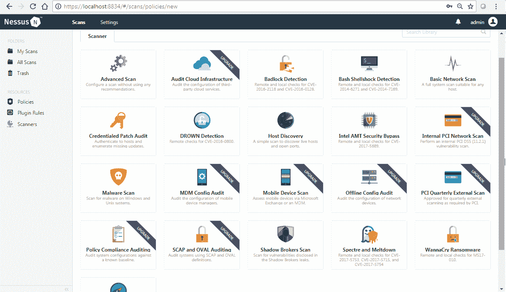

扫描模板

# 准备

要执行此活动，您必须在计算机上满足以下先决条件：

*   你必须安装 Nessus
*   您必须具有对要在其上执行扫描的主机的网络访问权限

要安装 Nesus，您可以按照[第 2 章](02.html)、*了解网络扫描工具*中提供的说明进行操作。这将允许您下载 Nessus 的兼容版本并安装所有必需的插件。要检查您的机器是否安装了 Nessus，请打开搜索栏并搜索`Nessus Web Client`。找到并单击后，将在默认浏览器窗口中打开：

如果您确信 Nessus 安装正确，您可以直接从浏览器中使用`https://localhost:8834`URL 打开 Nessus Web 客户端。如果找不到 Nessus Web 客户端，则应删除并重新安装 Nessus。Nessus 的拆卸和安装说明参见[第 2 章](02.html)、*了解网络扫描工具*。如果您已找到 Nessus Web 客户端，但无法在浏览器窗口中打开它，则需要检查 Nessus 服务是否正在 Windows 服务实用程序中运行：

此外，您可以根据需要使用服务实用程序启动和停止 Nessus。为了进一步使用命令行界面确认安装，您可以导航到安装目录，在那里可以查看和访问 Nessus 命令行实用程序：

# 怎么做…

执行以下步骤：

1.  打开 Nessus Web 客户端。
2.  使用您在安装过程中创建的用户登录 Nessus 客户端：

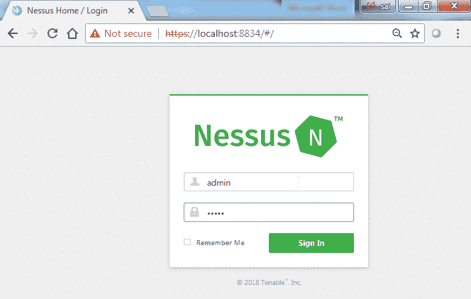

3.  单击主屏幕左侧资源下的策略选项，以查看策略屏幕：

4.  单击“创建新策略”和“基本网络扫描”：

5.  详细填写姓名和说明，如下所示：

6.  将组权限设置为可以使用。
7.  导航到“查找”选项卡，并从下拉列表中选择要执行的端口扫描类型：

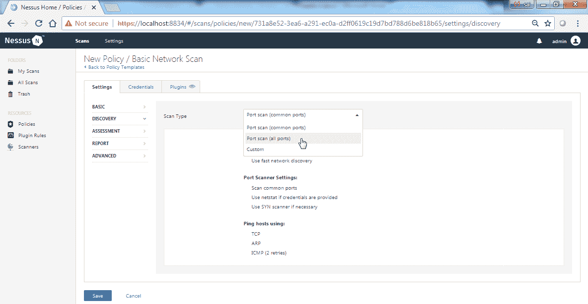

8.  导航到“评估”选项卡，并从下拉列表中选择要执行的评估类型：

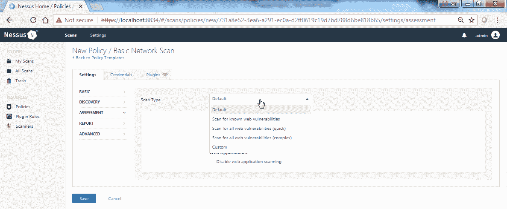

9.  导航到“报告”选项卡并选择 Nessus 的设置，以便根据您的要求准备报告：

10.  导航到“高级”选项卡，并根据需要从下拉列表中选择扫描设置：

11.  如果选择“自定义”，则“高级”选项卡下方将显示一个新的“常规”选项卡，以便您可以进一步自定义扫描设置：

12.  保存扫描。这将带您从*步骤 2*进入策略屏幕，其中列出您创建的当前策略：

13.  您可以选中策略名称旁边的复选框，然后单击右上角的“更多”下拉列表，从策略的复制、导出和删除选项中进行选择：

14.  请注意上一步，然后单击“导出”将策略导出到您的系统中：

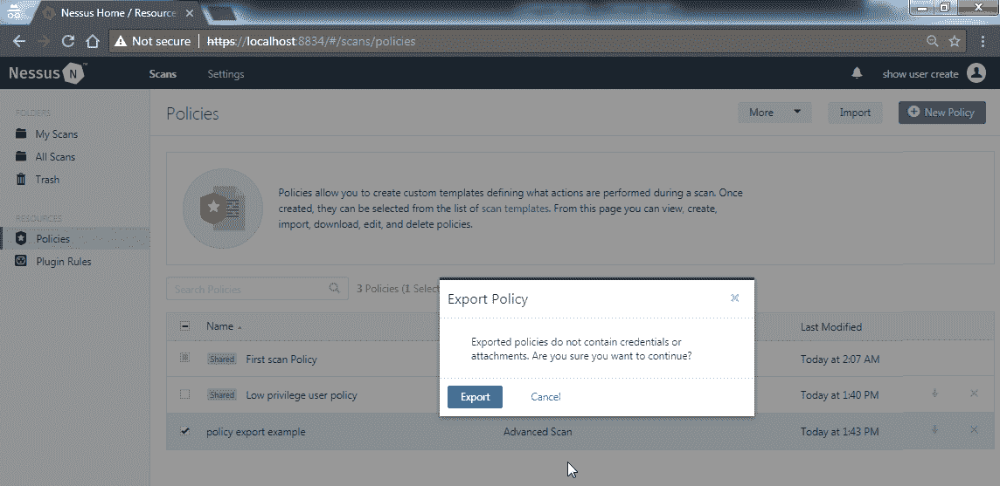

15.  点击导出。一个`.nessus`文件将被下载到您的系统上：

16.  要导入此文件，请单击导入并上载下载的`.nessus`文件：

17.  上载的策略现在在用户的策略屏幕中可见：

# 它是如何工作的。。。

已创建的策略可用于由不同的用户执行扫描。这些策略可以导入并导出到另一个 Nessus 环境中，从而避免创建新策略。

# 如何管理 Nessus 设置

在[第 2 章](02.html)*了解网络扫描工具*中，我们已经了解了很多关于 Nessus 设置的知识。为了快速回顾，在 Nessus 设置中，我们可以查看 Nessus 中提供的各种选项。Nessus 设置包括大约、高级、代理服务器、SMTP 服务器、自定义 CA 和密码管理。这些菜单有更多的子设置，它们有特定的用途。我们将看到如何使用*中的每个菜单来配置。。。*节。

# 准备

此部分与*如何管理 Nessus 策略*配方中的*准备*部分相同。

# 怎么做…

执行以下步骤：

1.  打开 Nessus Web 客户端。
2.  使用安装期间创建的用户登录 Nessus 客户端。
3.  通过单击主屏幕上的设置选项导航到设置屏幕，主屏幕直接显示关于菜单下的选项：

4.  通过导航到“软件更新”菜单并选择您喜欢的更新频率和类型来管理软件更新设置：

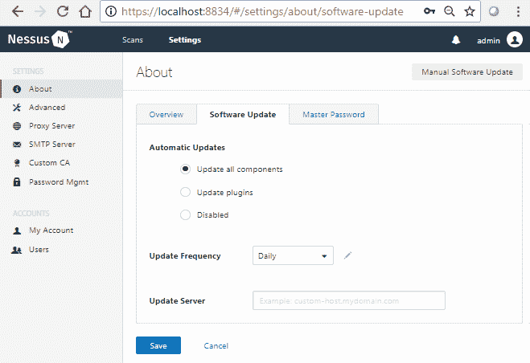

5.  导航到主密码部分以加密所有 Nessus 存储库、策略、结果和配置，设置主密码：

6.  导航到左侧窗格中“设置”下的“高级”选项卡。这允许用户配置 45 种不同的全局设置，这些设置适用于所有已配置的策略和用户，例如日志文件、插件和路径设置：

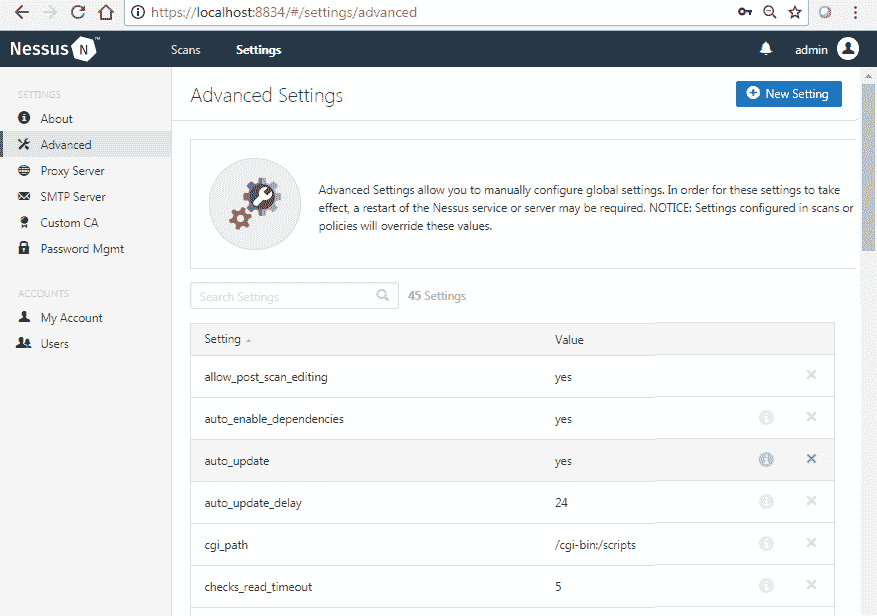

7.  导航到左侧窗格中“设置”下的“代理服务器”选项卡。在这里，您可以为 Nessus 配置代理服务器以转发请求。当要扫描的主机和 Nessus 之间存在代理服务器时，使用此选项：

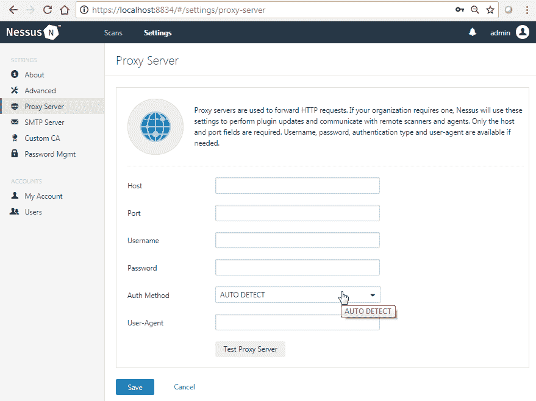

8.  导航到左侧窗格中“设置”下的“SMTP 服务器”选项卡。这允许用户为用户要求 Nessus 发送的任何电子邮件通知配置 SMTP 设置，例如扫描后完成：

9.  导航到左侧窗格中“设置”下的“自定义 CA”选项卡。在这里，用户可以上载自定义 CA 签名，用于避免 SSL 相关发现中出现误报：

10.  导航到左侧窗格中“设置”下的“密码管理”选项卡。在此，管理员可以配置所有用户和组遵循的密码策略：

# 它是如何工作的。。。

这些是为所有用户配置的全局设置，允许管理员为所有用户管理 Nessus 控制台。这些设置对于一些功能（如电子邮件通知和代理服务器配置）的功能也至关重要。

# 如何管理 Nessus 用户帐户

Nessus 是一个多用户环境，其中一个管理员用户可以创建多个用户帐户并配置全局设置，并允许他们配置本地策略设置。为了能够使用用户管理，Nessus 提供了两个菜单选项：“我的帐户”和“用户”。我的帐户用于管理您自己的帐户，“用户”选项卡用于管理员管理/创建/删除用户。在本食谱中，我们将看到这些设置的各种组件，以及如何使用这些组件来管理 Nessus 用户。

# 准备

此部分与*如何管理 Nessus 策略*配方中的*准备*部分相同。

# 怎么做…

执行以下步骤：

1.  打开 Nessus Web 客户端。
2.  使用安装期间创建的用户登录 Nessus 客户端。

3.  通过单击 ACCOUNTS 部分下的主屏幕导航到 My Account 屏幕，该部分有两个子选项 Account Settings 和 API Key：

此页面上的设置可用于更改管理员用户的密码，还可设置电子邮件通知功能使用的电子邮件 ID，并保存设置。

4.  导航到帐户设置旁边的 API 密钥选项卡。在这里，您可以配置 API 密钥以使用 Nessus rest API 进行身份验证。您可以通过单击 Generate 按钮创建新的 API 键，如下所示：

确保将这些密钥存储在专用文件夹中，并应用所有与密钥管理相关的安全最佳做法。

5.  单击“帐户”部分下的主屏幕，导航到用户屏幕。这将显示 Nessus 中当前存在的用户：

6.  单击右上角的新用户以创建新用户并填写详细信息：

在前面的屏幕截图中，您可以看到管理员可以将用户角色分配为标准管理员或系统管理员。让我们分配标准角色并检查用户权限之间的差异：

已创建具有标准权限的新用户`show_user_create`。您可以清楚地发现用户之间的权限差异，如下面的屏幕截图所示。在这里，标准用户没有用户创建和帐户管理权限。

# 它是如何工作的。。。

用户管理允许管理员创建新用户并管理他们自己的帐户。这允许将要执行的各种扫描分离，而不必使用一个帐户来执行所有扫描。这是因为 Nessus 还允许同时登录。一个具有不同用户扫描的帐户使得用户很难在给定的时间点识别其扫描，即使可以将其移动到不同的文件夹中。

# 如何选择 Nessus 扫描模板和策略

Nessus 允许用户将扫描自定义到最低程度，甚至允许用户过滤将要使用的插件，并禁用将不使用的插件。每一次扫描都有其独特的方式。例如，如果用户希望执行认证扫描，则他/她不能使用主机发现扫描模板创建新策略。为了执行认证扫描，用户必须选择一个基本网络扫描或一个高级扫描，该扫描具有一个功能，用户可以输入凭证，以便与要扫描的机器进行身份验证。因此，在创建策略之前选择 apt 扫描模板以及在创建不同策略之后选择 apt 策略非常重要。第二个选项是选择先前创建的模板或导入可用于执行扫描的现有模板。

用户还可以通过单击“新建扫描”并选择现有模板，随时创建策略。这种方法的唯一缺点是无法保存与自定义设置一起使用的策略或扫描模板。您必须创建一个类似的新策略或使用同一主机重新扫描它，这将创建扫描历史记录。这在重新检查扫描结果时造成了复杂性。在此配方中，我们将研究免费版本中可用的扫描模板以及用户可以创建的策略。

# 准备

此部分与*如何管理 Nessus 策略*配方中的*准备*部分相同。

# 怎么做…

执行以下步骤：

1.  打开 Nessus Web 客户端。
2.  使用安装期间创建的用户登录 Nessus 客户端。

3.  导航到主屏幕上“资源”部分下的“策略”选项卡。这将列出所有用户创建的现有策略（仅配置为与所有人共享）：

4.  您可以从现有策略中进行选择，也可以导入策略。

5.  如果没有满足您要求的现有策略，您可以创建新策略：

除高级扫描外，没有其他扫描模板可以配置插件。

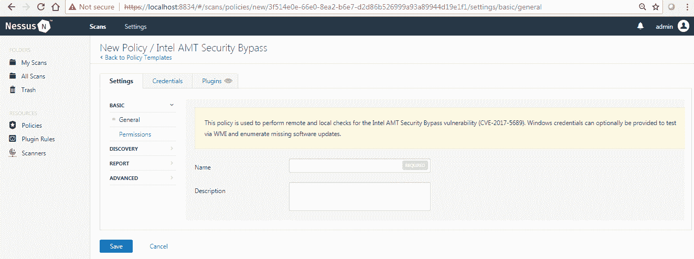

6.  选择特定模板后，创建策略并保存，如*如何管理 Nessus 策略*配方所示。
7.  创建策略后，您可以从“新建扫描”任务的“策略”屏幕的“用户创建的策略”部分中选择要扫描的策略：

8.  通过选择模板并填写详细信息，您还可以在创建新扫描时选择策略。

# 它是如何工作的。。。

为了正确执行扫描，选择 apt 策略同样重要。这将帮助用户获得正确的结果，并在确认和报告漏洞时节省大量时间。例如，如果用户想知道打开的端口，他或她去执行高级扫描，他/她将获得配置审计、补丁审计和扫描中使用的许多不必要的插件的结果。相反，如果用户选择了基本网络扫描，他/她将发现的只是打开的端口和影响这些主机上运行的服务的漏洞列表。

# 如何使用 Nessus 执行漏洞扫描

通过遵循前面的方法，用户应该能够理解策略的创建和选择。一旦确定了策略，用户需要做的就是识别要扫描的主机，选择策略，然后单击扫描。Nessus 对单个主机（打开的端口很少）进行非必要扫描的一般扫描时间将需要几分钟。随着主机和端口数量的不断增加，扫描所需的时间也越来越长。

始终建议在执行 Nessus 扫描之前通知利益相关者，因为这将导致事件调查的开销，即是否对主机执行了攻击，并告知网络管理员网络带宽利用率是否可能高于正常情况。

# 准备

此部分与*如何管理 Nessus 策略*配方中的*准备*部分相同。此配方还要求用户学习本章中之前的配方。

# 怎么做…

执行以下步骤：

1.  打开 Nessus Web 客户端。
2.  使用安装期间创建的用户登录 Nessus 客户端。
3.  单击创建新扫描。

4.  选择基本网络扫描模板并填写扫描所需的详细信息，例如名称、说明、用于扫描的远程主机，对于非必要扫描，请将凭据留空：

您可以换行或用逗号分隔输入要扫描的主机。您还可以上载要扫描的主机列表：

您还可以通过启用 schedule（计划）菜单中的 configuration（配置）选项，为将来的时间和日期安排扫描：

5.  启动扫描：

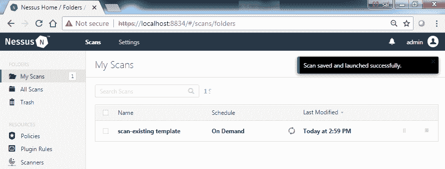

6.  扫描完成后，打开扫描以查看结果：

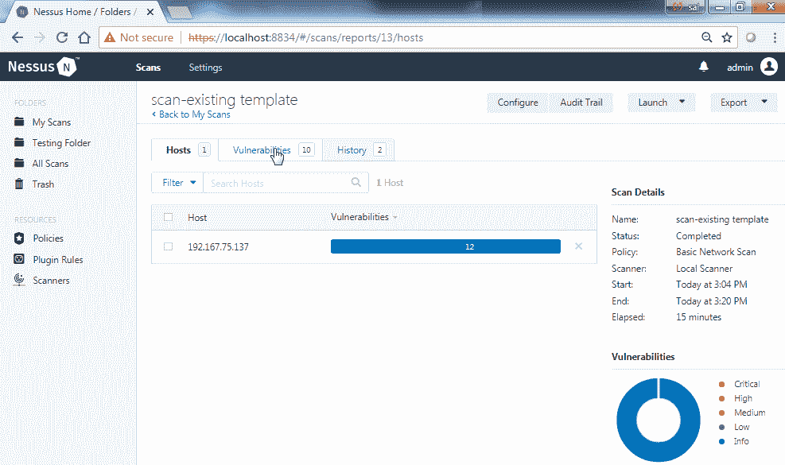

此外，要查看漏洞的名称，您可以单击工具栏或“漏洞”选项卡：

7.  选择基本网络扫描模板，并填写扫描所需的详细信息，如名称、说明、用于扫描的远程主机，以及凭据扫描的凭据：

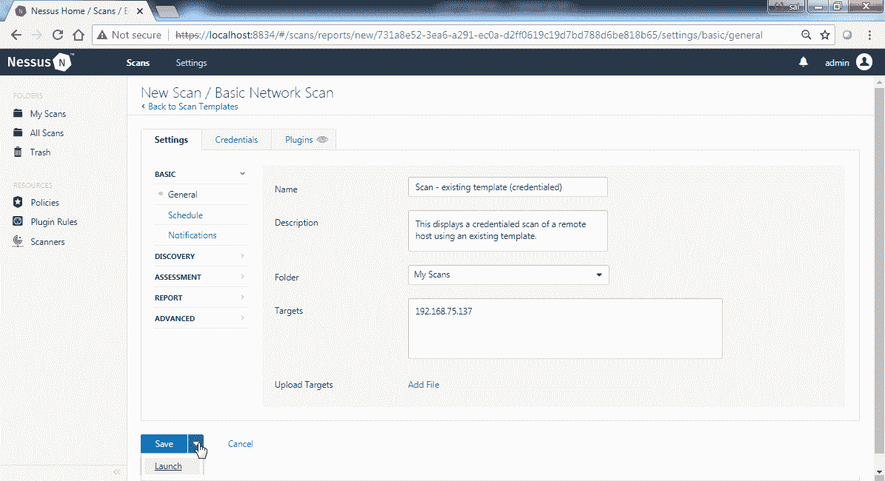

我们将为基于密码的 SSH 身份验证输入凭据，因为主机是 Linux 平台。Nessus 还支持基于 Windows 的身份验证：

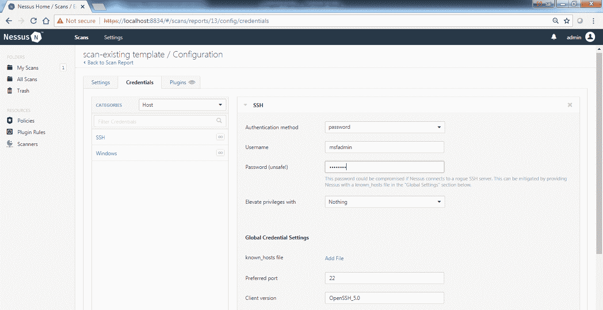

8.  启动扫描：

9.  扫描完成后，打开扫描以查看结果：

此外，要查看漏洞的名称，您可以单击工具栏或“漏洞”选项卡：

Nessus 还为 Nessus 应提及的具体补救措施提供了单独的选项卡。您还可以查看扫描历史记录：

10.  如果未按照您的要求执行扫描，则不会再次执行整个扫描。相反，您可以使用扫描结果页面右上角的配置选项重新配置扫描设置并启动新扫描：

11.  这将创建使用相同模板执行的扫描的历史记录。您可以单击要查看其历史记录结果的相应扫描，从而获得扫描结果：

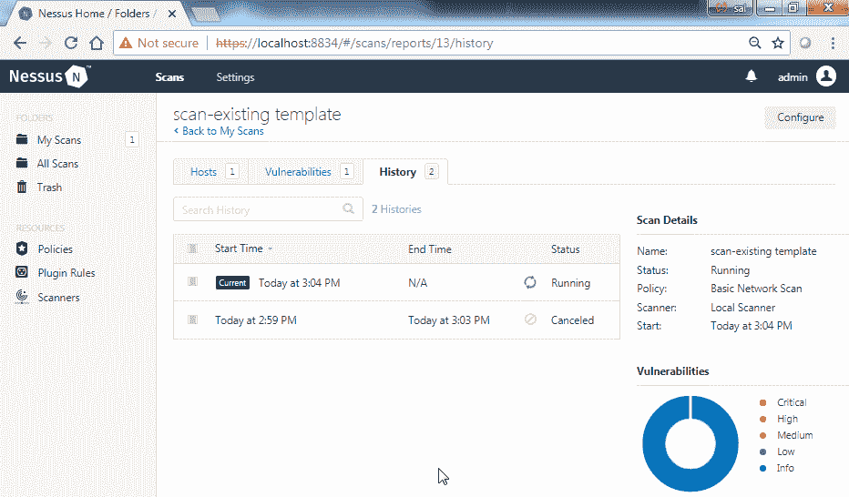

同样，通过在“新建扫描”屏幕上选择用户定义的模板，可以使用用户定义的策略执行扫描：

通过从下拉列表中选择相应的格式，可以将已执行扫描的报告导出为 Nessus 中可用的不同格式。我们将在接下来的章节中进一步研究报告。

# 它是如何工作的。。。

Nessus 扫描有多种选项，如有凭证、无凭证、合规性审计和 ASV 扫描。通过执行这些自动扫描，一个简单的网络工程师将能够确定组织 IT 基础架构的安全态势。

# 如何管理 Nessus 扫描

一旦执行，Nessus 扫描可以进一步隔离到文件夹中，以避免不同的扫描聚集在一起。这也使审计员能够轻松地访问结果。用户可以在 Nessus 上创建/删除/移动/复制扫描。在本配方中，我们将介绍用户在完成 Nessus 扫描时可以执行的各种操作。

# 准备

此部分与*如何管理 Nessus 策略*配方中的*准备*部分相同。此配方还要求用户已学习并完成本章中之前的配方。

# 怎么做…

执行以下步骤：

1.  打开 Nessus Web 客户端。
2.  使用安装期间创建的用户登录 Nessus 客户端。
3.  您可以使用主屏幕右上角的“新建文件夹”选项创建新文件夹：

4.  创建新文件夹后，用户可以导航到该文件夹并创建新扫描，以便在该文件夹中填充结果，而不会显示在主屏幕上：

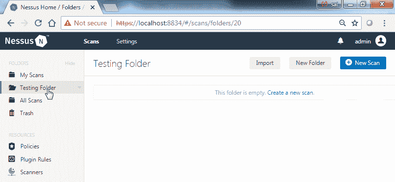

5.  您还可以通过选择扫描并单击 Nessus 主屏幕右上角的“移动到文件夹”选项，将已完成的现有扫描复制或移动到已创建的文件夹：

这将通过将主扫描报告保留在主屏幕上，在文件夹中创建扫描副本：

6.  扫描在`Testing Folder`中创建的副本：

将扫描移动到`Testing Folder`将从主屏幕删除扫描，并将原稿移动到文件夹：

现在，您可以删除移动到`Testing Folder`的扫描：

7.  您还可以通过选择特定扫描并将其移动到垃圾箱来删除扫描：

# 它是如何工作的。。。

当默认 Nessus 文件夹中存在大量扫描结果时，对 Nessus 扫描进行排序可能会成为一项繁琐的任务。相反，前面的选项将帮助用户隔离 Nessus 扫描并维护文件夹，以便他们可以随时随地访问结果。