# 配置审核

在本章中，我们将介绍以下内容：

*   引入符合性扫描
*   选择符合性扫描策略
*   引入配置审核
*   执行操作系统审核
*   执行数据库审核
*   执行 web 应用程序扫描

# 引入符合性扫描

在本章中，我们将介绍 Nessus 在执行各种审计（如认证扫描）和执行策略合规性审计（如操作系统审计、数据库审计和应用程序审计）方面的重要性。这是网络安全白盒评估的关键部分，因为这允许内部管理员或审计员了解组织中系统的安全状况。

# 选择符合性扫描策略

整个合规性扫描或审计不同于典型的漏洞扫描；它完全依赖于插件和 Nessus 审计文件。我们已经在[第 2 章](02.html)*了解网络扫描工具*中介绍了如何下载和更新插件的基础知识。现在，我们将进一步了解有关插件和 Nessus 审计文件的详细信息。在本配方中，我们将了解如何从 Nessus 中预加载的一组策略中选择正确的基线策略，以便对 Linux 主机执行配置审核。

# 插件

每个插件都包含用于检查软件、服务和操作系统的一个或多个版本的特定漏洞的语法。类似操作系统/服务/软件的一组插件被分组为一个插件系列，如下所示：

这些插件系列扩展成不同的插件，每个插件都执行特定的检查。用户不能手动添加插件；他们只能下载或更新新的或丢失的插件，只有当它们由 Tenable 提供时。每个插件都有一组参数来帮助用户理解插件。下一节将更详细地讨论这些参数。

# 提要

本节包含有关该漏洞的简要信息，并作为该漏洞的标题。

# 描述

本节深入了解受影响的确切组件和版本（如果可用）的漏洞，以及有关漏洞的详细信息。这允许用户了解服务或软件的哪个部分易受攻击，以及整个漏洞。

# 解决方案

本节向用户提供修复的详细信息，如要执行的配置更改或代码更改，或 Tenable 或任何其他可信来源关于如何缓解漏洞的文章链接。

# 插件信息

本节包含将插件与其他插件区分开来的参数。参数包括 ID、版本、类型、发布日期和修改日期。这些参数充当插件的元数据。

# 风险信息

本节提供了有关漏洞严重性的信息，以及全球公认的漏洞评分标准之一的**通用漏洞评分系统**（**CVSS**数据。严重性评级从关键到信息不等；CVSS 分数为 1-10 分。

# 脆弱性信息

本节使用**国家漏洞数据库**（**NVD**当前维护的**通用平台枚举**（**CPE**索引）提供插件适用的平台的详细信息。此外，它还使用可用漏洞利用率和漏洞利用难易程度等参数提供有关漏洞可利用性的信息。它还包括插件的发布日期。

# 参考信息

本节包含有关由各种已知机构（如 NVD 和 Secunia）发送到插件的漏洞的参考 ID 的信息。这些参考资料包括 EDB-ID、BID、Secunia 和 CVE-ID。

每个插件、插件系列，甚至所有插件都可以根据用户的要求启用和禁用，从而允许用户减少扫描时间，只使用必要的插件执行扫描。以下屏幕截图显示禁用的单个插件：

以下屏幕截图显示了禁用的整个插件系列：

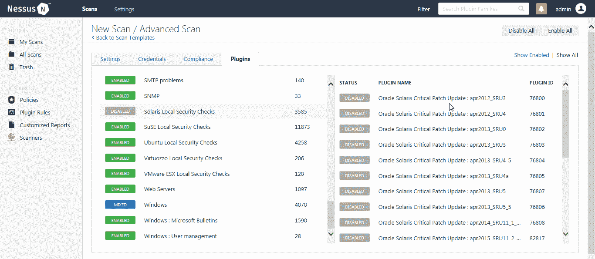

以下屏幕截图显示了使用屏幕右上角的 Disable all 按钮禁用的所有插件：

执行符合性扫描所需的插件的非常重要的组件是策略符合性插件。这些插件将与提供的审计文件一起使用，以识别操作系统级别、服务级别和配置级别的漏洞。例如，如果要对 Windows 执行符合性扫描，可以禁用所有剩余插件，只启用 Windows 符合性检查，如下所示：

# 合规标准

为了执行某些业务操作或确保其信息的安全性，必须遵守不同部门的许多标准，并且要求组织遵守这些标准。例如，大多数支付网关或任何与支付相关的功能都需要根据 PCI 标准进行测试才能被认为是安全的。

以下是市场上相关组织应遵守的一些标准：

*   ETSI**网络安全技术委员会**（**TC 网络**）
*   ISO/IEC 27001 和 27002
*   CISQ
*   多卡拉
*   NERC
*   NIST

*   ISO 15408
*   RFC 2196
*   ANSI/ISA 62443（原 ISA-99）
*   **ISA 安全合规研究所**（**ISCI**合规评估项目
*   ISCI 认证产品
*   ISO 17065 和全球认证
*   化学、石油和天然气工业
*   IEC 62443
*   IEC 62443 认证计划
*   艾斯梅
*   银行监管机构

审核员根据行业标准基线创建一份检查表，以确定差距，从而使组织能够努力填补差距，使之符合要求并获得认证。Nessus 中的法规遵从性模块以类似的方式工作。它可以识别配置差距、数据泄漏以及对各种基准的遵从性。

Nessus compliance 模块提供默认审核文件，以对照运行的操作系统、网络设备、软件和服务的基准检查合规性。Nessus 已预装了**互联网安全中心**（**CIS**）、**健康保险可携带性和责任法案**（**HIPAA**）和**可维护网络安全**（**TNS**的审计文件。它还允许用户使用**Nessus 攻击脚本语言**（**NASL**编写自定义审计文件。我们将在[第 7 章](07.html)*了解 Nessus 和 Nmap*的定制和优化。

# 准备

要执行此活动，您必须在计算机上满足以下先决条件：

*   安装 Nessus
*   获取对要执行扫描的主机的网络访问

要安装 Nesus，您可以按照[第 2 章](02.html)、*了解网络扫描工具*中提供的说明进行操作。这将允许您下载 Nessus 的兼容版本并安装所有必需的插件。要检查您的计算机上是否已安装 Nessus，请打开搜索栏并搜索 Nessus Web 客户端。找到并单击后，将在默认浏览器窗口中打开：

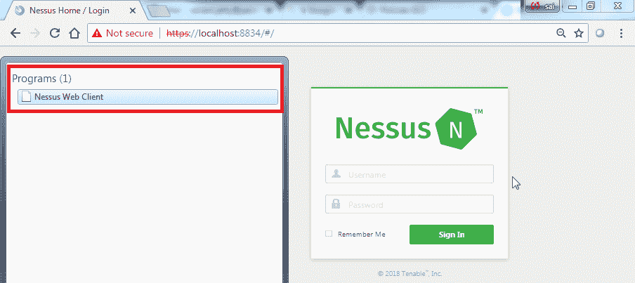

如果您确定 Nessus 安装正确，您可以直接在浏览器中使用`https://localhost:8834`URL 打开 Nessus Web 客户端。如果找不到 Nessus Web 客户端，则应删除并重新安装 Nessus。Nessus 的拆卸和安装说明参见[第 2 章](02.html)、*了解网络扫描工具*。如果您找到了 Nessus Web 客户端，但无法在浏览器窗口中打开它，则需要检查 Nessus 服务是否正在 Windows 服务实用程序中运行，如下所示：

您还可以根据需要使用服务实用程序启动和停止 Nessus。为了使用命令行界面进一步确认安装，您可以导航到安装目录以查看和访问 Nessus 命令行实用程序：

始终建议具有管理员或根级别的凭据，以便扫描仪能够访问所有系统文件。与未经认证的扫描相比，这将允许扫描仪执行更深的扫描并填充更好的结果。策略合规模块仅在 Nessus 的付费版本中可用，如 Nessus Professional 或 Nessus Manager。为此，您必须从 Tenable 购买激活密钥，并在设置页面中进行更新，如下所示：

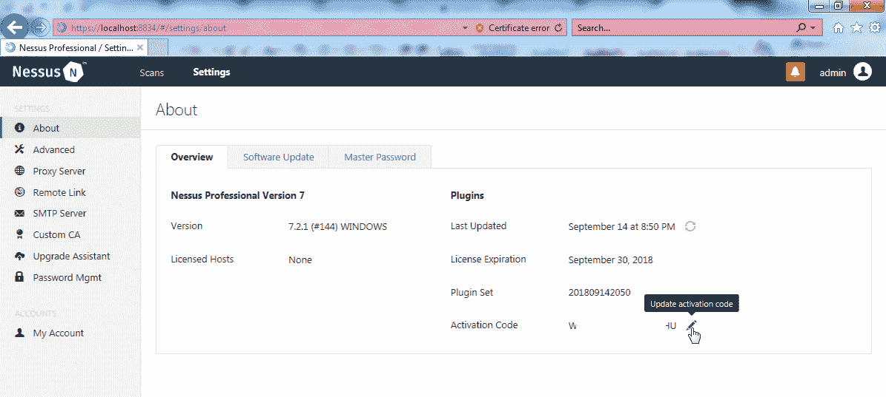

单击编辑按钮打开一个窗口，输入从 Tenable 购买的新激活码：

为了测试扫描，我们需要安装一个虚拟机。为了运行虚拟机，我建议使用 VMware，它可以从[下载并安装 https://www.vmware.com/products/workstation-pro/workstation-pro-evaluation.html](https://www.vmware.com/products/workstation-pro/workstation-pro-evaluation.html) 。

对于测试系统，读者可以从[下载 Metasploitable（Rapid 7 提供的易受攻击的虚拟机）https://information.rapid7.com/download-metasploitable-2017.html](https://information.rapid7.com/download-metasploitable-2017.html) 。应用以下步骤打开 Metasploitable。这提供了各种组件，包括操作系统、数据库和易受攻击的应用程序，这将帮助我们测试本章中的配方：

1.  解压缩下载的 Metasploitable 包：

2.  使用已安装的 VMware 工作站或 VMware Player 打开`.vmx`文件：

3.  使用`msfadmin`/`msfadmin`作为用户名和密码登录：

# 怎么做…

执行以下步骤：

1.  打开 Nessus Web 客户端。
2.  使用安装期间创建的用户信息登录 Nessus Web 客户端。
3.  单击策略选项卡并选择创建新策略。
4.  选择高级扫描并填写所需的详细信息：

5.  导航到 Compliance 选项卡并搜索 Nessus 中提供的 Linux 基准测试：

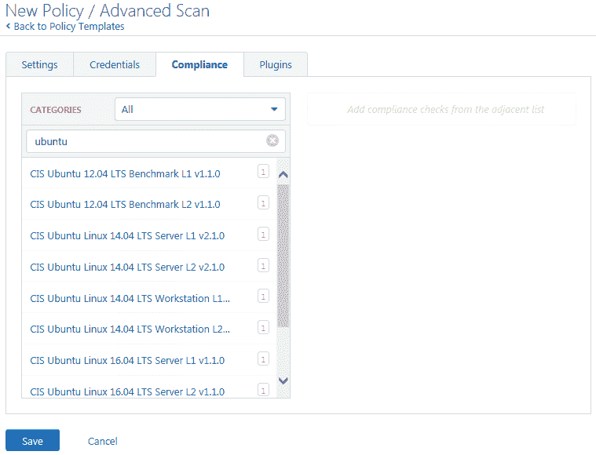

这显示了不同版本 Ubuntu 的各种基准测试。但是为了选择合适的配置文件，我们首先必须确定在测试机器上运行的 Ubuntu 版本。

6.  在测试机上使用`lsb_release –a`命令显示正在运行的 Ubuntu 版本：

很明显，远程测试机器是在 Ubuntu 8.04 上运行的，因此我们必须在可用的审计文件中选择最低的可用版本，以获得大致的结果。

7.  选择 Ubuntu 12.04 的 CIS 基准文件，因为它是可用的最低版本：

如果要配置任何特定的服务器/位置，可以选择更改可用参数，例如 NTP 服务器地址、Hosts.allow 网络、卷影组 ID、Syslog 主机地址和横幅文件位置。另外，如前面的屏幕截图所示，必须输入远程 Ubuntu 主机的 SSH 凭据。

# 它是如何工作的。。。

选择适当的 Nessus 文件对于执行任何合规性扫描都非常重要，因为 NASL 中的底层语法是根据所选的操作系统为每个审计文件定制的。Windows 审核文件在 Linux 上不起作用，反之亦然。为确保选择了正确的策略，建议始终将操作系统版本检查到最后一个小数点，并为最接近的可用小数点选择策略。

# 引入配置审核

配置审核是一种信息安全过程，在该过程中，您准备一个基线配置，然后将其与当前配置进行比较，以执行差距分析，然后努力缩小这些差距，以尽可能接近基线配置。这种弥合差距并达到最大硬化状态的过程称为风险或脆弱性缓解。

大多数公司和组织依靠强大的配置来确保其系统的安全性。一个经过良好加固和修补的系统对于黑客来说是一场噩梦。随着许多公司选择将其运营转移到云端，配置在安全方面的作用比以往任何时候都更大。网络设备中的一个简单失误，允许默认用户登录，将有助于黑客在几分钟内访问整个网络。

常规应用程序有两个主要组件：前端和后端。前端是最终用户作为可见资源访问应用程序的地方。因此，最终用户看不到或无法访问的任何内容都可以被视为后端。这包括 web 服务器、应用程序服务器、数据库服务器、路由器、防火墙以及入侵预防和检测系统。所有这些设备可能在物理上不同，或者由单个服务器集群处理。所有这些都是可以安装在任何物理服务器上的软件；也就是说，可以在具有 Windows 操作系统的普通计算机上安装 Apache Web 服务器。一个简单的 XAMPP 包安装一个 web/app 服务器、一个数据库和一个应用程序框架。所有这些不同的组件都有不同的配置——应用程序体系结构的任何级别的简单错误配置都可能危及整个系统的安全性：

配置审计将确保加强任何组织的网络安全结构。持续监控基础设施中网络设备和服务配置的变化也有助于确保设备和服务器的安全配置。以下是可采取的一些步骤，以确保严格强化服务器：

1.  检测配置中的任何动态更改
2.  应对新的或更改的配置执行配置审核
3.  严格检查设备和服务器日志
4.  审计将在从 web 应用程序到数据库的网络末端执行

在配置审核期间可以执行四种主要类型的审核，如下部分所述。

# 数据库审计

作为数据库审核的一部分，建议对数据库配置、架构、用户、权限和结构执行审核。通过使用各自制造商生产的安全配置指南，并分析配置中存在的差距，可以创建基线。以下是一些示例数据库配置检查：

*   认证方法
*   从角色 public 中撤消不必要的特权和角色
*   限制运行时设施的权限
*   确保在`tnsnames.ora`文件的`ADDRESS`参数中将 TCP 指定为`PROTOCOL`

# 网络设备审计

作为网络配置审核的一部分，建议对防火墙配置、防火墙规则库、路由器配置、web 应用程序防火墙签名和电子邮件客户端配置执行审核。这些是任何网络中的基本组件，因为防火墙中的一条错误规则可能会将整个网络暴露给 internet。以下是要在网络设备上执行的一些检查：

*   认证方法
*   访问控制列表审查
*   通信安全

# 操作系统审计

作为操作系统审核的一部分，始终建议审核访问控制、安全设置、错误报告、密码策略和文件夹权限。除了获取和审核操作系统的实际方法外，这些检查或多或少属于同一类别。以下是要执行的一些操作系统检查：

*   认证方法
*   密码策略
*   分区和数据隔离
*   公开股

# 应用程序审核

应用程序审核是配置和法规遵从性审核中要执行的主要组件之一。与其简单地检查配置使用情况，还不如在应用程序中查找由构建不良的模块和服务引起的安全漏洞；例如，一个应用程序模块允许用户直接输入 SQL 查询，而无需任何清理。这可能使具备 SQL 基本知识的攻击者能够手工创建查询并转储整个数据库，而无需直接对数据库进行任何网络级访问。理解端到端安全的重要性对每个人来说都非常重要。

以下是 OWASP 列出的十大最关键的 web 应用程序安全风险：

*   注射
*   断开的身份验证
*   敏感数据暴露
*   **XML 外部实体**（**XXE**）
*   中断的访问控制
*   安全配置错误
*   **跨站点脚本**（**XSS**）
*   不安全反序列化
*   使用具有已知漏洞的组件
*   记录和监测不足

# 执行操作系统审核

在前面的介绍中，我们已经了解了很多关于配置审核的需要以及它们对更安全网络的贡献。在本配方中，我们将考虑使用 Nessus 的合规性扫描功能来执行操作系统的配置审核。

# 准备

此配方的*准备*部分与*选择合规扫描策略*部分的*准备*部分相同。本食谱还要求您学习并实践本章中之前的食谱。

# 怎么做…

执行以下步骤：

1.  打开 Nessus Web 客户端。
2.  使用安装期间创建的用户详细信息登录 Nessus Web 客户端。
3.  按照*选择合规扫描策略*配方中的步骤进行操作。
4.  导航到凭据选项卡并选择要输入的 SSH 凭据，因为这是一个 Ubuntu 测试系统。选择基于密码的身份验证并填写用户名和密码（不安全！）字段，如下所示：

如果您在任何 Linux 系统中禁用了远程根登录，您可以作为低权限用户登录并提升到根权限，因为 Nessus 提供了提升权限选项。您只需从下拉菜单中选择 Root 并输入 Root 密码。Nessus 将以低权限用户身份登录，并在后台运行`su`命令，使用`root`登录：

5.  现在导航到 Plugins 选项卡，只启用本书前面提到的扫描所需的插件，这样可以缩短扫描时间并提供更快的结果：

6.  然后保存策略，如下所示：

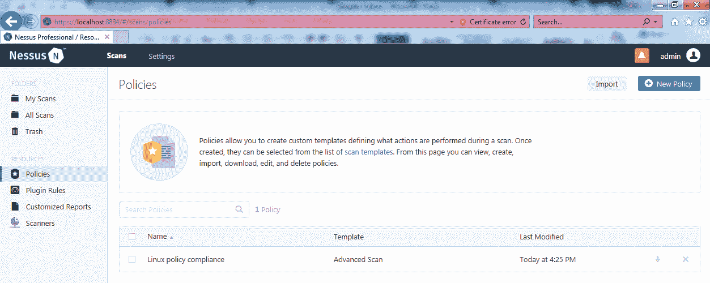

7.  导航到“扫描”并选择“新建扫描”，然后单击“扫描模板”屏幕上的“用户定义”以查找您创建的 Linux 符合性扫描策略：

选择策略并输入所需的详细信息，例如名称、说明和目标列表。要识别测试系统的 IP 地址，运行`ifconfig`命令：

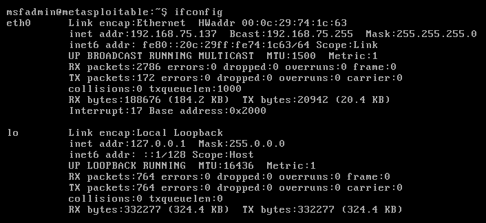

8.  输入`192.168.75.137`IP 地址，从下拉菜单中选择启动：

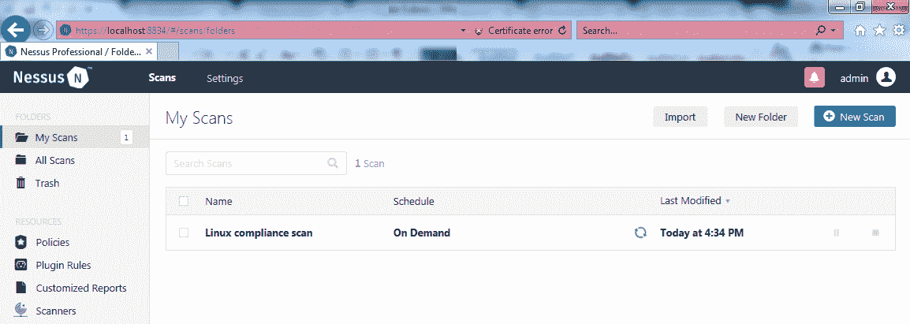

9.  扫描完成后，按如下方式单击以打开扫描：

打开结果后，应显示四个选项卡：

*   主人
*   弱点
*   顺从
*   历史

这些选项卡显示在以下屏幕截图中：

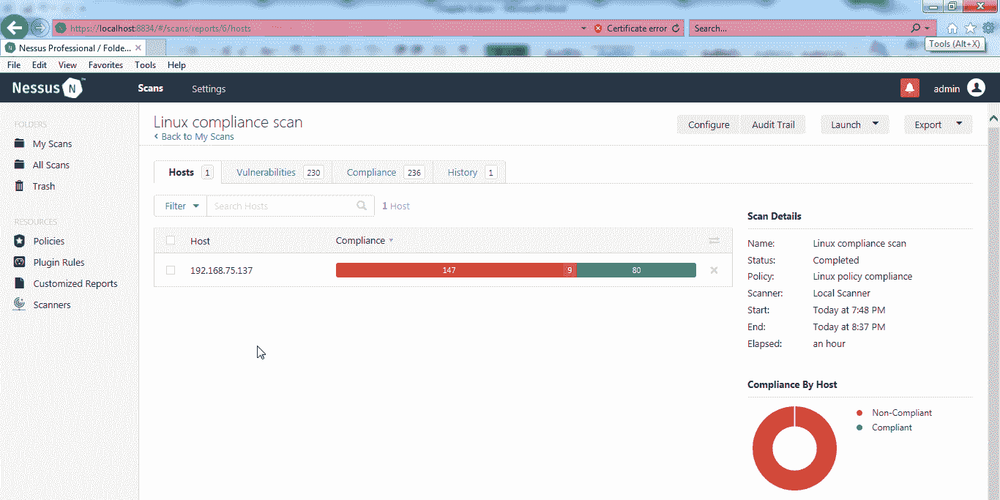

导航到“漏洞”列。这将显示远程 Ubuntu 主机中缺少的修补程序：

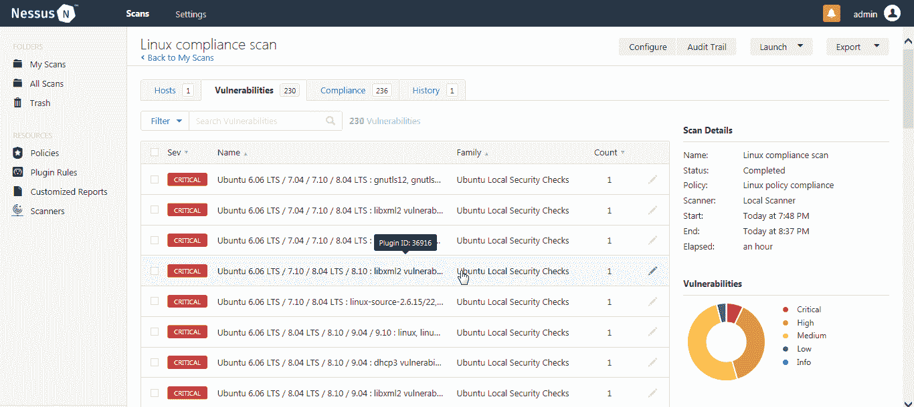

Nessus 列出的每个漏洞包括以下部分，以及其他插件详细信息，以帮助用户更好地了解该漏洞，并通过应用推荐的解决方案进行缓解：

*   描述
*   解决方案
*   另见
*   输出
*   港口城市
*   主办

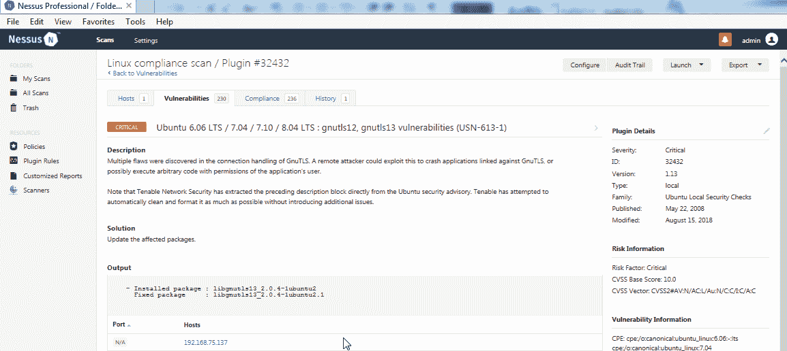

导航到“符合性”选项卡，从使用的 CIS 基准审核文件中检查配置中的差距：

每个合规性包括以下部分和参考信息，以帮助用户了解基线和当前配置之间的差距：

*   描述
*   解决方案
*   另见
*   输出

*   审计文件
*   政策价值
*   港口城市
*   主办

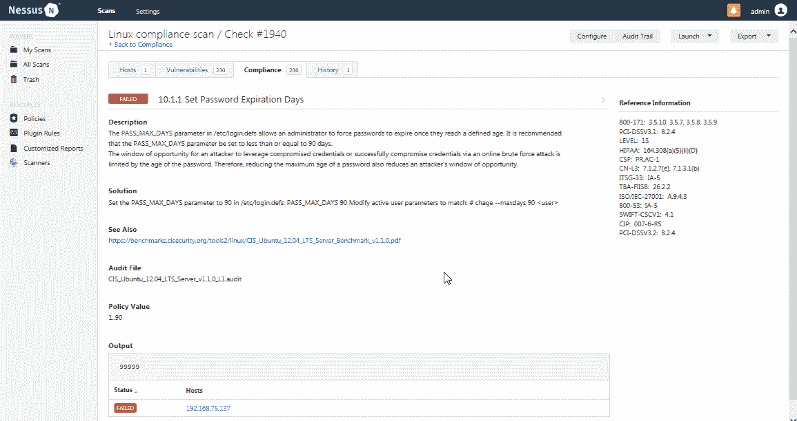

漏洞扫描和合规性扫描的主要区别在于评级。漏洞扫描的结果根据严重性报告：高、中、低和信息风险，基于多个因素，包括 CVSS 分数和易利用性。相反，在符合性扫描中，观察结果报告为失败、警告和通过，其中通过表示配置是安全的，失败点指向配置中的间隙。

# 它是如何工作的。。。

操作系统的配置审核允许用户了解操作系统配置中存在的差距。考虑到目前市场上复杂的病毒、恶意软件和广告软件，一个简单的 USB 开放访问可能导致网络接管。Windows 中的 WannaCry 恶意软件就是这样一个例子，其中一个过时的 SMB 版本允许攻击者以全球数百万台机器为目标。因此，作为常规事项，始终有必要在审核中包括操作系统的配置，以确保完全安全和兼容。

# 执行数据库审核

在前面的食谱中，我们已经看到了大量关于配置审核的需求及其对更安全网络的贡献。在本配方中，我们将考虑使用 Nessus 的合规性扫描功能对 MariaDB 数据库执行配置审核。

# 准备

此配方的*准备*部分与*选择合规扫描策略*部分的*准备*部分相同。此外，我们将使用 Kali Linux 操作系统，而不是使用 Metasploitable 虚拟机作为测试设置。您可以从[下载 Kali Linux ISOhttps://www.offensive-security.com/kali-linux-vm-vmware-virtualbox-image-download/](https://www.offensive-security.com/kali-linux-vm-vmware-virtualbox-image-download/) 。下载并解压缩包以找到一个`.vmx`文件，如*选择合规扫描策略*部分的*准备*部分。

使用以下语法启动 MySQL 服务并为默认用户 root 设置密码，以便我们可以使用相同的凭据远程登录到该服务以执行审核：

*   `- service myql start`：启动 MySQL 服务
*   `- mysql –u root`：使用 root 用户登录
*   `- use mysql`：选择一个 MySQL 表
*   `- update user set password=PASSWORD("NEW-ROOT-PASSWORD") where User='root';`：更新 MySQL 表中 root 用户的密码

这应该如下所示：

# 怎么做…

执行以下步骤：

1.  打开 Nessus Web 客户端。
2.  使用安装期间创建的用户详细信息登录 Nessus Web 客户端。
3.  单击策略选项卡并选择创建新策略。
4.  选择高级扫描并按如下方式填写所需的详细信息：

5.  导航到 Compliance 标签并搜索 Nessus 中提供的 MySQL 基准：

6.  *准备*部分截图显示远程主机运行 MariaDB 10.1.26；因此，我们可以得出结论，兼容版本是 MySQL 5.6，如[所示 https://mariadb.com/kb/en/library/mariadb-vs-mysql-compatibility/](https://mariadb.com/kb/en/library/mariadb-vs-mysql-compatibility/) 。
7.  选择用于 Linux 操作系统的 CIS MySQL 5.6 作为执行符合性扫描的策略：

如有必要，您可以更改策略的默认路径。

8.  导航到“凭据”选项卡，从下拉菜单中选择“数据库”，然后输入所需的详细信息：

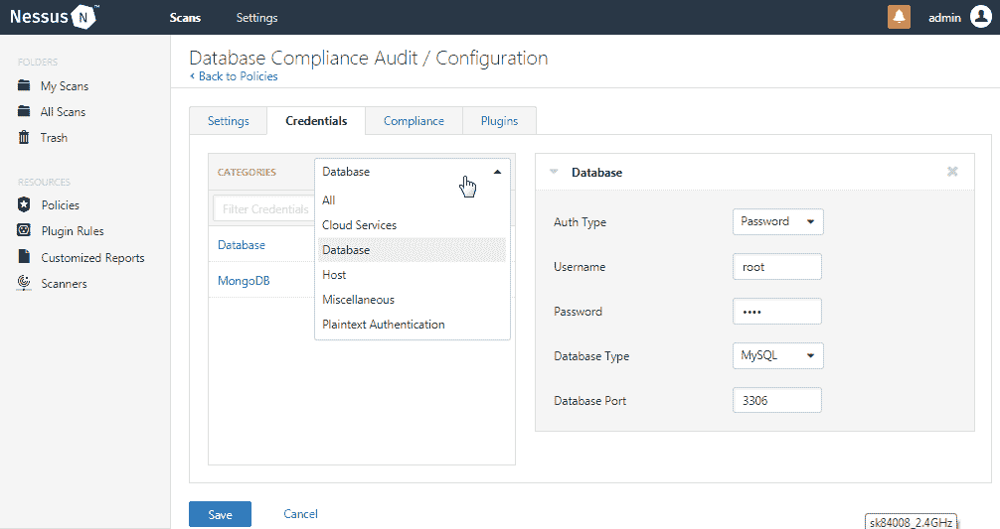

9.  导航到“插件”选项卡并禁用扫描不需要的所有插件：

10.  保存策略并导航到“扫描”页面以创建新扫描。
11.  导航到“用户定义策略”部分以查找为数据库符合性扫描创建的策略：

12.  选择策略并填写所需的详细信息，例如扫描名称、说明和要扫描的目标：

远程主机的 IP 地址可以通过`ifconfig`命令获取。在 Targets 字段中输入`192.168.75.136`IP 地址，然后选择 Launch 开始扫描：

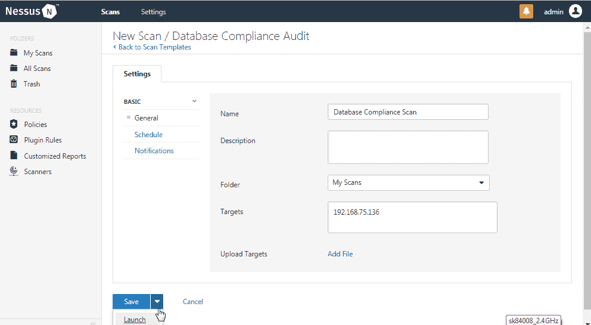

# 它是如何工作的。。。

数据库配置审计涵盖范围广泛的检查，从登录到授予用户的架构级访问。前面的扫描技术有助于突出显示 MySQL 服务器中缺少的修补程序以及失败的符合性检查。

# 执行 web 应用程序扫描

Nessus 还支持 web 应用程序扫描。这可用于审计和识别 web 应用程序中的漏洞。

Nessus 插件足以有效识别 OWASP 前 10 名中的关键漏洞。Nessus 为用户提供了提供身份验证详细信息的选项，以便执行详细扫描并报告各种漏洞。作为 web 应用程序测试的一部分，Nessus 还扫描应用程序服务器、web 服务器和数据库中的漏洞；即，端到端漏洞扫描。

# 准备

此配方的*准备*部分与*选择合规扫描策略*部分的*准备*部分相同。本食谱还要求您学习并实践本章中之前的食谱。Metasploitable 由多个易受攻击的应用程序组成。在此配方中，我们将使用 DVWA 演示 Nessus 执行 web 应用程序测试的能力：

DVWA 应用程序的默认登录凭据为用户名字段的`admin`，密码为`password`，如下所示：

# 怎么做…

执行以下步骤：

1.  打开 Nessus Web 客户端。
2.  使用安装期间创建的用户详细信息登录 Nessus Web 客户端。
3.  导航到“策略”页面，通过选择 web 应用程序测试扫描模板创建新策略。
4.  填写策略的名称并导航到凭据：

5.  选择 HTTP 身份验证，根据要审核的应用程序填写其余参数：

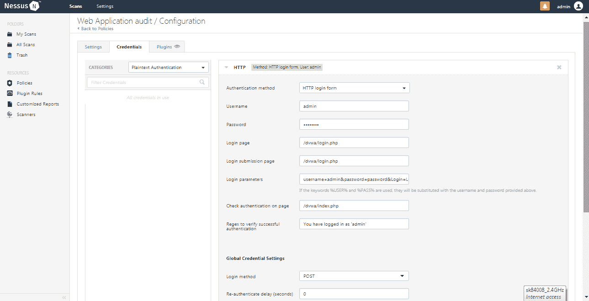

此身份验证表单需要填写多个参数，例如用户名、密码、登录页面路径、登录提交页面路径、登录参数、页面上检查身份验证的路径，以及验证身份验证成功的 Regex。通过花几分钟时间观察应用程序的工作情况以及它从浏览器控制台发送到服务器的请求，可以获得其中的大部分：

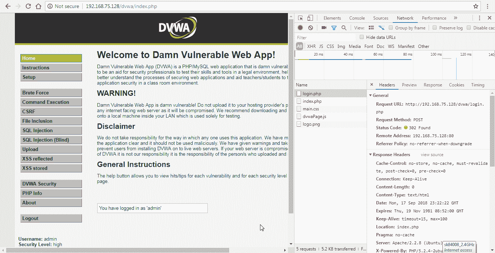

6.  保存策略并导航到“扫描”页面以创建新扫描。

7.  导航到用户定义策略以查找 Web 应用程序审核策略文件：

8.  选择适当的策略并填写详细信息，如名称、说明和目标。您只需输入主机的 IP 地址或域名，无需任何前缀或后缀路径：

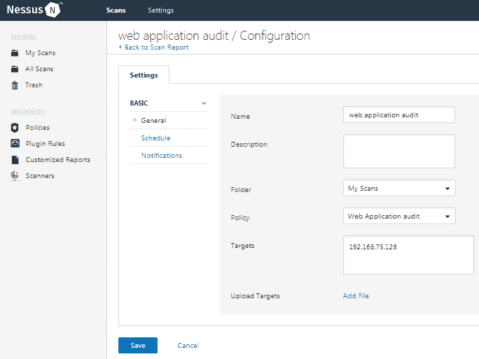

9.  启动扫描并等待扫描完成。
10.  扫描完成后，打开它以查看以下信息：

11.  导航到“漏洞”选项卡以检查报告的观察结果：

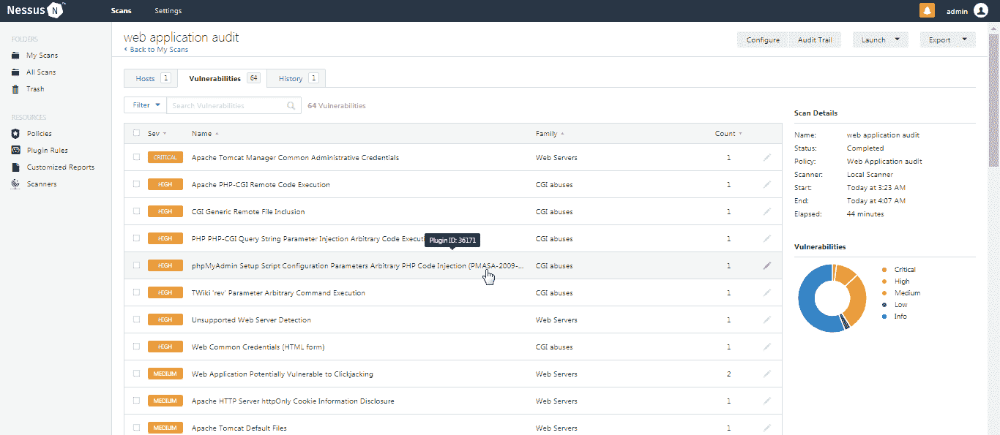

每个漏洞由以下部分以及其他插件详细信息组成，以帮助您了解该漏洞，如下所示：

*   描述
*   解决方案
*   另见
*   输出
*   港口城市
*   主人

# 它是如何工作的。。。

Nessus 插件根据配置的测试用例测试 web 应用程序，并报告失败的漏洞以及相应的输出。该报告还揭示了扫描器为帮助用户重新创建问题和创建更好的缓解方法而执行的大量漏洞利用。Nessus web 应用程序扫描程序无法执行任何业务逻辑检查，因为它缺少这些检查的决策算法。因此，最好仅将 Nessus web 应用程序扫描模块用于快速测试，然后在应用程序上执行全面的渗透测试，以获得更好的结果。