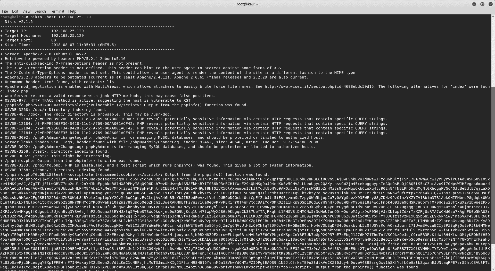
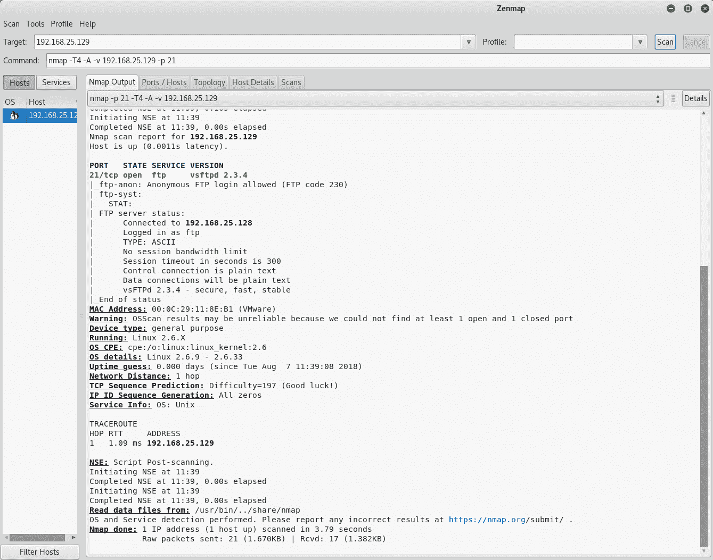
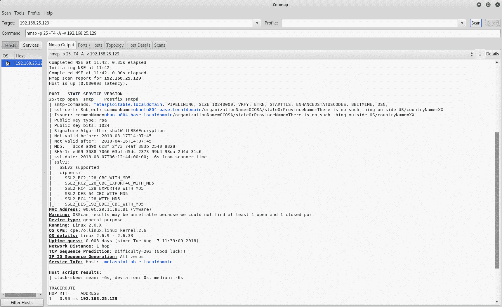
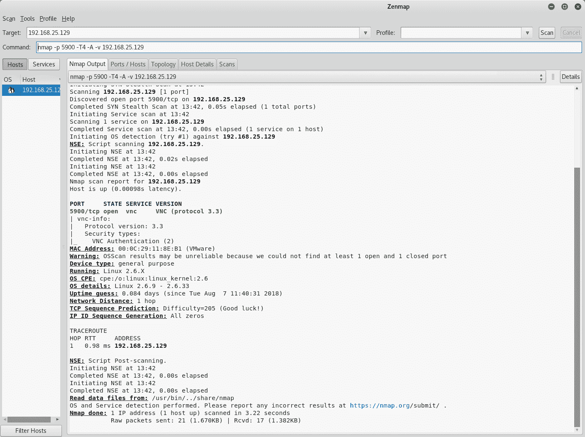
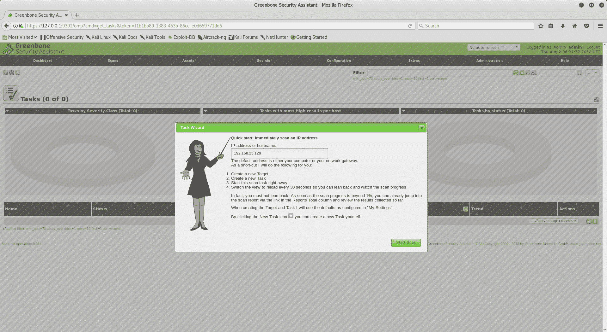
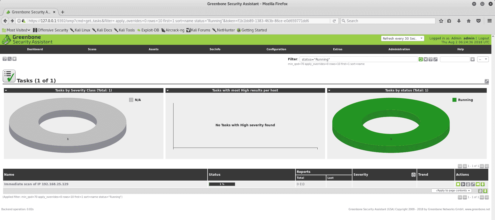

# 枚举和脆弱性评估

本章将探讨各种工具和技术，用于列举范围内的目标并对其进行脆弱性评估

读者将学习如何使用本章讨论的各种工具和技术列举目标系统，并学习如何使用专门工具（如 OpenVAS）评估漏洞。

本章将介绍以下主题：

*   什么是枚举
*   枚举服务
*   使用 Nmap 脚本
*   使用 OpenVAS 进行脆弱性评估

# 什么是枚举？

我们在前一章中已经看到了信息收集的重要性。一旦我们有了一些关于目标的基本信息，枚举就是下一个逻辑步骤。例如，假设 A 国需要对 B 国发动攻击。现在，A 国进行了一些侦察，并知道 B 国有 25 枚能够反击的导弹。现在，A 国需要弄清楚 B 国导弹的型号、制造和型号。这种列举将有助于 A 国更准确地制定攻击计划。

类似地，在我们的例子中，假设我们已经知道我们的目标系统正在`80`端口上运行某个 web 应用程序。现在我们需要进一步列举它是什么类型的 web 服务器，应用程序使用什么技术，以及任何其他相关细节。这将真正帮助我们选择准确的攻击和攻击目标。

# 枚举服务

在开始枚举目标系统上的服务之前，我们将在目标系统上进行快速端口扫描。这一次，我们将使用一个名为**Unicornscan**的工具，如以下屏幕截图所示：


端口扫描返回目标系统上打开的端口列表，如以下屏幕截图所示：


现在，我们在目标系统上有了一个开放端口列表，接下来的任务是关联与这些开放端口对应的服务，并进一步枚举它们的版本。枚举服务是非常关键的，因为它为进一步攻击奠定了坚实的基础。在本节中，我们将讨论枚举各种服务的技术，主要使用 Nmap。

# 超文本传输协议

**超文本传输协议**（**HTTP**）是用于服务 web 内容的最常用协议。默认情况下，它在端口`80`上运行。枚举 HTTP 可以揭示许多有趣的信息，包括它所服务的应用程序。

Nikto 是用于枚举 HTTP 服务的专用工具，是默认 Kali Linux 安装的一部分。以下屏幕截图显示 Nikto 工具中的各种可用选项：


我们可以使用`nikto -host <target IP address>`命令枚举 HTTP 目标，如下图所示：



Nmap 还可以有效地用于枚举 HTTP。下面的屏幕截图显示了使用 Nmap 脚本执行的 HTTP 枚举。语法如下：

```
nmap --script http-enum <Target IP address>
```


`http-enum`Nmap 脚本的输出显示了服务器信息以及可以进一步研究的各种有趣的目录。

# 文件传输协议

**文件传输协议**（**FTP**）是跨系统传输文件的常用协议。FTP 服务默认在端口`21`上运行。枚举 FTP 可以显示有趣的信息，例如服务器版本以及是否允许匿名登录。我们可以使用 Nmap 使用语法枚举 FTP 服务，如下所示：

```
nmap -p 21 -T4 -A -v <Target IP address>
```

下面的屏幕截图显示了使用 Nmap 的 FTP 枚举的输出。它显示 FTP 服务器为 vsftpd 2.3.4，并允许匿名登录：



# SMTP

**简单邮件传输协议**（**SMTP**是负责电子邮件传输的服务。服务默认在端口`25`上运行。枚举 SMTP 服务以了解服务器版本及其接受的命令非常有用。我们可以使用 Nmap 语法枚举 SMTP 服务，如下所示：

```
nmap -p 25 -T4 -A -v <Target IP address>
```

下面的屏幕截图显示了我们触发的枚举命令的输出。它告诉我们 SMTP 服务器的类型为 Postfix，并提供它正在接受的命令列表：



# 中小企业

**服务器消息块**（**SMB**是一种非常常用的共享文件、打印机、串口等的服务。从历史上看，它容易受到各种攻击。因此，枚举 SMB 可以为规划进一步的精确攻击提供有用的信息。为了枚举 SMB，我们将使用以下语法并扫描端口`139`和`445`：

```
nmap -p 139,445 -T4 -A -v <Target IP address>
```

下面的屏幕截图显示了 SMB 枚举扫描的输出。它告诉我们正在使用的 SMB 版本和工作组详细信息：


# 域名服务器

**域名系统**（**DNS**）是最广泛使用的将域名转换为 IP 地址的服务，反之亦然。默认情况下，DNS 服务在端口`53`上运行。我们可以使用 Nmap 语法来枚举 DNS 服务，如下所示：

```
nmap -p 53 -T4 -A -v <Target IP address>
```

以下屏幕截图显示目标系统上的 DNS 服务器类型为 ISC bind 版本 9.4.2：


# SSH

**Secure Shell**（**SSH**）是用于在两个系统之间安全传输数据的协议。它是 Telnet 的有效和安全的替代方案。SSH 服务默认在端口`22`上运行。我们可以使用 Nmap 语法来枚举 SSH 服务，如下所示：

```
nmap -p 22 -T4- A -v <Target IP address>
```

下面的屏幕截图显示了我们执行的 SSH 枚举命令的输出。它告诉我们目标正在运行 OpenSSH 4.7p1：


# VNC

**虚拟网络计算**（**VNC**是一种主要用于远程访问和管理的协议。默认情况下，VNC 服务在端口`5900`上运行。我们可以使用 Nmap 语法来枚举 VNC 服务，如下所示：

```
nmap -p 5900 -T4 -A -v <Target IP address>
```

下面的屏幕截图显示了我们执行的 VNC 枚举命令的输出。它告诉我们目标正在运行协议版本为 3.3 的 VNC：



# 使用 Nmap 脚本

Nmap 不仅仅是一个普通的端口扫描器。就其提供的功能而言，它是极其通用的。Nmap 脚本类似于附加组件，可用于执行其他任务。实际上有数百种这样的脚本可用。在本节中，我们将了解一些 Nmap 脚本。

# http 方法

`http-methods`脚本将帮助我们枚举目标 web 服务器上允许的各种方法。使用此脚本的语法如下所示：

```
nmap --script http-methods <Target IP address>
```

下面的屏幕截图显示了我们执行的 Nmap 脚本的输出。它告诉我们目标 web 服务器允许 GET、HEAD、POST 和 OPTIONS 方法：


# smb 操作系统发现

`smb-os-discovery`脚本将帮助我们枚举基于 SMB 协议的操作系统版本。使用此脚本的语法如下所示：

```
nmap --script smb-os-discovery <Target IP address>
```

以下屏幕截图显示枚举输出，告诉我们目标系统正在运行基于 Debian 的操作系统：


# http 站点地图生成器

`http-sitemap-generator`脚本将帮助我们创建托管在目标 web 服务器上的应用程序的分层站点地图。使用此脚本的语法如下所示：

```
nmap --script http-sitemap-generator <Target IP address>
```

以下屏幕截图显示了为托管在目标 web 服务器上的应用程序生成的站点地图：


# mysql 信息

`mysql-info`脚本将帮助我们枚举 MySQL 服务器，并可能收集服务器版本、协议和 salt 等信息。使用此脚本的语法如下所示：

```
nmap --script mysql-info <Target IP address>
```

下面的屏幕截图显示了我们执行的 Nmap 脚本的输出。它告诉我们目标 MySQL 服务器版本是`5.0.51a-3ubuntu5`，也是 salt 的值：


# 使用 OpenVAS 进行脆弱性评估

现在我们已经熟悉了枚举，接下来的逻辑步骤是执行漏洞评估。这包括探测每个服务可能存在的开放漏洞。有许多商业和开源工具可用于执行漏洞评估。一些最流行的工具是 Nessus、Nexpose 和 OpenVAS。

OpenVAS 是一个由多个工具和服务组成的框架，这些工具和服务提供了有效而强大的漏洞管理解决方案。有关 OpenVAS 框架的更多详细信息，请访问[http://www.openvas.org/](http://www.openvas.org/) 。

默认情况下，最新的 Kali Linux 发行版不附带 OpenVAS。因此，您需要手动安装和设置 OpenVAS 框架。以下是可用于在 Kali Linux 或任何基于 Debian 的 Linux 发行版上设置 OpenVAS 框架的命令集：

```
root@kali:~#apt-get update
root@kali:~#apt-get install openvas
root@kali:~#openvas-setup
```

在终端中运行上述命令后，应安装 OpenVAS 框架并准备好使用。您可以在`https://localhost:9392/login/login.html`URL 处通过浏览器访问，如下图所示：


输入凭据后，您可以看到初始仪表板，如以下屏幕截图所示：


现在是开始第一次漏洞扫描的时候了。要启动漏洞扫描，请打开任务向导，如以下屏幕截图所示，然后输入要扫描的目标的 IP 地址：



在任务向导中输入目标 IP 地址后，将触发扫描并跟踪进度，如以下屏幕截图所示：



在扫描过程中，您可以查看仪表板以获得扫描期间发现的漏洞摘要，如以下屏幕截图所示：


扫描完成后，您可以检查结果以查看所有详细结果以及严重程度。您可以单独单击每个漏洞以了解更多详细信息，如以下屏幕截图所示：


# 总结

在本章中，我们了解了枚举的重要性，以及在目标系统上执行有效枚举的各种工具和技术。我们还对 OpenVAS 漏洞管理框架进行了概述，该框架可用于执行有针对性的漏洞评估