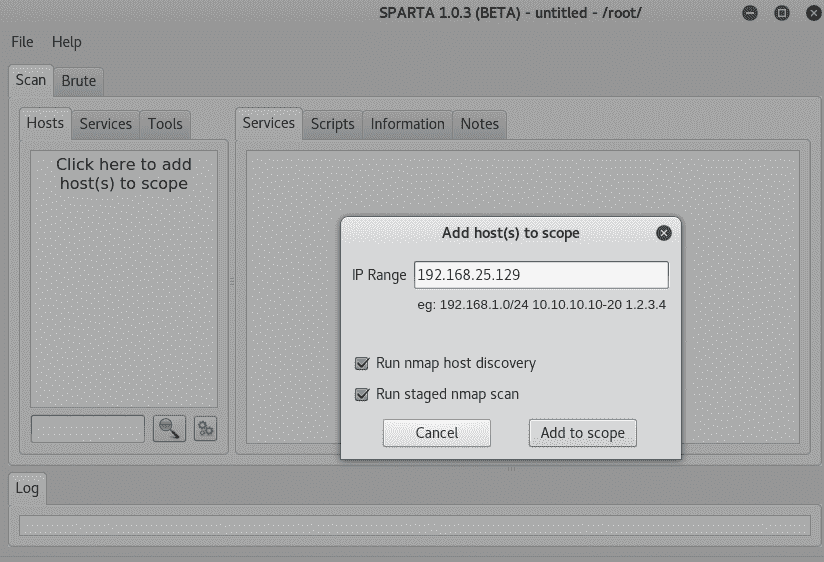
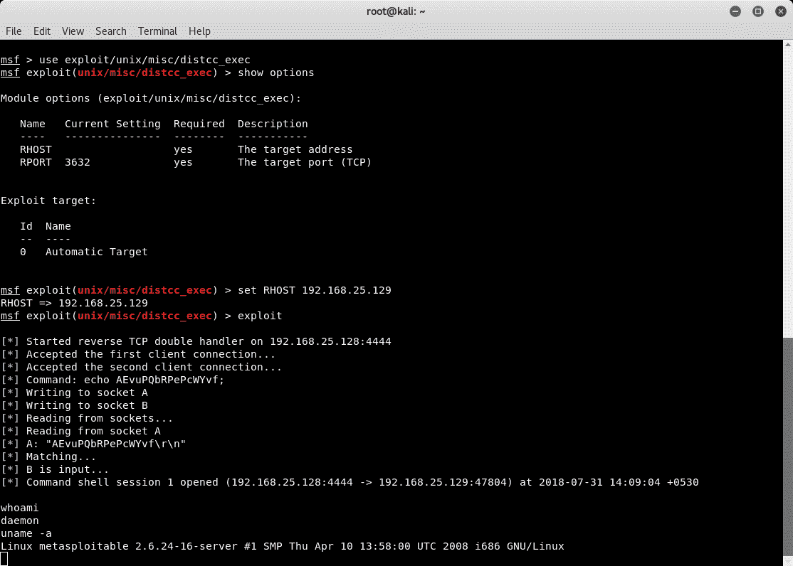

# 特权升级

在上一章中，我们了解了 web 应用程序安全的各个方面。在本章中，我们将讨论与权限提升相关的各种概念。我们将熟悉各种特权升级概念，以及在受损的 Windows 和 Linux 系统上升级特权的实用技术。

本章将介绍以下主题：

*   定义特权升级
*   水平权限升级与垂直权限升级
*   Windows 上的权限升级
*   Linux 上的权限提升

# 什么是特权升级？

在我们深入了解特权升级的任何技术细节之前，让我们先了解一下特权的基本知识。*privilege*一词在字典中的字面意思是一种特殊的权利、优势或豁免权，仅授予或提供给特定的个人或群体。在计算世界中，特权是由操作系统管理的。一个系统上可能有十个用户，但并非所有用户都具有相同级别的权限。根据安全最佳实践，通常遵循最小特权原则。这意味着每个用户只被分配执行任务所必需的最低权限。这一原则有助于消除滥用不必要、过度特权的可能性。

在安全评估的上下文中，权限提升成为一个重要因素。假设您已成功利用远程系统中的漏洞并获得 SSH 访问权限。但是，您的操作受到限制，因为您所泄露的用户没有高权限。现在，您肯定希望拥有最高级别的特权，以便能够探索受损系统的各个方面。权限提升会将普通用户的权限提升到具有最高权限的用户的权限。一旦完成，您就可以完全控制受损的系统。

为了了解特权如何工作的一些基本知识，下图显示了各种保护环：


此图显示了四个环：

*   **环 0**：属于操作系统内核，拥有最高权限。
*   **环 1 和环 2**：主要用于操作系统与各种硬件设备接口的设备驱动程序。这些戒指当然有很好的特权，但少于**戒指 0**。
*   **环 3**：我们的大多数终端应用程序都在这里运行。他们的特权最低。

因此，在权限提升的情况下，如果您想利用应用程序漏洞获得对**环 3**的访问权，那么您需要找到一种方法将权限提升到更高的环。在 Windows 环境中，具有最高权限的用户通常被称为**管理员**，而在 Linux 环境中，具有最高权限的用户被称为**root**。

# 水平权限升级与垂直权限升级

正如我们在上一节中所看到的，特权升级意味着获得您无权拥有的特权。权限提升可以是两种类型之一：水平或垂直。


# 横向权限提升

参考上图；总共有四个用户：三个普通用户和一个管理员。用户按其层次结构显示。现在，如果**普通用户 1**能够访问**普通用户 2**的数据，则称为横向权限提升，因为这两个用户在层次结构中处于同一级别。

# 纵向权限提升

参照上图，如果**普通用户 1**能够访问数据并获得**管理员**的权限，则称为垂直权限提升。**普通用户 1**和**管理员**在层次结构中处于不同的级别。

# Windows 上的权限升级

如前一节所述，在 Windows 系统上，拥有最高权限的用户称为**管理员**。一旦我们使用任何可用的漏洞来破坏系统，我们的目标应该是将用户权限提升到管理员的权限。

以下屏幕截图显示了以 Windows XP 为目标的对`ms08_067_netapi`漏洞的攻击。Metasploit 成功利用了该漏洞，并提供了 MeterMeter 会话，如以下屏幕截图所示：


MeterMeter 为我们提供了升级权限的能力。`getsystem`命令专门用于受损 Windows 系统上的权限提升。以下屏幕截图显示了使用`getsystem`命令在目标系统上获得管理员级别的权限：


# Linux 上的权限提升

在本节中，我们将了解如何利用 Linux 系统中的漏洞，然后升级我们的权限。我们将使用 Metasploitable 2 作为目标。

在考虑权限升级之前，我们必须至少具有对目标系统的正常级别访问权限。在这种情况下，我们的目标系统的 IP 地址是`192.168.25.129`。我们首先启动斯巴达，以收集有关我们目标的一些快速信息。我们将目标 IP 添加到 SPARTA 扫描范围内，如以下屏幕截图所示：



一旦 SPARTA 扫描完成，我们就可以知道目标系统上正在运行哪些服务。现在我们发现目标系统正在运行一个服务`distccd`（如下截图所示），这是一个用于源代码编译的分布式计算应用程序：


现在我们知道了要利用的服务，我们将打开 Metasploit 控制台来查找与`distcc`相关的任何利用：


我们在 Metasploit 中获得了一个名为`distcc_exec`的漏洞。现在，我们使用`show options`命令查找需要配置的参数。然后我们设置`RHOST`（目标）参数的值并触发`exploit`命令：



该漏洞利用成功，并为我们提供了一个远程命令外壳。但是，shell 的权限有限，现在我们需要将权限升级到 root。通过使用`uname`命令，我们知道目标是基于 Linux 内核 2.6.X 的。因此，我们需要找出哪个权限提升漏洞适合这个内核版本。我们可以使用`searchsploit`实用程序搜索特定漏洞。以下命令将列出我们需要的漏洞：

```
searchsploit privilege | grep -i linux | grep -i kernel | grep 2.6 | grep 8572
```

我们现在可以在目标系统上使用`wget`命令下载该漏洞，如下面的屏幕截图所示。下载后，我们使用以下命令在本地编译漏洞：

```
gcc -o exploit 8572.c 
```


在我们的 Kali Linux 系统上，我们使用以下命令在端口`12345`上启动 Netcat 侦听器：

```
nc -lvp 12345
```

一旦攻击在目标系统上执行，我们就会在 Kali 系统上得到一个反向 shell，如下面的屏幕截图所示，具有 root 权限。因此，我们成功地将权限从普通用户升级到 root 用户：


# 总结

在本章中，我们了解了权限在各种平台（如 Windows 和 Linux）中的重要性，以及在渗透测试期间提升权限的相关性