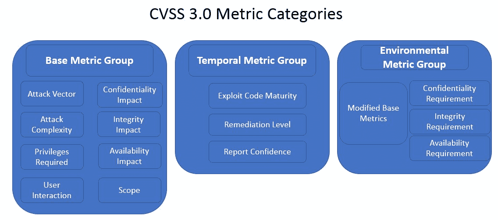
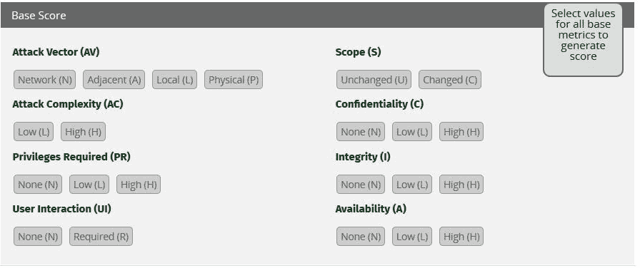

# 十八、漏洞评分

本章是关于理解正确漏洞评分的重要性。我们将了解标准漏洞评分的必要性，并使用**通用漏洞评分系统**（**CVSS**获得漏洞评分的实际知识。

本章将介绍以下主题：

*   漏洞评分要求
*   使用 CVSS 进行漏洞评分
*   CVSS 计算器

# 漏洞评分要求

以任何现代网络为例，扫描其漏洞。您将不知所措，发现大量漏洞。现在，如果你继续扫描网络，比如说每月一次，那么你的漏洞清单将继续快速增长。如果所有这些漏洞都按原样呈现给高级管理层，那么这将没有任何帮助。高级管理层对一些可以采取行动的精确信息更感兴趣。

典型的漏洞扫描程序可能会在特定系统中发现 100 个漏洞。在 100 个漏洞中，30 个可能是误报，25 个可能是信息性漏洞，25 个可能是低严重性漏洞，15 个可能是中等严重性漏洞，5 个可能是高严重性漏洞。自然，在报告的 100 个漏洞中，5 个高严重性漏洞将作为优先事项处理。其余的可以在以后根据资源可用性处理。

因此，除非对漏洞进行评分，否则无法为其分配严重性等级，因此无法对其进行优先修复。C 级管理人员还想知道组织内哪些漏洞的严重性最高。因此，对漏洞进行评分将有助于在项目可见性和资源管理方面获得高级管理层的正确关注和支持。如果不评分，就不可能优先考虑漏洞缓解和关闭。

# 使用 CVSS 进行漏洞评分

漏洞评分确实是一个非常主观的问题。这取决于评估漏洞的人员的背景和专业知识。因此，在没有任何标准体系的情况下，对同一漏洞的评分可能因人而异。

CVSS 是对漏洞进行评分的标准系统。在得出最终分数之前，它考虑了几个不同的参数。使用 CVSS 有以下好处：

*   它提供了标准化且一致的漏洞分数
*   它为漏洞评分提供了一个开放的框架，使评分的个人特征透明化
*   CVSS 有助于确定风险优先级

为简化起见，CVSS 指标被分为不同的组，如下图所示：

在前面的部分中，我们将简要介绍每个度量类别。

# 基度量群

基本度量组定义了给定漏洞的一些琐碎特征，这些特征随时间和用户环境而变化。如前一节所述，基本度量组分为两个子组。

# 可利用性度量

如上所述，可利用性度量反映了易受攻击的*事物*的特征，我们正式称之为**易受攻击组件**。因此，此处列出的每个可利用性指标都应相对于易受攻击的组件进行评分，并反映导致成功攻击的漏洞的属性。

# 攻击向量

攻击向量不过是攻击者采取的路径，以便成功地利用漏洞。攻击向量度量表明可能利用漏洞的可能方式。可通过 Internet 远程攻击的漏洞的潜在攻击者数量相对多于可攻击需要物理访问设备的漏洞的攻击者数量，因此，为了攻击该漏洞，攻击者越远程，度量值越大：

| **参数** | **说明** | **示例** |
| 网络 | 可通过网络远程利用该漏洞。易受攻击的组件已连接到网络，攻击者可以通过第 3 层（OSI）访问该组件。 | 发送巧尽心思构建的 TCP 数据包导致的拒绝服务 |
| 相邻 | 该漏洞可在同一物理或逻辑网络中被利用。不能在网络边界之外利用它。 | Bluejacking 攻击，ARP 洪泛 |
| 地方的 | 易受攻击的组件未通过任何方式连接到网络，攻击者必须在本地登录才能利用该漏洞进行攻击。 | 权限升级 |
| 身体的 | 只有当攻击者具有对易受攻击系统/组件的物理访问权限时，才能利用该漏洞。 | 冷启动攻击 |

# 攻击复杂性

攻击复杂性度量列出了攻击者无法控制但成功利用该漏洞所需的所有条件和先决条件。例如，可能只有在应用的特定版本部署在具有某些自定义设置的特定操作系统平台上时，才能利用特定漏洞。如果满足所有这些条件，则只有漏洞利用才有可能。对于其他一些漏洞，无论应用版本和基本操作系统类型如何，都有可能利用这些漏洞进行攻击。因此，条件和先决条件增加了攻击的复杂性，并因漏洞而异：

| **参数** | **说明** | **示例** |
| 低的 | 不存在可能阻碍攻击者成功重复利用易受攻击组件的特定条件或先决条件。 | 发送巧尽心思构建的 TCP 数据包导致拒绝服务 |
| 高的 | 攻击的成功取决于攻击者无法控制的特定条件。因此，攻击者不可能在任何时候发动成功的攻击，并且需要投入大量精力准备攻击。 | 涉及随机令牌、序列号等的攻击 |

# 所需权限

privileges required（所需权限）度量定义了攻击者必须拥有的权限级别，以便成功利用该漏洞。可能存在一些漏洞，可以使用正常权限级别进行攻击，而其他漏洞则可能严格要求 root 或管理员级别的权限才能成功利用：

| **参数** | **说明** |
| 没有一个 | 攻击者不需要任何先前的权限或访问权限即可执行攻击。 |
| 低的 | 攻击者需要有限或最低权限才能成功执行攻击。 |
| 高的 | 攻击者需要管理员或 root 等重要权限才能利用易受攻击的组件进行攻击。 |

# 用户交互

用户交互度量表示目标用户需要执行的操作（攻击者的操作除外），以成功利用该漏洞。某些漏洞可能仅由攻击者利用，而其他漏洞可能需要额外的用户交互/参与：

| **参数** | **说明** | **示例** |
| 没有一个 | 攻击者可以利用易受攻击的系统/组件进行攻击，而无需受害者/用户进行任何交互。 | 发送巧尽心思构建的 TCP 数据包导致拒绝服务 |
| 要求的 | 攻击者将要求受害者（用户）执行某种操作以利用该漏洞。 | 线控驾驶攻击，单击劫持 |

# 范围

CVSS 3.0 允许我们捕获组件中漏洞的指标，这也会对资源造成无法承受的影响。范围是指易受攻击组件的哪些部分受到该漏洞的影响，或者哪些关联受到利用该漏洞的影响。范围由授权机构划分。漏洞可能会影响同一授权机构内或不同授权机构内的组件。例如，虚拟机中允许攻击者修改基本（主机）系统中的文件的漏洞将包括范围内的两个系统，而 Microsoft Word 中允许攻击者修改系统主机文件的漏洞将属于单一授权权限：

| **参数** | **说明** |
| 不变的 | 被利用的漏洞只会影响受影响组件管理的资源 |
| 改变 | 被利用的漏洞可能会影响易受攻击组件边界以外的资源 |

# 影响指标

影响度量表示受影响组件在机密性、完整性和可用性方面的各种属性。

# 保密影响

机密性影响表示成功利用漏洞后对信息机密性的影响：

| **参数** | **说明** |
| 高的 | 完全失去机密性，导致攻击者完全可以访问资源。例如，对密码的攻击和窃取私有加密密钥可能会导致完全失去机密性。 |
| 低的 | 机密性的损失有限。虽然获得了对机密信息的访问，但攻击者无法完全控制获得的信息。 |
| 没有一个 | 不影响受影响组件内的机密性。 |

# 完整性影响

完整性影响度量表示成功利用漏洞后对信息完整性的影响：

| **参数** | **说明** |
| 高的 | 完全丧失完整性。例如，攻击者可以修改受影响组件保护的所有文件。如果攻击者能够部分修改信息，这将导致严重后果。 |
| 低的 | 尽管数据可能会被修改，但攻击者无法完全控制修改的数量或结果。对受影响的部件没有严重影响。 |
| 没有一个 | 对受影响组件内的完整性没有影响。 |

# 可用性影响

可用性影响度量表示成功利用漏洞后对受影响组件可用性的影响。可用性的丧失可能是由于网络服务停止，例如 web、数据库或电子邮件。所有倾向于以网络带宽、处理器周期或磁盘空间的形式消耗资源的攻击都可以用以下指标表示：

| **参数** | **说明** |
| 高的 | 完全丧失可用性，导致拒绝访问受影响组件的资源 |
| 低的 | 对资源可用性的影响有限 |
| 没有一个 | 对受影响组件内的可用性没有影响 |

# 时间度量群

时间度量表示各种利用漏洞技术、修补程序或解决方法的现有状态，或漏洞存在的置信度。

# 利用代码成熟度

漏洞利用代码成熟度度量表示漏洞被利用的可能性，这取决于现有的漏洞利用技术和代码可用性状态。

一些攻击代码可能是公开的，使得许多攻击者很容易访问这些代码。这增加了漏洞被利用的可能性。请注意以下参数：

| **参数** | **说明** |
| 未定义 | 将此值指定给度量不会影响分数。它只是指示跳过此度量的评分公式。 |
| 高的 | 功能自治代码存在，或者不需要利用漏洞（手动触发），详细信息广泛可用。 |
| 功能的 | 功能性攻击代码可用，在大多数情况下都有效。 |
| 概念证明 | 概念证明明显可用。代码可能并非在所有情况下都能正常工作，并且可能需要熟练的攻击者进行大量编辑。 |
| 未经证实 | 攻击代码不可用或攻击只是假设的。 |

# 补救水平

补救级别度量表示为缓解漏洞而可用的修复程序、修补程序或变通方法的级别。它可以帮助确定漏洞修复的优先级：

| **参数** | **说明** |
| 未定义 | 将此值指定给度量不会影响分数。它只是指示跳过此度量的评分公式。 |
| 不可用的 | 不存在解决方案或无法应用解决方案。 |
| 变通办法 | 存在非官方、非供应商的修复；这可能是内部补丁的形式。 |
| 临时修复 | 官方的，但暂时的，修复存在；它可以是快速修复/热修复的形式。 |
| 正式定案 | 供应商提供并正式发布了完整且经过测试的修复程序。 |

仅当分析师需要在受影响组织的特定领域自定义 CVSS 分数时，才使用环境指标。您可以在[上阅读更多关于环境指标的信息 https://www.first.org/cvss/cvss-v30-specification-v1.8.pdf](https://www.first.org/cvss/cvss-v30-specification-v1.8.pdf) 。

# 报告信心

报告置信度指标表示对漏洞存在的置信度以及资源和技术细节的真实性。可能是发布某个漏洞时没有任何附加技术细节。在这种情况下，根本原因和影响可能未知：

| **参数** | **说明** |
| 未定义 | 将此值指定给度量不会影响分数。它只是指示跳过此度量的评分公式。 |
| 证实 | 存在一份全面的报告，或者可以从功能上复制漏洞/问题。源代码可用于手动验证研究结果，或者受影响代码的作者/供应商已确认存在漏洞。 |
| 公平的 | 相当多的细节已经公布，但研究人员对根本原因还没有完全的信心。研究人员可能无法访问源代码来确认这些发现。 |
| 未知的 | 有关于存在该漏洞的报告；然而，其原因尚不清楚。关于漏洞的真实性质存在不确定性。 |

# CVSS 计算器

在前面的章节中，我们研究了计算最终 CVSS 分数时考虑的各种类型的指标。在计算分数时考虑这么多的数值可能显得压倒一切。然而，通过使用在线 CVSS 计算器，这项任务变得很容易。可在[访问 https://www.first.org/cvss/calculator/3.0](https://www.first.org/cvss/calculator/3.0) 。

在线 CVSS 计算器已获得所有必需的参数，您需要根据您的环境和漏洞上下文选择正确的参数。完成后，将自动填充最终分数。

以下屏幕截图显示了为任何参数选择值之前的 CVSS 计算器：

考虑可以在网络上远程开发的漏洞，执行起来非常复杂，需要高的帐户权限，并且需要来自目标用户的某种交互，而对保密性、完整性和可用性的影响较低。在这种情况下，CVSS 分数将为 3.9，评级为低，如以下屏幕截图所示：

让我们考虑另一个可以在网络上被远程利用的漏洞；但是，它很容易执行。它需要较低或正常的帐户权限，需要目标用户进行某种交互，而对机密性、完整性和可用性的影响较小。在这种情况下，CVSS 分数将为 5.5，评级为中等，如以下屏幕截图所示：

让我们考虑另一个可以在网络上被远程利用的漏洞。但是，它非常容易执行，不需要任何特定的帐户权限，也不需要目标用户进行任何类型的交互。如果成功利用该漏洞，对机密性和完整性的影响将很大，而对可用性的影响则很小。在这种情况下，CVSS 分数将为 9.4，并被评为关键，如以下屏幕截图所示：

# 总结

在本章中，我们了解了漏洞评分的重要性以及评分任何给定漏洞时需要考虑的各种参数。