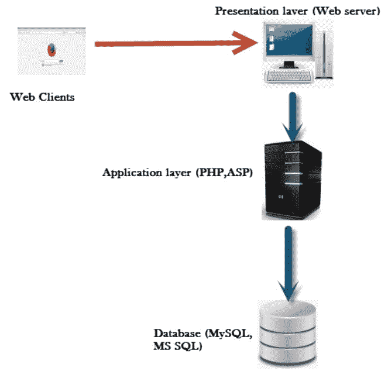
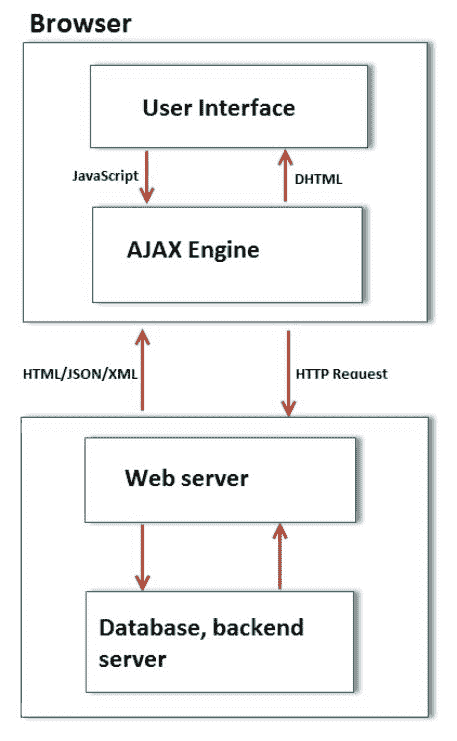

# 一、渗透测试和 Web 应用简介

web 应用使用 HTTP 协议进行客户端-服务器通信，并且需要 web 浏览器作为客户端接口。它可能是现代公司中最普遍的应用类型，从人力资源的组织氛围调查到公司网站的 It 技术服务。即使是厚实的移动应用和许多**物联网**（**物联网**设备）也通过 web 服务和嵌入其中的 web 接口使用 web 组件。

不久前，人们认为只有在组织的外围和网络级别才需要安全，因此公司在物理和网络安全方面花费了大量资金。然而，随之而来的是一种有点虚假的安全感，因为他们依赖于组织内外的 web 技术。在最近几年和几个月里，我们看到了惊人的数据泄露和数百万记录被破坏的消息，包括来自世界各地的人们的信用卡号、健康史、家庭住址和**社会安全号码**（**SSN**等信息。许多攻击都是通过利用 web 漏洞或设计失败发起的。

现代组织承认它们依赖于 web 应用和 web 技术，并且它们与它们的网络和操作系统一样容易受到攻击。这导致了针对网络攻击提供保护或防御服务的公司数量的增加，以及**web 应用防火墙**（**WAF**）、**运行时应用自我保护**（**RASP**等技术的出现或发展，web 漏洞扫描程序和源代码扫描程序。此外，越来越多的组织发现，在向最终用户发布应用之前测试应用的安全性是有价值的，这为有才华的黑客和安全专业人员提供了一个机会，让他们能够利用自己的技能发现缺陷，并就如何修复缺陷提供建议，从而帮助公司、医院、，学校和政府希望有更安全的应用和日益改进的软件开发实践。

# 主动安全测试

**渗透测试**和**道德黑客行为**是一种主动测试 web 应用的方法，通过执行类似于任何一天可能发生的真实攻击的攻击。它们以受控的方式执行，目的是尽可能多地发现安全缺陷，并就如何减轻此类缺陷带来的风险提供反馈。

对于公司来说，在将应用发布给最终用户之前对其进行安全测试是非常有益的。事实上，有些具有安全意识的公司在其软件开发周期中几乎完全集成了渗透测试、漏洞评估和源代码审查。因此，当他们发布一个新的应用时，它已经经历了不同的测试和修复阶段。

# 不同的测试方法

人们经常被以下术语弄糊涂，交替使用它们，而不理解，尽管这些术语的某些方面重叠，但也有一些细微的差异需要你注意：

*   道德黑客
*   渗透测试
*   脆弱性评估
*   安全审计

# 道德黑客

很少有人意识到黑客是一个被误解的术语；它对不同的人意味着不同的东西，而且黑客通常被认为是一个坐在黑暗的封闭空间里，没有社交生活和恶意的人。因此，在术语“黑客”之前加上了“道德”一词。术语**道德黑客**是指致力于识别系统漏洞和漏洞，向系统供应商或所有者报告，有时帮助他们修复系统的专业人员。道德黑客使用的工具和技术与黑客或黑帽黑客使用的工具和技术相似，但目标不同，因为它是以更专业的方式使用的。道德黑客也称为*安全研究人员*。

# 渗透测试

渗透测试是我们在本书中经常使用的一个术语，它是道德黑客的一个子集。这是一个更专业的术语，用来描述道德黑客的行为。如果你正在计划职业道德黑客或安全测试，那么你经常会看到标题为“渗透测试者”的职位公告。尽管渗透测试是道德黑客的一个子集，但它在许多方面有所不同。这是一种更简化的方法，可以识别系统中的漏洞，并确定该漏洞是否可利用。渗透测试受测试人员和待测试系统所有者之间的合同管辖。您需要定义测试的范围，以便识别要测试的系统。需要定义接洽规则，这决定了测试的方式。

# 脆弱性评估

有时，组织可能只想识别其系统中存在的漏洞，而不实际利用这些漏洞并获得访问权限。脆弱性评估比渗透测试更广泛。**漏洞评估**的最终结果是一份报告，对发现的漏洞进行了优先级排序，最严重的漏洞列在顶部，风险较小的漏洞列在报告的下方。此报告对于知道自己存在安全问题并且需要确定最关键问题并确定其优先级的客户非常有用。

# 安全审计

**审计**是一个系统化的程序，用于根据预定的一套标准衡量系统的状态。这些标准可以是行业最佳实践或内部检查表。审计的主要目标是衡量和报告合规性。如果您正在审核 web 服务器，首先要注意的是服务器上打开的端口、服务器上启用的有害 HTTP 方法（如`TRACE`）、使用的加密标准以及密钥长度。

# 进行渗透测试时的注意事项

当计划执行渗透测试项目时，无论是作为专业渗透测试人员的客户还是作为公司内部安全团队的一部分，在开始参与之前，都需要考虑一些方面。

# 交战规则

**接战规则**（**RoE**）是一份涉及渗透测试进行方式的文件。在开始渗透测试之前，应在 RoE 中明确说明的一些指令如下：

*   测试的类型和范围
*   客户联系方式
*   客户端 IT 团队通知
*   敏感数据处理
*   情况会议和报告

# 测试的类型和范围

测试类型可以是黑框、白框或中间灰框，具体取决于参与的方式以及与测试团队共享的信息量。

在每种类型的测试中都有一些事情可以做，也有一些事情不能做。通过**黑盒测试**，测试团队从组织外部的攻击者的角度工作，渗透测试人员从头开始，试图识别网络地图、实施的防御机制、面向互联网的网站和服务等。即使这种方法在模拟外部攻击者时可能更现实，但你需要考虑这样的信息可以很容易地从公共来源收集，或者攻击者可能是一个不满的雇员或已经拥有它的前雇员。因此，如果目标是仅供员工使用的内部应用，则采用黑盒方法可能会浪费时间和金钱。

**白盒测试**是向测试团队提供有关目标的所有可用信息，有时甚至包括应用的源代码，因此很少或根本没有时间用于侦察和扫描。当部分信息（如应用的 URL、用户级文档和/或用户帐户）提供给测试团队时，将进行灰盒测试。

**灰盒测试**在测试 web 应用时特别有用，因为主要目的是发现应用本身中的漏洞，而不是宿主服务器或网络中的漏洞。渗透测试人员可以使用用户帐户来采纳恶意用户或通过社会工程获得访问权限的攻击者的观点。

在决定测试范围时，客户机和测试团队需要评估哪些信息有价值，哪些信息需要保护，并在此基础上确定哪些应用/网络需要测试，以及对信息的访问程度。

# 客户联系方式

我们可以同意，即使我们在进行测试时采取了所有必要的预防措施，有时测试也会出错，因为这涉及到让计算机做一些令人讨厌的事情。在客户端拥有正确的联系信息真的很有帮助。渗透测试通常会演变为**拒绝服务**（**拒绝服务**攻击。客户端的技术团队应全天候提供服务，以防计算机出现故障，需要硬复位才能使其恢复在线。

渗透测试 web 应用的优势在于，它可以在专门为此目的构建的环境中完成，从而允许测试人员降低对客户的生产性资产产生负面影响的风险。

# 客户端 IT 团队通知

渗透测试也被用作检查支持人员是否准备好应对事件和入侵企图的手段。您应该与客户讨论这一点，无论是公开测试还是未公开测试。如果是已宣布的测试，请确保将测试（攻击）的时间和日期以及源 IP 地址告知客户端，以避免其 it 安全团队错过任何真正的入侵尝试。如果是未经通知的测试，请与客户讨论如果测试被自动化系统或网络管理员阻止会发生什么情况。测试到此结束，还是继续测试？这完全取决于测试的目的，测试的目的是测试基础设施的安全性，还是检查网络安全和事件处理团队的响应。即使您正在进行未经通知的测试，也要确保升级矩阵中的某个人知道测试的时间和日期。Web 应用渗透测试通常会公布。

# 敏感数据处理

在测试准备和执行期间，将向测试团队提供并可能找到有关公司、系统和/或其用户的敏感信息。在 RoE 中需要特别注意敏感数据的处理，并应采取适当的存储和通信措施（例如，测试人员计算机上的全磁盘加密、通过电子邮件发送的报告加密等）。如果您的客户受到各种监管法律的保护，如**健康保险便携性和责任法案**（**HIPAA**）、**格拉姆-里奇-布利利法案**（**GLBA**）或欧洲数据隐私法，只有授权人员才能查看个人用户数据。

# 情况会议和报告

沟通是渗透测试成功的关键。测试团队和客户组织之间应安排定期会议，并由测试团队发布常规状态报告。测试团队应说明他们达到了什么程度，以及到目前为止发现了哪些漏洞。客户组织还应确认其检测系统是否触发了因渗透尝试而产生的任何警报。如果正在测试 web 服务器并部署 WAF，则它应该记录并阻止攻击尝试。作为最佳实践，测试团队还应记录进行测试的时间。这将有助于安全团队将日志与渗透测试关联起来。

WAF 通过分析客户端和服务器之间的 HTTP/HTTPS 流量来工作，并且它们能够检测和阻止对 web 应用的最常见攻击。

# 渗透测试的局限性

虽然建议进行渗透测试，并且应定期进行渗透测试，但渗透测试存在一定的局限性。测试的质量及其结果将直接取决于测试团队的技能。由于范围的限制、渗透测试人员对测试环境的访问限制以及测试人员使用的工具的限制，渗透测试无法找到所有漏洞。以下是渗透测试的一些限制：

*   **技能限制**：如前所述，测试的成功和质量将直接取决于渗透测试团队的技能和经验。渗透测试可以分为三大类：网络、系统和 web 应用渗透测试。如果让精通网络渗透测试的人员在涉及测试 web 应用的项目上工作，您将无法获得正确的结果。如今，互联网上部署了大量的技术，很难找到一个精通这三方面的人。测试人员可能对 ApacheWeb 服务器有深入的了解，但可能是第一次遇到 IIS 服务器。过去的经验对测试的成功也起着重要作用；将低风险漏洞映射到具有高威胁级别的系统是一项只有通过经验才能获得的技能。
*   **时间限制**：渗透测试通常是一个短期项目，必须在预定的时间内完成。测试团队需要在这段时间内产生结果并识别漏洞。另一方面，攻击者有更多的时间来处理他们的攻击，并且可以仔细计划。渗透测试人员还必须在测试结束时生成一份报告，描述方法、识别的漏洞和执行摘要。必须定期拍摄屏幕截图，然后将其添加到报告中。显然，攻击者不会编写任何报告，因此可以将更多时间用于实际攻击。
*   **自定义漏洞的限制**：在一些高度安全的环境中，普通的渗透测试框架和工具用处不大，团队需要跳出框框思考，例如创建自定义漏洞并手动编写脚本以达到目标。创建漏洞利用非常耗时，并且会影响测试的总体预算和时间。在任何情况下，编写自定义漏洞都应该是任何自尊的渗透测试人员的投资组合的一部分。
*   **避免 DoS 攻击**：黑客攻击和渗透测试是一门让计算机或应用做一些原本不该做的事情的艺术。因此，测试有时可能导致 DoS 攻击，而不是访问系统。许多测试人员不运行此类测试，以避免无意中导致系统停机。由于系统没有测试 DoS 攻击，它们更容易受到脚本小子的攻击，他们只是在寻找这样的互联网可访问系统，以便通过让它们离线来寻求名声。**脚本儿童**是不熟练的个人，他们利用计算机系统中容易发现和众所周知的弱点，在不了解或不关心潜在有害后果的情况下获得名声。应该向客户介绍 DoS 测试的优缺点，因为这将帮助他们做出正确的决定。
*   **访问限制**：网络被划分为不同的部分，测试团队通常有访问权和权限只测试那些有服务器且可以从互联网访问的部分，以模拟真实世界的攻击。但是，此类测试不会检测客户端所在的内部网络上的配置问题和漏洞。
*   **所用工具的限制**：有时，渗透测试团队只允许使用客户批准的工具和开发框架列表。没有一个工具是完整的，无论它是免费版本还是商业版本。测试团队需要了解这些工具，当这些工具缺少特性时，他们必须找到替代品。

为了克服这些限制，大型组织有一个专门的渗透测试团队，负责研究新的漏洞并定期执行测试。除渗透测试外，其他组织还定期进行配置审查。

# 测试 web 应用的必要性

随着大量面向互联网的网站以及在线开展业务的组织数量的增加，web 应用和 web 服务器成为攻击者极具吸引力的目标。Web 应用遍布公共和私有网络，因此攻击者不必担心缺少目标。与 web 应用交互只需要 web 浏览器。web 应用中的一些缺陷，例如逻辑缺陷，甚至可以被外行利用。例如，由于逻辑实现不好，如果一家公司有一个电子商务网站，允许用户在结帐过程后将商品添加到购物车中，而恶意用户通过反复试验发现了这一点，那么他们就可以轻松利用这一点，而无需任何特殊工具。

web 应用中的漏洞还提供了传播恶意软件和病毒的手段，这些漏洞可以在几分钟内传播到全球。网络罪犯通过利用 web 应用和安装恶意软件获得可观的经济收益，这些恶意软件随后将传递给应用的用户。

边缘的防火墙更允许流入 web 服务器的 HTTP 流量，因此攻击者不需要打开任何特殊端口。多年前设计的 HTTP 协议没有提供任何内置的安全特性；这是一个明文协议，需要使用 HTTPS 协议进行额外的分层，以确保通信安全。它也不提供单独的会话标识，而是将其留给开发人员进行设计。许多开发人员是直接从大学毕业的，他们只有编程语言的理论知识，以前没有 web 应用编程的安全方面的经验。即使向开发人员报告该漏洞，他们也需要很长时间来修复它，因为他们更忙于 web 应用的功能创建和增强部分。

安全编码从 web 应用的体系结构和设计阶段开始，因此需要在开发周期的早期进行集成。稍后集成安全性将被证明是困难的，并且需要大量返工。在开发阶段早期使用威胁建模来识别风险和威胁，确实有助于最大限度地减少 web 应用的生产就绪代码中的漏洞。

投入资源编写安全代码是减少 web 应用漏洞的有效方法。然而，编写安全代码很容易说，但很难实现。

# 防范 web 应用攻击的原因

防范 web 应用攻击的一些最令人信服的理由如下：

*   保护客户数据
*   遵守法律法规
*   名誉损失
*   收入损失
*   防止业务中断。

如果 web 应用与信用卡信息交互并存储信用卡信息，则需要遵守**支付卡行业**（**PCI**制定的规则和规定。PCI 有特定的指导原则，例如审查 web 应用中的所有代码漏洞，或安装 WAF 以降低风险。

当 web 应用未经漏洞测试且攻击者获得对客户数据的访问权限时，如果客户因未充分保护其数据而对公司提起诉讼，则会严重影响公司的品牌。这也可能导致收入损失，因为许多客户将转向可能确保更好安全性的竞争对手。

如果是 DoS 攻击、服务器脱机清理暴露的数据或进行取证调查，对 web 应用的攻击也可能导致服务严重中断。这可能在财务报表中得到负面反映。

这些理由应该足以说服组织的高级管理人员在资金、人力和技能方面投入资源，以提高 web 应用的安全性。

# 卡利 Linux

在本书中，我们将使用 Kali Linux 提供的工具来完成我们的测试。Kali Linux 是一个基于 Debian 的 GNU/Linux 发行版。Kali Linux 被安全专业人员用来执行攻击性安全任务，由一家名为攻击性安全的公司维护。Kali Linux 的前身是 BackTrack，它是渗透测试人员使用了六年多的主要工具之一，直到 2013 年被 Kali Linux 取代。2015 年 8 月，Kali Linux 的第二个版本以代码名 Kali Sana 发布，2016 年 1 月，该版本切换为*滚动发布*。

这意味着软件将持续更新，而无需更改操作系统版本。Kali Linux 附带了一大套流行的黑客工具，可以在安装了所有先决条件的情况下使用。我们将深入研究这些工具，并使用它们来测试易受实际 web 应用中发现的主要缺陷影响的 web 应用。

# 渗透测试人员的 web 应用概述

Web 应用不仅仅涉及 HTML 代码和 Web 服务器。如果您不是一名积极参与 web 应用开发的程序员，那么很可能您不熟悉 HTTP 协议的内部工作原理、web 应用与数据库交互的不同方式，以及当用户单击链接或将网站 URL 输入其 web 浏览器时会发生什么情况。

作为渗透测试人员，了解信息如何从客户机流向服务器和数据库，然后再返回客户机是非常重要的。本节将包括一些信息，这些信息将帮助之前不了解 web 应用渗透测试的个人利用 Kali Linux 中提供的工具进行端到端 web 渗透测试。您将大致了解以下内容：

*   HTTP 协议
*   HTTP 中的头文件
*   使用 cookies 进行会话跟踪
*   HTML
*   web 应用的体系结构

# HTTP 协议

在 web 服务器和客户端之间承载 web 应用流量的底层协议称为**超文本传输协议**（**HTTP**。HTTP/1.1 是该协议最常见的实现，在 RFCs 7230-7237 中定义，它取代了 RFC 2616 中定义的旧版本。最新版本，即 HTTP/2，于 2015 年 5 月发布，其定义见 RFC 7540。第一个版本 HTTP/1.0 现在被认为已经过时，不推荐使用。

随着互联网的发展，HTTP 协议的后续版本增加了新功能。在 HTTP/1.1 中，添加了持久连接、`OPTIONS`方法等特性，以及 HTTP 支持缓存的其他一些改进。

RFC 是描述由**互联网工程任务组**（**IETF**创建的互联网标准和协议的详细技术文件。RFC 文档的最终版本成为在应用中实现协议时可以遵循的标准。

HTTP 是一种客户机-服务器协议，其中客户机（web 浏览器）向服务器发出请求，服务器响应该请求。服务器的响应主要是 HTML 格式的页面。默认情况下，HTTP 协议使用端口`80`，但 web 服务器和客户端可以配置为使用不同的端口。

HTTP 是一种明文协议，这意味着客户机和服务器之间的所有信息都是未加密的，通信链中的任何中介都可以看到和理解它。为了解决 HTTP 设计中的这一缺陷，发布了一个新的实现，该实现使用**安全套接字层**（**SSL**协议）建立加密通信通道，然后通过该协议发送 HTTP 数据包。这被称为 HTTPS 或 HTTP over SSL。近年来，SSL 已越来越多地被称为**传输层安全**（**TLS**的较新协议所取代，目前版本为 1.2。

# 了解 HTTP 请求和响应

HTTP 请求是客户端发送给服务器的消息，以获取某些信息或执行某些操作。它有两个部分，由一个空行分隔：标题和正文。标头包含与请求本身、预期响应、cookie 和其他相关控制信息相关的所有信息，正文包含交换的数据。HTTP 响应具有相同的结构，更改其中包含的信息的内容和使用。

# 请求头

以下是浏览到`www.bing.com`时使用 web 应用代理捕获的 HTTP 请求：


此标头中的第一行表示请求的方法：`GET`，请求的资源：`/`（即根目录），协议版本：`HTTP 1.1`。HTTP 头中还可以有几个其他字段。我们将讨论最相关的领域：

*   **主机**：指定被请求资源的主机和端口号。一个 web 服务器可能包含多个站点，也可能包含共享主机或负载平衡等技术。此参数用于区分由相同基础结构提供服务的不同站点/应用。
*   **用户代理**：服务器使用此字段标识接收信息的客户端类型（即 web 浏览器）。这对开发人员很有用，因为响应可以根据用户的配置进行调整，因为并非 HTTP 协议和 web 开发语言中的所有功能都与所有浏览器兼容。
*   **Cookie**：Cookie 是客户端和服务器之间交换的临时值，除其他原因外，用于保存会话信息。
*   **内容类型**：向服务器指示请求主体中包含的媒体类型。
*   **授权**：HTTP 允许通过此参数进行每请求客户端认证。认证方式有多种，最常见的是`Basic`、`Digest`、`NTLM`和`Bearer`。

# 响应头

在接收到请求并处理其内容后，服务器可能会响应如下所示的消息：


响应头的第一行包含状态代码（`200`，为三位数代码。这有助于浏览器了解操作状态。以下是几个重要字段的详细信息：

*   **状态码**：没有名为状态码的字段，但该值在表头传递。`2xx`系列状态代码用于将成功操作传回 web 浏览器。`3xx`系列用于在移动网页时，当服务器希望客户端连接到另一个 URL 时指示重定向。`4xx`系列用于指示客户端请求中的错误，用户必须在重新发送之前修改请求。`5xx`系列表示服务器端出现错误，因为服务器无法完成操作。在前面的标题中，状态代码为`200`，表示操作成功。HTTP 状态代码的完整列表可在[中找到 https://developer.mozilla.org/en-US/docs/Web/HTTP/Status](https://developer.mozilla.org/en-US/docs/Web/HTTP/Status) 。

*   **设置 Cookie**：如果定义了此字段，将在客户端中建立 Cookie 值，服务器可使用该值识别客户端并存储临时数据。

*   **缓存控制**：指示是否应将响应内容（图像、脚本代码或 HTML）存储在浏览器的缓存中，以减少页面加载时间，以及如何进行。

*   **服务器**：此字段表示服务器类型和版本。由于此信息可能会引起潜在攻击者的兴趣，因此最好将服务器配置为忽略其响应，如前面屏幕截图中显示的标题所示。

*   **内容长度**：此字段将包含一个值，指示响应正文中的字节数。使用它是为了让另一方知道当前请求/响应何时完成。

所有标题字段及其用法的详尽列表可在以下 URL 中找到：[http://www.w3.org/Protocols/rfc2616/rfc2616-sec14.html](http://www.w3.org/Protocols/rfc2616/rfc2616-sec14.html) 。

# HTTP 方法

当客户端向服务器发送请求时，它还应该通知服务器要对所需资源执行什么操作。例如，如果用户只想查看网页内容，它将调用`GET`方法，通知服务器将网页内容发送到客户端 web 浏览器。

本节介绍了几种方法。它们是渗透测试人员感兴趣的，因为它们指示两个端点之间发生的数据交换类型。

# GET 方法

`GET`方法用于检索 URL 标识的任何信息或由 URL 标识的流程生成的任何信息。`GET`请求可以从客户端获取参数，然后通过 URL 本身将这些参数传递给 web 应用，方法是在参数名称和值后面添加问号`?`。如下表头所示，当您在 Bing 搜索引擎中发送`web penetration testing`的搜索查询时，通过 URL 发送：


# POST 方法

`POST`方法与`GET`方法相似。它用于从服务器检索数据，但通过请求体传递内容。由于数据现在在请求主体中传递，因此攻击者更难检测和攻击底层操作。如下面的`POST`请求所示，用户名（`login`和密码（`pwd`不是在 URL 中发送的，而是在正文中发送的，正文与标题之间用一个空行隔开：


# 头部法

`HEAD`方法与`GET`相同，只是服务器响应中没有消息体；也就是说，`HEAD`请求的响应只是`GET`请求响应的报头。

# 示踪法

当使用`TRACE`方法时，接收服务器使用响应正文中的原始请求消息反弹`TRACE`响应。`TRACE`方法用于识别中间设备（如代理服务器和防火墙）对请求的任何更改。一些代理服务器在数据包通过 HTTP 头时编辑 HTTP 头，这可以通过`TRACE`方法识别。它用于测试目的，因为它允许您跟踪对方接收到的内容。

# PUT 和 DELETE 方法

`PUT`和`DELETE`方法是 WebDAV 的一部分，WebDAV 是 HTTP 协议的扩展，允许在 web 服务器上管理文档和文件。开发人员使用它将生产就绪的网页上载到 web 服务器上。`PUT`用于上传数据到服务器，而`DELETE`用于删除数据。在现代应用中，`PUT`和`DELETE`也用于 web 服务中，以对数据库执行特定操作。`PUT`用于插入或修改记录，`DELETE`用于删除、禁用或防止将来读取信息。

# 期权法

`OPTIONS`方法用于向服务器查询请求 URL 可用的通信选项。在下面的标题中，我们可以看到对`OPTIONS`请求的响应：


了解 HTTP 数据包的布局非常重要，因为它包含有用的信息，并且可以从用户端控制几个字段，从而使攻击者有机会注入恶意数据或操纵应用的某些行为。

# 在 HTTP 中保持会话

HTTP 是一种无状态的客户机-服务器协议，其中客户机发出请求，服务器使用数据进行响应。下一个请求被视为一个全新的请求，与前一个请求无关。HTTP 请求的设计使得它们彼此独立。当您在网上购物时将商品添加到购物车时，应用需要一种机制将商品绑定到您的帐户。每个应用可以使用不同的方式来标识每个会话。

跟踪会话最广泛使用的技术是通过服务器设置的会话 ID（标识符）。一旦用户使用有效的用户名和密码进行认证，就会为该用户分配一个唯一的随机会话 ID。在客户端发送的每个请求中，都包含唯一的会话 ID，以将请求与经过认证的用户绑定。可以使用`GET`或`POST`方法共享 ID。当使用`GET`方法时，会话 ID 将成为 URL 的一部分；使用`POST`方法时，ID 在 HTTP 消息体中共享。服务器维护一个将用户名映射到分配的会话 ID 的表。分配会话 ID 的最大优点是，即使 HTTP 是无状态的，用户也不需要对每个请求进行认证；浏览器将显示会话 ID，服务器将接受它。

会话 ID 还有一个缺点：任何获得会话 ID 访问权限的人都可以模拟用户，而不需要用户名和密码。此外，会话 ID 的强度取决于用于生成它的随机程度，这有助于击败暴力攻击。

# 曲奇饼

在 HTTP 通信中，**cookie**是服务器存储在客户机文件系统或 web 浏览器内存中的具有名称、值和某些行为参数的单个信息。Cookie 是事实上的标准机制，通过它，会话 ID 在客户端和 web 服务器之间来回传递。使用 cookie 时，服务器通过在 HTTP 响应头中设置`Set-Cookie`字段为客户端分配一个唯一的 ID。当客户端接收到标头时，它将存储 cookie 的值；也就是说，本地文件或浏览器内存中的会话 ID，它将它与发送它的网站 URL 相关联。当用户重新访问原始网站时，浏览器将发送 cookie 值，以识别用户。

除了会话跟踪之外，cookies 还可用于存储终端客户端的首选项信息，如语言和其他配置选项，这些选项将在会话之间保持不变。

# 服务器和客户端之间的 Cookie 流

Cookie 始终由服务器设置和控制。web 浏览器只负责在每次请求时将它们发送到服务器。在下图中，您可以看到向服务器发出了一个`GET`请求，服务器上的 web 应用选择设置一些 cookie 来标识用户和用户在以前的请求中选择的语言。在客户端发出的后续请求中，cookie 成为请求的一部分：


# 持久性和非持久性 cookies

Cookies 分为两大类。持久 cookie 作为文本文件存储在客户端设备的内部存储器中。由于 cookie 存储在硬盘上，因此它可以在浏览器崩溃时幸存下来，或者在各种会话中保持不变。不同的浏览器将以不同的方式存储持久 cookie。例如，Internet Explorer 将 Cookie 保存在用户文件夹`AppData\Roaming\Microsoft\Windows\Cookie`中的文本文件中，而 Google Chrome 则使用同样存储在用户文件夹`AppData\Local\Google\Chrome\User Data\Default\cookies`中的 SQLite3 数据库。如前所述，cookie 可用于以会话 ID、首选项和其他类型的购物数据的形式传递敏感信息。如果它存储在硬盘上，则无法防止恶意用户修改它。

为了解决持久性 cookie 面临的安全问题，程序员提出了另一种如今更常用的 cookie，称为**非持久性 cookie**，它存储在 web 浏览器的内存中，不会在硬盘上留下任何痕迹，并通过请求和响应头在 web 浏览器和服务器之间传递。非持久 cookie 仅在服务器指定的预定义时间内有效。

# Cookie 参数

除了 cookie 的名称和值外，web 服务器还设置了几个其他参数，用于定义 cookie 的范围和可用性，如以下响应标头所示：


以下是一些参数的详细信息：

*   **域**：指定 cookie 要发送到的域。
*   **路径**：为了进一步锁定 cookie，可以指定`Path`参数。如果指定的域为`email.com`且路径设置为`/mail`，则 cookie 将只发送到`email.com/mail`内的页面。
*   **HttpOnly**：设置此参数是为了缓解**跨站点脚本**（**XSS**）攻击带来的风险，因为 JavaScript 将无法访问 cookie。
*   **安全**：如果设置了此选项，则 cookie 只能通过安全通信通道发送，即 SSL 和 TLS。
*   **过期**：cookie 将被存储到该参数指定的时间。

# HTTP 响应中的 HTML 数据

响应正文中的数据是对最终用户有用的信息。它通常包含 HTML 格式的数据，但也可以是**JavaScript 对象表示法**（**JSON**）或**可扩展标记语言**（**XML**）数据、脚本代码或图像、视频等二进制文件。只有明文信息最初存储在 web 上，其格式更适合阅读，同时能够包含表格、图像和指向其他文档的链接。这被称为**超文本标记语言**（**HTML**），web 浏览器就是用来解释它的工具。HTML 文本使用标记格式化。

HTML 不是一种编程语言。

# 服务器端代码

脚本代码和 HTML 格式由 web 浏览器解释和显示。这称为**客户端代码**。检索客户端请求的信息、会话跟踪以及大部分应用逻辑所涉及的过程都是通过**服务器端代码**在服务器上执行的，该代码是用 PHP、ASP.NET、Java、Python、Ruby 和 JSP 等语言编写的。这段代码生成一个输出，然后可以使用 HTML 格式化。当您看到一个以`.php`扩展名结尾的 URL 时，它表示该页面可能包含 PHP 代码。然后，它必须通过服务器的 PHP 引擎运行，该引擎允许在加载网页时生成动态内容。

# 多层 web 应用

随着越来越复杂的 web 应用的使用，在单个系统上部署 web 应用的传统方法已经过时了。将所有鸡蛋放在一个篮子里并不是部署业务关键型应用的明智方法，因为这会严重影响应用的性能、安全性和可用性。单一服务器承载应用和数据的简单设计，仅适用于流量不大的小型 web 应用。设计 web 应用的三层方法是前进的方向。

# 三层 web 应用设计

在三层 web 应用中，表示层、应用层和数据层之间存在物理分离，描述如下：

*   **表示层**：这是接收客户端连接的服务器，是将响应发送回客户端的出口点。它是应用的前端。**表示层**对 web 应用至关重要，因为它是用户和应用其余部分之间的接口。在表示层接收的数据被传递到应用层中的组件进行处理。接收到的输出使用 HTML 格式化，并显示在用户的 web 客户端上。Apache 和 nginx 是开源软件程序，Microsoft IIS 是部署在表示层的商业软件。
*   **应用层**：处理器密集型处理和主应用逻辑在**应用层**中处理。一旦表示层从客户机收集了所需的数据并将其传递给应用层，在该层工作的组件就可以将业务逻辑应用于数据。然后，输出返回到表示层，并发送回客户端。如果客户机请求数据，则会从数据层提取数据，处理为客户机有用的形式，并传递到表示层。Java、Python、PHP 和 ASP.NET 是在应用层工作的编程语言。
*   **数据访问层**：实际存储和数据存储在**数据访问层。**当客户端需要数据或发送数据进行存储时，由应用层传递到数据访问层进行持久存储。在该层工作的组件负责维护数据并保持其完整性和可用性。它们还负责管理来自应用层的并发连接。MySQL 和 Microsoft SQL 是这一层最常用的两种技术。**结构化查询语言**（**SQL**）关系数据库是目前 web 应用中最常用的数据库，尽管 NoSQL 数据库，如 MongoDB、CouchDB 和其他 NoSQL 数据库，以不同于传统关系数据库行-列表格式的形式存储信息，也被广泛应用，尤其是在大数据分析应用中。SQL 是一种数据定义和查询语言，许多数据库产品支持它作为检索和更新数据的标准。

下图显示了表示层、应用层和数据访问层如何协同工作：



# 网络服务

Web 服务可以看作是不包含表示层的 Web 应用。面向服务的体系结构允许 web 服务提供者轻松地与该服务的使用者集成。Web 服务使不同的应用能够在它们之间共享数据和功能。它们允许消费者通过互联网访问数据，而应用不知道数据的格式或位置。

当您不想公开数据模型或用于访问数据的逻辑，但仍然希望数据随时可供其消费者使用时，这一点就变得非常重要。例如，证券交易所公开的 web 服务。在线经纪商可以使用此 web 服务获取有关股票的实时信息，并将其显示在自己的网站上，使用自己的展示风格和品牌供最终用户购买。经纪人的网站只需要调用服务并为公司请求数据。当服务回复数据时，web 应用可以解析信息并显示它。

Web 服务是独立于平台的。证券交易所应用可以用任何语言编写，无论构建应用所使用的底层技术如何，仍然可以调用该服务。服务提供商和消费者唯一需要达成一致的是数据交换的规则。

目前有两种不同的方式来开发 web 服务：

*   **简单对象访问协议**（**SOAP**）
*   **代表性状态转移**（**REST**），也称为 RESTful web 服务。

# 介绍 SOAP 和 RESTWeb 服务

SOAP 一直是开发 web 服务的传统方法，但它有许多缺点，应用现在正转向 REST 或 RESTful web 服务。XML 是使用 SOAP web 服务时唯一可用的数据交换格式，而 REST web 服务可以使用 JSON 和其他数据格式。尽管由于额外的安全规范，在某些情况下仍然建议使用基于 SOAP 的 web 服务，但轻量级 REST web 服务由于其简单性而成为许多 web 服务开发人员的首选方法。SOAP 是一种协议，而 REST 是一种体系结构风格。亚马逊、Facebook、谷歌和雅虎！已经转移到 RESTWeb 服务。

REST web 服务的一些功能如下所示：

*   它们与 CRUD 操作配合得非常好
*   它们具有更好的性能和可扩展性
*   它们可以处理多种输入和输出格式
*   连接到 web 服务的开发人员的较小学习曲线
*   REST 的设计理念类似于 web 应用

CRUD 代表创建、读取、更新和删除；它描述了持久存储的四个基本功能。

与 REST 相比，SOAP 的主要优点是 SOAP 独立于传输，而 REST 只在 HTTP 上工作。REST 是基于 HTTP 的，因此可以使用影响标准 web 应用的相同漏洞来对付它。幸运的是，可以应用相同的安全最佳实践来保护 RESTWeb 服务。

在开发 SOAP 服务时，XML 数据被包装在 SOAP 请求中，然后使用 HTTP 发送，这种复杂性迫使许多组织转向 REST 服务。它还需要一个**Web 服务定义语言**（**WSDL**文件），该文件提供了与服务相关的信息。必须在发布 WSDL 文件的地方维护 UDDI 目录。

REST 服务的基本思想是，它不使用 SOAP 等复杂机制，而是通过 HTTP 直接与服务提供者通信，而不需要任何附加协议。它使用 HTTP 创建、读取、更新和删除数据。

基于 SOAP 的 web 服务的使用者发送的请求如下所示：

```
<?xml version="1.0"?> 
<soap:Envelope 
xmlns:soap="http://www.w3.org/2001/12/soap-envelope" soap:encodingStyle="http://www.w3.org/2001/12/soap-encoding">
  <soap:body sp="http://www.stockexchange.com/stockprice"> 
    <sp:GetStockPrice> 
      <sp:Stockname>xyz</sp:Stockname> 
    </sp:GetStockPrice> 
  </soap:Body> 
</soap:Envelope> 
```

另一方面，发送到 REST web 服务的请求可以如此简单：

```
http://www.stockexchange.com/stockprice/Stockname/xyz 
```

应用使用`GET`请求从 web 服务读取数据，这具有较低的开销，并且与长而复杂的 SOAP 请求不同，开发人员易于编写代码。虽然 RESTWeb 服务也可以使用 XML 返回数据，但很少使用的 JSON 是返回数据的首选方法。

# web 服务中的 HTTP 方法

RESTWeb 服务对待 HTTP 方法的方式可能不同于标准 web 应用中的方式。这种行为取决于开发人员的偏好，但将`POST`、`GET`、`PUT`和`DELETE`方法与 CRUD 操作关联起来越来越流行。最常见的方法如下：

*   创建：`POST`
*   阅读：`GET`
*   更新：`PUT`
*   删除：`DELETE`

一些**应用编程接口**（**API**实现）交换了`PUT`和`POST`功能。

# XML 和 JSON

web 服务使用 XML 和 JSON 来表示结构化的数据集或对象。

如前几节所述，XML 使用基于标记和属性以及这些标记的值的语法；例如，应用的文件菜单可以表示为：

```
<menu id="m_file" value="File"> 
  <popup> 
    <item value="New" onclick="CreateDocument()" /> 
    <item value="Open" onclick="OpenDocument()" /> 
    <item value="Close" onclick="CloseDocument()" /> 
  </popup> 
</menu> 
```

相反，JSON 使用了一种更经济的语法，类似于 C 和 Java 编程语言。JSON 格式的相同菜单如下所示：

```
{"menu": { 
  "id": "m_file", 
  "value": "File", 
  "popup": { 
    "item": [ 
      {"value": "New", "onclick": "NewDocument()"}, 
      {"value": "Open", "onclick": "OpenDocument()"}, 
      {"value": "Close", "onclick": "CloseDocument()"} 
    ] 
  } 
}} 
```

# AJAX

**异步 JavaScript 和 XML**（**AJAX**）是多种现有 web 技术的组合，让客户端在后台发送请求并处理响应，而无需用户直接干预。它还允许您减轻服务器的部分应用逻辑处理任务。AJAX 允许您与 web 服务器通信，而无需用户在 web 浏览器中显式发出新请求。这使得服务器的响应更快，因为网页的某些部分可以单独更新，从而改善了用户体验。AJAX 使用 JavaScript 连接并从服务器检索信息，而无需重新加载整个网页。

以下是使用 AJAX 的一些好处：

*   **提速**：使用 AJAX 的目的是提高 web 应用的性能。通过更新单个表单元素，服务器上需要最少的处理，从而提高性能。客户端的响应能力也得到了极大的提高。
*   **用户友好**：在基于 AJAX 的应用中，用户无需重新加载整个页面来刷新网站的特定部分。这使得应用更具交互性和用户友好性。它还可用于执行实时验证和自动完成。
*   **异步调用**：基于 AJAX 的应用旨在对 web 服务器进行异步调用，因此命名为异步 JavaScript 和 XML。这允许用户在后台更新网页的一部分时与网页进行交互。
*   **网络利用率降低**：由于没有每次执行整页刷新，网络利用率降低。在加载大型图像、视频或动态内容（如 Java 小程序或 Adobe Flash 程序）的 web 应用中，使用 AJAX 可以优化网络利用率。

# AJAX 的构建块

如前所述，AJAX 是用于构建 web 应用的常见 web 技术的混合体。使用这些 web 技术设计应用的方式产生了基于 AJAX 的应用。以下是 AJAX 的组件：

*   **JavaScript**：基于 AJAX 的应用最重要的组件是客户端 JavaScript 代码。JavaScript 在后台与 web 服务器交互，并在向用户显示信息之前对其进行处理。它使用**XMLHttpRequest**（**XHR**API）在服务器和客户端之间传输数据。XHR 存在于后台，用户不知道它的存在。
*   **动态 HTML（DHTML）**：一旦从服务器检索到数据并通过 JavaScript 进行处理，则需要更新网页元素以反映服务器的响应。一个完美的例子是在填写在线表单时输入用户名。表单将动态更新，以反映并通知用户用户名是否已在网站上注册。使用 DHTML 和 JavaScript，您可以动态更新页面内容。DHTML 早在 AJAX 之前就存在了。仅使用 DHTML 的主要缺点是它严重依赖客户端代码来更新页面。大多数情况下，您没有在客户端加载所有内容，您需要与服务器端代码交互。这就是 AJAX 发挥作用的地方，它通过 XHR 对象在客户端代码和服务器端代码之间创建连接。在 AJAX 之前，您必须使用 JavaScript 小程序。
*   **文档对象模型（DOM）**：DOM 是用于组织 HTML 或 XML 文档中元素的框架。它是表示 HTML 对象并与之交互的约定。从逻辑上讲，假设一个 HTML 文档被解析为一棵树，其中每个元素都被视为一个树节点，树的每个节点都有自己的属性和事件。例如，HTML 文档的 body 对象将具有一组特定的属性，例如`text`、`link`、`bgcolor`等。每个对象也有事件。该模型允许 JavaScript 使用 DHTML 动态访问和更新页面内容的接口。DHTML 是一种浏览器功能，DOM 作为实现它的接口。

# AJAX 工作流

下图说明了基于 AJAX 的应用的各个组件之间的交互。与传统的 web 应用相比，AJAX 引擎是主要的补充。AJAX 引擎的附加层充当通过 AJAX 发出的所有请求和响应的中介。AJAX 引擎是 JavaScript 解释器：



以下是用户与基于 AJAX 的应用交互的工作流。用户界面和 AJAX 引擎是客户端 web 浏览器上的组件：

1.  用户键入网页的 URL，浏览器向服务器发送 HTTP 请求。服务器处理请求并使用 HTML 内容进行响应，HTML 内容由浏览器通过 web 渲染引擎显示。在 HTML 中，网页嵌入在 JavaScript 代码中，JavaScript 解释器在遇到事件时执行该代码。
2.  当与网页交互时，用户会遇到一个使用嵌入式 JavaScript 代码并触发事件的元素。谷歌搜索页面就是一个例子。一旦用户开始输入搜索查询，底层 AJAX 引擎就会截获用户的请求。AJAX 引擎通过 HTTP 请求将请求转发给服务器。此请求对用户是透明的，用户无需显式单击 submit 按钮或刷新整个页面。
3.  在服务器端，应用层处理请求并以 JSON、HTML 或 XML 格式将数据返回到 AJAX 引擎。AJAX 引擎将这些数据转发给 web 渲染引擎，以便由浏览器显示。web 浏览器使用 DHTML 仅更新网页的选定部分以反映新数据。

遇到基于 AJAX 的应用时，请记住以下几点：

*   XMLHttpRequestAPI 在幕后发挥了神奇的作用。由于它的名字很长，所以通常被称为 XHR。首先实例化一个名为`xmlhttp`的 JavaScript 对象，它用于从服务器发送和捕获响应。AJAX 工作需要对 XHR 的浏览器支持。所有主流 web 浏览器的最新版本都支持此 API。
*   AJAX 的 XML 部分有点误导。在 AJAX 引擎和 web 服务器之间交换数据时，应用可以使用 XML 以外的任何格式，例如 JSON、明文、HTTP 甚至图像。JSON 是首选格式，因为它是轻量级的，可以转换为 JavaScript 对象，这进一步允许脚本轻松访问和操作数据。
*   多个异步请求可以同时发生，而无需等待一个请求完成。
*   许多开发人员使用 AJAX 框架，这简化了设计应用的任务。JQuery、Dojo Toolkit、**Google Web Toolkit**（**GWT**）和 Microsoft AJAX 库（.NET 应用）都是著名的框架。

AJAX 请求的示例如下所示：

```
function loadfile() 
{ 
  //initiating the XMLHttpRequest object 
  var xmlhttp; 
  xmlhttp = new XMLHttpRequest();   
  xmlhttp.onreadystatechange=function() 
  { 
    if (xmlHttp.readyState==4) 
    { 
      showContents(xmlhttp.ResponseText); 
    } 
  //GET method to get the links.txt file   
  xmlHttp.open("GET", "links.txt", true); 
```

函数`loadfile()`首先实例化`xmlhttp`对象。然后，它使用此对象从服务器中提取文本文件。当服务器返回文本文件时，它会显示文件的内容。加载文件及其内容时没有用户参与，如前面的代码段所示。

# HTML5

HTML 规范的第五个版本于 2014 年 10 月首次发布。这个新版本指定了用于媒体播放、拖放、web 存储、可编辑内容、地理位置、本地 SQL 数据库、加密、web 套接字等的 API，从安全测试的角度来看，这可能会变得有趣，因为它们为攻击打开了新的路径，或者试图解决以前 HTML 版本中的一些安全问题。

# 网袋

HTTP 是一个**无状态**协议，如前所述。这意味着为每个请求建立一个新连接，并在每个响应后关闭。HTML5**WebSocket**是一种通信接口，允许客户端和服务器之间的永久双向连接。

客户端通过`GET`请求打开 WebSocket，如下所示：

```
GET /chat HTTP/1.1 
Host: server.example.com 
Upgrade: websocket 
Connection: Upgrade 
Sec-WebSocket-Key: x3JJHMbDL1EzLkh9GBhXDw== 
Sec-WebSocket-Protocol: chat, superchat 
Sec-WebSocket-Version: 13 
Origin: http://example.com 
```

如果服务器理解请求并接受连接，则其响应如下：

```
HTTP/1.1 101 Switching Protocols 
Upgrade: websocket 
Connection: Upgrade 
Sec-WebSocket-Accept: HSmrc0sMlYUkAGmm5OPpG2HaGWk= 
Sec-WebSocket-Protocol: chat 
```

然后，HTTP 连接被 WebSocket 连接取代，它成为一个双向二进制协议，不一定与 HTTP 兼容。

# 总结

本章介绍了道德黑客和 web 应用的渗透测试。我们首先确定了测试 web 应用的不同方法。我们还讨论了在开始测试之前要定义的重要约定规则。接下来，我们研究了在当今世界测试 web 应用的重要性，以及不进行常规测试的风险。然后，我们简要介绍了 Kali Linux 作为一个测试平台，最后简要回顾了现代 web 应用使用的概念和技术。