# 侦察和分析 Web 服务器

多年来，恶意攻击者找到了各种方法来渗透系统。他们收集有关目标的信息，识别漏洞，然后发动攻击。一旦进入目标，他们就试图隐藏自己的踪迹并保持隐藏状态。攻击者可能不一定遵循与我们相同的顺序，但作为渗透测试人员，遵循此处建议的方法将有助于您以结构化的方式进行评估；此外，每个阶段收集的数据将有助于编写对客户有价值的报告。攻击者的目标最终是拥有您的系统；因此，他们可能不会遵循任何顺序方法来实现这一点。作为渗透测试人员，您的目标是尽可能多地识别 bug；因此，遵循逻辑方法是非常有用的。此外，你需要有创造力，跳出框框思考。

以下是渗透测试的不同阶段：

*   **侦察**：这包括调查公开信息，了解目标的底层技术和组件之间的关系
*   **扫描**：这包括通过手动测试或自动扫描来发现目标中可能存在的漏洞或漏洞
*   **攻击**：这涉及到攻击漏洞、破坏目标和获取访问权限
*   **维护访问（利用后）**：设置提升被利用资产特权或以其他方式访问的手段；安装后门、利用本地漏洞、创建用户和其他方法
*   **掩盖痕迹**：这包括移除攻击证据；通常，专业渗透测试不涉及最后一个阶段，因为能够重建测试人员遵循的路径为防御团队提供了有价值的信息，并有助于建立目标的安全级别

侦察和扫描是渗透测试的初始阶段。渗透测试的成功在很大程度上取决于在这些阶段收集的信息的质量。在本章中，您将担任渗透测试人员，并使用被动和主动侦察技术提取信息。然后，您将使用 Kali Linux 提供的不同工具探测目标，以提取更多信息，并使用自动化工具查找一些漏洞。

# 侦察

**侦察**是国防军使用的一个术语，它意味着以一种不会引起敌人警惕的方式获取有关敌人的信息。攻击者和渗透测试人员也使用相同的概念来获取与目标相关的信息。情报收集是侦察的主要目标。在此初始阶段收集的任何信息都被认为是重要的。使用恶意内容的攻击者以侦察阶段获得的信息为基础，并逐渐进行攻击。一点看似无害的信息可能会帮助您在测试的后期阶段突出显示严重缺陷。渗透测试人员的一项宝贵技能是能够将自身风险较低但组装后影响较大的漏洞链接在一起。

渗透测试中的侦察目标包括以下任务：

*   使用 Whois 记录、搜索引擎和 DNS 服务器识别 IP 地址、域、子域和相关信息。
*   从谷歌、必应、雅虎等公开资源收集目标网站的相关信息！，还有肖丹。互联网档案（[https://archive.org/](https://archive.org/) ），一个充当互联网上所有网页数字档案的网站，可以在侦察阶段透露一些非常有用的信息。该网站自 1996 年以来一直在存档缓存页面。但是，如果目标网站是最近创建的，则 Internet Archive 需要一些时间来缓存它。
*   通过社交网站（如 LinkedIn、Facebook、Flick、Instagram 或 Twitter）以及 Maltego 等工具，识别与目标相关的人。
*   使用地理 IP 数据库、谷歌地图的卫星图像和 Bing 地图确定目标的物理位置。
*   使用 Burp Suite、HTTP Track 和 ZAP Proxy 等工具手动浏览 web 应用程序并创建站点地图，以了解应用程序的流程和爬行。

在 web 应用程序渗透测试中，侦察可能不会如此广泛。例如，在灰箱方法中，此阶段可收集的大部分信息由客户提供；此外，范围可能严格限于在测试环境中运行的目标应用程序。为了完整起见，在本书中我们将采用通才的方法。

# 被动侦察与主动侦察

真正意义上的侦察应该始终是被动的。这意味着侦察永远不应该与目标直接互动，它应该从第三方来源收集所有信息。然而，在实际实现中，在对 web 应用程序进行侦察时，您通常会与目标进行交互以获得最新的更改。被动侦察依赖于缓存的信息，可能不包括最近对目标所做的更改。尽管您可以通过使用与目标相关的公开可用信息了解到很多信息，但与网站进行交互时不应向防火墙和入侵预防设备发出警报，这一阶段应始终包括在内。

一些渗透测试人员认为，被动侦察应该包括浏览目标 URL 和浏览公开内容；然而，其他人会争辩说，它不应该涉及任何针对实际网站的网络数据包。

# 信息收集

如前所述，侦察的主要目标是收集信息，同时避免对入侵检测机制进行检测和警报。被动侦察用于从公开可用资源中提取与目标相关的信息。在 web 应用程序渗透测试中，首先会给您一个 URL。然后，您将查看整个网站，并尝试连接不同的部分。被动侦察也称为**开源情报**（**OSINT**）收集。

在黑匣子渗透测试中，你以前没有关于目标的信息，必须像不知情的攻击者一样接近目标，侦察起着主要作用。网站的 URL 是你唯一拥有的东西，用来扩展你对目标的了解。

# 域名注册详情

每次注册域名时，您都必须提供有关公司或业务的详细信息，例如名称、电话号码、邮寄地址以及用于技术和计费目的的特定电子邮件地址。域注册器还将存储您的权威 DNS 服务器的 IP 地址。

检索此信息的攻击者可以恶意使用此信息。注册期间提供的联系人姓名和号码可用于社会工程攻击，如通过电话欺骗用户。邮寄地址可以帮助攻击者执行保护并找到不安全的无线接入点。《纽约时报》在 2013 年受到攻击，当时其 DNS 记录被恶意攻击者更改，该攻击者针对管理该域的注册商的域转销商发起网络钓鱼攻击。更改 DNS 记录会对网站的功能造成严重影响，因为攻击者可以使用它将 web 流量重定向到不同的服务器，而纠正的更改可能需要 72 小时才能到达遍布全球的所有公共 DNS 服务器。

# Whois–提取域信息

**Whois 记录**用于检索域名所有者向域名注册商提供的注册详细信息。它是一个协议，用于提取有关域的信息和相关联系信息。您可以查看注册域的个人/实体的名称、地址、电话号码和电子邮件地址。Whois 服务器由**区域互联网注册商**（**RIR**运营），可通过`43`端口直接查询。在互联网的早期，只有一台 Whois 服务器，但随着互联网的扩展，现有 Whois 服务器的数量有所增加。如果查询的服务器上不存在所请求域的信息，则请求将转发到域注册器的 Whois 服务器，并将结果返回给最终客户端。Kali Linux 内置了一个 Whois 工具，可以从终端运行。该工具检索到的信息仅与域名所有者更新的信息一样准确，如果注册网站上更新的详细信息不正确，则有时可能会产生误导。此外，域所有者可以通过订阅域注册器提供的附加服务来阻止与域相关的敏感信息，注册器将显示其详细信息，而不是域的联系方式。

`whois`命令后跟目标域名应该会显示一些有价值的信息。输出将包含注册器名称和返回信息的 Whois 服务器。它还将显示域注册的时间和到期日期，如以下屏幕截图所示：


如果域管理员未能在到期日前续订域，域注册器将释放该域，然后任何人都可以购买该域。输出还指出了域的 DNS 服务器，可以进一步查询该服务器以查找域中的其他主机：


# 使用 DNS 识别相关主机

一旦您拥有权威 DNS 服务器的名称，您就可以使用它来标识域中的其他主机。DNS 区域不一定只包含 web 服务器的条目。在互联网上，每一种需要主机名来识别服务的技术都使用 DNS。邮件服务器和 FTP 服务器使用 DNS 将主机解析为 IP 地址。通过查询 DNS 服务器，您可以识别目标组织中的其他主机；它还将帮助您确定可从 internet 访问的其他应用程序。`citrix.target-domain.com`或`webmail.target-domain.com`的记录可以引导您找到可从 internet 访问的其他应用程序。

# 利用挖掘进行区域转移

DNS 服务器通常实施复制（即主服务器和辅助服务器）以提高可用性。为了将主机解析数据库从一级同步到二级，将执行名为**区域传输**的操作。辅助服务器从主服务器请求区域（该服务器负责的域的一部分）数据，这将使用数据库的副本进行响应，其中包含它可以解析的 IP 地址-主机名对。

DNS 服务器中的错误配置允许任何人请求区域传输并获取这些服务器的已解析主机的完整列表。使用 Linux 中的**域 Internet Groper**（**dig**命令行工具，您可以尝试执行区域传输以识别域中的其他主机。区域传输通过 TCP 端口`53`完成，而不是 UDP 端口`53`，后者是标准 DNS 端口。

`dig`命令行工具主要用于查询 DNS 服务器的主机名。一个简单的命令，如`dig google.com`显示域的 IP 地址和承载其 DNS 区域的 DNS 服务器的名称（也称为名称服务器）。DNS 记录有多种类型，如**邮件交换器**（**MX**）、SRV 记录和 PTR 记录。`dig google.com mx`命令显示 MX 记录的信息。

除了通常的 DNS 任务外，`dig`命令还可用于执行 DNS 区域传输。

让我们请求将区域转移到`zonetransfer.me`，这是罗宾·伍德（DigiNinja）为教育目的制作的一个易受攻击的域名。使用`dig`命令向`nsztm1.digi.ninja`服务器请求`zonetransfer.me`域的 AXFR（区域传输）寄存器：

```
$ dig axfr zonetransfer.me @nsztm1.digi.ninja
```

如下面的屏幕截图所示，如果启用了区域传输，`dig`工具将在终端转储区域中的所有条目：

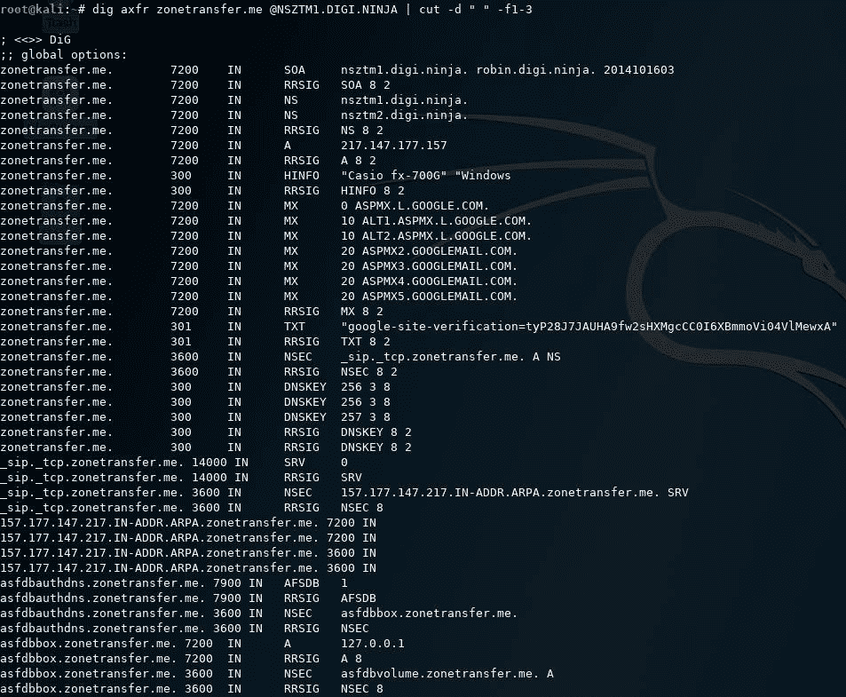

Shell 命令，例如`grep`或`cut`对于处理命令行工具的输出非常有用。在前面的示例中，`cut`与`|`（管道）字符一起使用，以仅显示由`-d " "`（空格）字符从`dig`命令结果的每一行分隔的前三个元素。在此屏幕截图中，列由制表符分隔，最后一列中显示的信息由空格分隔。

您经常会发现，即使主 DNS 服务器阻止区域传输，该域的辅助服务器也可能允许区域传输。`dig google.com NS +noall +answer`命令将显示该域的所有名称服务器。

尝试从`facebook.com`的 DNS 服务器执行区域传输失败，因为该公司已正确锁定其 DNS 服务器：


执行 DNS 查找以搜索 IP 地址是被动侦察。但是，当您使用`dig`或`nslookup`等工具进行区域转移时，它会变成主动侦察。

# DNS 枚举

在实际的渗透测试项目中，发现一个配置错误、允许匿名区域传输的服务器是非常罕见的。还可以使用其他技术来发现与域相关的主机名或子域，Kali Linux 提供了一些有用的工具来实现这一点。

# 德纳姆

**DNSEnum**是一个命令行工具，可自动识别基本 DNS 记录，如 MX、邮件交换服务器、NS、域名服务器或域的地址记录。它还尝试在所有已识别的服务器上进行区域传输，并且能够尝试子域和主机名的反向解析（即，获取给定 IP 地址的主机名）和强制执行（查询主机名的存在以获取其 IP 地址）。以下是对`zonetransfer.me`的查询示例：


分区转移结果如下：


# 激烈的

凶猛由`mschwager`呈现，在*凶猛：一种用于定位非连续 IP 空间*（[的 DNS 侦察工具中 https://github.com/mschwager/fierce](https://github.com/mschwager/fierce) ），GitHub©2018，详情如下：

Feare 是一种半轻量级扫描程序，可帮助定位指定域中的非连续 IP 空间和主机名。

Feature 使用区域转移、字典攻击和反向解析来收集主机名和子域以及域的 IP 地址，并且可以选择搜索相关名称（例如，`domain company.com`、`corpcompany.com`或`webcompany.com`。在下面的示例中，我们将使用搜索来识别`google.com`的主机名：


# DNSRecon

**DNSRecon**是 Kali Linux 中包含的另一个有用工具。它允许您通过多种技术收集 DNS 信息，包括区域传输、字典请求和谷歌搜索。在下面的截图中，我们将通过区域转移（`-a`）进行枚举，对 Whois 获得的 IP 地址空间（`-w`）进行反向分析，并通过`zonetransfer.me`进行谷歌搜索（`-g`）：


# 使用 Nmap 强制 DNS 记录

**Nmap**附带了一个脚本，用于使用暴力强制技术查询 DNS 服务器中的其他主机。它利用了`vhosts-defaults.lst`和`vhosts-full.lst`字典文件，其中包含 Nmap 开发团队多年来收集的大量常见主机名列表。文件可位于`/usr/share/nmap/nselib/data/`。Nmap 向 DNS 服务器发送该文件中每个条目的查询，以检查 DNS 区域中是否有该主机名可用的 a 记录。

如下面的屏幕截图所示，暴力脚本返回了一个肯定的结果。它通过查询 DNS 区域中的一些主机的 a 记录来标识这些主机：


# 使用搜索引擎和公共网站收集信息

现代搜索引擎是公共信息收集和被动侦察的宝贵资源。Google、Bing 和 DuckDuckGo 等通才引擎允许我们使用高级搜索过滤器查找特定域中的信息、特定文件类型、URL 中的内容以及特定的文本模式。还有一些专门的搜索引擎，如 Shodan，可以让您在多种服务中搜索主机名、开放端口、服务器位置和特定的响应头。

# 谷歌傻瓜

**谷歌 dorks**技术，也被称为*谷歌黑客*，最初是滥用谷歌的高级搜索选项，后来扩展到其他也包含类似选项的搜索引擎。它搜索特定的字符串和参数，以从组织或目标获取有价值的信息。以下是一些对渗透测试仪有用的示例：

*   可以搜索特定站点或域中的 PDF 文档，如下所示：

```
      site:example.com filetype:pdf 
```

*   可以搜索对特定域（不包括域的站点）的电子邮件地址的引用：

```
      "@example.com" -site:example.com 
```

*   可搜索标题中有`admin`字样或`example.com`中有 URL 的行政网站：

```
      intitle:admin OR inurl:admin  site:example.com 
```

*   您还可以查找指示可能存在 SQL 注入漏洞的特定错误消息：

```
      "SQL Server Driver][SQL Server]Line 1: Incorrect syntax near"  
      site:example.com 
```

在谷歌和其他搜索引擎中，有数千种可能有用的搜索组合。Kali Linux 的创建者，进攻性安全，也维护一个搜索字符串的公共数据库，该数据库可能会为渗透测试人员产生有用的结果，可访问：[https://www.exploit-db.com/google-hacking-database/](https://www.exploit-db.com/google-hacking-database/) 。

# 肖丹

**朔丹**[https://shodan.io](https://shodan.io) 是另一种搜索引擎；它可以帮助您查找连接到 internet 的设备，而不是网页中的内容。与谷歌一样，谷歌也有运营商和特定的语法来执行高级和特定的搜索。此屏幕截图显示了对与`google.com`相关的所有主机名的搜索：

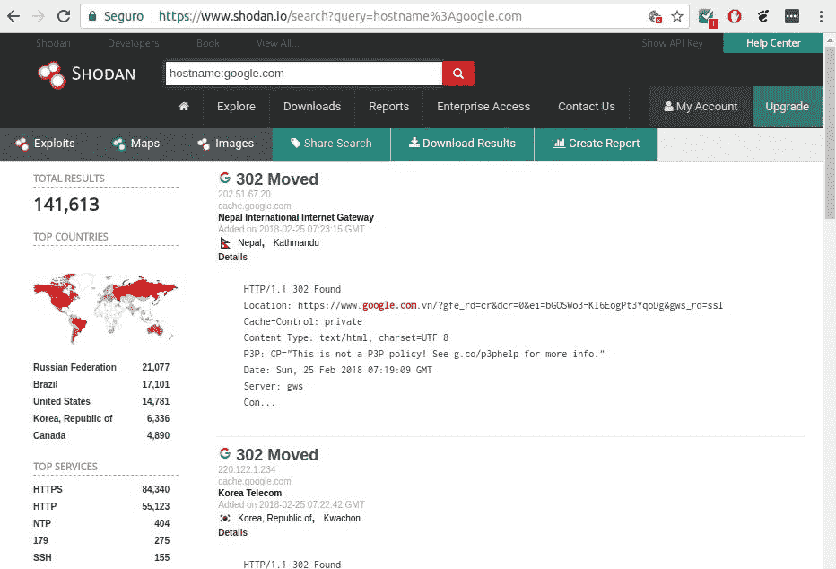

使用 Shodan 的主机名搜索示例

要利用 Shodan 的高级搜索功能，首先需要创建一个帐户。免费帐户产生的结果数量有限，有些选项虽然仍然非常有用，但受到限制。Shodan 可用于查找以下内容：

*   暴露于 internet 的属于某个域的服务器可以如下所示：

```
      hostname:example.com 
```

*   具体类型的设备，如 CCTV 摄像机或**工控系统**（**ICS**），可通过指定`Server`参数找到：

```
      Server: SQ-WEBCAM 
```

*   可以找到特定的开放端口或服务，例如，使用公共端口的 web 服务器：

```
      port:80,443,8080 
```

*   特定网络范围内的主机如下所示：

```
      net:192.168.1.1/24 
```

有关 Shodan 搜索选项和运算符的有用参考信息，请访问：[https://pen-testing.sans.org/blog/2015/12/08/effective-shodan-searches](https://pen-testing.sans.org/blog/2015/12/08/effective-shodan-searches) 。

# 收割机

**Harvester**是 Kali Linux 中包含的一个命令行工具，充当各种搜索引擎的包装器，用于从不同的公共来源（如搜索引擎和 PGP 密钥服务器）查找与域相关的电子邮件帐户、子域名、虚拟主机、开放端口/横幅以及员工姓名。在最新版本中，作者增加了 DNS 暴力、反向 IP 解析和**顶级域**（**TLD**扩展的功能。

在以下示例中，`theharvester`用于收集关于`zonetransfer.me`的信息：


# 马尔蒂戈

**Maltego**是 OSIT 广泛使用的专有软件。Kali Linux 包括 Maltego 的社区版，在完成在线注册后可以免费使用，但有一些限制。Maltego 对数据片段（例如电子邮件地址和域名）执行*转换*，以获取更多信息，并将所有结果显示为显示不同对象之间关系的图形。**转换**是对特定对象的公共信息的搜索，例如，搜索与域名相关的 IP 地址或与电子邮件地址或人名相关的社交媒体帐户。以下屏幕截图显示了 Maltego 的主界面：


马尔特戈界面

# 侦察-信息收集框架

OSIT 收集是一个耗时的手动过程。与目标组织相关的信息可能分布在多个公共资源中，积累和提取与目标相关的信息是一项困难且耗时的任务。大多数组织的 IT 预算不允许在此类活动上花费太多时间。

**Recon ng**是渗透测试人员经常需要的工具。这是一个关于类固醇的信息收集工具。Recon ng 是一个非常交互式的工具，类似于 Metasploit 框架。该框架使用许多不同的来源来收集数据，例如，在 Google、Twitter 和 Shodan 上。有些模块在查询网站之前需要 API 密钥。可以通过在搜索引擎的网站上完成注册来生成密钥。其中一些模块使用付费 API 密钥。

要在 Kali Linux 中启动 Recon ng，请导航到应用程序菜单并单击信息收集子菜单，或者只需在终端中运行`recon-ng`命令。您将看到右侧窗格中列出的 Recon ng。与 Metasploit 类似，当框架启动并运行时，您可以输入`show modules`来检查随框架附带的不同模块。一些模块是被动的，而其他模块则主动探测目标以提取所需信息。

尽管侦察 ng 有几个利用模块，但该工具的主要任务是协助侦察活动，其中有大量模块用于完成此任务：

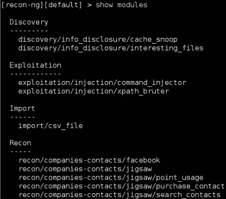

Recon ng 可以查询多个搜索引擎，其中一些搜索引擎是通过 web 请求查询的；也就是说，该工具复制了普通用户在搜索框中输入文本并单击搜索按钮时发出的请求。另一种选择是使用引擎的 API。这通常比使用自动化工具效果更好。使用 API 时，搜索引擎可能需要 API 密钥来识别发送这些请求的人并应用配额。该工具的工作速度比人工快，通过分配 API，可以跟踪使用情况并防止有人滥用该服务。因此，请确保您没有压倒搜索引擎，否则您的查询可能会被拒绝。

所有主要的搜索引擎都有注册用户持有 API 密钥的选项。例如，您可以在[为 Bing 生成 API 密钥 https://azure.microsoft.com/en-us/try/cognitive-services/?api=bing-网络搜索 api。](https://datamarket.azure.com/dataset/bing/search)

此免费订阅每月为您提供 5000 个查询。生成密钥后，需要使用以下命令将其添加到 Recon ng 工具中的密钥表中：

```
keys add bing_api <api key generated>  
```

要显示存储在 Recon ng 中的所有 API 密钥，请输入以下命令：

```
keys list  
```

# 使用 Recon ng 进行域枚举

收集有关目标网站子域的信息将帮助您识别网站的不同内容和功能。目标组织提供的每个产品或服务可能都有一个子域专用于它。这有助于以连贯的方式组织不同的内容。通过识别不同的子域，您可以创建一个站点地图和一个将各个部分连接起来的流程图，并更好地了解网站的流程。

# 子级和顶级域枚举

使用 Bing Web 主机名枚举器模块，我们将尝试在[上查找其他子域 https://www.facebook.com/](https://www.facebook.com/) 网站：

1.  首先，您需要使用`load recon/domains-hosts/bing_domain_web`命令加载模块。接下来，输入`show info`命令，该命令将显示描述模块的信息。

2.  下一步是在`SOURCE`选项中设置目标域。我们将其设置为`facebook.com`，如截图所示：


3.  准备好后，使用`run`命令启动模块。该工具首先查询几个域，然后使用（`-`指令删除已查询的域。然后它再次搜索其他域。这里最大的优势是速度。除了速度，输出还以明文形式存储在数据库中。这可以作为其他工具（如 Nmap、Metasploit 和 Nessus）的输入。输出如以下屏幕截图所示：

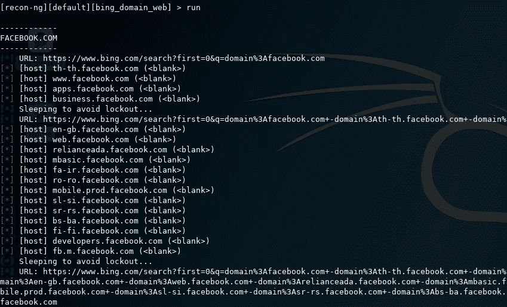

DNS 公共后缀暴力模块可用于识别**顶级域名**（**TLD**）和**二级域名**（**SLD**）。许多基于产品和基于服务的企业在每个地理区域都有单独的网站；您可以使用此暴力模块来识别它们。它使用`/usr/share/recon-ng/data/suffixes.txt`中的单词列表文件来枚举其他域。

# 报告模块

您运行的每个侦察模块将在单独的表中存储输出。您可以以多种格式导出这些表，例如 CSV、HTML 和 XML 文件。要查看 Recon ng 工具使用的不同表格，您需要输入`show`并按*选项卡*两次，以列出自动完成功能的可用选项。

要将表格导出到 CSV 文件中，请输入`use reporting/csv`加载 CSV 报告模块。（可以使用`load`命令代替`use`命令，但不起作用。）加载模块后，设置文件名和要导出的表格，输入`run`：


以下是侦察中的一些额外侦察模块，它们对渗透测试人员有很大帮助：

*   **Netcraft 主机名枚举器**：Recon ng 将获取 Netcraft 网站并累积与目标相关的所有主机，并将其存储在主机表中。
*   **SSL SAN 查找**：许多启用 SSL 的网站都有一个证书，使用**主题备选名称**（**SAN**功能跨多个域工作。本模块使用[http://ssltools.com/](http://ssltools.com/) 用于检索证书 SAN 属性中列出的域的网站。
*   **LinkedIn 身份验证联系人枚举器**：这将从 LinkedIn 配置文件中检索联系人并将其存储在联系人表中。
*   **IPInfoDB GeoIP**：这将显示使用 IPInfoDB 数据库的主机的地理位置（需要 API）。
*   **雅虎！主机名枚举器**：使用 Yahoo！搜索引擎在域中查找主机。使用多个搜索引擎的模块可以帮助您定位可能未被其他搜索引擎索引的主机和子域。
*   **Geocoder 和 reverse Geocoder**：这些模块使用 Google Map API 提供的坐标获取地址，如果给出了地址，它们也会检索坐标。然后，信息存储在位置表中。
*   **图钉模块**：使用 Recon ng 图钉模块，您可以从流行社交网站中提取数据，将其与地理位置坐标关联，并创建地图。两个广泛使用的模块如下：
    *   **推特地理位置搜索**：在推特上搜索从给定坐标的特定半径上传的媒体（图像和推特）
    *   **Flickr 地理定位搜索**：尝试定位从给定坐标附近区域上传的照片

这些图钉模块可用于将人员映射到物理位置，并确定在特定时间处于给定坐标的人员。积累并转换为 HTML 文件的信息可以映射到精确坐标处的卫星图像。使用 Recon ng，您可以创建一个包含主机、IP 地址、物理位置和人员的大型数据库，所有这些都只需使用公共可用资源即可。

侦察应始终以从各种公共资源中提取信息为目标，并识别可被攻击者用来直接或间接攻击组织的敏感数据。

# 扫描–探测目标

渗透测试需要在有限的时间内进行，而侦察阶段的时间最短。在实际渗透测试中，您与客户共享侦察阶段收集的信息，并尝试就扫描阶段应包括的目标达成共识。

在此阶段，客户端还可能向您提供侦察阶段未识别的其他目标和域，但这些目标和域将包含在实际测试和利用阶段。这样做是为了从测试中获得最大的好处，包括黑帽和白帽黑客的方法，在黑帽和白帽黑客的方法中，您可以像恶意攻击者一样开始测试，并且在您前进的过程中，会提供额外的信息，从而获得目标的准确视图。

一旦确定了承载网站的目标服务器，下一步就需要收集额外的信息，例如操作系统和该特定服务器上可用的服务。除了托管网站外，一些组织还启用 FTP 服务，并根据需要打开其他端口。第一步，除了端口`80`和端口`443`之外，您还需要识别 web 服务器上打开的其他端口。

扫描阶段包括以下几个阶段：

*   端口扫描
*   操作系统指纹识别
*   Web 服务器版本标识
*   基础设施分析
*   应用程序标识

# 使用 Nmap 进行端口扫描

**网络映射器**俗称 Nmap，是最广为人知的端口扫描仪。它发现 TCP 和 UDP 开放端口非常成功，并且是渗透测试仪工具包中的一个重要软件。Kali Linux 预装了 Nmap。Nmap 是定期更新的，并且由一个活跃的开发小组维护，该小组为这个开源工具做出贡献。

默认情况下，Nmap 不会向所有端口发送探测。Nmap 只检查`nmap-services`文件中指定的前 1000 个常用端口。每个端口条目都有一个对应的编号，指示该端口打开的可能性。这大大提高了扫描速度，因为扫描中忽略了不太重要的端口。根据目标的响应，Nmap 确定端口是打开的、关闭的还是已过滤的。

# 端口扫描的不同选项

运行 Nmap 端口扫描的简单方法称为**TCP 连接扫描**。此选项用于扫描打开的 TCP 端口，并使用`-sT`选项调用。连接扫描执行完整的三向 TCP 握手（SYN-SYN/ACK-ACK）。它提供了更准确的端口状态，但更有可能在目标计算机上记录，并且比可选的 SYN 扫描速度慢。使用`-sS`选项的 SYN 扫描不会完成与目标的握手，因此不会登录到该目标机器上。但是，SYN 扫描生成的数据包可以向防火墙和 IPS 设备发出警报，并且这些设备有时会默认阻止这些数据包。

使用`-F`标志调用 Nmap 时，将扫描前 100 个端口，而不是前 1000 个端口。此外，它还为您提供了使用`--top-ports [N]`标志自定义扫描的选项，以便从`nmap-services`文件中扫描`N`最流行的端口。许多组织可能有应用程序正在侦听不属于`nmap-services`文件的端口。对于这种情况，您可以使用`-p`标志定义 Nmap 要扫描的端口、端口列表或端口范围。

有 65535 个 TCP 和 UDP 端口以及可以使用任何端口的应用程序。如果需要，可以使用`-p 1-65535`或`-p-`选项测试所有端口。

以下屏幕截图显示了上述命令的输出：

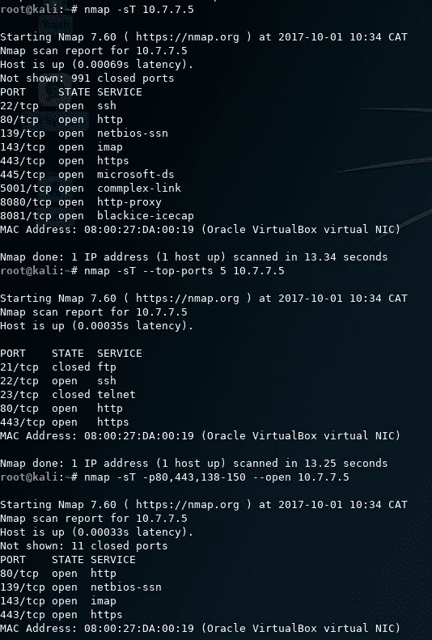

在渗透测试中，保存结果并保存运行的所有工具的日志非常重要。您应该保存注释和记录以更好地组织项目，并保存日志作为预防措施，以防目标出现问题。然后，您可以返回日志并检索对重新建立服务或识别故障源至关重要的信息。Nmap 有多种`-o`选项可将其结果保存为不同的文件格式：`-oX`用于 XML 格式，`-oN`用于 Nmap 输出格式，`-oG`用于 greppable text，而`-oA`用于 all。

# 使用 Nmap 规避防火墙和 IP

除了对 TCP 进行不同的扫描外，Nmap 还提供了各种选项，在扫描来自组织网络外部的目标时帮助绕过防火墙。以下是这些选项的说明：

*   **确认扫描**：此选项用于规避某些路由器上只允许来自内部网络的 SYN 数据包的规则，从而阻止默认连接扫描。这些路由器将只允许内部客户端通过路由器进行连接，并将使用 SYN 位集阻止来自外部网络的所有数据包。当使用`-sA`标志调用 ACK scan 选项时，Nmap 生成仅设置了 ACK 位的数据包，使路由器误以为该数据包是对内部客户端连接的响应，并允许该数据包通过该数据包。ACK scan 选项无法可靠地判断终端系统的端口是打开还是关闭，因为不同的系统以不同的方式响应未经请求的 ACK。但是，它可以用来识别路由器后面的在线系统。
*   **防火墙规则**中的硬编码源端口：许多防火墙管理员使用允许来自外部网络的传入流量的规则配置防火墙，这些流量来自特定的源端口，如`53`、`25`和`80`。默认情况下，Nmap 随机选择一个源端口，但可以将其配置为使用特定的源端口，以便使用`--source-port`选项绕过此规则。
*   **自定义数据包大小**：Nmap 和其他端口扫描程序发送特定大小的数据包，防火墙现在定义了丢弃此类数据包的规则。为了避免这种检测，可以将 Nmap 配置为使用`--data-length`选项发送不同大小的数据包。
*   **自定义 MTU**：Nmap 也可以配置为发送 MTU 较小的数据包。扫描将使用`--mtu`选项和 MTU 值进行。这可以用来绕过一些旧的防火墙和入侵检测设备。新的防火墙在将流量发送到目标机器之前重新组装流量，因此很难避开它们。MTU 需要是 8 的倍数。以太网 LAN 的默认 MTU 为 1500 字节。
*   **碎片化数据包**：绕过 IDS 和 IPS 系统的一种常见但有效的方法是对数据包进行碎片化，以便在通过这些防御机制进行分析时，它们不匹配恶意模式。在执行完整 TCP 扫描（`-sT`时，Nmap 可以使用`-f`选项执行此操作。
*   **MAC 地址欺骗**：如果目标环境中配置的规则仅允许来自特定 MAC 地址的网络数据包，则可以配置 Nmap 设置特定 MAC 地址进行端口扫描。端口扫描包也可以通过`--spoof-mac`选项配置特定的 MAC 地址。

# 识别操作系统

识别 web 服务器上打开的端口后，需要确定底层操作系统。Nmap 提供了几个选项来执行此操作。使用`-O`选项执行操作系统扫描；您可以为详细输出添加`-v`，以了解为确定操作系统而进行的底层测试：

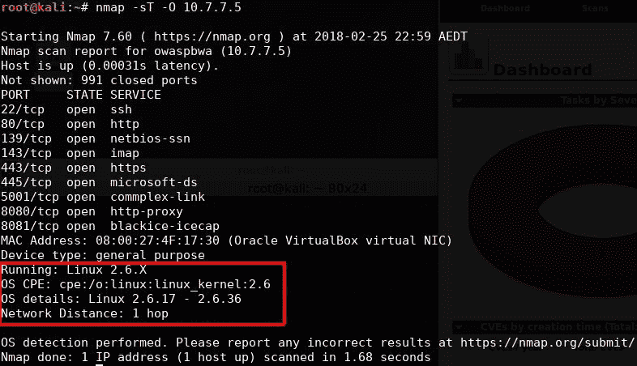

熟练的黑客不依赖于单一工具的结果。因此，Kali Linux 附带了几个指纹识别工具；除了使用 Nmap 运行版本扫描外，您还可以使用诸如 Amap 之类的工具获得第二种意见。

# 分析服务器

一旦确定了底层操作系统和开放端口，您就需要确定在开放端口上运行的确切应用程序。扫描 web 服务器时，需要分析在操作系统上运行的 web 服务的风格和版本。Web 服务器基本上处理来自应用程序的 HTTP 请求并将其分发到 Web；Apache、IIS 和 nginx 是使用最广泛的 web 服务器。除了版本之外，您还需要确定 web 服务器上启用的任何其他软件、功能和配置，然后才能进入开发阶段。

Web 应用程序开发严重依赖于 PHP 和.NET 等框架，每个 Web 应用程序都需要不同的技术，具体取决于用于设计它的框架。

除了 web 服务器的版本扫描外，还需要确定支持 web 应用程序的其他组件，例如数据库应用程序、加密算法和负载平衡器。

多个网站通常部署在同一物理服务器上。您只需要攻击渗透测试项目范围内的网站，并且需要正确理解虚拟主机才能执行此操作。

# 识别虚拟主机

许多组织的网站由使用共享资源的服务提供商托管。共享 IP 地址是他们使用的最有用和最具成本效益的技术之一。当您对特定 IP 地址执行反向 DNS 查询时，通常会看到返回的许多域名。这些网站使用基于名称的虚拟主机，通过主机头值，它们可以唯一地识别和区别于托管在同一 IP 地址上的其他网站。

这类似于多路复用系统。当服务器收到请求时，它通过查询请求头中的`Host`字段来识别请求并将其路由到特定主机。这在[第 1 章](01.html#K0RQ0-d48f8b63a8cc440fbc92835fec01cc38)、*渗透测试和 Web 应用简介*中进行了讨论。

在为网站进行交互和策划攻击时，确定托管类型非常重要。如果 IP 地址承载多个网站，则必须在攻击中包含正确的主机头值，否则将无法获得所需的结果。这也可能会影响该 IP 地址上托管的其他网站。直接使用 IP 地址进行攻击可能会产生不希望的结果，并且可能会攻击范围外的元素。如果这些元素不属于客户组织，这甚至可能产生法律影响。

# 使用搜索引擎定位虚拟主机

您可以通过分析 DNS 记录来确定是否在一个 IP 地址上承载多个网站。如果多个名称指向同一 IP 地址，则主机头值用于唯一标识网站。DNS 工具如`dig`和`nslookup`可用于识别返回类似 IP 地址的域。

您可以使用[http://ipneighbour.com/](http://ipneighbour.com/) 网站，以确定其他网站是否托管在给定的 web 服务器上。以下示例显示了在同一 IP 地址上托管的多个与 Wikipedia 相关的网站：

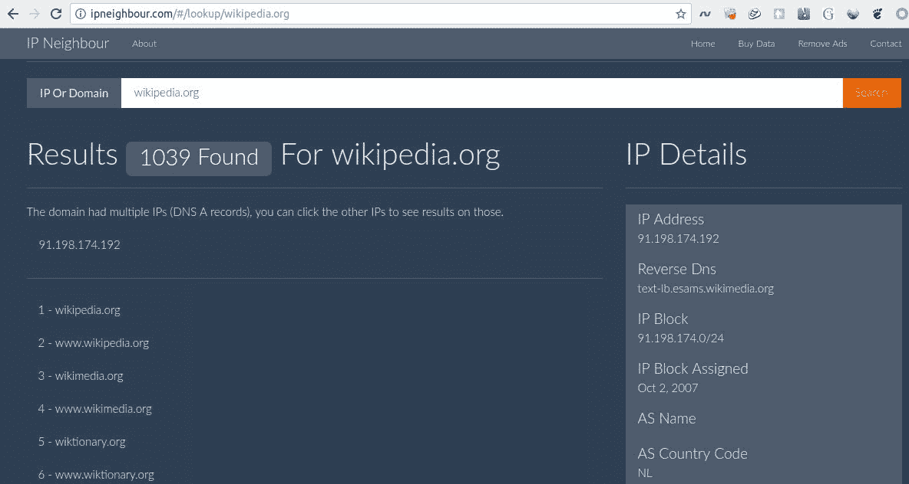

# 识别负载平衡器

高需求的网站和应用程序使用某种形式的负载平衡来跨服务器分配负载并保持高可用性。网站的交互性使得最终用户在整个会话期间访问同一台服务器以获得最佳用户体验至关重要。例如，在电子商务网站上，一旦用户将项目添加到购物车中，预期用户将在结帐页面再次连接到同一服务器以完成交易。随着中间层（如负载平衡器）的引入，来自用户的后续请求由负载平衡器发送到同一服务器变得非常重要。

有几种技术可用于服务器之间的负载平衡用户连接。DNS 是最容易配置的，但它不可靠，不能提供真正的负载平衡体验。硬件负载平衡器是目前用于将流量路由到网站的设备，可跨多个 web 服务器维护负载。

在渗透测试期间，有必要确定所使用的负载平衡技术，以便全面了解网络基础设施。一旦确定，您现在必须测试负载平衡器后面的每个服务器是否存在漏洞。还需要与客户团队协作，因为不同的硬件负载平衡器供应商使用不同的技术来维护会话亲和力。

# 基于 Cookie 的负载均衡器

硬件负载平衡器使用的一种流行方法是在终端客户端的浏览器中插入一个 cookie，将用户绑定到特定的服务器。此 cookie 的设置与 IP 地址无关，因为许多用户将处于代理或 NAT 配置之后，并且他们中的大多数将使用相同的源 IP 地址。

每个负载平衡器都有自己的 cookie 格式和名称。此信息可用于确定是否正在使用负载平衡器以及谁是其提供商。负载平衡器设置的 cookie 还可以显示与目标相关的敏感信息，这些信息可能对渗透测试仪有用。

Burp 代理可以配置为拦截连接，您可以通过分析标头来查找 cookie。如以下屏幕截图所示，目标使用 F5 负载平衡器。长数值实际上是包含池名、web 服务器 IP 地址和端口的编码值。因此，这里负载平衡器 cookie 揭示了它不应该做的关键服务器细节。可以将负载平衡器配置为设置不显示此类详细信息的自定义 cookie：

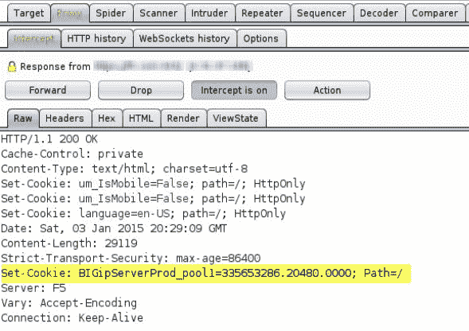

F5 负载平衡器的默认 cookie 具有以下格式：

```
BIGipServer<pool name> =<coded server IP>.<coded server port>.0000 
```

# 识别负载平衡器的其他方法

以下列出了识别设备（如负载平衡器）的其他几种方法：

*   **分析服务器之间的 SSL 差异**：不同 web 服务器之间的 SSL 配置可能会有细微变化。颁发给池中 web 服务器的证书上的时间戳可能会有所不同。SSL 配置中的差异可用于确定是否在负载平衡器后面配置了多个服务器。
*   **重定向到不同的 URL**：跨服务器负载平衡请求的另一种方法是将客户端重定向到不同的 URL 以分配负载。用户可以浏览到网站`www.example.com`，但会被重定向到`www2.example.com`。来自另一个用户的请求被重定向到`www1.example.com`，然后来自不同服务器的网页被传递。这是识别负载平衡器的最简单方法之一，但由于它具有管理开销和安全性影响，因此通常不会实现。
*   **负载平衡器 DNS 记录**：DNS 区域中的主机记录可用于判断设备是否为负载平衡器。
*   **负载平衡器检测器**：这是一个包含在 Kali Linux 中的工具。它确定网站是否正在使用负载平衡器。从外壳执行刀具的命令为`lbd <website name>`。该工具附带一个免责声明，它是一个概念验证工具，容易出现误报。
*   **Web 应用程序防火墙（WAF）**：除了负载平衡器，应用程序还可能使用 WAF 来阻止攻击。Kali Linux 中的 WAFW00F web 应用程序防火墙检测工具能够检测路径中是否存在任何 WAF 设备。可通过导航至信息收集| IDS/IPS 标识来访问该工具。

# 应用程序版本指纹

在众所周知的端口（如端口`25`和端口`80`上运行的服务很容易识别，因为它们被广泛的应用程序（如邮件服务器和 web 服务器）使用。**互联网分配号码管理局**（**IANA**）负责维护端口号的正式分配，可以从每个操作系统的端口映射文件中识别映射。但是，许多组织在更适合其基础架构的端口上运行应用程序。您经常会看到内部网网站在端口`8080`而不是端口`80`上运行，或者在端口`8443`而不是端口`443`上运行。

端口映射文件只是一个占位符，应用程序可以在开发人员设计的任何打开的端口上运行，而不受 IANA 设置的映射的影响。这就是为什么您需要进行版本扫描，以确定 web 服务器是否确实在端口`80`上运行，并进一步分析该服务的版本。

# Nmap 版本扫描

Nmap 有两个选项可用于执行版本扫描；版本扫描可以与操作系统扫描结合使用，也可以单独运行。Nmap 通过发送大量数据包来探测目标，然后分析响应以确定确切的服务及其版本。

要仅启动版本扫描，请使用`-sV`选项。操作系统扫描和版本扫描可以使用`-A`（主动）选项组合在一起，该选项还包括路由跟踪和一些脚本的执行。如果没有随扫描选项一起定义端口，Nmap 将首先使用前 1000 个端口的默认列表在目标上执行端口扫描，并从中识别打开的端口。

接下来，它将向打开的端口发送一个探测，并分析响应以确定在该特定端口上运行的应用程序。接收到的响应与`nmap-service-probes`文件中发现的庞大签名数据库相匹配。这类似于 IPS 签名的工作原理，即网络数据包与包含恶意数据包签名的数据库相匹配。版本扫描选项仅与该文件中签名的质量相同。

以下屏幕截图显示了上述命令的输出：


您可以向 Nmap 项目报告未知端口的错误结果和新签名。这有助于提高未来版本中签名的质量。

# Amap 版本扫描

Kali Linux 还附带了一个名为 Amap 的工具，该工具由**黑客的选择**（**THC**）小组创建，与 Nmap 类似。它通过发送大量数据包来探测打开的端口，然后分析响应以确定在该端口上侦听的服务。

发送到目标端口的探针在名为`appdefs.trig`的文件中定义，接收到的响应根据`appdefs.resp`文件中的签名进行分析。

在渗透测试期间，重要的是使用多种工具探测端口，以排除任何误报或否定。在测试过程中，依赖一个工具的签名可能是致命的，因为您未来的漏洞利用将取决于此阶段确定的服务及其版本。

您可以使用`-bqv`选项调用 Amap，该选项将只报告打开的端口，并以 ASCII 格式打印收到的响应以及与之相关的一些详细信息：


# web 应用程序框架中的指纹识别

了解用于开发网站的框架可以帮助您识别未修补版本中可能存在的漏洞。

例如，如果网站是在 WordPress 平台上开发的，那么可以在该网站的网页中找到它的踪迹。大多数 web 应用程序框架都有标记，攻击者可以使用这些标记来确定所使用的框架。

有几个地方可以揭示框架的细节。

# HTTP 头

除了定义 HTTP 事务的操作参数外，标头还可能包含可供攻击者使用的其他信息。

在下面的示例中，使用 Firefox 中的开发工具（*F12*键），您可以从`Server`字段确定正在使用 Apache web 服务器。另外，使用`X-AspNet-Version`可以看出 ASP.NET 版本 2 是开发框架。这种方法可能并不总是有效，因为可以通过服务器端的适当配置禁用标头字段：


应用程序框架还创建了新的 cookie 值，这些值可以为所使用的底层框架提供一些信息，所以也要关注 cookie。

HTML 页面源代码中的注释也可以指示用于开发 web 应用程序的框架。页面源中的信息还可以帮助您确定使用的其他 web 技术。

# WhatWeb 扫描仪

WhatWeb 工具用于识别网站使用的不同 web 技术。它包含在 Kali Linux 中，可以通过访问应用程序| 03-Web 应用程序分析| Web 漏洞扫描程序来访问它。它确定了用于设计 web 应用程序的不同内容管理系统、统计/分析包和 JavaScript 库。该工具声称拥有 900 多个插件。它可以在不同的攻击级别上运行，以平衡速度和可靠性。该工具可以在单个网页上获得足够的信息来识别网站，也可以递归查询网站以识别所使用的技术。

在下一个示例中，我们将对启用了`-v`verbose 选项的 OWASP BWA 虚拟机使用该工具。这将打印出与所识别技术相关的一些有用信息：


# 扫描 web 服务器以查找漏洞和错误配置

到目前为止，我们已经处理了目标的基础设施部分。我们现在需要分析底层软件，并尝试了解在幕后工作的不同技术。使用默认配置设计的 Web 应用程序容易受到攻击，因为它们为恶意攻击者利用该应用程序提供了多个漏洞。

Kali Linux 提供了几种工具来分析 web 应用程序的配置问题。扫描工具通过浏览整个网站并查找感兴趣的文件、文件夹和配置设置来识别漏洞。服务器端脚本语言（如 PHP 和 CGI）未正确实现，并且在旧版本上运行，可以使用自动化工具加以利用。

# 使用 Nmap 识别 HTTP 方法

在 web 渗透测试期间，对 web 服务器的第一个直接请求应该是确定 web 服务器支持哪些方法。您可以使用 Netcat 打开与 web 服务器的连接，并使用`OPTIONS`方法查询 web 服务器。还可以使用 Nmap 确定支持的方法。

在不断增加的 Nmap 脚本存储库中，您可以找到一个名为`http-methods.nse`的脚本。当您使用`--script`选项和目标一起运行脚本时，它将列出目标上允许的 HTTP 方法，并指出危险的方法。在下面的屏幕截图中，您可以看到这一点，它检测到几种启用的方法，并指出`TRACE`是一种危险的方法：


# 使用 Metasploit 中的辅助模块测试 web 服务器

以下模块对于渗透测试人员测试 web 服务器的漏洞非常有用：

*   `dir_listing`：此模块将连接到目标 web 服务器，并确定其上是否启用了目录浏览。
*   `dir_scanner`：使用此模块，您可以扫描目标以查找任何感兴趣的 web 目录。您可以为模块提供自定义创建的词典或使用默认词典。
*   `enum_wayback`：这是一个有趣的模块，用于查询 Internet 存档网站并查找目标域中的网页。可能已取消链接的旧网页仍可以访问，并且可以使用 Internet Archive 网站找到。您还可以确定网站多年来所经历的变化。
*   `files_dir`：该模块可以通过定位配置文件和源代码文件的备份来扫描服务器是否存在数据泄漏漏洞。
*   `http_login`：如果该网页有一个可通过 HTTP 工作的登录页面，您可以尝试使用 Metasploit 字典对其进行强制。
*   `robots_txt`：Robot 文件可以包含一些未经探索的 URL，您可以使用此模块查询它们，以查找未被搜索引擎索引的 URL。
*   `webdav_scanner`：这个模块可以用来查看服务器上是否启用了 WebDAV，基本上把 web 服务器变成了一个文件服务器。

# 确定 HTTPS 配置和问题

任何管理任何类型的敏感或个人识别信息（姓名、电话号码、地址、健康状况；信用；或税务记录、信用卡和银行账户信息等）的网站或 web 应用程序都需要实施一种机制，以保护从客户端到服务器的信息，反之亦然。

HTTP 作为一种明文协议诞生。因此，它不包括保护客户端和服务器交换的信息不被第三方查看和/或修改的机制。作为解决此问题的方法，在客户端和服务器之间创建加密的通信通道，并通过该通道发送 HTTP 数据包。HTTPS 是 HTTP 协议在安全通信通道上的实现。它最初是在**安全套接字层**（**SSL**上实现的。SSL 在 2014 年被弃用，取而代之的是**传输层安全**（**TLS**），尽管仍有许多站点支持 SSLv3，无论是因为配置错误还是因为向后兼容。

支持旧的加密算法有一个主要缺点。大多数较旧的密码套件被发现很容易被密码分析员破解，在合理的时间内使用今天可用的计算能力。

一个专门的攻击者可以从云服务提供商那里租用廉价的计算能力，并使用它来破解旧密码并获得对明文信息的访问。因此，使用旧密码会产生错误的安全感，应该禁用。客户端和服务器只允许协商一个被认为是安全的、在实践中很难破解的密码。

Kali Linux 包括许多工具，允许渗透测试人员在 SSL/TLS 实现中识别此类错误配置。在本节中，我们将回顾最流行的。

# OpenSSL 客户端

在几乎每一个 GNU/Linux 发行版中，**OpenSSL**都是基本的 SSL/TLS 客户机，它包含的功能将帮助您在 HTTPS 服务器上执行一些基本测试。

基本测试是与服务器建立连接。在本例中，我们将连接到端口`443`（默认 HTTPS 端口）上的测试服务器：

```
openssl s_client -connect 10.7.7.5:443
```

在下面的屏幕截图所示的结果中，您可以看到有关连接参数和证书交换的详细信息。值得注意的是，该连接使用了 SSLv3，这本身就是一个安全问题，因为 SSL 已被弃用，并且已知存在可能导致信息完全解密的漏洞，例如**在降级的旧加密**（**POODLE**）上填充 Oracle，我们将在后面的章节中讨论：


您经常会看到编写为 ECDHE-RSA-RC4-MD5 的密码套件。格式分为以下几个部分：

*   **ECDHE**：这是一个密钥交换算法
*   **RSA**：这是一种认证算法
*   **RC4**：这是一种加密算法
*   **MD5**：这是一个哈希算法

有关 SSL 和 TLS 密码套件的全面列表，请访问：[https://www.openssl.org/docs/apps/ciphers.html](https://www.openssl.org/docs/apps/ciphers.html) 。

可以使用 OpenSSL 更好地测试目标的其他一些选项如下：

*   **禁用或使用特定协议**：使用`-no_ssl3`、`-no_tls1`、`-no_tls1_1`和`-no_tls1_2`选项，您可以禁用相应协议的使用，并测试您的目标接受哪些协议
*   **测试一个特定协议**：`-tls1`、`-tls1_1`和`-tls1_2`选项只测试指定的协议

现在，接受 SSL 和 TLS 1.0 被认为是不安全的。TLS 1.1 在某些应用中可以接受，但建议选择 TLS 1.2。

# 使用 SSLScan 扫描 TLS/SSL 配置

**SSLScan**是一种命令行工具，可在指定目标上执行各种测试，并返回 SSL/TLS 服务器接受的协议和密码的综合列表，以及安全测试中有用的一些其他信息：

```
sslscan 10.7.7.5  
```


您可以使用 SSLScan 的颜色代码获取显示结果的安全性方面的严重性的快速参考。红色（允许 SSLv3 并使用 DES 和 RC4 密码）表示配置不安全，而建议使用绿色或白色。

命令的输出可以使用`--xml=<filename>`选项导出到 XML 文档中。

# 使用 SSLyze 扫描 TLS/SSL 配置

**SSLyze**是一个 Python 工具，可以通过类似于 SSLScan 的方式连接到服务器来分析服务器的 SSL/TLS 配置。它能够一次扫描多个主机，还可以测试性能并使用客户端证书进行相互身份验证。以下命令在您的测试机上运行常规 HTTPS 扫描（包括 SSL 版本 2、SSL 版本 3 和 TLS 1.0、TLS 1.1 和 TLS 1.2 检查、证书的基本信息以及压缩、重新协商和 Heartbleed 测试）：

```
sslyze --regular 10.7.7.5  
```

您可以在以下屏幕截图中看到结果：


# 使用 Nmap 测试 TLS/SSL 配置

Nmap 包含一个名为`ssl-enum-ciphers`的脚本，它可以识别服务器支持的密码套件，并根据密码强度对其进行评级。它使用 SSLv3、TLS 1.1 和 TLS 1.2 进行多个连接。如果脚本识别出 SSL 实现易受任何先前发布的漏洞攻击，例如犯罪和贵宾犬，则脚本还将突出显示：


# Spidering web 应用程序

在测试大型实际应用程序时，需要一种更详尽的方法。作为第一步，您需要确定应用程序的大小，因为有几个决定取决于它。您需要的资源数量、工作量估计和评估成本取决于应用程序的大小。

web 应用程序由多个相互链接的网页组成。在开始评估应用程序之前，您需要对其进行映射以确定其大小。您可以像普通用户一样手动浏览应用程序，单击每个链接并查看内容。当手动爬网应用程序时，您的目标应该是从经过身份验证和未经身份验证的用户的角度识别尽可能多的网页。

手动对应用程序进行爬网既耗时又容易被遗漏。Kali Linux 有许多工具可用于自动化此任务。Burp 套件中的 Burp Spider 工具对于爬行 web 应用程序是众所周知的。它自动化了在应用程序中对各种网页进行编目的繁琐任务。它的工作原理是请求一个网页，解析它的链接，然后向这些新链接发送请求，直到所有网页都被映射。通过这种方式，可以映射整个应用程序，而不会忽略任何网页。

警告：
由于爬行是一个自动过程，因此需要了解该过程和应用程序的工作方式，以避免爬行器执行敏感请求，如密码重置、表单提交和信息删除。

# 打嗝蜘蛛

Burp Spider 使用被动和主动方法映射应用程序。

启动 Burp Proxy 时，默认情况下它以被动爬网模式运行。在此模式下，当浏览器配置为使用 Burp 代理时，它将使用通过代理请求的所有内容更新站点地图，而不发送任何进一步的请求。被动爬行被认为是安全的，因为您可以直接控制爬行的内容。这在包含管理功能的关键应用程序中变得非常重要，您不希望触发这些功能。

为了有效的映射，被动 spidering 模式应与主动模式一起使用。最初，允许 Burp Spider 在浏览应用程序时被动地对其进行映射，当您找到需要进一步映射的感兴趣的网页时，可以触发主动爬网模式。在活动模式下，Burp Spider 将递归地请求网页，直到它映射所有 URL。

下面的屏幕截图显示了被动爬行的输出，单击应用程序中的各个链接。在被动映射应用程序之前，请确保已将 Burp 设置为 web 浏览器中的代理，并且已关闭拦截：


当您想主动爬行网页时，右键单击站点地图部分中的链接，然后单击爬行此分支。一旦你这样做，主动蜘蛛模式就开始了。在 Spider 部分，您将看到已发出请求，站点地图部分将填充新项目，如以下屏幕截图所示：

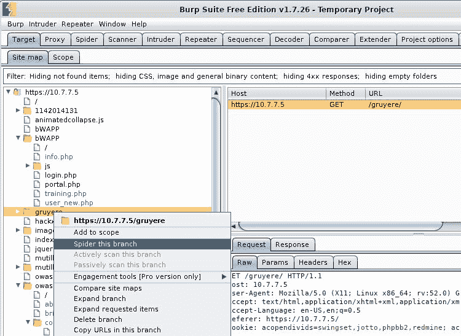

当活动 spider 运行时，它将显示请求的数量和一些其他详细信息。在 Spider Scope 部分中，您可以使用正则表达式字符串创建规则来定义目标：

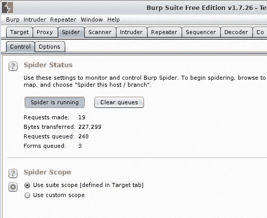

# 应用程序登录

应用程序在允许您查看内容之前可能需要身份验证。Burp Spider 可以配置为在对应用程序进行爬网时使用重新配置的凭据对其进行身份验证。在 Spider 部分的 Options（选项）选项卡中，您可以定义凭证或选择 Prompt for Guide（提示提供指导）选项。当您选择提示指南选项时，它将显示一个提示，如果爬行器遇到登录页面，您可以在其中输入用户名和密码，如下所示：


# 目录暴力强制

也称为*强制浏览*，**目录暴力强制**是请求应用程序或服务器页面中没有直接链接的文件和服务器目录的过程。这通常是通过从公共名称列表中获取目录和文件名来完成的。Kali Linux 包括一些用于完成此任务的工具。我们将在这里探讨其中的两个。

# 肮脏的

**DIRB**可以递归扫描目录，并在 web 服务器中查找具有不同扩展名的文件。非标准 404 时自动检测*未找到*代码。然后，它可以将结果导出到文本文件，在服务器需要有效会话时使用会话 cookie，并执行基本 HTTP 身份验证和上游代理等功能。以下屏幕截图显示了 DIRB 的基本用法，使用默认字典并将输出保存到文本文件：

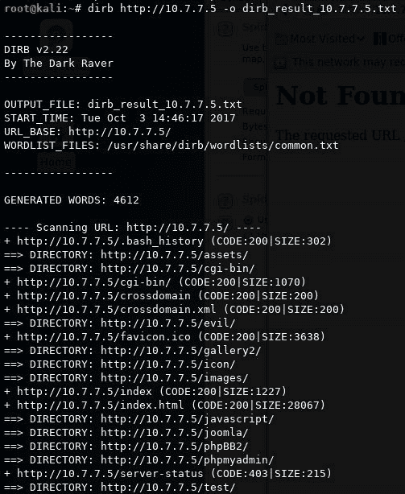

# ZAP 的强制浏览

DirBuster 是由 OWASP 维护的目录暴力工具，现在作为强制浏览功能集成到 OWASP ZAP 中。要使用它，您可以启动 OWASP-ZAP（在 Kali 的菜单中，转到 03-Web 应用程序分析| OWASP-ZAP），并将浏览器配置为将其用作代理；就像 Burp 进行被动爬网一样，ZAP 注册您浏览的所有 URL 以及它们从服务器请求的资源。因此，您浏览到目标，检测到的文件和目录将记录在 ZAP 中。接下来，右键单击要进行强制浏览的目录，然后转到攻击|强制浏览站点/强制浏览目录/强制浏览目录（和子目录）。站点、目录或目录和子目录之间的选择取决于要扫描的内容。站点表示从服务器的根目录进行扫描，目录表示仅选定目录，目录和子目录递归地为选定目录：

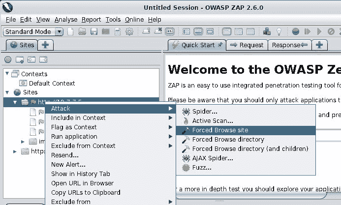

在此之后，选择名称列表文件（字典）并单击开始按钮。现有目录和文件可能会显示在同一选项卡中：


# 总结

有了这些，我们就到了本章的结尾。我们完成了侦察阶段，最后扫描了 web 服务器。在下图中，您可以查看渗透测试的侦察阶段所涉及的任务以及 Kali Linux 中可用于每个任务的一些有用工具：


侦察是渗透测试的第一阶段。当测试可从互联网访问的目标时，搜索引擎和社交网站可以显示有用的信息。搜索引擎存储了大量信息，这些信息在执行黑盒渗透时非常有用。我们使用这些免费资源来识别恶意用户可能对目标使用的信息。Kali Linux 有几个工具可以帮助您实现目标，我们在本章中使用了其中的一些工具。

最后，我们进入了扫描阶段，这要求黑客主动与 web 应用程序交互，以识别漏洞和错误配置。

在下一章中，我们将研究影响 web 应用程序的服务器端和客户端漏洞。